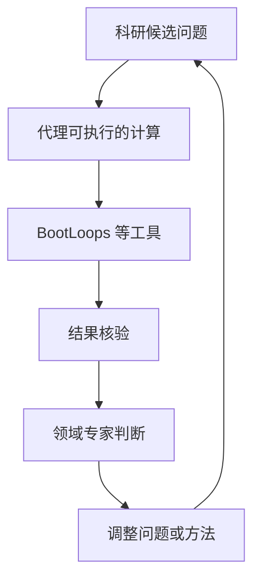

# Claude-shaped science：适配 AI 能力的科研选题

**Claude-shaped science** 是 Matthew Schwartz 在 Anthropic 发布的科研实践文章，主张先匹配代理的计算优势，再由人确定值得研究的问题；不是一项机器人控制算法。

## 英文缩写速查

| 缩写 | 英文全称 | 简要说明 |
|------|----------|----------|
| AI | Artificial Intelligence | 科研流程中的工具执行与辅助推理 |
| LLM | Large Language Model | 支撑编码与跨领域方法检索的语言模型 |
| PR | Pull Request | 本库用来审阅可追溯知识变更 |

## 为什么重要

文章提醒读者区分两个问题：结果是否算对，以及是否回答了领域真正关心的问题。工具可检验性不能替代选题品味。

## 流程总览

以下按本页已归纳的机制与资料绘制，表示模块或阅读路径关系。

## 核心原理

将候选问题与可复用计算工具匹配，检查结果后请领域专家修正方向。[BootLoops](./bootloops.md) 是配套的精确计算与验证工具箱。它由 Schwartz 维护，不是 Anthropic 官方产品；相关案例是作者的实践报告，不是通用自主科研能力的证明。

## 工程实践

以下是**面向机器人研究的迁移建议，不是文章已经验证的实验结果**：

| 任务 | 适合交给代理的部分 | 人侧验收 |
|------|--------------------|----------|
| 论文复现 | 转写公式、生成配置、对照曲线 | 任务定义、基准口径与差异解释 |
| 控制器调试 | 做量纲检查、整理日志、运行离线测试 | 边界条件、模型假设与安全性 |
| 策略对比 | 自动汇总多种子结果 | 固定预算、留出场景及实际工程价值 |

提交任务前写清输入版本、参考答案、停止条件与人工检查点；保留错误和失败实验，而不只保存成功摘要。知识整理走 PR 审阅，真实机器人测试仍需独立安全流程。

## 局限与风险

- 原文是客座实践文章，不是受控 benchmark；不要将某一案例外推成所有科研任务都可自动完成。
- 专家指导、计算预算和核验成本是方法的一部分，不能从流程里省去。
- 本页收录选题方法；文章的跨领域成果未在本次 ingest 中逐项复现。

## 关联页面

- [BootLoops](./bootloops.md)：计算工具与验证协议的实现边界。
- [AI Auto-Research](../concepts/ai-auto-research.md)：研究生命周期与人机治理。

## 参考来源

- [Claude-shaped science 来源归档](../../sources/sites/anthropic-claude-shaped-science.md)

## 推荐继续阅读

- [原文](https://www.anthropic.com/research/claude-shaped-science)
- [固定版本工具仓库](https://github.com/BootLoops-ai/bootloops/tree/66b680ce742e654cfe86da4f072a69061fe182b1)
