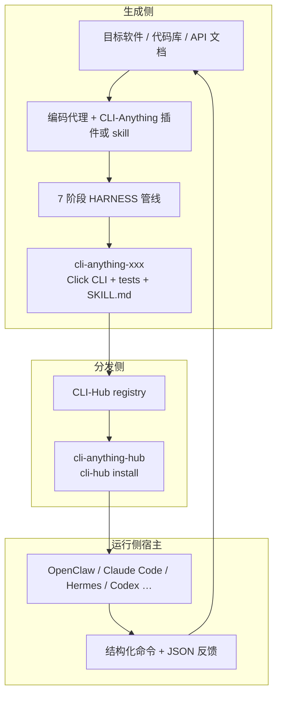

# CLI-Anything（HKUDS）

**CLI-Anything**（[HKUDS/CLI-Anything](https://github.com/HKUDS/CLI-Anything)，Apache-2.0）是香港大学 HKUDS 开源组织维护的 **agent-native computer use** 栈：用编码代理驱动的 **7 阶段 harness 生成器**，把 GUI 软件、代码库或 Web API 变成可安装的 **Click CLI**（结构化 JSON 输出、REPL、undo/redo、测试与 `SKILL.md`），再经 **[CLI-Hub](https://hkuds.github.io/CLI-Anything/)**（`pip install cli-anything-hub`）统一发现与安装。技术报告见 [arXiv:2606.03854](https://arxiv.org/abs/2606.03854)。

## 一句话定义

把「人类点 GUI」改写成 **代理可组合的命令行 harness + 注册表**，让 Claude Code / OpenClaw / Hermes 等宿主 **直接操控真实软件后端**，而不是截图点坐标。

## 英文缩写速查

| 缩写 | 英文全称 | 简要说明 |
|------|----------|----------|
| CLI | Command-Line Interface | 命令行接口；本项目主张的 agent 主交互面 |
| Hub | CLI-Hub registry | 浏览/安装 harness 与部分第三方 CLI 的注册表面 |
| REPL | Read-Eval-Print Loop | 交互式命令会话；生成 CLI 常带统一 REPL |
| SKILL | Agent Skill (`SKILL.md`) | 代理可发现的技能描述文件（agentskills 生态） |
| MCP | Model Context Protocol | 工具互操作协议；与 CLI harness **互补而非等同** |
| CAD | Computer-Aided Design | 计算机辅助设计；Hub 演示含 FreeCAD 等 |
| JSON | JavaScript Object Notation | 生成 CLI 的结构化输出格式，便于代理消费 |
| E2E | End-to-End | 对真实软件/文件的端到端测试层级 |

## 为什么重要（对本知识库读者）

- **CAD / 3D / 引擎工作流可 agent 化：** Hub 演示与仓内 harness 覆盖 [FreeCAD](freecad-mcp.md) 路线旁的 **`cli-anything-freecad`**、Blender、Godot、CloudCompare、QGIS 等——机器人夹具、场景资产、点云与地图工具可走 **结构化命令**，而不是脆弱 RPA。
- **与本库代理栈正交互补：** [OpenClaw](openclaw.md) / [Hermes Agent](hermes-agent.md) 是 **宿主运行时**；[Agent Reach](agent-reach.md) 是 **外网读搜脚手架**；CLI-Anything 专责 **把专业软件暴露成可调用 CLI + skill**。仓内已有 `hermes-skill`、OpenClaw/Claude Code 插件路径。
- **对抗 GUI-agent 叙事：** 技术报告明确批评截图—点击范式；选型时可作为「computer use 是否必须视觉」的对照锚点（见 [arXiv:2606.03854](https://arxiv.org/abs/2606.03854)）。
- **与 MCP / Skills 的分工：** [MCP](../concepts/model-context-protocol.md) 标准化 **工具协议**；CLI-Anything 标准化 **应用侧命令面生成与分发**。同一软件可同时存在 MCP 桥（如 FreeCAD MCP）与 CLI harness——按宿主与部署选择。

## 核心原理

| 层次 | 内容 |
|------|------|
| **问题** | Agent–Software Gap：机器人/工程代理擅长推理与结构化 IO，却难稳定使用专业 GUI |
| **解法** | 对目标软件做 **真实后端集成** 的 CLI harness（非玩具重写），统一 JSON + 人类可读输出 |
| **生成器** | `/cli-anything <path-or-repo>`：Analyze → Design → Implement → Plan Tests → Write Tests → Document(+SKILL) → Publish |
| **分发** | `cli-anything-<name>` 包 + `skills/` 下 canonical `SKILL.md`；Hub `cli-hub install` |
| **精炼** | `/cli-anything:refine` 做能力缺口分析并增量补命令（非破坏性迭代） |

### 流程总览

### 与相近方案对照

| 方案 | 交互面 | 强项 | 典型代价 |
|------|--------|------|----------|
| **CLI-Anything** | 生成式 CLI + Hub + SKILL | 覆盖任意软件、真实后端、可测试可安装 | 依赖上游软件安装；生成质量随代理与目标代码库波动 |
| [FreeCAD MCP](freecad-mcp.md) | MCP + 桌面 RPC | 复用已开 FreeCAD 会话、截图审图、FEM | 绑定 FreeCAD/MCP 宿主 |
| [CAD Skills](cad-skills.md) | Agent Skills + build123d | 无头 CI、脚本化 URDF 链 | 不直接驱动桌面 FreeCAD GUI 真值 |
| GUI computer-use agent | 截图 + 点击 | 无 API 时仍可尝试 | 像素脆弱、难组合、难回归测试 |
| [HarnessBank](paper-harnessbank.md) | 进化 **宿主** harness | 冻结模型下自改进控制环 | 不生成应用 CLI；代码发布状态见其页 |

## 工程实践

| 场景 | 做法 |
|------|------|
| **先用现成** | `pip install cli-anything-hub` → `cli-hub search|install|launch`；缺上游软件时先装 Blender/FreeCAD 等 |
| **给代理装发现能力** | `npx skills add HKUDS/CLI-Anything --skill cli-hub-meta-skill -g -y`（SKILL 兼容宿主） |
| **生成新 harness** | 在 Claude Code：marketplace 安装 `cli-anything` 插件后 `/cli-anything <本地路径或仓库 URL>`；其它平台见上游 README（Pi / OpenClaw / Hermes / Codex…） |
| **机器人相关选型** | CAD/装配优先试 FreeCAD harness 或对照 [FreeCAD MCP](freecad-mcp.md)；场景/资产用 Blender；引擎侧对照 [Unreal MCP](unreal-mcp.md) / Godot harness |
| **质量门槛** | 贡献与合并要求测试与 skill 路径对齐；以克隆时 `CONTRIBUTING.md` 与 CI 为准，本页不固化命令细节 |
| **开源状态** | **已开源**（生成器 + 多应用 harness + Hub）。详见 [仓库归档](../../sources/repos/hkuds_cli_anything.md) |

## 局限与风险

- **不是 Robot Gateway / 运动栈：** 不替代真机安全闸门、[Philia](philia.md) 契约或 RL locomotion；只解决 **软件操控面**。
- **上游依赖：** harness 常包装真实桌面/引擎进程；无头 CI、许可证与 GPU/显示环境需自行评估。
- **生成 ≠ 完备：** 7 阶段产物覆盖度依赖分析质量；复杂 GUI 需多次 `refine`，且安全敏感命令（写库、下载、执行脚本）须人工审。
- **生态变动快：** 注册表条目、平台插件路径与 skill 布局（如统一到 `skills/`）会演进——安装命令以官方 README / Hub 为准。
- **误区：有了 CLI 就不必 MCP。** 宿主若以 MCP 为工具总线，仍可能要薄包装；二者解决不同层的互操作问题。

## 关联页面

- [DeepTutor（HKUDS）](deeptutor.md) — agent-native 辅导工作区；可挂载 CLI Apps 并 consult 外部 agent
- [Hermes Agent](hermes-agent.md) — 常驻 agent OS；可消费 CLI-Anything 生成的 skill/CLI
- [DeepSeek Harness](deepseek-harness.md) — DeepSeek 官方插件化宿主（自带 `packages/skill`；与生成式 CLI 互补）
- [OpenClaw](openclaw.md) — SKILL 兼容个人助手宿主；Hub meta-skill 安装目标之一
- [Agent Reach](agent-reach.md) — 外网读搜 CLI 脚手架（与「专业软件 CLI 生成」互补）
- [FreeCAD MCP](freecad-mcp.md) — 同软件域的 MCP 桥对照
- [Unreal MCP](unreal-mcp.md) — 引擎侧代理桥对照
- [CAD Skills](cad-skills.md) — 脚本化 CAD / URDF 技能链
- [HarnessBank](paper-harnessbank.md) — 宿主 harness 自进化（概念相邻、问题不同）
- [SkillCorpus](paper-skillcorpus.md) — 社区 `SKILL.md` 语料与评测语境
- [Model Context Protocol](../concepts/model-context-protocol.md) — 工具协议层
- [LLM Wiki（Karpathy 模式）](../references/llm-wiki-karpathy.md) — 知识编译 vs 软件 harness 编译的对照

## 参考来源

- [CLI-Anything 仓库源归档（本站）](../../sources/repos/hkuds_cli_anything.md)
- [CLI-Hub 站点归档（本站）](../../sources/sites/cli-anything-hub.md)
- [技术报告归档 arXiv:2606.03854（本站）](../../sources/papers/cli_anything_arxiv_2606_03854.md)
- [HKUDS/CLI-Anything（GitHub）](https://github.com/HKUDS/CLI-Anything)
- [CLI-Hub](https://hkuds.github.io/CLI-Anything/)

## 推荐继续阅读

- [CLI-Anything README（main）](https://github.com/HKUDS/CLI-Anything/blob/main/README.md) — 多平台安装、7 阶段说明与演示索引
- [Tech Report: CLI-Anything: Towards Agent-Native Computer Use](https://arxiv.org/abs/2606.03854) — GUI vs agent-native 论证
- [CONTRIBUTING.md](https://github.com/HKUDS/CLI-Anything/blob/main/CONTRIBUTING.md) — 向 Hub 贡献新 harness 的流程
