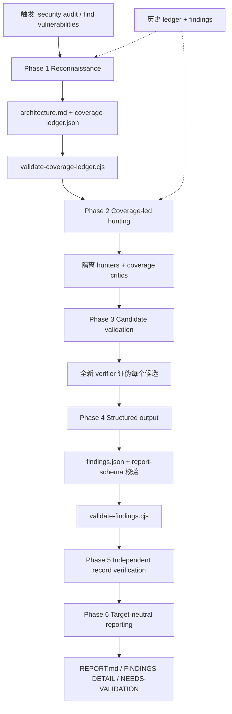

# Security Audit Skill（Cloudflare）

**Security Audit Skill**（仓库 [cloudflare/security-audit-skill](https://github.com/cloudflare/security-audit-skill)）是 Cloudflare 开源的 **coding-agent 安全审计技能包**：把「安全审计 / 找漏洞 / pen-test」请求编排成 **六阶段、覆盖率驱动、对抗验证** 的工作流，产出 **机器可读且可 schema 校验** 的 `findings.json` 与目标中立报告。它是 Cloudflare 内部漏洞发现 harness 的 **单仓起点**，详见博客 [Build your own vulnerability harness](https://blog.cloudflare.com/build-your-own-vulnerability-harness)。

## 一句话定义

用 **隔离子 agent + coverage ledger + 发现/验证分离 + JSON schema 门禁**，把 coding agent 变成可重复、可增量叠加的 **安全审计管线**，而非一次性「扫一遍代码」的 prompt。

## 英文缩写速查

| 缩写 | 英文全称 | 简要说明 |
|------|----------|----------|
| AppSec | Application Security | 应用层漏洞发现与治理 |
| IPC | Inter-Process Communication | 本地进程间通信；skill 含桌面/移动/本地 IPC 攻击类 |
| IAM | Identity and Access Management | 云身份与访问管理；`CLOUD-AND-DEPLOYMENT.md` 覆盖 |
| LLM | Large Language Model | 审计 orchestrator 与 hunter/verifier 的后端 |
| RPC | Remote Procedure Call | 远程过程调用；`PROTOCOLS-RPC-AND-MESSAGING.md` 覆盖 |
| SBOM | Software Bill of Materials | 供应链安全；`SUPPLY-CHAIN-AND-RELEASE.md` 覆盖 |

## 核心信息

| 字段 | 内容 |
|------|------|
| 机构 | Cloudflare |
| 许可 | MIT |
| Stars（入库日） | ~15.8k（GitHub，以克隆时为准） |
| 安装 | `npx skills add https://github.com/cloudflare/security-audit-skill --skill security-audit` |
| 开源状态 | **已开源** — skill 全文件、`report-schema.json`、校验器与测试均在 GitHub |

## 为什么重要（对本知识库读者）

- **补「深度审计 skill 层」：** [Codex Security](codex-security.md) 偏 **CLI/SDK 扫描 + SARIF/CI 门禁**；本 skill 偏 **多阶段 agent 编排 + 覆盖率 ledger + 对抗验证**，适合需要 **可审计 artifact 链** 的深度安全审查。
- **与 code review 工具互补：** [Open Code Review](open-code-review.md) 聚焦 **diff 级缺陷评论**；本 skill 聚焦 **信任边界失败与 exploit 路径**，二者可叠用在 PR 前（review 降噪 + audit 挖边界）。
- **机器人云边代码面同样适用：** 遥操作网关、OTA 服务、训练 farm API、数据集门户——除 AuthN/AuthZ/KMS 基线（见 [软件安全基础](../concepts/software-security-basics.md)）外，可用本 skill 做 **业务逻辑与协议面** 的结构化审计。
- **Harness 设计可迁移：** Cloudflare 博客描述 harness 从单 skill 演进为舰队级系统；对本库 **ingest/lint/ci-preflight** 维护环（见 [HumanLayer Skills](humanlayer-skills.md) 的 control-loop 隐喻）有 **sensor–verifier–artifact** 对照价值。

## 核心结构

| 层次 | 内容 |
|------|------|
| **分发** | GitHub 仓 `skills/security-audit/`；[skills.sh](https://skills.sh) CLI 安装 |
| **Orchestrator** | `SKILL.md` — 触发词、平台术语、六阶段概览、反模式 |
| **阶段 prompt** | `RECONNAISSANCE.md`、`HUNTING.md`、`VALIDATION-AND-REPORTING.md` |
| **攻击类库** | `ATTACK-CLASSES.md` + 按目标分面（LLM、Web/Auth、Client、Supply-chain、Cloud、RPC、资源耗尽、数据隔离、桌面/IPC、内存安全） |
| **机器可读产物** | `coverage-ledger.json`、`findings.json`（`confirmed` / `needs_validation` / `rejected`）、`report-schema.json` |
| **校验门禁** | `validate-coverage-ledger.cjs`、`validate-findings.cjs`（零依赖 Node + 测试） |
| **人类报告** | `REPORT.md`、`FINDINGS-DETAIL.md`、`NEEDS-VALIDATION.md`（从已验证记录派生） |

### 流程总览（六阶段审计）

## 工程实践

| 场景 | 建议入口 | 备注 |
|------|----------|------|
| 单仓深度审计 | 在目标代码库启动 agent → `security audit this codebase` | 默认输出 `~/security-audit-skill/<repo>/run-<N>` |
| 指定输出目录 | `do a security review, output to ~/audits/my-project` | 仅当显式选择被 VCS ignore 的路径时才写入目标仓内 |
| 聚焦子树 | `find security vulnerabilities in ./src` | 仍走完整模式或 guidance 模式（视触发词） |
| 多轮补缺口 | 同一 repo 再次运行 | 利用 prior ledger/findings 增量；Cloudflare 经验：单轮约只发现重复运行总量的一半 |
| 与 CI 叠用 | 人工或 agent 跑 audit → 导出 JSON | 与 [Codex Security](codex-security.md) SARIF 门禁分工：本 skill 偏深度 artifact，Codex 偏 PR diff 扫描 |
| 原生/LLM/Web 目标 | 按栈选读对应 `*-AND-*.md` | 如机器人栈含 ROS/gRPC/遥操作 Web → `PROTOCOLS-RPC`、`WEB-PROTOCOL-AND-AUTH` |

## 局限与风险

- **需要强 agent 能力与沙箱：** 无 tool use / 并行子 agent 时 workflow 无法按设计运行；执行目标构建/测试需 OS 级沙箱（禁外网、资源限制），否则 lead 只能保持 `needs_validation`。
- **不是 instant CVE 扫描器：** 强调 **source-grounded 边界失败** 与对抗验证；`needs_validation` 与 `rejected` 是正常产物，勿误读为「没扫出东西就失败」。
- **纵深防御缺口不算漏洞：** Layer A 已阻断攻击时，Layer B 缺失仅作 hardening note——与机器人 **fail-safe / fail-passive** 分层设计同构，但 verdict 语义不同。
- **仍依赖模型与 orchestrator 质量：** schema 校验保证 **格式**，不保证 **完备性**；不能替代渗透测试团队、依赖扫描与 [软件安全基础](../concepts/software-security-basics.md) 中的 AuthN/AuthZ/KMS 基线。
- **与本 wiki Python 工具链的适配未验证：** 对本库 `scripts/`、`Makefile`、`docs/` 静态站的收益需实际试用，不宜外推 Cloudflare 内部 harness 结论。

## 关联页面

- [Codex Security](codex-security.md) — OpenAI agent 扫描 CLI + SARIF/CI 门禁
- [Open Code Review](open-code-review.md) — 确定性 diff 级 code review 管线
- [软件安全基础](../concepts/software-security-basics.md) — AuthN/AuthZ/密钥/供应链最小基线
- [Superpowers（obra）](superpowers-obra.md) — 编码代理交付管线；可与 audit 叠在 release 前
- [HumanLayer Skills](humanlayer-skills.md) — control-loop 式 agent 维护；与本 skill 的 **verifier 分离** 同向
- [Agent Skills（Addy Osmani）](agent-skills-addyosmani.md) — Agent Skills 生态总览
- [系统工程 Hub](../overview/hub-systems-engineering.md) — 安全与合规子链入口
- [Ingest Workflow](../../schema/ingest-workflow.md) — 本仓库维护规范

## 参考来源

- [Security Audit Skill 仓库源归档（本站）](../../sources/repos/cloudflare-security-audit-skill.md)
- [cloudflare/security-audit-skill（GitHub）](https://github.com/cloudflare/security-audit-skill)
- [Build your own vulnerability harness（Cloudflare Blog）](https://blog.cloudflare.com/build-your-own-vulnerability-harness)

## 推荐继续阅读

- [skills.sh 文档](https://skills.sh) — `npx skills add` 安装与 agent 选择
- [Codex Security 文档](https://developers.openai.com/codex/security) — PR `--diff` 扫描与 SARIF 导出（与本 skill 互补）
- OWASP ASVS — 应用安全验证标准，可作 audit 期望覆盖的对照清单
