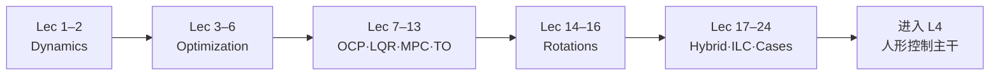

# CMU Optimal Control 2025 学习策展（16-745）

**一句话：** [Zachary Manchester](https://www.ri.cmu.edu/ri-people/zachary-manchester/) 主讲的 CMU **16-745 Optimal Control and Reinforcement Learning**（Spring 2025）把动力学、数值优化、经典 OCP、凸 MPC、TrajOpt/DDP、姿态、混杂系统与案例串成一条可对照本库方法页的公开视频课；入口是 YouTube 播放列表 [Optimal Control 2025](../../sources/courses/cmu_optimal_control_16_745_2025_youtube.md)。

## 英文缩写速查

| 缩写 | 英文全称 | 简要说明 |
|------|----------|----------|
| OCP | Optimal Control Problem | 有限/无限时域最优控制；本课理论主干 |
| LQR | Linear Quadratic Regulator | 线性二次调节；课中「三种推导」核心 |
| MPC | Model Predictive Control | 滚动时域在线求解；凸 MPC 专讲 |
| DDP | Differential Dynamic Programming | 二阶轨迹优化；与 iLQR 对照 |
| ILC | Iterative Learning Control | 重复任务上的迭代修正；应对模型误差 |
| LQG | Linear Quadratic Gaussian | LQR + Kalman 的随机最优控制经典组合 |
| SO(3) | Special Orthogonal Group in 3D | 三维旋转群；姿态模块基础 |

## 为什么重要

1. **补齐「有概念页、缺一整门课」的缺口**：本库早已链到该 playlist，但未做完整讲次归档；本页把 24 讲落成可导航策展。
2. **对齐 [运动控制主路线](../../roadmap/motion-control.md) L3–L4**：动力学 → 优化 → LQR/DP → MPC/TrajOpt → 足式/案例，正好覆盖「控制基础 → 传统主干」过渡带。
3. **与 [数值优化策展](./numerical-optimization-curriculum.md) 互补**：数值优化课给 QP/KKT/锥规划语言；本课给 **OCP 视角下如何把优化嵌进控制器**（射击法、直接法、DDP、凸 MPC）。

## 推荐学习路径

| 阶段 | 讲次 | 学完应能做什么 | 本库入口 |
|------|------|----------------|----------|
| 动力学底座 | 1–2 | 写离散动力学、谈平衡与稳定性 | [Optimal Control](../concepts/optimal-control.md) |
| 优化语法 | 3–6 | 线搜索/牛顿直觉、merit、正则 | [Numerical Optimization Curriculum](./numerical-optimization-curriculum.md) |
| 经典 OCP | 7–9 | Pontryagin、LQR 三视角、DP | [LQR](../formalizations/lqr.md)、[LQR/iLQR](../methods/lqr-ilqr.md) |
| 在线/离线轨迹 | 10–13 | 凸 MPC、非线性 TrajOpt、DDP、直接法 | [MPC](../methods/model-predictive-control.md)、[Trajectory Optimization](../methods/trajectory-optimization.md) |
| 姿态 | 14–16 | SO(3)/四元数上的优化与 LQR | [LQR](../formalizations/lqr.md) |
| 专题与案例 | 17–24 | 混杂足式、ILC、LQG、步行、KF 对偶、凸松弛着陆、驾驶博弈、BC | [ILC 范式](../overview/robot-control-paradigm-receding-horizon-ilc.md)、[KF](../formalizations/kalman-filter.md)、[Convex Relaxation](../methods/convex-relaxation-robotics.md)、[IL](../methods/imitation-learning.md) |

## 讲次 ↔ 本库节点映射

### Dynamics & Optimization（Lec 1–6）

| 讲 | 主题 | 独立节点 |
|----|------|----------|
| 1–2 | 动力学回顾、离散化与稳定性 | [Optimal Control](../concepts/optimal-control.md) |
| 3–5 | 数值优化 Pt.1–3 | [Numerical Optimization Curriculum](./numerical-optimization-curriculum.md)、[Constrained Optimization](../concepts/constrained-optimization.md) |
| 6 | 正则、merit、控制史 | 同上 + [Optimal Control](../concepts/optimal-control.md) |

### Optimal Control Core（Lec 7–13）

| 讲 | 主题 | 独立节点 |
|----|------|----------|
| 7 | 确定性 OCP 与 Pontryagin | [Optimal Control](../concepts/optimal-control.md) |
| 8 | LQR three ways | [LQR](../formalizations/lqr.md)、[LQR/iLQR](../methods/lqr-ilqr.md) |
| 9 | 可控性与动态规划 | [Bellman 方程](../formalizations/bellman-equation.md)、[MDP](../formalizations/mdp.md) |
| 10 | Convex MPC | [Model Predictive Control](../methods/model-predictive-control.md) |
| 11 | Nonlinear TrajOpt | [Trajectory Optimization](../methods/trajectory-optimization.md) |
| 12 | DDP | [LQR/iLQR](../methods/lqr-ilqr.md) |
| 13 | Direct TrajOpt / collocation / SQP | [Trajectory Optimization](../methods/trajectory-optimization.md) |

### Rotations & Special Topics（Lec 14–24）

| 讲 | 主题 | 独立节点 |
|----|------|----------|
| 14–16 | 三维旋转、姿态优化、四旋翼 LQR | [LQR](../formalizations/lqr.md) |
| 17 | 混杂系统与足式 | [Locomotion](../tasks/locomotion.md)、[Humanoid Locomotion](../tasks/humanoid-locomotion.md) |
| 18 | Iterative Learning Control | [滚动优化与 ILC](../overview/robot-control-paradigm-receding-horizon-ilc.md) |
| 19 | 随机 OCP 与 LQG | [Kalman Filter](../formalizations/kalman-filter.md)、[LQR](../formalizations/lqr.md) |
| 20 | How to Walk | [Locomotion](../tasks/locomotion.md)、[LIP/ZMP](../concepts/lip-zmp.md) |
| 21 | Kalman 与对偶 | [Kalman Filter](../formalizations/kalman-filter.md)、[State Estimation](../concepts/state-estimation.md) |
| 22 | 凸松弛与火箭着陆 | [Convex Relaxation in Robotics](../methods/convex-relaxation-robotics.md) |
| 23 | 自动驾驶与博弈 | [自动驾驶核心算法地图](../overview/autonomous-driving-core-algorithms-series.md) |
| 24 | 数据驱动控制与 Behavior Cloning | [Imitation Learning](../methods/imitation-learning.md) |

## 工程实践（怎么用这门课）

1. **先看课程站 Lectures 表，再开 playlist**：每讲有 notebook 目录（[`lecture-notebooks`](../../sources/repos/optimal_control_16_745.md)），边看边跑比只听录像效率高。
2. **L3 最小子集**：Lec 7–10 + 12（Pontryagin → LQR → DP → 凸 MPC → DDP）即可对接本库控制主干；姿态与案例按需加。
3. **与数值优化课并行**：卡在 QP/KKT/线搜索时跳到 [Numerical Optimization Curriculum](./numerical-optimization-curriculum.md)，再回 Lec 3–6 / 10。
4. **注意年份标签**：playlist 中 Lec 8、13 标题写 2024，内容仍挂在 2025 列表；以 playlist 顺序为准。

## 局限与风险

- **本页是策展而非字幕精读**：入库日未能稳定抽取 YouTube 字幕；公式细节以 notebook + 课程站为准。
- **作业不完全公开**：不要假设 Gradescope/私有 HW 仓可复现全部练习。
- **勿与 Tedrake Underactuated 混为一谈**：同主题邻域课程；本 playlist 的权威归属是 **CMU 16-745 / Manchester**（见来源归档说明）。
- **频道名含 MIT**：录像频道为 `MIT Robotic Exploration Lab`，课程建制仍是 CMU 16-745——引用时写清课程代号以免检索混淆。

## 关联页面

- [Optimal Control (OCP)](../concepts/optimal-control.md) — 理论入口
- [LQR / iLQR](../methods/lqr-ilqr.md) — Lec 8 / 12 方法页
- [Model Predictive Control](../methods/model-predictive-control.md) — Lec 10
- [Trajectory Optimization](../methods/trajectory-optimization.md) — Lec 11 / 13
- [Numerical Optimization Curriculum](./numerical-optimization-curriculum.md) — 优化语法互补
- [运动控制成长路线](../../roadmap/motion-control.md) — L3–L4 主路线

## 参考来源

- [sources/courses/cmu_optimal_control_16_745_2025_youtube.md](../../sources/courses/cmu_optimal_control_16_745_2025_youtube.md) — YouTube *Optimal Control 2025* 全表（24 讲）
- [sources/sites/cmu_optimal_control_16_745.md](../../sources/sites/cmu_optimal_control_16_745.md) — 官方课程站
- [sources/repos/optimal_control_16_745.md](../../sources/repos/optimal_control_16_745.md) — GitHub 讲义组织

## 推荐继续阅读

- [YouTube: Optimal Control 2025](https://www.youtube.com/playlist?list=PLZnJoM76RM6IAJfMXd1PgGNXn3dxhkVgI)
- [CMU 16-745 Lectures](https://optimalcontrol.ri.cmu.edu/lectures/)
- [Background 预习](https://optimalcontrol.ri.cmu.edu/background/)
- 社区笔记书（非官方）：[justinberi.github.io/CMU-16-745](https://justinberi.github.io/CMU-16-745/intro.html)
