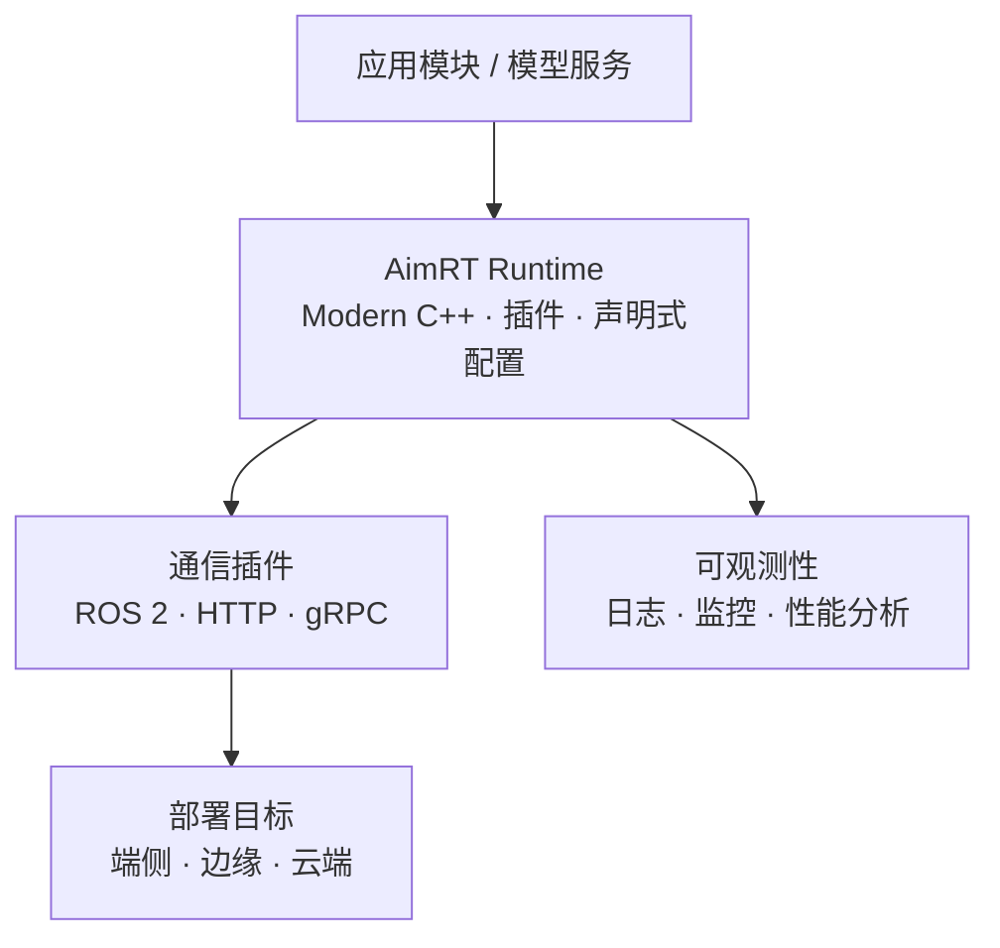

# AimRT

## 一句话定义

**AimRT** 是 [智元机器人](https://github.com/AgibotTech) 开源的 **Modern C++ 机器人运行时框架**（[GitHub](https://github.com/AimRT/AimRT)，Mulan PSL v2）：通过 **插件** 与 **声明式配置** 组织线程、资源、通信与部署，兼容 **ROS 2、HTTP、gRPC**，并提供日志、监控与性能分析等可观测性基础设施 — 适合承载模型服务与机器人应用模块，**不直接提供运动策略或训练代码**。

## 英文缩写速查

| 缩写 | 英文全称 | 简要说明 |
|------|----------|----------|
| AimRT | AgiBot Intelligent Robot Runtime | 智元开源机器人运行时框架 |
| ROS 2 | Robot Operating System 2 | 兼容的传统机器人生态接口 |
| gRPC | gRPC Remote Procedure Calls | 云/边 RPC 通信插件支持 |
| PSL | Permissive Software License | Mulan 宽松许可证 v2 |
| SDK | Software Development Kit | 上层应用通过插件/模块接入运行时 |

## 为什么重要

- **智元软件栈的「运行时层」**：在国内具身开源全景中归类为 **部署运行时**（见 [424 项覆盖索引](../queries/china-domestic-opensource-424-coverage.md)）；与 [AimDK X2](./agibot-aimdk-x2.md)（X2 真机任务 API）和 `aimrt_mujoco_sim`（MuJoCo 联调）分工清晰。
- **跨部署场景统一**：README 明确整合 **端侧 / 边缘 / 云端** 研发，面向 AI 与云原生机器人应用 — 适合把「机载模块 + 边云推理 + 监控」放在同一 runtime 语义下演进。
- **渐进式升级现有系统**：插件接口 + ROS 2/HTTP/gRPC 兼容，降低从 legacy 栈迁移的切换成本。

## 流程总览

## 核心原理

| 字段 | 内容 |
|------|------|
| 机构 | 智元机器人（AgiBot） |
| 许可 | Mulan PSL v2 |
| GitHub | <https://github.com/AimRT/AimRT>（~1400 stars，cpp20） |
| 文档 | <https://docs.aimrt.org/> · <https://aimrt.org/> |
| 设计重点 | 资源管控、异步编程、部署配置的现代 C++ 实现 |
| 扩展性 | 全面插件开发接口；兼容 ROS 2 / HTTP / gRPC |
| 边界 | **运行时与通信** — 非 RL 训练框架、非 X2 专用 SDK |

## 工程实践

1. **先读 README 与快速开始** — [docs.aimrt.org/tutorials](https://docs.aimrt.org/tutorials/index.html) 了解模块/插件组织方式与配置范式。
2. **与 AimDK 分工** — X2 真机二次开发优先 [AimDK X2 文档](./agibot-aimdk-x2.md)；需要改底层 runtime、跨端部署或自定义通信插件时再深入 AimRT 源码。
3. **仿真联调** — 公众号全景中的 **aimrt_mujoco_sim** 用 MuJoCo 做动力学、AimRT 做模块通信 — 适合控制器与状态发布联调，不等同于 Isaac 级大规模 RL。
4. **许可与依赖** — 提交产品化前核对 Mulan PSL v2 义务与第三方插件依赖。

## 局限与风险

- **docs.aimrt.org 可用性**：偶发 5xx；关键信息以 GitHub README 与 release notes 为备份入口。
- **不替代运动策略**：需自行接入训练栈（如 agibot_x1_train）或外部 WBC/VLA；勿期望 clone AimRT 即得行走策略。
- **与 AimDK 易混淆**：AimRT = 开源 **运行时**；AimDK = X2 **应用 SDK**（文档站分发，非同一 GitHub 仓）。

## 关联页面

- [AimDK X2（灵犀二次开发框架）](./agibot-aimdk-x2.md)
- [agibot_x2_urdf（本体模型资产）](./cn-os-agibot-x2-urdf.md)
- [国内具身开源全景技术地图](../overview/china-domestic-embodied-opensource-76-companies-technology-map.md)
- [424 项覆盖索引](../queries/china-domestic-opensource-424-coverage.md)

## 参考来源

- [AimRT 源码归档](../../sources/repos/aimrt.md)（<https://github.com/AimRT/AimRT>）
- [国内具身智能开源全景（微信公众号）](../../sources/blogs/wechat_embodied_station_domestic_opensource_panorama_2026-09-06.md)

## 推荐继续阅读

- [AimRT 发布说明](https://docs.aimrt.org/release_notes/index.html)
- [AimDK X2 官方文档](https://x2-aimdk.agibot.com/zh-cn/latest/index.html)
