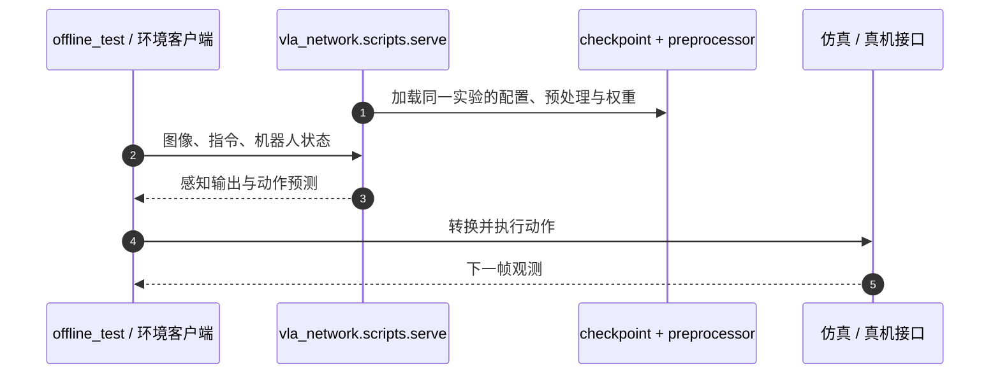

# GraspVLA：十亿级合成数据预训练的抓取基座

## 一句话定义

GraspVLA 在 SynGrasp-1B 合成动作数据上预训练，以自回归感知与 flow-matching 动作生成联合支持开放词汇抓取和零样本 Sim2Real。

## 英文缩写速查

| 缩写 | 英文全称 | 简要说明 |
| --- | --- | --- |
| VLA | Vision-Language-Action | 视觉和语言条件下生成动作 |
| CoT | Chain of Thought | 串联感知与动作生成的思维链 |
| HF | Hugging Face | 官方模型与数据分发平台 |

## 为什么重要

- 展示大规模仿真数据能否预训练可真机迁移的抓取策略。
- 已有模型服务、训练数据和仿真/真机接口，可从原先的公司清单入口转为复现入口。

## 核心原理

**SynGrasp-1B** 是十亿帧合成抓取数据，官方 README 称覆盖 **240 类、超过一万物体**。模型将自回归感知任务与 flow-matching 动作生成置于统一 CoT，以联合利用动作数据与互联网语义；这使合成动作学习与开放词汇理解能共享表征。

这里的“零样本”指论文设定下的直接 Sim2Real 抓取迁移，不代表任意本体、任意相机和任意接触任务无需适配。

## 源码运行时序图

从 `offline_test` 验证服务协议，再接 README 的 simulation playground；真机控制需要独立适配。

## 工程实践

1. 锁定官方 `PKU-EPIC/GraspVLA` 的版本，按 `uv sync --locked` 安装。
2. 获取 HF `vegebirrd/GraspVLA` 权重；`config.json`、`preprocessor.npz` 与 checkpoint 必须来自同一实验目录。
3. 启动 `vla_network.scripts.serve`，用 `vla_network.scripts.offline_test` 验证请求/响应及感知框。
4. 先接 simulation playground，再查 real-world control interface；训练入口使用 SynGrasp-1B。
5. **开源核查（2026-10-05）**：推理、训练入口、权重和 SynGrasp-1B 已列出；数据发布新闻日期为 2026-08-19。

## 局限与风险

- 配置/归一化不匹配会让可运行的服务生成错误动作，须先做离线回放。
- 感知泛化与真机抓取成功率要分开；仿真 benchmark 不能替代硬件协议。
- 公开代码与模型可用不自动说明所有训练依赖或每个许可都相同，使用前检查相应仓库/资产说明。

## 关联页面

- [AstraBrain](./galbot-astrabrain.md)
- [VLA](../methods/vla.md)
- [Sim2Real](../concepts/sim2real.md)

## 参考来源

- [官方 GraspVLA 代码与资产核查](../../sources/repos/graspvla.md)

## 推荐继续阅读

- [官方仓库](https://github.com/PKU-EPIC/GraspVLA)
- [原始论文](https://arxiv.org/abs/2505.03233)
