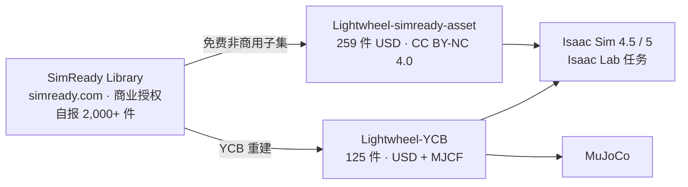

# Lightwheel-simready-asset

## 一句话定义

**Lightwheel-simready-asset** 是 [光轮智能](./lightwheel.md) 在 GitHub 公开的 **免费 SimReady 资产包（v1，2025）**：259 个面向 NVIDIA Isaac Sim 的 USD 资产（251 件操作物体 + 8 个运动地形环境），许可为 **CC BY-NC 4.0**——它是商业 [Lightwheel SimReady](./lightwheel-simready.md) 资产体系的非商用开源子集。

## 英文缩写速查

| 缩写 | 英文全称 | 简要说明 |
|------|----------|----------|
| SimReady | Simulation-Ready | 带物理、碰撞、关节、可直接仿真的资产；光轮资产体系的品牌名 |
| USD / USDZ | Universal Scene Description（Zip 包） | 资产格式；Isaac Sim 原生，免转换 |
| CC BY-NC 4.0 | Creative Commons Attribution-NonCommercial 4.0 | 本仓许可：可署名使用与改编，禁止商用 |
| RL | Reinforcement Learning | README 声称资产经 RL 工作流验证 |
| Teleop | Teleoperation | README 声称资产经遥操作采数验证 |

## 为什么重要

- **零成本起步：** 商业 [SimReady Library](./lightwheel-simready.md)（simready.com）按件售卖（样例 $50 / $145）；本仓是研究与教学可直接下载的免费入口。
- **铰接预配置：** 门、抽屉、柜等交互件已配 articulation，省去在 Isaac Sim 里手工配关节——对 [Isaac Lab](./isaac-lab.md) 操作任务原型最有用。
- **国内开源清单中的「资产层」代表：** 收录于 [国内具身智能开源全景（76 家 · 424 项）](../overview/china-domestic-embodied-opensource-76-companies-technology-map.md) 的本体模型资产分组；与 [Lightwheel-YCB](./cn-os-lightwheel-ycb.md) 一起构成光轮公开资产的两块。

## 核心原理

| 字段 | 内容（README，2026-10-10 核查） |
|------|------|
| 机构 | 光轮智能（Lightwheel AI，README 地址 Cupertino, CA） |
| 规模 | **259** 个资产：**251** 操作（家居物品、厨房用品与工具、工业零件、门/抽屉/柜等交互件、训练用几何体）+ **8** 运动（地形变体、导航环境、障碍赛道、台阶与坡道、室内外空间） |
| 格式 | `.usd` / `.usdz` |
| 目标平台 | NVIDIA **Isaac Sim 4.5 / 5** |
| 交互 | 预配置 articulation；Isaac Sim 中 Shift + 左键拖动可动部件 |
| 验证 | 自报 "Isaac Lab, Teleoperation, RL validated"（无公开测试报告） |
| 下载 | 仓库本体不含资产，经 README 的 Google Drive 链接下载 |
| 许可 | **CC BY-NC 4.0**（根目录 LICENSE 存在）；署名要求：项目内命名为 `lightwheel_{asset_name}` |
| 引用 | BibTeX `lightwheel_simready_2025`，version v1 |

与 SimReady 体系的关系：

## 工程实践

1. 从 README 的 Google Drive 链接下载资产包，解压后在 Isaac Sim 中直接打开 USD 检查碰撞与关节。
2. 放进 [Isaac Lab](./isaac-lab.md) 场景前，抽查质量、摩擦与碰撞近似（README 未列物理参数来源），必要时加 [域随机化](../concepts/domain-randomization.md)。
3. 在代码与论文中按 `lightwheel_{asset_name}` 命名并引用 `lightwheel_simready_2025`，满足署名条款。
4. 需要标准化物体集做可复现实验时，优先 [Lightwheel-YCB](./cn-os-lightwheel-ycb.md)；需要更多品类或商用授权时转向 simready.com。
5. 资产问题按 README 渠道反馈（Discord / GitHub Issues），附 Isaac Sim 版本与复现步骤。

## 局限与风险

- **非商用：** CC BY-NC 4.0 禁止商业使用；产品化或客户交付须另购商业授权。
- **资产不在 git 中：** 依赖 Google Drive 外链，链接失效或版本漂移无 git 历史可追溯。
- **"实测物理"未体现在本仓：** 光轮 2026-03 提出的 Measure → Solve → Generate 实测参数叙事针对商业体系；本仓 README 未说明物理参数是测量还是估计。
- **版本兼容：** 仅声明 Isaac Sim 4.5 / 5；Newton 或 MuJoCo 需自行转换（Newton 资产见 [Lightwheel SimReady](./lightwheel-simready.md) 的 Newton-Lightwheel 说明）。
- 公众号清单为策展快照（2026-09-06）；本页事实以 2026-10-10 仓库 README 为准。

## 关联页面

- [Lightwheel SimReady](./lightwheel-simready.md) — 本仓所属的商业资产体系主节点
- [Lightwheel SimReadyGen](./lightwheel-simreadygen.md) — 文本→SimReady 资产生成服务
- [Lightwheel-YCB](./cn-os-lightwheel-ycb.md) — 另一个开源资产集（YCB 重建）
- [Isaac Sim](./isaac-sim.md) / [Isaac Lab](./isaac-lab.md) — 目标平台
- [国内具身开源全景技术地图](../overview/china-domestic-embodied-opensource-76-companies-technology-map.md)
- [HMI 开源项目主表导读](../queries/hmi-opensource-projects-coverage.md)
- [Humanoid Motion Intelligence](../entities/humanoid-motion-intelligence.md)

## 参考来源

- [Lightwheel-simready-asset 源码归档](../../sources/repos/lightwheel-simready-asset.md)（<https://github.com/LightwheelAI/Lightwheel-simready-asset>）
- [光轮 SimReady 官方博文合集归档](../../sources/blogs/lightwheel_simready.md)
- [国内具身智能开源全景（微信公众号）](../../sources/blogs/wechat_embodied_station_domestic_opensource_panorama_2026-09-06.md)

## 推荐继续阅读

- [LightwheelAI/Lightwheel-simready-asset（GitHub）](https://github.com/LightwheelAI/Lightwheel-simready-asset)
- [simready.com 资产商城](https://simready.com/)
- [光轮智能 GitHub 组织](https://github.com/LightwheelAI)
