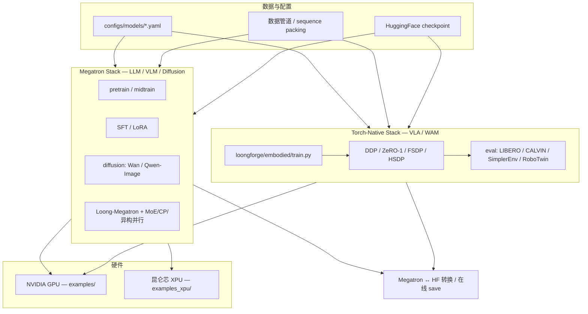
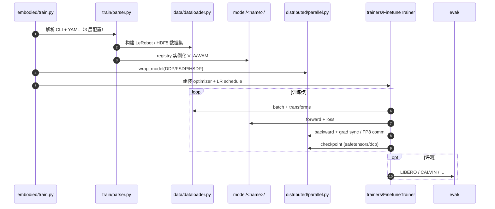

# LoongForge

## 一句话定义

**LoongForge** 是 [百度智能云百舸](https://github.com/baidu-baige) 开源的 **多模态大模型与具身模型训练框架**：在 patch 版 [Megatron-LM](https://github.com/NVIDIA/Megatron-LM) 之上覆盖 LLM / VLM / 扩散预训练与 SFT，并以独立的 **torch-native 子系统**（`loongforge/embodied/`）加速 Pi0.5、GR00T、xVLA、DreamZero 等 **VLA 与世界–动作（WAM）** 微调；原生支持 **NVIDIA GPU** 与 **昆仑芯 XPU**，Apache 2.0 许可。

## 英文缩写速查

| 缩写 | 英文全称 | 简要说明 |
|------|----------|----------|
| VLA | Vision-Language-Action | 视觉–语言–动作统一策略 |
| WAM | World-Action Model | 世界–动作模型（如 DreamZero、FastWAM） |
| MoE | Mixture of Experts | 混合专家架构；LoongForge 含 EP 通信与 TAOT 负载均衡 |
| EP | Expert Parallelism | 专家并行；MoE 训练中的专家分片与 All2All 通信 |
| FSDP | Fully Sharded Data Parallel | 全分片数据并行；具身栈默认策略之一 |
| CP | Context Parallel | 上下文并行；长序列 LLM 训练 |
| HF | Hugging Face | checkpoint 在线读写与 Megatron↔HF 转换 |
| XPU | — | 昆仑芯 AI 加速卡；`examples_xpu/` 独立入口 |

## 为什么重要

- **国内少有的「基础模型 + 具身」统一训练栈**：同一仓库提供 DeepSeek / Qwen / GLM 等 LLM·VLM 与 Pi0.5 / GR00T / DreamZero 等具身 example，降低从预训练到 VLA 后训练的工具链切换成本。
- **生产验证背景**：源自百舸 [AIAK-Training-LLM](https://cloud.baidu.com/doc/AIHC/s/Alyo476jr) 企业套件，README 称最大生产 run 达 **5000+ XPU**；曾支撑 LLaVA-OneVision-1.5/2.0 等公开模型训练。
- **具身社区直接可用**：2026-07 发布的 **LoongForge-Embodied** 对代表 VLA/WAM 宣称 **1.79×–4.38×** 相对官方基线吞吐，并内置 LIBERO / CALVIN 等评测模块——与 [LeRobot](./lerobot.md) 数据格式兼容（`lerobot_dataset.py`）。
- 收录于 [国内具身开源全景](../overview/china-domestic-embodied-opensource-76-companies-technology-map.md)；本页为 **424 项索引** 中百度智能云条目的深度节点（原公众号分类「数据采集/工具」已修正为 **训练框架/加速**）。

## 流程总览

LoongForge 按模态拆成 **Megatron 栈** 与 **具身 torch-native 栈**，共享配置、Docker 与 checkpoint 工具，但训练 core  intentionally 解耦：

## 核心原理

| 维度 | Megatron Stack | LoongForge-Embodied |
|------|----------------|---------------------|
| **目标规模** | 十亿–千亿参数 LLM/VLM、扩散 | 通常 &lt;10B 的 VLA/WAM |
| **并行** | TP / PP / EP / CP、ViT–LLM 异构并行 | DDP、ZeRO-1、FSDP、HSDP |
| **关键优化** | TAOT MoE 负载均衡、FP8 训练、长序列 CP | `torch.compile`、CUDA Graph、FP8 通信、按模型定制 I/O |
| **代表模型** | DeepSeek-V3、Qwen3-VL、Wan2.2、GLM-5.2 | Pi0.5、GR00T-N1.6/1.7、xVLA、DreamZero、LingBot-VA |
| **入口** | `loongforge/train/` + `examples/` | `loongforge/embodied/train.py` + `examples/embodied/` |

**设计取舍：** 具身模型参数量远小于 LLM，Megatron 式 TP/PP/EP 收益有限；因此 embodied 子系统 **不与 Megatron 共享 args/parser/core**，避免为小模型背负大模型训练栈复杂度，同时仍共用仓库 release、Docker 与文档。

## 源码运行时序图（具身微调路径）

以下时序对齐 `loongforge/embodied/train.py` → `train/trainers/` → `distributed/` 的典型 **VLA 微调** 路径（如 Pi0.5 / GR00T）：

**复现入口：** `examples/embodied/<model>/` 下 shell 脚本；统一 Docker 镜像见 [hub.docker.com/u/loongforge](https://hub.docker.com/u/loongforge)。

## 工程实践

| 步骤 | 动作 |
|------|------|
| 1. 环境 | 拉取 **统一 Docker 镜像**（LLM/VLM/VLA/扩散共用）或按 [安装指南](https://loongforge.readthedocs.io/en/latest/get_started/installation.html) 源码安装；昆仑芯见 [P800 教程](https://loongforge.readthedocs.io/en/latest/kunlun_tutorial/install_p800.html) |
| 2. 选型 | LLM/VLM/扩散 → `examples/` + Megatron 文档；VLA/WAM → `examples/embodied/` + [具身教程索引](https://loongforge.readthedocs.io/en/latest/embodied_tutorial/quick_start_index.html) |
| 3. 数据 | 具身侧支持 **LeRobot 格式**（`loongforge/embodied/data/datasets/lerobot_dataset.py`）；大模型侧内置格式转换与 packing |
| 4. 权重 | 离线 **Megatron ↔ HF** 转换，或训练过程 **在线 HF load/save**（`tools/`） |
| 5. 验证 | 具身：`loongforge/embodied/eval/`；对比官方基线 loss 曲线与 README [Performance](https://github.com/baidu-baige/LoongForge#performance) 表 |

### 具身代表加速（README 快照，2026-09）

| 模型 | 类型 | 宣称加速 |
|------|------|----------|
| DreamZero (Wan2.2-5B) | WAM | **4.38×** |
| Pi0.5 | VLA | **2.80×** |
| GR00T-N1.6 | VLA | **2.31×** |
| GR00T-N1.7 / xVLA | VLA | **1.79×** |

## 局限与风险

- **双栈认知成本**：LLM 与具身路径配置体系不同（Megatron args vs embodied 三层 YAML）；误用栈会导致并行策略无效或 OOM。
- **部分算子平台绑定**：README 写明部分高性能 **CUDA fused op** 仅在百舸平台提供；自托管 GPU 需以开源 TileLang / PyTorch 路径为准实测吞吐。
- **基线对齐声明**：官方强调 loss 曲线对齐，但 benchmark 为 **特定机型的时点快照**；换卡型、batch 或数据 packing 后需自行复测。
- **与 LeRobot 分工**：LoongForge **侧重训练加速与多机扩展**；数据采集、Hub 权重与 EnvHub 评测仍常回到 [LeRobot](./lerobot.md) 生态。
- **开源状态（2026-09-21 复核）**：主仓、文档、Docker、example 脚本 **已开源**（Apache 2.0）；无独立「仅权重」 gating。

## 关联页面

- [LeRobot](./lerobot.md) — 具身数据格式与 Hub 生态；LoongForge-Embodied 内置 LeRobot 数据集后端
- [Isaac GR00T](./isaac-gr00t.md) — GR00T-N1.6/N1.7 官方实现；LoongForge 提供加速训练 example
- [VLA](../methods/vla.md) — 视觉–语言–动作方法总览
- [国内具身开源 424 项覆盖](../queries/china-domestic-opensource-424-coverage.md)

## 参考来源

- [LoongForge 源码归档](../../sources/repos/loongforge.md)（GitHub 深度复核，2026-09-21）
- [国内具身智能开源全景（微信公众号）](../../sources/blogs/wechat_embodied_station_domestic_opensource_panorama_2026-09-06.md) — 初收录条目

## 推荐继续阅读

- [LoongForge GitHub 仓库](https://github.com/baidu-baige/LoongForge)
- [LoongForge 文档](https://loongforge.readthedocs.io/en/latest/index.html)
- [LoongForge-Embodied 子系统 README](https://github.com/baidu-baige/LoongForge/tree/main/loongforge/embodied)
- [TAOT 论文（MoE 专家放置）](https://arxiv.org/abs/2608.03676)
