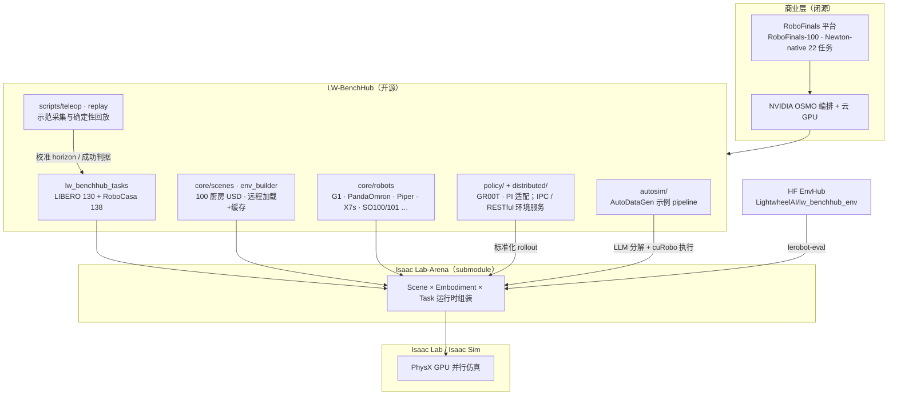
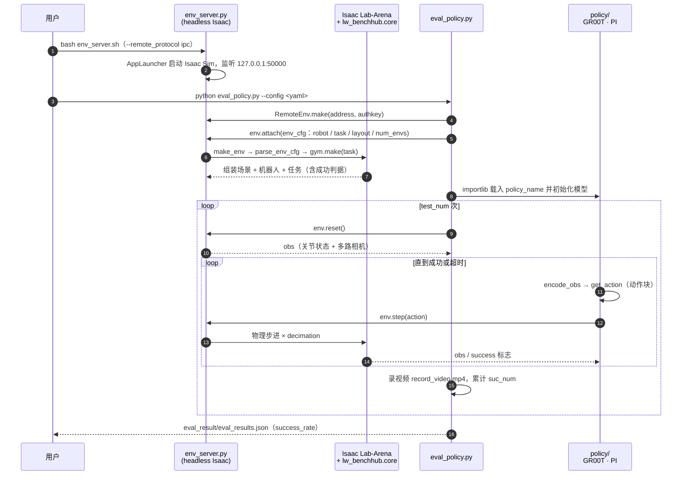

# LW-BenchHub（Lightwheel BenchHub）

**LW-BenchHub**（[LightwheelAI/LW-BenchHub](https://github.com/LightwheelAI/LW-BenchHub)）是 [光轮智能](./lightwheel.md) 开源的 **具身评测 benchmark 枢纽**：在 NVIDIA [Isaac Lab-Arena](./isaac-lab-arena.md)（光轮 × NVIDIA 共同开发的评测框架）之上，把任务定义、场景资产、策略 rollout 编排与评测指标打包成一层，先后承载 Lightwheel-LIBERO（130 任务）与 Lightwheel-RoboCasa（138 任务）。它也是商业评测平台 [RoboFinals](./lightwheel-robofinals.md) 的开源下层：官方博文把 RoboFinals 描述为「Arena + BenchHub」双层基础设施之上的产品。

## 一句话定义

**Arena 负责「场景 × 机器人 × 任务」可组合，BenchHub 负责「把一整套 benchmark 托管起来、按统一协议跑完并计分」——LW-BenchHub 就是这层托管/执行框架的开源实现。**

## 英文缩写速查

| 缩写 | 英文全称 | 简要说明 |
|------|----------|----------|
| LW | Lightwheel | 光轮智能；仓库与任务套件前缀（LW-RoboCasa-Tasks / LW-LIBERO-Tasks） |
| Arena | NVIDIA Isaac Lab-Arena | 光轮 × NVIDIA 评测框架；Scene / Embodiment / Task 解耦，本仓以 git submodule 引入 |
| LIBERO | LIBERO（Lifelong Robot Learning benchmark） | 终身学习桌面/房间操作 benchmark；本仓迁入 130 任务 |
| USD | Universal Scene Description | OpenUSD 场景格式；100 厨房场景以 USD 交付 |
| MJCF | MuJoCo XML Format | MuJoCo 模型格式；Lightwheel-YCB 资产同时提供 |
| VLA | Vision-Language-Action | 视觉-语言-动作策略；本仓 `policy/` 带 GR00T、π 系列适配 |
| RL / IL | Reinforcement / Imitation Learning | README 给出 RL（rsl-rl、skrl）训练与 IL 策略评测两条线 |
| SR | Success Rate | `eval_policy.py` 输出的 `success_rate` |
| IPC | Inter-Process Communication | 环境服务与策略进程默认走本地 IPC（:50000），亦可选 RESTful |
| OSMO | NVIDIA OSMO | RoboFinals 用于分布式 rollout 编排；不在本仓内 |

## 为什么重要

- **学术榜在 Isaac 上的「统一骨架」：** 原版 [RoboCasa](./robocasa.md) 跑在 robosuite + MuJoCo，[LIBERO](./libero-benchmark.md) 也有自己的栈；LW-BenchHub 把二者（以及资产侧的 [Lightwheel-YCB](./cn-os-lightwheel-ycb.md)）放进同一个 Arena 骨架，使跨任务、跨场景、跨机器人的对比口径一致。
- **RoboFinals 的可自助部分：** RoboFinals 平台、RoboFinals-100 与 Newton-native 22 任务都不公开；想提前对齐其评测管线，能 `git clone` 的就是 Arena + LW-BenchHub（+ AutoDataGen）。
- **评测吞吐的证据来源：** 光轮与 NVIDIA 用本仓的 Lightwheel-RoboCasa-Tasks 做了 Arena 并行评测性能研究，自报最高 **13.5×**、10 小时级压到 1 小时内，这是 Arena「GPU 并行评测」叙事的主要实测出处之一。
- **EnvHub 生态入口：** HF 上的 `LightwheelAI/lw_benchhub_env` 让 `lerobot-eval` 直接拉取光轮厨房任务，见 [LeRobot EnvHub](../concepts/lerobot-envhub.md) 与 [LW BENCHHUB TOUR](./lw-benchhub-tour.md)。

## 官方博文时间线

> 逐篇要点；原文链接、完整数字与口径差异见 [BenchHub × Arena 博文合集](../../sources/blogs/lightwheel_benchhub_arena_posts.md)。数字均为 **光轮自报**。

### 2025-09-29 · One Skeleton, Three Benchmarks（三 benchmark 迁入 Arena）

- **定位：** Arena 除训练/评测外，可作 **benchmark skeleton**——高质量场景/资产 + 模块化 task/robot/scene 接口，让 benchmark 能一致地迁移与扩展。
- **Lightwheel-YCB：** 重建全部 106 个 YCB 物体 + 19 个课程方块（共 125）；PBR 材质与质量/摩擦/刚度升级；刚体/铰接/可变形；OpenUSD + MJCF；teleop 验证（详见 [Lightwheel-YCB](./cn-os-lightwheel-ycb.md)）。
- **Lightwheel-LIBERO：** 130 任务全部迁入；厨房/客厅/书房等环境刷新；多机器人 Piper、X7s、G1；每「任务 × 机器人」50 条人类示范。
- **Lightwheel-RoboCasa：** 138 任务迁入；100 厨房（10 layout × 10 style）；2,500+ 资产用于随机化；多机器人 G1、X7s、R1 Pro；同样 50 条示范/组合。
- **读法：** 这一步只是「迁移 + 资产升级」，还没有「BenchHub」这个名字的托管层叙事，也没有公开分数。

### 2026-01-05 · Behind RoboFinals: Isaac Lab – Arena and Lightwheel BenchHub（命名 BenchHub 与开源任务套件）

- **双层栈：** RoboFinals = Arena（开源评测核）+ **Lightwheel BenchHub**（benchmark 托管、执行、规模化）。
- **BenchHub 四件套：** benchmark 任务定义 / 仿真资产与场景配置 / 策略执行与 rollout 编排 / 评测管线与指标；把基础设施与具体任务套件解耦，让多个 benchmark 共用稳定底座。
- **有效性校准：** 用 teleop 数据 + **确定性轨迹回放** 校准任务可行性、episode horizon 与成功判据；策略成绩 **只通过标准化 rollout** 计（避免脆弱仿真设置造成的假成功）。
- **开源 LW-RoboCasa-Tasks + LW-LIBERO-Tasks：** 268 任务（原子技能 → 长时域复合，注册为 Gymnasium 环境）；RoboCasa 100 USD 厨房 + LIBERO 4 个桌面场景族，场景远程加载 + 本地缓存；8 族 / 28 机器人变体；每「任务–机器人」50 个标准化 episode → **20,000+** 受控评测 episode，用于分布级而非单点评测。

### 2026-02-04 · GPU-Accelerated Parallel Evaluation（Arena 性能研究）

- **设置：** Lightwheel-RoboCasa-Tasks（Arena）vs 原版 RoboCasa（robosuite + MuJoCo）；10 个长时域任务（PrepareCoffee、QuickThaw、SteamInMicrowave 等）；**GR00T N1.5** 策略、Panda-Omron；每 rollout 200 步；1,024 / 2,048 / 4,096 并行 env；**8× RTX 6000D**。三组对照：Arena 并行 / Arena 顺序 / MuJoCo 顺序，任务、episode 数、策略推理一致。
- **结果（自报）：** 相对 MuJoCo 顺序 **10.7× / 12.4× / 13.5×**（随并行数增加）；墙钟 MuJoCo 顺序 10.2 h、Arena 顺序 **34.9 h**（高保真资产更贵）、Arena 并行 **0.76 h** → 并行本身带来 **46×**。
- **边界：** 只测 **同构并行**（仅物体位置变化）；每 env 不同物体的 **异构并行** 待 Arena v0.2（文发时「coming soon」）。原始数据在文内链接的 Google Doc，本库未核实。
- **与 Arena 页数字的关系：** [Isaac Lab-Arena](./isaac-lab-arena.md) 页引 NVIDIA 博客写「约 40×」，与本文 46× 口径来源不同（推测为不同统计方式或版本），引用时注明出处。

## 核心原理

### 分层栈

| 层 | 负责什么 | 不负责什么 |
|----|----------|------------|
| Isaac Lab / Sim | 物理与渲染、GPU 并行 env | benchmark 语义 |
| [Isaac Lab-Arena](./isaac-lab-arena.md) | Scene / Embodiment / Task 运行时组合，避免 N×M×K 份配置 | 具体任务套件、资产库、计分口径 |
| **LW-BenchHub** | 任务定义与成功判据、场景/资产加载、机器人适配、teleop/回放校准、策略服务化评测、RL 预设 | 分布式集群编排、闭源任务包 |
| RoboFinals | 100 任务工业榜、多物理后端记分板、OSMO 编排、云/本地部署 | — （商业服务） |

### 关键机制

1. **任务即注册：** `lw_benchhub_tasks/` 下每个任务（如 `OpenOven`）自带成功判据、资产控制与摆放逻辑，以 Gymnasium id 注册，`task_backend` / `scene_backend` 字段在 YAML 中切换 RoboCasa / LIBERO 来源。
2. **场景 × 布局解耦：** `layout`（如 `libero-1-1`）、`sources`（objaverse / lightwheel / aigen_objs）与 `resample_*_on_reset` 控制随机化；厨房场景经 Lightwheel SDK 拉取并本地缓存。
3. **策略–仿真解耦：** README 称「server–client 架构 + zero-copy 数据交换」。源码中 `env_server.py` 在 headless Isaac 进程里起环境服务（默认 IPC `127.0.0.1:50000`，可选 RESTful `:8000`），`eval_policy.py` 作为客户端 `attach` 环境配置后循环 `reset → policy.eval`，最终写 `eval_result/eval_results.json`（`success_rate`）。这样 GR00T、π 等依赖可与 Isaac 的 Python 环境隔离。
4. **数据校准闭环：** teleop（键盘 / Vision Pro、PICO、Quest / 主从臂）→ HDF5 → state / action / joint-target 三种回放；`core/checks/` 下有掉落、穿模、速度跳变、动作–状态不一致等检查器，对应博文「确定性回放校准成功判据」的工程落点（推测：博文指的就是这一套，官方未逐一对应）。

## 源码运行时序图

以仓库 `env_server.sh` + `lw_benchhub/scripts/policy/eval_policy.py` 的 **原生策略评测路径** 为例（HEAD `b2bcb2d`，2026-05-18）。EnvHub / `lerobot-eval` 路径见 [LW BENCHHUB TOUR](./lw-benchhub-tour.md) 的时序图，此处不重复。

复现关键：先起 `env_server` 再跑客户端；`env_cfg` 未给的字段由客户端默认值补齐（`scene_backend=robocasa`、`num_envs=1`、`execute_mode=eval` 等）。批量并行评测需把 `num_envs` 调大，单进程默认是 1。

## 工程实践

| 步骤 | 做法 / 入口 | 注意 |
|------|-------------|------|
| 安装 | `conda create -n lw_benchhub python=3.11` → `git lfs pull` → `bash install.sh` | README 徽章：Python 3.11、CUDA 12.8、驱动 570.133.07、Isaac Lab 5.0.0；需 RTX GPU |
| 版本线 | `third_party/IsaacLab-Arena` 为 submodule | 社区 Tour 复现钉 Lab 2.3.2 / Sim 5.1 / Arena 0.1.1；Arena 主线已转 Lab 3.0 / Sim 6.0（见 [Arena](./isaac-lab-arena.md)），**不要混装** |
| 采示范 | `python lw_benchhub/scripts/teleop/teleop_main.py --task_config pandaomron`，YAML 设 `record: true` | 输入：键盘 / VR / 主从臂 |
| 回放校验 | `replay_demos.py`（state）/ `replay_action_demo.py --replay_mode action|joint_target` | 用来确认任务可行与 horizon，是评测可信度前提 |
| RL | `bash train.sh`（默认 LiftObj state）/ `bash eval.sh` | 装饰器绑定 RL 配置，接 rsl-rl、skrl |
| VLA 评测（原生） | `env_server.sh` + `scripts/policy/eval_policy.py`，策略在 `policy/GR00T`、`policy/PI` | 见上方时序图 |
| VLA 评测（EnvHub） | `lerobot_eval.sh`：`--env.hub_path=LightwheelAI/lw_benchhub_env` + SmolVLA DoublePiper | 细节与坑见 [Tour](./lw-benchhub-tour.md)、[EnvHub](../concepts/lerobot-envhub.md) |
| 数据 | HF：`LightwheelAI/Lightwheel-Tasks-{Double-Piper,G1-WBC,G1-Controller,X7S}`、`lightwheel_tasks` | README：219 任务 × 4 机器人，21,500 episode / 20,537,015 帧 |
| 自动生成动作 | 装 [AutoDataGen](https://github.com/LightwheelAI/AutoDataGen)（`autosim`）+ [cuRobo](./curobo.md) 后跑 `scripts/autosim/run_autosim_example.py --pipeline_id=LWBenchhub-Autosim-CoffeeSetupMugPipeline-v0` | 仓内 9 个 pipeline；脚本技能「执行完」≠ 任务成功 |
| 对齐 RoboFinals | 用同一 Arena + BenchHub 协议跑自家策略，再申请 RoboFinals | RoboFinals 任务与资产难度更高，SR 不可直接迁移 |

### 开源状态（2026-10-10 核查）

| 项 | 状态 |
|----|------|
| 代码 | **已开源**；README 与源文件头声明 Apache 2.0，仓库根目录 **无独立 LICENSE 文件**；最新提交 2026-05-18 |
| 任务套件 | 268 任务代码在仓内（`lightwheel_libero_tasks` 5 个子套件 + `lightwheel_robocasa_tasks` single/multi stage） |
| 场景资产 | 经 Lightwheel SDK 远程拉取；离线全量获取方式 **未核实** |
| 示范数据 | **已发布**（HF） |
| AutoDataGen | **已开源**（Apache 2.0） |
| RoboFinals 任务包 / Newton-native 任务 | **未开源**（商业平台内） |

## 局限与风险

- **自报数字为主：** 13.5×、46×、20,000+ episode、28 变体等均出自光轮博文；性能研究原始数据在外链 Google Doc，未经第三方复现。
- **博文与 README 口径不一：** 博文写 8 族 / 28 变体、RoboCasa 支持 R1 Pro；README 写 7 类 / 27 变体且未列 R1 Pro。引用时以入库日 README 为准并注明。
- **「比 MuJoCo 快」不是单步更快：** Arena 顺序执行反而慢约 3.4 倍（34.9 h vs 10.2 h）；收益完全来自 GPU 并行，**单 env 调试或小批量评测不会更快**。
- **同构并行局限：** 性能研究只变物体位置；真正的多物体、多场景异构并行依赖 Arena v0.2 之后的版本。
- **与原版 benchmark 不可直接横比：** Lightwheel-RoboCasa / LIBERO 换了资产、物理参数与机器人，分数不能与 [RoboCasa 官方榜](./robocasa.md) 或原版 LIBERO 结果混排。
- **资产依赖外部服务：** 场景通过 Lightwheel SDK 远程加载；网络或账号受限时可能无法完整复现（推测，未实测）。
- **版本漂移快：** README 徽章（Isaac Lab 5.0.0）、社区复现（Lab 2.3.2）与 Arena 主线（Lab 3.0）三条线并存，升级前先锁 submodule commit。

## 关联页面

- [光轮智能](./lightwheel.md) — 公司主页
- [Lightwheel RoboFinals](./lightwheel-robofinals.md) — 建在 Arena + BenchHub 上的商业评测平台
- [Isaac Lab-Arena](./isaac-lab-arena.md) — 下层开源评测框架
- [LW BENCHHUB TOUR](./lw-benchhub-tour.md) — SmolVLA × EnvHub × 双臂 Piper 的社区复现
- [LeRobot EnvHub](../concepts/lerobot-envhub.md) — `lw_benchhub_env` 的分发机制
- [Lightwheel-YCB](./cn-os-lightwheel-ycb.md) — 同一「骨架」迁移中的资产 benchmark
- [RoboCasa](./robocasa.md) / [LIBERO](./libero-benchmark.md) — 被迁移的原版 benchmark
- [Newton Physics](./newton-physics.md) — RoboFinals Newton-native 全栈的物理引擎
- [GR00T](./isaac-gr00t.md) — 性能研究所用策略
- [具身评测基准选型闭环](../queries/embodied-eval-benchmark-selection-loop.md)
- [国内具身开源全景技术地图](../overview/china-domestic-embodied-opensource-76-companies-technology-map.md)

## 参考来源

- [BenchHub × Arena 官方博文合集（2025-09-29 / 2026-01-05 / 2026-02-04）](../../sources/blogs/lightwheel_benchhub_arena_posts.md)
- [RoboFinals 官方博文合集](../../sources/blogs/lightwheel_robofinals_posts.md)
- [LW-BenchHub 仓库归档（国内开源全景条目）](../../sources/repos/cn_os_lw_benchhub.md)
- [LW-BenchHub 仓库归档（2026-08 快照）](../../sources/repos/lw-benchhub.md)
- [Behind RoboFinals 单篇归档](../../sources/sites/lightwheel_robofinals_isaac_lab_arena.md)
- [国内具身智能开源全景（微信公众号）](../../sources/blogs/wechat_embodied_station_domestic_opensource_panorama_2026-09-06.md)
- [One Skeleton, Three Benchmarks](https://lightwheel.ai/media/lightwheel-benchmark-anouncement)
- [Behind RoboFinals](https://lightwheel.ai/media/robofinals-isaac-lab)
- [Isaac Lab-Arena 性能研究](https://lightwheel.ai/media/il-arena-benchmark-study)

## 推荐继续阅读

- [LW-BenchHub GitHub](https://github.com/LightwheelAI/LW-BenchHub) 与 [官方文档](https://docs.lightwheel.net/lw_benchhub)
- [AutoDataGen GitHub](https://github.com/LightwheelAI/AutoDataGen)
- [NVIDIA 博客：用 Isaac Lab-Arena 简化通才策略仿真评测](https://developer.nvidia.com/blog/simplify-generalist-robot-policy-evaluation-in-simulation-with-nvidia-isaac-lab-arena/)
- [Isaac Lab-Arena GitHub](https://github.com/isaac-sim/IsaacLab-Arena)
