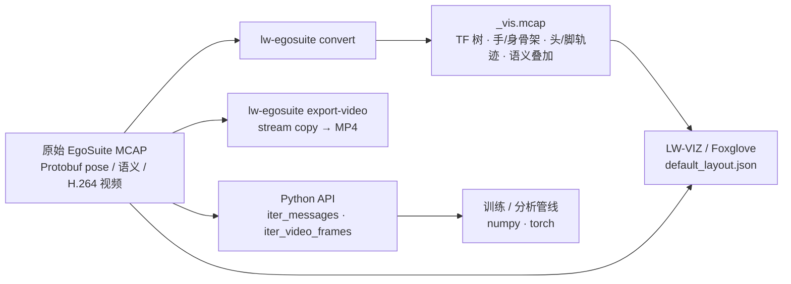

# LW-Egosuite-DevKit

## 一句话定义

**LW-Egosuite-DevKit** 是 [光轮智能](./lightwheel.md) 为其 egocentric 人类数据产品 [EgoSuite](./lightwheel-egosuite.md) 开源的 **MCAP 工具链**（Apache-2.0）：把原始 EgoSuite MCAP 转成可视化 MCAP、在 LW-VIZ 中叠加手/身骨架与语义段、导出 MP4，并提供 Python 读取与视频逐帧解码 API——是使用 [EgoSuite-Open100K](./egosuite-open100k.md) MCAP 版本的官方入口。

## 英文缩写速查

| 缩写 | 英文全称 | 简要说明 |
|------|----------|----------|
| MCAP | MCAP Container Format | EgoSuite 原生录制容器，多 topic 时间同步 |
| CLI | Command-Line Interface | `lw-egosuite convert` / `export-video` 命令 |
| LW-VIZ | Lightwheel Visualization | 光轮托管的 Foxglove 系可视化平台（foxviz.lightwheel.net） |
| TF | Transform (Frame Tree) | 坐标系变换树；输出 `/tf-tree/tf_tree` |
| PyPI | Python Package Index | 包名 `lw-egosuite-devkit` |

## 为什么重要

- **把 EgoSuite 的 schema 变成可执行规范：** README 列出原始 MCAP 预期 topic（21 关节手、22/14/8 关节身体、头/头相机位姿、双目头部视频、可选腕部/深度/音频/坏帧标记），是读懂 [EgoSuite-Open100K](./egosuite-open100k.md) 数据的最快路径。
- **质检先于训练：** 在 LW-VIZ / [Foxglove](./foxglove-studio.md) 中同时加载原始与 `_vis.mcap`，可直观看到手骨架是否贴合图像、头/脚轨迹是否漂移、语义段是否对齐，避免脏数据直接进 VLA 预训练。
- **收录于** [国内具身智能开源全景（76 家 · 424 项）](../overview/china-domestic-embodied-opensource-76-companies-technology-map.md) 第二层分组，是光轮少数公开的数据侧代码之一（采集硬件与标注算法未开源）。

## 核心原理

| 字段 | 内容 |
|------|------|
| 机构 | 光轮智能（Lightwheel） |
| 仓库 | <https://github.com/LightwheelAI/LW-Egosuite-DevKit> |
| 包 | `pip install lw-egosuite-devkit`（PyPI 0.1.2 首发 2026-03-03 → 1.0.2 于 2026-08-06） |
| 环境 | Ubuntu 20.04+，Python 3.11（README 推荐 conda）；视频导出/解码需 ffmpeg + ffprobe |
| 许可 | Apache-2.0 |

### 功能模块

- **convert：** 读原始 MCAP，写出 `foxglove.SceneUpdate` 骨架（左右手 21 关节 3D + 2D 投影、上/下身）、头部轨迹（最近 300 帧）、脚部轨迹（最近 100 帧，需下身数据）、子任务描述日志与图像上的语义文字叠加；默认输出 `{input_stem}_vis.mcap`。
- **export-video：** 把某个 `foxglove.CompressedVideo` topic（默认 `/sensor/camera/head_left/video`）无重编码导出为 MP4。
- **Python API：** `lw_egosuite_backend.mcap_reader.iter_messages` 按 topic 迭代解码后的 proto；`EgosuiteMcapReader.iter_video_frames` 把视频解成 `numpy`（H×W×3 uint8）或 `torch` 张量。
- 消息定义来自 `lw-egosuite-msg` 包；字段规范见 [EgoSuite 数据文档](https://docs.lightwheel.net/egocentric_data/mcap_data/overview)。

## 工程实践

1. `pip install lw-egosuite-devkit`，对单文件 `lw-egosuite convert --mcap ep.mcap`，批量时对目录循环（输出与源文件同目录）。
2. 打开 LW-VIZ → Layouts 导入 `assets/default_layout.json` → **同时** 加载 `ep.mcap` 与 `ep_vis.mcap`。
3. 训练侧不必经 MCAP：Open100K 同时提供 LeRobot v3 版本；MCAP 适合自建管线或需要原始标定 / 原始视频 / 音频时使用（格式取舍见 [HDF5 / MCAP / LeRobot](../comparisons/hdf5-mcap-lerobot-data-formats.md)）。
4. 源码运行时序图：**不适用**（工具链非训练/推理代码，上图已给出 CLI 与 API 数据流）。

## 局限与风险

- **只覆盖 MCAP：** 不负责 LeRobot 导出或人→机 retarget；姿态均在世界系，进机器人管线需自行换系。
- **LW-VIZ 为光轮托管服务：** 也可用通用 Foxglove，但默认布局按 LW-VIZ 调试。
- **版本耦合：** 文档有 v0.3.0 / v1.0.0 两版 schema；旧批次数据（`batch_version`）与新版 DevKit 兼容性以 release note 为准。
- GitHub API 经代理 403，未核 star / issue 活跃度；开源状态以 raw README（2026-10-10 可读）与 PyPI 为准。

## 关联页面

- [Lightwheel EgoSuite](./lightwheel-egosuite.md) — 母产品：egocentric 人类数据方案
- [EgoSuite-Open100K](./egosuite-open100k.md) — 官方十万小时级开放数据集（本 DevKit 的主要消费场景）
- [Foxglove Studio](./foxglove-studio.md) — LW-VIZ 所基于的 MCAP 可视化生态
- [HDF5 / MCAP / LeRobot 数据格式](../comparisons/hdf5-mcap-lerobot-data-formats.md)
- [国内具身开源全景技术地图](../overview/china-domestic-embodied-opensource-76-companies-technology-map.md)
- [HMI 开源项目主表导读](../queries/hmi-opensource-projects-coverage.md)
- [Humanoid Motion Intelligence](../entities/humanoid-motion-intelligence.md)

## 参考来源

- [LW-Egosuite-DevKit 源码归档](../../sources/repos/lw-egosuite-devkit.md)（<https://github.com/LightwheelAI/LW-Egosuite-DevKit>）
- [Lightwheel EgoSuite 官方博客与开源核查归档](../../sources/blogs/lightwheel_egosuite.md)
- [EgoSuite-Open100K 项目页归档](../../sources/sites/egosuite-open100k-lightwheel.md)
- [国内具身智能开源全景（微信公众号）](../../sources/blogs/wechat_embodied_station_domestic_opensource_panorama_2026-09-06.md)

## 推荐继续阅读

- [LW-Egosuite-DevKit README](https://github.com/LightwheelAI/LW-Egosuite-DevKit)
- [PyPI: lw-egosuite-devkit](https://pypi.org/project/lw-egosuite-devkit/)
- [EgoSuite Egocentric Data 文档](https://docs.lightwheel.net/egocentric_data/)
