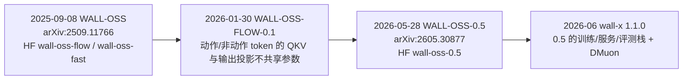
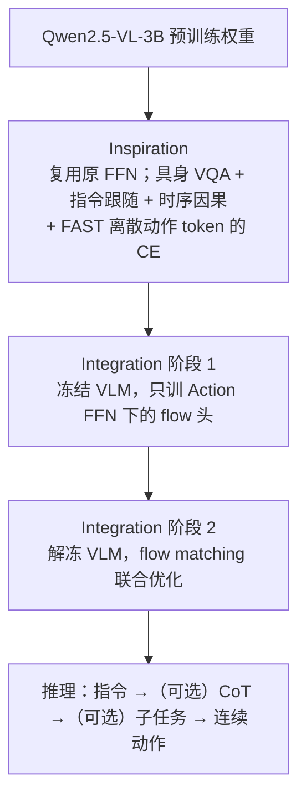
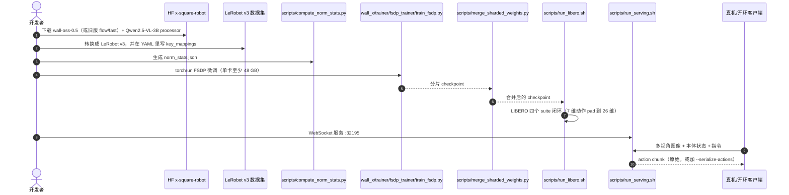

# WALL-OSS 与 WALL-X（自变量具身基础模型 + 开源代码）

**WALL-OSS**（*Igniting VLMs toward the Embodied Space*，[arXiv:2509.11766](https://arxiv.org/abs/2509.11766)，[官方页](https://x2robot.com/research/68bc2cde8497d7f238dde690)，2025-09-08）是 **自变量机器人（X Square Robot）** 发布的端到端具身基础模型。**WALL-X**（[X-Square-Robot/wall-x](https://github.com/X-Square-Robot/wall-x)）是 WALL 系列模型共用的开源训练与推理仓库。本页是 WALL-OSS 一代和 wall-x 代码的主节点；第二代 **WALL-OSS-0.5**（2026-05-28）有独立技术报告，单独成页：[Wall-OSS-0.5](./paper-wall-oss-0-5.md)。

## 一句话定义

**把 3B VLM 改造成能直接出连续动作的 VLA：同一组注意力，按 token 类型静态分流到「视觉语言 FFN」和「动作 FFN」；先用离散动作 token 和具身问答把 VLM 拉进具身空间，再换成 flow matching 输出高频动作；代码和权重统一放在 wall-x 维护。**

## 英文缩写速查

| 缩写 | 英文全称 | 简要说明 |
|------|----------|----------|
| WALL-OSS | —（官方未给出全称） | 自变量开源具身基础模型系列名；WALL-X 为其代码仓 |
| VLA | Vision-Language-Action | 视觉–语言–动作统一策略；本页模型的类别 |
| VLM | Vision-Language Model | 主干 Qwen2.5-VL-3B |
| MoE | Mixture-of-Experts | 一代论文的说法：静态路由的 VL FFN / Action FFN，不是 learned top-k 路由 |
| MoT | Mixture-of-Transformers | 0.5 代的说法：每层 VL Expert + Action Expert，只共享注意力 |
| FAST | Frequency-space Action Sequence Tokenization | DCT→量化→BPE 的离散动作 tokenizer；一代 Inspiration 阶段使用 |
| CoT | Chain-of-Thought | 本文扩展为 Uni-CoT：指令→推理→子任务→连续动作 |
| VQA | Visual Question Answering | 通用 VQA 与具身 VQA，用来保留并增强视觉语言能力 |
| DAM / CAM | Discrete / Continuous Action Modeling | 离散动作建模 / 连续动作建模 |
| FSDP | Fully Sharded Data Parallel | wall-x 微调训练器 |

## 为什么重要

- **「论文 + 权重 + 训练代码」三件齐全的国产 VLA 基座之一：** 2025-09 同时放出 arXiv 报告、HF `wall-oss-flow` / `wall-oss-fast` 和 wall-x 训练推理仓（Apache-2.0）；2026-05 又在同一仓库升级到 WALL-OSS-0.5。
- **已经被下游当基线和底座使用：** [HOST](./paper-host-one-shot-human-video.md) 用 Wall-OSS 做单视频习得的对照（八任务 17%，+SFT-50 为 56%）；[XRZero-G0](./xrzero-g0.md) 用它验证 robot-free 数据配比；[HINT](./paper-hint-robot-manipulation.md) 在 Wall-OSS-0.5 上做插件；[carm-lerobot](./carm-lerobot.md) 把 `wall-oss-flow` 接进 LeRobot 真机流程。
- **回应「动作头冲掉 VLM 先验」：** 论文把这个问题拆成模态、预训练分布、训练目标三个鸿沟，方案是「紧耦合 + 课程」，与 [Knowledge Insulation](./paper-knowledge-insulation.md) 的隔离思路相对。0.5 代把它进一步写成 gradient bridge。
- **版本谱系清楚：** 同一仓库承载了 FAST/FLOW → FLOW-0.1 → 0.5 三次权重迭代，可以直接对照「离散先验 → 连续控制」这条路线在一家公司内部的演化。

## 版本时间线

| 维度 | WALL-OSS（2025-09） | WALL-OSS-0.5（2026-05） |
|------|---------------------|--------------------------|
| **报告** | arXiv:2509.11766（v1 2025-09-15；PDF 写 2025-09-08） | arXiv:2605.30877（v1 2026-05-29 / v2 2026-06-01）→ [独立页](./paper-wall-oss-0-5.md) |
| **主干** | Qwen2.5-VL-3B | Qwen2.5-VL-3B-Instruct 初始化，MoT 扩展后超过 4B 参数 |
| **专家结构** | 共享自注意力 + 静态路由 VL FFN / Action FFN（论文称 MoE） | 每层 VL Expert + Action Expert，只共享注意力（MoT）；FLOW-0.1 已先把 QKV/输出投影拆开 |
| **离散动作** | FAST（DCT→Quant→BPE） | 学习式 Vision-Aligned RVQ Action Tokenizer |
| **训练流程** | 两阶段：Inspiration（VQA + FAST）→ Integration（先冻 VLM 训 flow 头，再联合） | 单阶段三路共训：flow + action-token CE + 多模态 CE，从第 0 步开始，不 warm-up、不 stop-grad |
| **flow 监督** | 速度场回归 | Action-Space Supervision（等效于 \((1-\tau)^2\) 加权） |
| **推理时的思维链** | Uni-CoT：可选输出 CoT / 子任务再出动作 | 报告不再强调 Uni-CoT；训练时按步随机采样目标级或步骤级指令，主线是「预训练即可上真机」 |
| **数据** | 自采 + 24 个开源动作集 + 通用/具身 VQA；>10,000 h（另一处写数万小时） | 20+ 本体，每 epoch 1M+ 轨迹；90M 多模态（含 12M bridge） |
| **核心主张** | VLM→VLA 的紧耦合迁移；指令跟随与长程 | 预训练 checkpoint 不微调即可执行（17 任务零样本）；微调后 15 任务比 π0.5 高 17.5 pp |
| **公开权重** | `wall-oss-flow`、`wall-oss-fast`（+ ModelScope）；2026-01 `wall-oss-flow-0.1` | `wall-oss-0.5` |
| **代码** | wall-x 旧提交 `97406f2`（README 要求 FLOW/FAST 回退到这里） | wall-x main / 1.1.0 |

## 核心原理（方法）

### 1. 三个鸿沟

论文认为 VLM 迁到动作空间时有三处不匹配：

- **模态与数据规模**：动作是 3D 时空连续信号，缺少 CLIP 式大规模对齐数据。
- **预训练分布**：具身画面是第一人称、鱼眼、有自遮挡，VLM 在具身 VQA 上表现差。
- **训练目标**：VLM 是离散 next-token，动作更适合 diffusion / flow matching，直接嫁接会破坏语言–动作对齐。

论文把已有 VLA 分成两类：(a) 统一式（RT-2 / OpenVLA 直接用 VLM 出动作 token，权重漂移、过拟合动作）；(b) 解耦式（π0 外挂动作专家，视觉语言只是辅助信号，指令跟随偏弱）。WALL-OSS 取第三条路：**紧耦合共享注意力 + 按任务分配 FFN**。

### 2. 架构

- 输入：第一人称视角与臂载相机画面 + 文本指令（Integration 阶段加机器人状态和噪声动作）。
- 自注意力全模态共享；**静态路由**把动作类特征送 Action FFN、视觉语言特征送 VL FFN，不用 softmax / top-k 学习路由。
- 输出头：LM Head（CoT、子任务、FAST token）+ Flow Head（连续动作块，图示为 \(a_1..a_{20}\)）。

### 3. 两阶段课程

- **Inspiration**：\(\mathcal L=\lambda_{VQA}\sum -\log p(\tau_t)+\lambda_D\sum -\log p(z_k)\)，其中 \(z_{1:K}=\mathrm{FAST}(a)\)。作用是给 VLM 粗粒度、带语义的动作感，同时补具身空间推理。
- **Integration**：\(x_t=(1-\rho(t))x_0+\rho(t)\epsilon\)，回归速度场 \(v_\phi(x_t,h,t)\approx \epsilon-x_0\)；先冻结 VLM 再联合训练。

### 4. Uni-CoT（统一跨层思维链）

把「指令 → 推理 → 子任务计划 → 连续动作」放进一个可微模型。训练时用 **path-drop**：中间层可以带也可以跳过，所以同一模型既能走完整链，也能直接从指令出动作。推理时由模型自己决定是否展开 CoT / 子任务，也可以边推理边执行。微调时只有 **1%** 的帧带子任务或 CoT 标注。

### 5. 数据

| 来源 | 内容 |
|------|------|
| 自采动作 | 桌面臂、移动底座、轮式双臂、轮式人形；厨房清洁、衣物整理、移动抓放、装配；分为短程精细和长程推理两类任务；多模型步骤标注 + 人工抽检 |
| 开源动作 | AgiBotWorld、DROID、BC-Z、RH20T、Bridge v2、Fractal、UMI-biarm 等 **24** 个数据集；统一坐标/单位、最大 DoF 模板加掩码、内外参与时间戳、控制频率重采样 |
| 多模态 VQA | 通用（CapsFusion、Cambrian、PixMo、COCO、VQAv2…）+ 具身（RoboPoint、Robo2VLM、SpaceThinker…）；在自采轨迹上自动生成规划/时空/感知/可供性 VQA，统一 `<box>` / `<point>` 格式 |

规模口径：论文 §4 写「超过 10,000 小时」，§4.4 和官方页写「数万小时」，两处不一致，引用时应注明出处。

## 源码运行时序图

wall-x main 分支（1.1.0）面向 **Wall-OSS-0.5**。一代 FLOW / FAST 权重按 README 需要回退到提交 `97406f2`，入口是同一套 `train_fsdp` 与 `Qwen2_5_VLMoEForAction.from_pretrained()`。

- **最短核对路径：** `scripts/fake_inference.py --checkpoint-path` 冒烟测试 → `run_libero.sh SMOKE=1` → 自有 LeRobot 数据微调 → `run_serving.sh` + `draw_openloop_plot.py` 做开环对比。
- **部署：** `workspace/rtx5090/` 提供 RTX 5090 的安装与服务脚本；默认训练配置依赖 `X-Square-Robot/dmuon`。

## 工程实践

| 项 | 建议 |
|----|------|
| **选版本** | 新项目直接用 `wall-oss-0.5` + main 分支；要复现一代论文或沿用 `wall-oss-flow`（如 [carm-lerobot](./carm-lerobot.md) 的示例）时，checkout `97406f2`，不要混用两代配置 |
| **FLOW 还是 FAST** | 按命名与 README「flow-matching and FAST action branches」推断，一代两个权重分别对应连续 flow 分支和离散 FAST 分支（**推测**，HF 卡片没有逐项说明差异）；官方页把 Flow-Model 放在前面，下游示例（如 carm-lerobot）也用 `wall-oss-flow` |
| **动作空间** | 0.5 代统一为 26 维（双臂各 3D 位置 + 6D 旋转 + 夹爪，加底座 3 维、升降 1 维、头部 2 维）；单臂数据要用 `action_padding` 补齐 |
| **共训比例** | 一代微调时 action 与 VQA 交错采样（非子任务 VQA 1:15，子任务样本 1:100）；论文消融显示去掉共训后字母块识别大幅下降，微调时不要只保留动作损失 |
| **CoT 标注** | 只需约 1% 的帧带子任务/CoT 标注就能学会生成；长程任务优先补子任务标签，不必全量标注 |
| **数据规范** | 统一米/弧度、相机内外参、时间戳和控制频率；缺失关节用掩码占位 |
| **开源状态（2026-10-09）** | **已开源**：wall-x 代码（Apache-2.0）+ 4 个 HF 权重（`wall-oss-fast`、`wall-oss-flow`、`wall-oss-flow-0.1`、`wall-oss-0.5`）+ ModelScope 组织页。**未开源**：预训练语料、具身 VQA 基准、真机评测套件。HF 卡片元数据**未写** license 字段，商用前要核对 |

## 实验与评测

评测由第三方盲测：训练方提供测试文档（环境、初态、评分细则），由未参与开发的人员按文档执行。基线为 π0（同样有 VLM 预训练）和 Diffusion Policy（从头训练），并分别设 Flat（只给高层指令）和 GPT4-Subtask（人工子任务标注 + 推理时由 GPT-4 生成子任务）两种指令范式。

**具身 VQA（人工评测，相对基座 VLM）：**

| 模型 | Object Grounding | Scene Captioning | Action Planning |
|------|------------------|------------------|-----------------|
| Qwen2.5-VL-3B | 46.1% | 57.7% | 59.8% |
| **WALL-OSS** | **91.6%** | **87.6%** | **69.0%** |

**操作任务：**

| 轴 | 结果 |
|----|------|
| 零样本指令抓放 | 预训练后不微调：见过的物体平均任务进度 **85%**，新物体 **61%**；失败多是位姿误差，不是语义误解 |
| 动作精度与数据效率 | Collect-Waste（ID）：WALL-OSS 与 π0 均 **100%**，DP 80%；Pick-Place-Cup（500 条演示）：预训练模型 >90%，DP <20% |
| OOD 环境 | Collect-Waste 换环境：DP 掉到 0%，WALL-OSS 与 π0 仍 >80% |
| 长程（Set-Table / Tidy-Bedroom，预训练未见） | WALL-OSS 自生成子任务后明显好于 π0 / DP；基线常见阶段混乱和重复放置（只有图，未给数值表） |
| 推理型任务（Block-Spell / Place-by-Color 文字条件） | Flat 基线在 Block-Spell 上接近 0，只报 GPT-subtask 基线；WALL-OSS 在 ID / OOD 上都更高（图表形式） |

**Block-Spell 指令跟随准确率（多模态共训消融）：**

| 块类型 | WALL-OSS（共训） | WALL-OSS（只训动作） | π0（只训动作） |
|--------|------------------|----------------------|----------------|
| 字母 | **87%** | 26% | 9% |
| 数字 | **95%** | 80% | 35% |

微调数据量：Place-by-Color 500 条、Block-Spell 1600、Set-Table 1500、Tidy-Bedroom 1000、Collect-Waste 900（§5.2.3 又写 1000，前后不一）、Pick-Place-Cup 500。

## 结论

**WALL-OSS 一代的价值主要在路线与开源：离散动作先验加具身 VQA 先把 VLM「点燃」，再接 flow 头输出连续动作，并且这套流程有可跑的代码和权重。它的绝对性能已被 0.5 代取代，自报数字只能在自家六任务上读。**

1. **共训比架构更关键** — Block-Spell 字母识别 87% vs 26%，说明微调阶段也要保留 VQA / CoT 共训，否则 VLM 的细粒度指认能力会被动作损失冲掉。
2. **子任务生成解决长程阶段混乱** — 1% 标注就能学会生成子任务；基线的主要失败是不知道做到哪一步，不是单步动作差。
3. **预训练 VLA 对 DP 的优势在小数据和 OOD** — 1000 条 ID 时两者都很高；500 条或换环境后 DP 明显崩溃。
4. **对 π0 的领先集中在指令 / 推理类任务** — 纯动作精度任务上二者持平（都是 100% / >80%），读数时别把「全面超越」外推。
5. **评测透明度有限** — 六任务中多项只给柱状图，没有数值表；数据小时数前后口径不一，复现时要回原文核对。
6. **代码要按版本 checkout** — main 已切到 0.5；一代权重只能在旧提交上用，这是 wall-x 最常见的踩坑点。

## 与其他工作对比

| 对比轴 | WALL-OSS | [π0](./paper-pi0.md) | [π0.5](./paper-pi05-open-world-vla.md) / [Knowledge Insulation](./paper-knowledge-insulation.md) | [Wall-OSS-0.5](./paper-wall-oss-0-5.md) |
|--------|----------|----------------------|---------------------------------------|------------------------------------------|
| **动作出口** | flow 头（另有 FAST 版本） | flow matching 动作专家 | FAST 自回归 + flow 动作专家 | flow（部署）+ RVQ token（训练时的梯度桥） |
| **与 VLM 的耦合** | 共享注意力 + 静态双 FFN；两阶段，先冻后联合 | 解耦：动作专家读 VLM 表征 | KI 对 flow 梯度做 stop-grad，隔离主干 | 端到端梯度，不 stop-grad；MoT |
| **语言推理** | Uni-CoT：CoT / 子任务 / 动作一体 | 无显式推理 | 分层语义子任务 | 以零样本执行为主 |
| **开源** | 代码 + 权重 | openpi 开源 | openpi 部分开源 | 代码 + 权重 |

同机构生态：[X-Tokenizer](./cn-os-x-tokenizer.md) 是自变量 2026-06 公开的 RVQ 动作 tokenizer，与 0.5 代的 Vision-Aligned RVQ 思路相近（是否为同一组件属**推测**，报告未点名）；[XRZero-G0](./xrzero-g0.md) 是 0.5 代引用的无本体采数设备；[WALL-WM](./paper-rcl-2606-01955-wall-wm-carving-world-action-modeling-at-the-eve.md) 和 [WALL-SS](./paper-wall-ss.md) 是同公司世界模型方向的工作。

## 局限与风险

- **自建评测**：六个真机任务和具身 VQA 基准都没有公开，任务进度评分细则由训练方制定（执行由第三方盲测）。
- **口径不一**：数据规模（「超过 1 万小时」和「数万小时」两种写法）、Collect-Waste 演示条数（900 和 1000 两种写法）在同一篇论文里前后不一致。
- **一代权重已非 main 默认**：直接 `pip install -e .` 最新版去加载 `wall-oss-flow` 可能对不上配置，要按 README 回退提交。
- **许可边界**：仓库是 Apache-2.0，但 HF 权重卡没有 license 元数据，只能推定沿用仓库许可（**推测**），商用前须向官方确认。
- **数据不可复现**：自采语料和自动生成的具身 VQA 没有公开，第三方只能微调，不能复现预训练。
- **策展快照**：本页最初来自公众号开源清单（2026-09-06），2026-10-09 按论文、README 和 HF 重写；仓库后续更名或归档时需重新核实。

## 关联页面

- [Wall-OSS-0.5 技术报告](./paper-wall-oss-0-5.md) — 第二代：gradient-bridged 共训，预训练即可上真机
- [VLA](../methods/vla.md) — 方法族总览
- [Flow Matching 具身策略](../concepts/flow-matching-embodied-policy.md) — 连续动作出口
- [π0](./paper-pi0.md) / [π0.5](./paper-pi05-open-world-vla.md) / [Knowledge Insulation](./paper-knowledge-insulation.md) — 主要对照路线
- [X-Tokenizer](./cn-os-x-tokenizer.md) — 同机构 RVQ 动作 tokenizer
- [XRZero-G0](./xrzero-g0.md) — 同机构无本体采数，以 Wall-OSS 做下游验证
- [WALL-WM](./paper-rcl-2606-01955-wall-wm-carving-world-action-modeling-at-the-eve.md) / [WALL-SS](./paper-wall-ss.md) — 同公司世界模型线
- [HOST](./paper-host-one-shot-human-video.md) — 以 Wall-OSS 为对照的单视频习得
- [HINT](./paper-hint-robot-manipulation.md) — 在 Wall-OSS-0.5 上做插件
- [carm-lerobot](./carm-lerobot.md) / [LeRobot](./lerobot.md) — wall-x 的下游接入
- [LIBERO](./libero-benchmark.md) — wall-x 自带的仿真评测
- [Manipulation](../tasks/manipulation.md)
- [国内具身开源全景技术地图](../overview/china-domestic-embodied-opensource-76-companies-technology-map.md)
- [HMI 开源项目主表导读](../queries/hmi-opensource-projects-coverage.md)
- [Humanoid Motion Intelligence](./humanoid-motion-intelligence.md)
- [424 项覆盖索引](../queries/china-domestic-opensource-424-coverage.md)

## 参考来源

- [WALL-OSS / WALL-OSS-0.5 官方页归档](../../sources/sites/x2robot-wall-oss.md)
- [WALL-X 源码归档](../../sources/repos/wall-x.md)（<https://github.com/X-Square-Robot/wall-x>）
- [国内具身智能开源全景（微信公众号）](../../sources/blogs/wechat_embodied_station_domestic_opensource_panorama_2026-09-06.md)
- Zhai et al., *Igniting VLMs toward the Embodied Space*, [arXiv:2509.11766](https://arxiv.org/abs/2509.11766)

## 推荐继续阅读

- 论文 — <https://arxiv.org/abs/2509.11766>
- 官方页 — <https://x2robot.com/en/research/68bc2cde8497d7f238dde690>
- 代码 — <https://github.com/X-Square-Robot/wall-x>
- 权重 — <https://huggingface.co/x-square-robot/wall-oss-flow> · <https://huggingface.co/x-square-robot/wall-oss-fast>
- Wall-OSS-0.5 — <https://x2robot.com/en/oss>
