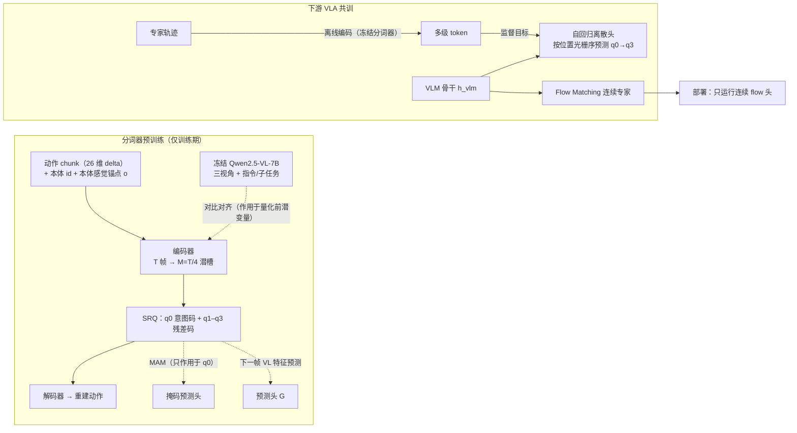
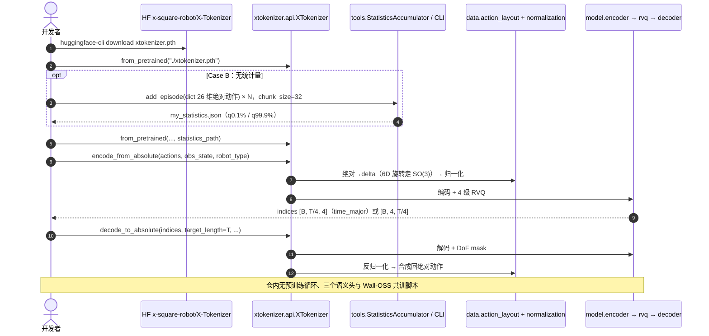

# X-Tokenizer（多模态动作分词器 / VLA 语义接口）

**X-Tokenizer**（*X-Tokenizer: A Multimodal Action Tokenizer for Vision-Language-Action Pretraining*，[arXiv:2606.14752](https://arxiv.org/abs/2606.14752)，v1 2026-06-07 / v2 2026-06-28；[官网项目页](https://x2robot.com/pages/x-tokenizer)，官网博客日期 **2026-06-30**；[GitHub](https://github.com/X-Square-Robot/X-Tokenizer)；[HF 权重](https://huggingface.co/x-square-robot/X-Tokenizer)）由 **自变量机器人（X Square Robot）**、香港城市大学与清华大学提出。官方标语是："A multimodal action tokenizer that doubles as a semantic interface between vision-language reasoning and continuous robot control."

## 一句话定义

**一个只在训练期使用的动作分词器：第一级离散码被训成与 VLM 语义对齐的「动作词」，后几级码负责几何残差。冻结后，它给混合离散–连续 VLA 的自回归分支当监督目标，用来塑造共享隐状态。部署时策略只运行连续 flow 头，不调用这个分词器。**

## 英文缩写速查

| 缩写 | 英文全称 | 简要说明 |
|------|----------|----------|
| VLA | Vision-Language-Action | 本页的下游消费者：Wall-OSS 混合离散–连续策略 |
| SRQ | Semantic Residual Quantization | 本文瓶颈：只有第一级 RVQ 接语义监督，后几级只做重建 |
| RVQ | Residual Vector Quantization | 多级码本逐级量化上一级的残差；本文用 4 级 × 2048 码 |
| MAM | Masked Action Modeling | 对第一级码做 BERT 式掩码预测，让它成为「动作语言」 |
| VL | Vision-Language | 冻结 Qwen2.5-VL-7B 抽取的多视角图像 + 指令融合特征 |
| FAST | Frequency-space Action Sequence Tokenization | DCT + BPE 动作分词基线；主要对照对象 |
| BPE | Byte-Pair Encoding | FAST 的变长合并编码；加噪后会重新切分 |
| CFG | Classifier-Free Guidance | 训练时随机丢弃 state / 本体 id，推理可缺省 |
| WER | Word Error Rate | 噪声鲁棒性指标：加噪前后 token 序列的编辑距离比 |
| PPL | Perplexity | 各级码本的有效使用度；SRQ 期望逐级上升 |
| PR | Progress Rate | 真机分阶段打分（满分 10 分折算成 0–100） |
| VQA | Visual Question Answering | 真机评测附带的点定位 grounding 测试（N=107） |
| EE | End-Effector | 动作布局以双臂末端位姿 + 夹爪为核心 |

## 为什么重要

- **改变了分词器的目标。** FAST、VQ-VLA 这类方法按重建误差优化码本，码字只划分动作几何。混合 VLA 中，离散 token 损失还会塑造连续专家读取的共享隐状态，所以目标若只是「重建索引」，就会把 VLM 往几何码型上拉。X-Tokenizer 把离散目标对齐到 VLM 特征空间，论文称之为 *semantic interface learning*。
- **对照实验干净。** 真机实验中四种动作接口共用 Qwen2.5-VL-3B 初始化、数据、训练计划和 Flow Matching 专家，只换动作接口。结果显示：仅有层级的 RVQ 能提 VQA，但动作分下降；加上三个语义头后，两者同时上升。
- **部署零开销。** 三个语义头只在分词器预训练时存在。下游推理时自回归头和 X-Tokenizer 都关闭，策略只做单次前向的连续 flow 回归。
- **开源可复核一部分。** 推理库与约 1 GB 权重以 Apache-2.0 公开，可以直接拿自己的轨迹做编码/解码实验；训练侧和数据则不可复核（见下文开源边界）。

## 核心信息

| 项 | 内容 |
|----|------|
| **机构** | 自变量机器人（X Square Robot）；香港城市大学；清华大学（通讯：Xianyuan Zhan、Hang Su） |
| **出处** | arXiv:2606.14752（cs.CV）；官网 /blog 2026.06.30；官网 /news 2026-07-02 |
| **结构** | Perceiver 式编码器 → SRQ（4 级 × 2048 码，EMA 更新）→ Perceiver IO 式解码器；时间压缩 4×（论文默认 64 帧→16 潜槽） |
| **动作空间** | 26 维 delta 动作：双臂末端位置（6）+ 6D 旋转（12）+ 夹爪（2）+ 底盘速度（3）+ 升降（1）+ 头部俯仰/偏航（2） |
| **预训练语料** | 约 2.4M 轨迹 / 2.0B 动作帧；54 个 robot_type 归入 17 个机械臂族；含自变量内部数据、AgiBotWorld、DROID、RoboTwin 2.0、RoboMind、RoboCoin、Open-X 子集等 |
| **语义教师** | 冻结 Qwen2.5-VL-7B，第 −3 层特征；输入为三视角（头 + 双腕）图像 + 全局指令 + 子任务指令，离线预抽取 |
| **下游** | Wall-OSS 混合 VLA（[WALL-X 仓](./cn-os-wall-x.md)）；真机实验的骨干为 Qwen2.5-VL-3B |
| **开源（截至 2026-10-09）** | **部分开源**：推理库 + `xtokenizer.pth`（Apache-2.0）已发布；预训练代码、下游共训代码、语料未发布 |

## 核心原理（方法）

### 流程总览

### 1. 编码器–SRQ–解码器

- **Delta 动作：** 每帧相对 chunk 前一刻的本体感觉锚点 \(o\) 取偏移。位置用减法，6D 旋转用 SO(3) 合成，夹爪、底盘速度、升降和头部直接用原值。作者的理由是：绝对指令随状态和本体变化，会让固定大小的码本浪费容量去记位置偏置。
- **编码器：** 12 层 Transformer（H=1024），本体 embedding 从 1024 个槽位的注册表中查取（含一个 "none" 槽），之后对 \(o\) 做可选 cross-attn，再由 16 个可学习 latent query 下采样。
- **SRQ：** 量化本身是标准 RVQ，区别在于监督不对称：第一级码接受 MAM 监督，对比对齐也通过量化前潜变量间接塑造它；第 2–4 级只承担重建和 commitment 损失。
- **解码器：** 64 个可学习位置 query 先 cross-attn 到量化潜变量和 \(o\)，再经过 4 层 self-attn 输出 delta，由 DoF mask 把本体缺失的通道置零，最后合成回绝对动作。
- **CFG 式丢弃：** \(o\) 和本体 id 各以 0.2 的概率被丢弃，另有 0.1 的概率换成 "none" 槽位。推理时四种「有/无」组合都能运行。

### 2. 三个语义头（训练后移除）

| 头 | 作用对象 | 目标 | 关键超参 |
|----|----------|------|----------|
| **MAM** | 第一级码 \(c^{(1)}_{1:M}\) | 15% 位置做 BERT 式 80/10/10 掩码，用 2 层 Transformer 预测原码 | 前 10 epoch 关闭，之后 \(\lambda=0.1\) |
| **VL 对比对齐** | 量化前潜变量 \(h_{1:M}\) | 双粒度 InfoNCE：chunk 级（批内负样本）+ 槽位级（与批内所有 \(BM-1\) 个槽对比），CLIP 式对称 | \(\lambda_{\text{align}}=0.5\)，温度目标 0.1 |
| **下一帧 VL 预测** | 多级量化潜变量 \(\tilde z_{1:M}\) | 回归 chunk 之后一帧的 VL 特征（ℓ1） | \(\lambda=0.2\) |

重建侧除平移 ℓ1 外，还有旋转测地线损失（在物理空间计算）、DCT 频域 ℓ1（压高频抖动）和速度一致性损失。预训练 100 epoch，T 在 [8, 64] 内均匀采样，batch 256，AdamW lr 5e-5。

### 3. 下游共训（式 8）

VLM 骨干与 Flow Matching 专家共享 \(h_{\text{vlm}}\)。离散分支按「位置优先」的光栅序自回归预测全部 4 级码，连续分支回归轨迹；损失为 \(\mathcal L_{\text{vlm}} + \lambda_{\text{fm}}\mathcal L_{\text{fm}}\)。离散损失的作用是正则化隐状态，可执行精度由 flow 分支保证。

## 源码运行时序图

官方仓 [X-Square-Robot/X-Tokenizer](https://github.com/X-Square-Robot/X-Tokenizer) 只提供推理侧：加载权重、自算统计量、编码/解码。下图对应 README 的 Case B → Case A 路径。

- **最短核对路径：** `python examples/02_compute_statistics.py` → `python examples/01_encode_decode.py`。示例使用两条合成 `.npz` episode，可以验证「显式六步」与高层 API 的数值一致性。
- **下游接线：** 用自己的 VLA 训练框架离线编码专家轨迹，把 `quantizer_major` 或 `time_major` 展平后作为 LM token 目标。README 提醒，同一潜步内应保持 q0→q1→q2→q3 的生成顺序。

## 工程实践

| 项 | 实践要点 |
|----|----------|
| **数据整形** | 每条 episode 整理为 9 个 key 的 dict（左右 EE 位置 / 6D 旋转 / 夹爪、底盘 `velocity_decomposed`、`height`、`head_actions`）；欧拉角或四元数先用 `euler_to_6d` / `quat_to_6d` 转换 |
| **缺失部件** | 没有头部或底盘时直接省略对应 key；统计阶段会自动按 NaN 跳过，编码/解码时传 `dof_mask` |
| **统计量** | 训练统计量不随包提供，必须自算；`--chunk-size 32` 要与发布权重一致，否则归一化严重截断；建完后跑一次 `validate_statistics` |
| **本体槽位** | 发布权重暴露 18 个规范槽位（0 Unknown、1 X2Arm 为默认值，以及 Franka、UR5、Piper、ARX5、AgiBot、UMI、R1Lite 等）；未登记的名字落到 Unknown |
| **chunk 长度** | 推理时 `T ∈ [8, 64]` 免重载；编码器输出 `ceil(T/4)` 个潜步（`model/encoder.py`），不必是 4 的倍数；解码时要传 `target_length=T` |
| **token 排布** | 按时间步自回归选 `time_major`，先出整条 q0 再细化选 `quantizer_major`；两者只差排列顺序 |
| **部署形态** | 论文方案中分词器只在训练期出现；若要做纯离散自回归策略，需要自己验证解码质量，论文没有评测这种用法 |
| **不适用项** | 灵巧手、关节空间控制：动作锚点是末端位姿，作者把这类扩展列为未来工作 |

## 实验与评测

### 码本与对齐诊断

| 检查 | 结果 |
|------|------|
| 码本使用率（L1→L4） | **76.4% / 93.8% / 99.3% / 99.8%**；L1 呈长尾分布（Zipf 式），L2–4 接近均匀；没有任何一级崩到 <10% |
| 消融（重建 ℓ1；PPL q0→q3） | FAST 0.01446；256-bin 均匀量化 0.00486；No aux 0.00815（751/693/756/757）；w/o Align+Pred 0.00830；w/o MAM 0.01564；**Full 0.01693（510→700→828→916）** |
| 对齐统计 | 槽位级余弦热图呈对角带，chunk 中段约 0.60；臂族矩阵对角线比语料均值高约 0.05 |
| VL → 码本功能替代 | 把冻结 VL 特征直接送入 SRQ + 解码器：逐任务方向余弦 **0.85–0.95**（动作编码自身约 0.99）；插拔、按键等精细接触前任务差距最大 |

Full 模型的重建 ℓ1 比 FAST 高 17%，论文把它当作有意的取舍：放弃一部分重建精度，换取语义结构。

### 噪声鲁棒与延迟

| σ | X-Tokenizer | FAST | 256-bin | RDT2 VQ |
|---|-------------|------|---------|---------|
| 0.004 | **0.313** | 0.313 | 0.454 | 0.325 |
| 0.006 | **0.437** | 0.899 | 0.533 | 0.439 |
| 0.008 | **0.526** | 1.445 | 0.597 | 0.549 |

（WER，越低越好。）编辑大多落在 q1–3，q0 基本不变；FAST 一旦被噪声触发 BPE 重切分，WER 就急剧上升。Fig.7（读图数值）：每个 chunk 的训练输入长度 FAST 156 / RDT2-VQ 27 / X-Tokenizer 30 token；token→动作延迟 332 / 758 / **324** ms（论文未写明硬件）。

### RoboTwin 2.0（50 个双臂任务；每任务 100 次 rollout）

| 方法 | Easy | Hard | Avg |
|------|------|------|-----|
| π0 | 65.9 | 58.4 | 62.1 |
| π0.5 | 82.7 | 76.8 | 79.8 |
| X-VLA | 72.9 | 72.8 | 72.8 |
| **Wall-OSS + X-Tokenizer** | **84.7** | **80.9** | **82.8** |

设置：从公开的全自由度 Wall-OSS checkpoint 出发，接入冻结的 X-Tokenizer，全系统微调 70k 步；每任务 50 条 Clean + 500 条 Randomized 示范。作者明确说明这是**基准对照**而非受控消融（各方法的骨干、数据、算力都不同）。Easy→Hard 的掉点为 −3.8，π0.5 为 −5.9。弱项任务：hanging_mug 31/20、turn_switch 45/38、blocks_ranking_size 46/46。

**跨本体（5 个单臂本体，各训 70k 步）：** 单本体分训 70.9 / 64.0 → 5 本体联合 **77.9 / 74.4**（Easy / Hard），Hard 上 +10.4。作者承认数据多样性也有贡献，没有把增益单独归因于分词器。

### 真机（7 个桌面任务 × 10 次 rollout；每任务约 500 条遥操作；PR 评分）

| 接口 | Pick Up Cup | Push Towel | Distribute Blocks | Stack Bottle | Place Tape | Arrange Flowers | Turn On Light | VQA | 7 任务均值 |
|------|-----|-----|-----|-----|-----|-----|-----|-----|-----|
| Wall-OSS（flow） | 46 | 70 | 39 | 60 | 60 | 38.5 | 35 | 50.4 | 49.8 |
| + FAST | 61 | 90 | **58** | **80** | **100** | 57 | 65 | 75.7 | 73.0 |
| + RVQ（no-aux） | 58 | 90 | 47 | **80** | 90 | 51 | 68 | 79.4 | 69.1 |
| **+ X-Tokenizer** | **73** | **100** | 50 | **80** | **100** | **68.5** | **70** | **85.9** | **77.4** |

数据来源：论文 Fig.10 与官网页图表 `DATA`。按组聚合：X-Tokenizer 短程 5 任务 80.6、长程 2 任务 69.25；FAST 长程 61.0；RVQ(no-aux) 短程 73.0、长程 59.5。头条的「+13.5%」是 VQA 的相对增幅（75.7→85.9），「+8.25」是长程 PR 的绝对增幅（61.0→69.25）。此外，分词器对齐的是 Qwen2.5-VL-**7B**，被 **3B** 骨干消费，说明它可以跨骨干复用。

## 结论

**X-Tokenizer 的价值在于「离散目标该对齐到什么」：把第一级码对齐到 VLM 语义，后几级留给几何。它是训练期脚手架，不是更好的压缩器，重建 ℓ1 反而比 FAST 差。**

1. **层级本身不够** — 只做重建的 4 级 RVQ 让 VQA 从 75.7 升到 79.4，但 7 任务动作均值从 73.0 降到 69.1。三个语义头加齐之后，两项指标才同时上升。
2. **读数要分层** — RoboTwin 82.8 是跨骨干的基准对照；真机 77.4 是只换接口的受控对照。只有后者能归因到分词器。
3. **鲁棒性来自层级分工** — 噪声主要改动 q1–3，q0 稳定，因此骨干看到的「粗动作标签」不会因小扰动而翻转。FAST 的变长 BPE 正好在这一点上不稳。
4. **语义的代价在精细放置** — Distribute Blocks 50 < FAST 58；VL 驱动的重建在插拔、按键这类任务上 L1 最大。毫米级任务不要只看聚合分。
5. **部署形态要看清** — 推理期不跑分词器，也不跑 AR 头；想把它当纯离散自回归策略的动作词表，属于论文之外的用法。
6. **开源只覆盖推理半边** — 可以用发布权重给自己的数据打 token，但复现预训练与 Wall-OSS 共训缺代码，也缺 2.4M 轨迹语料。

## 与其他工作对比

| 对比轴 | X-Tokenizer | [FAST](./paper-rcl-2501-09747-fast-efficient-action-tokenization-for-vision-la.md) | [OAT](./paper-oat-ordered-action-tokenization.md) | [UniT](./paper-unit-unified-physical-language.md) | [CLAP](./paper-rcl-2601-04061-clap-contrastive-latent-action-pretraining-for-l.md) |
|--------|-------------|------|-----|------|------|
| **离散化** | 4 级 RVQ，第一级接语义监督 | DCT + BPE，变长 | 有序粗到细 token | 视觉锚定三分支、统一码本 | 对比式潜动作 |
| **语义来源** | 冻结 VLM 特征（对比 + 下一帧预测）+ MAM | 无（纯压缩） | 无（结构约束） | 视觉 / 动作 / 融合联合嵌入 | 视觉动力学特征 |
| **编码时是否需要图像** | 否（语义头只在预训练期使用） | 否 | 否 | 是（多流编码器） | — |
| **下游形态** | 混合 VLA 的离散监督；推理不调用 | AR VLA 直接出 token | AR 策略 | VLA / 世界模型 | VLA 预训练 |

论文相关工作一节对 ActionCodec 的评价是：引入了跨模态对比，但对齐空间是内部学到的，没有锚定冻结 VLM，也不区分意图层与残差层。对 RDT2 VQ 的评价是：单码本在噪声下的替换会散布到整条序列。与同公司工作的关系：[WALL-WM](./paper-rcl-2606-01955-wall-wm-carving-world-action-modeling-at-the-eve.md) 和 [WALL-SS](./paper-wall-ss.md) 走世界模型路线，[HOST](./paper-host-one-shot-human-video.md) 做单视频 one-shot；X-Tokenizer 处在 Wall-OSS 系列 VLA 预训练的动作接口层，作者在结论中提到它可以推广到世界模型潜变量（未验证）。

## 局限与风险

- **训练侧不可复核：** 仓库只有推理代码。三个语义头、100 epoch 预训练和 Wall-OSS 共训都没有公开实现，PPL / WER / 真机数字只能当作论文自报。
- **数据封闭：** 预训练混合了自变量内部数据（11 个 robot_type）；真机约 3.5k 条轨迹、约 480k 条 grounding 样本以及 N=107 的 VQA 评测集都是内部数据。
- **口径不一：** README 写「18 个本体」（含 Unknown 槽），论文写 17 个臂族 / 54 个 robot_type，附录又说注册表超过 70 个预定义本体、编码器有 1024 个嵌入槽。引用时要写明口径。官网结果卡副标题写 "Easy/Medium/Hard"，实际只报 Easy / Hard。
- **RoboTwin 不是受控实验：** 82.8 vs π0.5 79.8 混入了骨干与数据差异，作者自己也这么说明。
- **真机规模小：** 每任务 10 次 rollout，评分是人工分阶段 PR；论文未写明真机平台的具体型号。
- **动作空间边界：** 末端位姿锚定，没有覆盖灵巧手、关节空间和力觉。
- **延迟数字要谨慎引用：** Fig.7 未注明硬件，图注写的是 encoding latency，坐标轴却标「LM-tokid → action」；而且分词器不在部署链路上，这组延迟只影响离线编码与离散解码场景。

## 关联页面

- [VLA 动作分词（形式化）](../formalizations/vla-tokenization.md) — 动作离散化的通用框架
- [VLA](../methods/vla.md) — 混合离散–连续头所在的方法族
- [统一多模态 Token](../methods/unified-multimodal-tokens.md) — 视觉 / 语言 / 动作同一嵌入空间的架构趋势
- [Action Chunking](../methods/action-chunking.md) — 本文以 chunk 为编码单位
- [FAST](./paper-rcl-2501-09747-fast-efficient-action-tokenization-for-vision-la.md) — 主要对照分词器
- [OAT](./paper-oat-ordered-action-tokenization.md) — 有序粗到细动作 token
- [UniT](./paper-unit-unified-physical-language.md) — 视觉锚定统一码本（编码需图像）
- [CLAP](./paper-rcl-2601-04061-clap-contrastive-latent-action-pretraining-for-l.md) — 对比式潜动作预训练
- [π0.5](./paper-pi05-open-world-vla.md) — RoboTwin 对照基线
- [RoboTwin](./robotwin.md) — 仿真评测基准
- [WALL-X](./cn-os-wall-x.md) — Wall-OSS 开源仓（下游测试平台）
- [Wall-OSS-0.5](./paper-wall-oss-0-5.md) — 同机构 VLA，flow + RVQ 动作 token 共训（论文引用为混合 VLA 之一；二者的码本是否相同，原文未说明）
- [WALL-WM](./paper-rcl-2606-01955-wall-wm-carving-world-action-modeling-at-the-eve.md) — 同机构世界动作模型
- [WALL-SS](./paper-wall-ss.md) — 同机构 next-scale 世界模型
- [HOST](./paper-host-one-shot-human-video.md) — 同机构单视频 one-shot 习得
- [跨具身迁移枢纽](../overview/hub-cross-embodiment.md)
- [Manipulation](../tasks/manipulation.md)
- [国内具身开源全景技术地图](../overview/china-domestic-embodied-opensource-76-companies-technology-map.md)
- [国内开源 424 项覆盖索引](../queries/china-domestic-opensource-424-coverage.md)
- [HMI 开源项目主表导读](../queries/hmi-opensource-projects-coverage.md)
- [Humanoid Motion Intelligence](../entities/humanoid-motion-intelligence.md)

## 参考来源

- [X-Tokenizer 项目页归档](../../sources/sites/x2robot-x-tokenizer.md)（官网页、博客日期、开源核查 2026-10-09）
- [X-Tokenizer 源码归档](../../sources/repos/x-tokenizer.md)（<https://github.com/X-Square-Robot/X-Tokenizer>）
- [国内具身智能开源全景（微信公众号）](../../sources/blogs/wechat_embodied_station_domestic_opensource_panorama_2026-09-06.md)
- 论文 [arXiv:2606.14752](https://arxiv.org/abs/2606.14752)（v2 PDF 正文与附录 A–D）

## 推荐继续阅读

- 论文 — <https://arxiv.org/abs/2606.14752>
- 官网项目页 — <https://x2robot.com/pages/x-tokenizer>
- GitHub — <https://github.com/X-Square-Robot/X-Tokenizer>
- HF 权重 — <https://huggingface.co/x-square-robot/X-Tokenizer>
- Wall-OSS（下游平台）— <https://arxiv.org/abs/2509.11766>
- FAST — <https://arxiv.org/abs/2501.09747>
