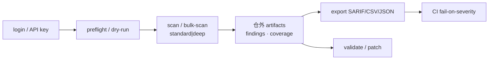

# Codex Security（OpenAI）

## 一句话定义

**Codex Security**（[`@openai/codex-security`](https://www.npmjs.com/package/@openai/codex-security) / [openai/codex-security](https://github.com/openai/codex-security)）是 OpenAI 开源的 **应用安全扫描 CLI 与 TypeScript SDK**：驱动 Codex agent 在授权代码库上做漏洞发现、校验与辅助修复，并把结果导出为 SARIF/CSV/JSON 供 CI 消费。

## 英文缩写速查

| 缩写 | 英文全称 | 简要说明 |
|------|----------|----------|
| CLI | Command-Line Interface | `npx @openai/codex-security` 入口 |
| SDK | Software Development Kit | TypeScript `CodexSecurity` 编程接口 |
| SARIF | Static Analysis Results Interchange Format | CI / IDE 通用静态分析结果格式 |
| AppSec | Application Security | 应用层漏洞发现与治理 |
| CI | Continuous Integration | 用 `--fail-on-severity` 与 exit code 做门禁 |
| API | Application Programming Interface | `OPENAI_API_KEY` / `CODEX_API_KEY` 或第三方 provider |

## 为什么重要

1. **补「可执行扫描层」**：本库 [软件安全基础](../concepts/software-security-basics.md) 讲 AuthN/AuthZ/密钥/供应链原则；Codex Security 提供可挂进 PR/CI 的 **agent 驱动 AppSec 扫描** 工具位。
2. **机器人研发栈同样有 Web/云边代码面**：遥操作网关、OTA 服务、训练 farm API、数据集门户——都需要依赖扫描与授权检查之外的 **业务逻辑漏洞** 发现。
3. **工程闭环完整**：scan → validate → patch → `scans compare`（根因匹配）→ SARIF 导出，适合与 [容器与 CI/CD](../concepts/container-orchestration-cicd.md) 流水线衔接。

## 核心结构 / 机制

| 层次 | 内容 |
|------|------|
| **包与运行时** | npm ESM 包；捆绑 Codex plugin + runtime；Node 22.13+/24/26 + Python 3.10+ |
| **入口** | CLI：`scan` / `bulk-scan` / `export` / `validate` / `patch` / `scans *` / `install-hook`；SDK：`new CodexSecurity().run(path, opts)` |
| **目标选择** | 整仓、多 `--path`、committed `--diff`、`--working-tree` |
| **深度模式** | `--mode deep`：discovery workers / subagents / stop-after-no-new / max-discovery-runs |
| **认证** | ChatGPT login（含 device-auth）；CI 环境 API key（默认不落盘）；OpenRouter / Fireworks / Amazon Bedrock |
| **产物** | workbench 状态 + 仓外 `outputDir`；SARIF/CSV/JSON；扫描历史与根因 compare |
| **容器** | 官方镜像 + Compose；可选 Ubuntu AppArmor；CSV 钉死 immutable Git revision |

### 流程总览



## 源码运行时序图

官方包可直接 `npm install` / `npx` 运行（非论文训练管线；下图对齐 CLI/SDK 扫描主路径）：

```mermaid
sequenceDiagram
  autonumber
  participant Dev as Developer / CI
  participant CLI as codex-security CLI/SDK
  participant Auth as ChatGPT login or API key
  participant Plugin as bundled_plugin<br/>schemas · deep-scan
  participant Model as Inference provider
  participant FS as outputDir + state dir<br/>(outside worktree)

  Dev->>CLI: scan PATH (or CodexSecurity.run)
  CLI->>CLI: preflight target / mode / outputDir
  CLI->>Auth: resolve --auth auto|chatgpt|api-key
  Auth-->>CLI: credential (env key not persisted)
  CLI->>Plugin: start isolated Codex Security runtime
  Plugin->>Model: discovery / review / validate / attack-path
  Model-->>Plugin: candidates + validations
  Plugin->>FS: seal findings.json · coverage · manifest
  Plugin-->>CLI: report path + severity summary
  CLI-->>Dev: stdout JSON/report; exit 0/1/2
  opt CI export
    Dev->>CLI: export --export-format sarif
    CLI->>FS: write results.sarif
  end
```

关键复现路径：`npm install @openai/codex-security` → `npx @openai/codex-security login`（或设 `OPENAI_API_KEY`）→ `npx @openai/codex-security scan . --output-dir /tmp/cs-out --fail-on-severity high`。批量见仓库根 `docker compose` + `repositories.csv`。

## 工程实践

| 场景 | 建议 |
|------|------|
| **PR 增量扫描** | `scan . --diff origin/main --json --fail-on-severity high`；结果目录用 `mktemp` 且在 worktree 外 |
| **全仓深扫** | `--mode deep`；控制 `--workers` / `--max-discovery-runs` / `--max-cost`；大仓先 `--path` 收窄 |
| **团队门禁** | `export` SARIF 接入现有静态分析消费端；exit `1`=策略失败、`2`=覆盖不全/运行错误（勿当通过） |
| **多仓治理** | `bulk-scan repositories.csv`（`id,repository,revision` 钉死完整 commit）；容器镜像 + 私有 `results/`/`state/`（`chmod 700`） |
| **误报治理** | `findings false-positive OCCURRENCE_ID --reason "..."`；`scans compare` 跟踪 resolved vs reopened |
| **知识注入** | 重复 `--knowledge-base` 挂威胁模型 / 架构 PDF / 安全策略；`--scan-prompt-file` 统一指令 |

### 开源状态（步骤 2.5）

- **已开源（Apache-2.0）**：[openai/codex-security](https://github.com/openai/codex-security) + npm `@openai/codex-security`（入库日 **0.1.8**）
- **文档：** [developers.openai.com/codex/security](https://developers.openai.com/codex/security)
- **非自包含离线扫描器：** 依赖推理 API / ChatGPT 登录；部分网络安全 finding 需 [Trusted Access for Cyber](https://chatgpt.com/cyber)

## 局限与风险

- **误区：开源包 = 免费无限扫描。** 仍需 OpenAI（或其他 provider）配额与可能的 Cyber Trusted Access；`<1.0` 公共 API 可随 minor 变更。
- **误区：exit 0 且无 high = 绝对安全。** 覆盖不全时可能 exit 2；report-only 默认不 fail；agent 扫描有漏报/误报，需与依赖锁定、SBOM、签名等 [供应链基线](../concepts/software-security-basics.md) 叠用。
- **权限与数据：** 以本机用户权限读文件系统；结果含源码摘录与复现步骤——产物放仓外并限制访问；扫描进程可继承无关云凭证，应按需收窄环境变量。
- **沙箱边界：** `approvalPolicy: "never"`；`--codex` 覆盖不能收紧其文件系统/审批策略；仅扫有权评估的仓库。
- **与机器人运控正交：** 不替代机载安全 FSM / 实时隔离；服务的是 **研发与云边代码面** 的 AppSec。

## 关联页面

- [软件安全基础](../concepts/software-security-basics.md)
- [容器编排与 CI/CD](../concepts/container-orchestration-cicd.md)
- [可观测性](../concepts/observability-logs-metrics-tracing.md)
- [系统工程知识链](../overview/hub-systems-engineering.md)
- [模型版本管理与 OTA](../concepts/model-versioning-ota.md)

## 参考来源

- [Codex Security 仓库归档](../../sources/repos/codex-security.md)
- [Codex Security 官方文档归档](../../sources/sites/openai-codex-security-docs.md)

## 推荐继续阅读

- 官方文档：<https://developers.openai.com/codex/security>
- npm：<https://www.npmjs.com/package/@openai/codex-security>
- 安全披露：<https://github.com/openai/codex-security/blob/main/SECURITY.md>
