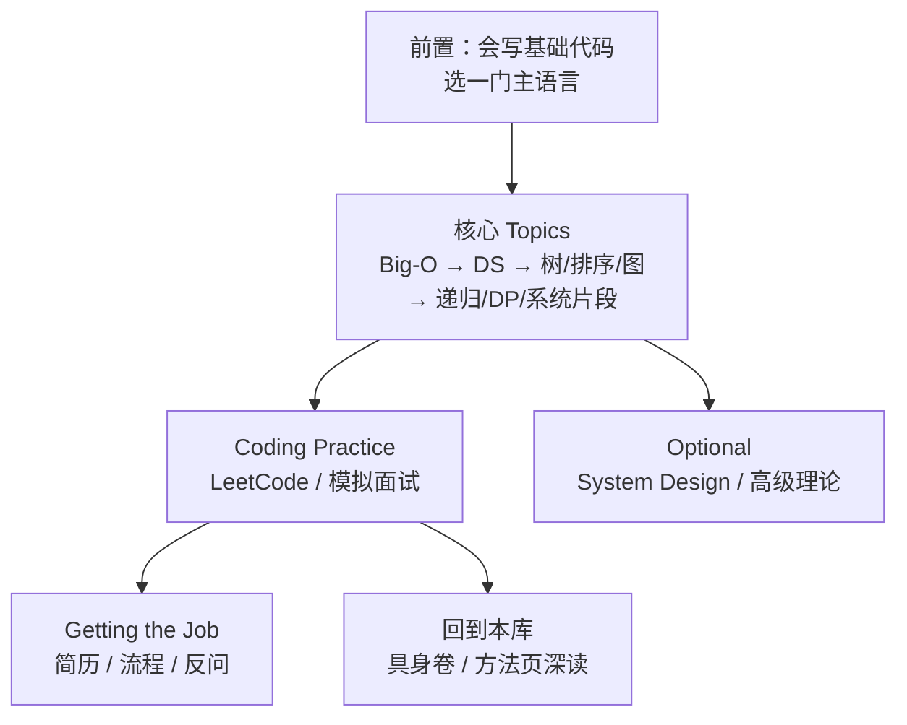

# Coding Interview University

**Coding Interview University**（[jwasham/coding-interview-university](https://github.com/jwasham/coding-interview-university)，CC-BY-SA-4.0）是 Jeff Washam 维护的 **开源软件工程面试自学清单**：以一份超长 `README.md`（含 [简体中文翻译](https://github.com/jwasham/coding-interview-university/blob/main/translations/README-cn.md)）把 Big-O、核心数据结构、图论、DP、基础系统知识与 **LeetCode 式刷题** 串成多月计划，目标是通过 Amazon / Google / Meta / Microsoft 等 **通用 SWE 技术面试**——**不是**前端/全栈专轨，也**不**覆盖现代深度学习面试专卷。

## 一句话定义

**大厂 coding 面试的「策展型 CS 路线图 + 外链资源索引」**：给机器人/具身研究者补 **算法与系统底子** 与 **OJ 刷题节奏**，与 [具身智能面试题库](embodied-interview-qa.md) 的专识卷正交互补。

## 英文缩写速查

| 缩写 | 英文全称 | 简要说明 |
|------|----------|----------|
| CIU | Coding Interview University | 本仓库社区常用简称 |
| SWE | Software Engineer | README 声明的目标岗位（非 FE/全栈专轨） |
| DS | Data Structures | 数组、链表、栈、队列、哈希、树、图等 |
| DP | Dynamic Programming | README 专题块；面试高频 |
| BFS | Breadth-First Search | 图/树遍历；与 DFS 并列 |
| DFS | Depth-First Search | 图/树遍历；回溯与连通性 |
| BST | Binary Search Tree | 有序树结构；面试基础 |
| NP | Nondeterministic Polynomial time | README 可选理论块（NP-Complete 等） |
| OJ | Online Judge | LeetCode / HackerRank 等外部刷题平台 |

## 为什么重要（对本知识库读者）

- **补「卷八」通用 coding 层：** [具身智能高频面试题库](embodied-interview-qa.md) 卷八含 LeetCode 与系统设计短答；CIU 提供 **更系统的 DS/Algo 学习顺序与书单**，避免只刷题不补基础。
- **研究岗也需要 CS 面试面：** 机器人 ML 岗常考实现题 + 基础复杂度/数据结构；CIU 与 [深度学习基础](../concepts/deep-learning-foundations.md)、[MDP](../formalizations/mdp.md) 等本库页 **并行**，不互相替代。
- **与机器人自学手册分工：** [qqfly 机器人学指南](learn-robotics-qqfly-guide.md) 走 Craig → Modern Robotics → 运动规划；CIU 走 **通用 CS + 刷题**——适合「规控会了、算法面薄弱」的读者。
- **开源、可 fork、多语言：** CC-BY-SA；`translations/README-cn.md` 降低中文读者门槛；适合个人 fork 后勾进度。
- **明确边界：** README 写明不覆盖前端专轨、也不当作完整 CS 学位替代——完整自学可接 [roadmap.sh/computer-science](https://roadmap.sh/computer-science)。

## 核心原理

| 层次 | 内容 |
|------|------|
| **形态** | 单仓 Markdown 策展；无统一可执行应用 |
| **主线** | Study Plan → Topics of Study → Coding Practice → Getting the Job |
| **方法论** | 边学边刷、Anki 闪卡、聚焦面试高频 75% CS、避免作者自述的「过度学习」 |
| **刷题面** | 外链 LeetCode 等；README 列题型与推荐题单思路 |
| **加深（可选）** | System Design、编译器、安全、并行、高级数据结构等 optional 区块 |

### 学习路径总览

### 主题块 ↔ 本库对照（精选）

| CIU 主题块 | 面试/研究关联 | 本库可深读 |
|------------|---------------|------------|
| Big-O / 复杂度 | 实现题与仿真性能直觉 | 工程实践各页中的 profiling 语境 |
| 图 / BFS / DFS | 规划、搜索、拓扑 | [导航·SLAM 栈](../overview/navigation-slam-autonomy-stack.md)（概念层） |
| DP / 递归 | 轨迹优化、序贯决策直觉 | [MDP](../formalizations/mdp.md)、[Bellman 方程](../formalizations/bellman-equation.md) |
| 进程/线程/网络 | 部署、分布式训练、ROS 通信 | [实时控制中间件 query](../queries/real-time-control-middleware-guide.md) |
| System Design（可选） | 机器人数据/推理服务架构 | [VLA 部署 query](../queries/vla-deployment-guide.md) |
| LeetCode 段 | 卷八 coding | [具身智能面试题库](embodied-interview-qa.md) 卷八 |

## 工程实践

| 场景 | 做法 |
|------|------|
| **具身岗 + 算法面弱** | 并行：白天本库 [depth-vla](../../roadmap/depth-vla.md) / [depth-rl-locomotion](../../roadmap/depth-rl-locomotion.md)，晚间 CIU 核心 Topics + 每日 1–2 题 |
| **仅补面试** | 跳过 optional 区块；按 README「Don't Make My Mistakes」控制范围 |
| **中文阅读** | 优先 `translations/README-cn.md`，外链失效时回英文 main README |
| **完整 CS 学位级** | README 指向 [roadmap.sh/computer-science](https://roadmap.sh/computer-science)，CIU 作 **面试子集** |
| **与蘑菇书并行** | [动手学强化学习](hands-on-rl-book.md) 补 RL 算法；CIU 不覆盖 PPO/SAC 面试深问 |
| **进度管理** | Fork 仓或复制 TOC 到个人笔记；用 checkbox 勾进度（README 原生支持） |
| **开源状态** | **已开源**（Markdown 清单）。详见 [仓库归档](../../sources/repos/jwasham_coding_interview_university.md) |

## 局限与风险

- **不是机器人面试全集：** 不覆盖 WBC、Sim2Real、VLA 等专识；具身面经以 [embodied-interview-qa](embodied-interview-qa.md) 与本库方法页为准。
- **不是前端/全栈路线图：** README 明确区分；UI/Node 专岗请看 [roadmap.sh](https://roadmap.sh/)。
- **外链衰减：** 视频、课程、OJ 链接随平台变化；克隆日后需自行替换失效资源。
- **强度叙事勿照搬：** 作者曾全职数月学习；README 亦提醒勿过度学习——按岗位 JD 裁剪。
- **无运行时/权重：** 不适用「源码运行时序图」；本质是 **阅读 + 刷题计划**，非可部署框架。
- **许可：** CC-BY-SA-4.0；衍生整理需保持相同许可并署名。

## 关联页面

- [具身智能高频面试题库](embodied-interview-qa.md) — 卷八 LeetCode/系统设计；与本页通用 CS 线互补
- [开源机器人学学习指南（qqfly）](learn-robotics-qqfly-guide.md) — 机器人规控系统自学
- [动手学强化学习（蘑菇书）](hands-on-rl-book.md) — 中文 RL 算法教材
- [人形系统学习策展](humanoid-system-curriculum.md) — 课程式系统学习，非 OJ 刷题
- [深度学习基础](../concepts/deep-learning-foundations.md) — 本库 DL 概念底座
- [运动控制主路线](../../roadmap/motion-control.md) — 机器人研究主线；CIU 作并行面试补底

## 参考来源

- [Coding Interview University 仓库源归档（本站）](../../sources/repos/jwasham_coding_interview_university.md)
- [jwasham/coding-interview-university（GitHub）](https://github.com/jwasham/coding-interview-university)
- [简体中文 README（translations）](https://github.com/jwasham/coding-interview-university/blob/main/translations/README-cn.md)

## 推荐继续阅读

- [Coding Interview University README（main）](https://github.com/jwasham/coding-interview-university/blob/main/README.md) — 完整 TOC 与书单
- [Computer Science Roadmap（roadmap.sh）](https://roadmap.sh/computer-science) — README 推荐的更完整 CS 自学补充
- [Why I studied full-time for 8 months for a Google interview（Medium）](https://medium.freecodecamp.org/why-i-studied-full-time-for-8-months-for-a-google-interview-cc662ce9bb13) — 作者学习强度背景（勿机械照搬）
