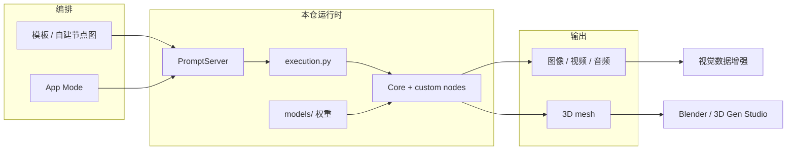
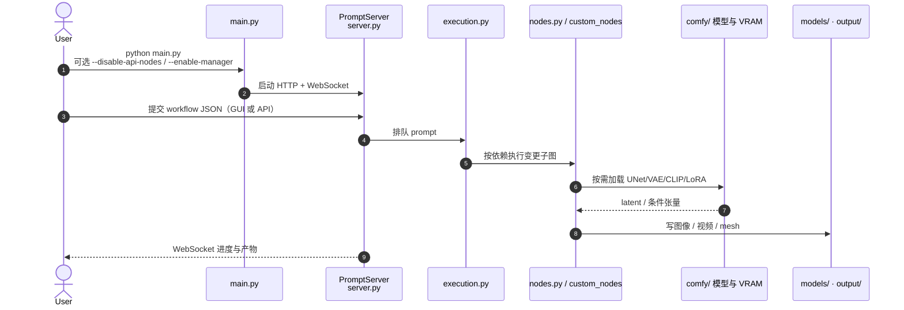

# ComfyUI

**ComfyUI**（[Comfy-Org/ComfyUI](https://github.com/Comfy-Org/ComfyUI)，官网 [comfy.org](https://comfy.org/)，稳定版 **v0.32.0**）是 **GPL-3.0** 开源的 **节点图式生成引擎**：把扩散/流匹配等模型、预处理与后处理连成可检查的计算图，同时暴露 **GUI、本地 HTTP/WebSocket API 与可选云端点**。由 **Comfy-Org** 维护；历史个人命名空间 [comfyanonymous/ComfyUI](https://github.com/comfyanonymous/ComfyUI) 仍出现在部分发行徽章中。

## 一句话定义

在画布上把 **模型加载 → 条件编码 → 采样 → 解码/后处理** 编成可复用工作流 JSON，由后端按依赖局部重跑；核心可完全本地离线，权重与 Partner API 另算。

## 英文缩写速查

| 缩写 | 英文全称 | 简要说明 |
|------|----------|----------|
| ComfyUI | Comfy UI | 本页引擎：节点图 GUI + API + 执行后端 |
| VAE | Variational Autoencoder | 像素 ↔ latent；图中常与扩散骨干分节点加载 |
| CLIP | Contrastive Language–Image Pre-training | 文本/图像条件编码器，节点间以黄色 CLIP 槽传递 |
| LoRA | Low-Rank Adaptation | 低秩适配器；可与 checkpoint 分路径加载 |
| MCP | Model Context Protocol | 官方 Comfy MCP（public beta）把 Agent 接到本地或 Cloud |
| API | Application Programming Interface | `server.py` 的 REST/WebSocket；Cloud 另有生产端点 |
| VRAM | Video Random Access Memory | 核心卖点之一是智能显存与 offload，决定本地能否跑大视频模型 |
| GPL | GNU General Public License | 核心 copyleft 许可；生成物与第三方节点许可需另核 |

## 核心信息

| 字段 | 内容 |
|------|------|
| 机构 | 节点式视觉引擎组织（Comfy-Org） |
| 类型 | 节点图式生成引擎（GUI + API + 后端） |
| 版本 | v0.32.0（2026-08-11 GitHub Releases） |
| 代码 | <https://github.com/Comfy-Org/ComfyUI> |
| 许可 | GPL-3.0 |
| 开源结论 | **已开源**（完整可运行核心）；权重不随仓分发 |

## 为什么对机器人栈重要

1. **视觉合成的可复现工作流：** 具身数据增强需要 **可版本化的图**（ControlNet 骨架、inpaint、背景替换），而不是一次性 Web UI 截图。ComfyUI 把工作流存 JSON，还能从生成 PNG 反读种子与全图——适合实验室把「怎么造这张图」写进数据集卡。
2. **与编排层/DCC 的分工：** [3D Gen Studio](./3dgenstudio.md) 是 **Kanban/MCP 网格生产编排**，本引擎是它调用的 **生成运行时**；[Blender](./blender.md) 仍是网格/动画精修 DCC。选型时不要把三者当成同一个工具。
3. **开源视频先验的常用宿主：** [Wan](./paper-wan-video.md) 等骨干在社区与官方模板里常以 ComfyUI 节点落地；这是「权重可下、图可分享」的推理层，**不是** 动作条件世界模型本身。
4. **Agent 可批跑、但物理不自动成立：** 官方 [Comfy MCP](https://docs.comfy.org/agent-tools/mcp.md) 可让 Cursor/Claude 搜模板、跑图、出图/视频/3D；下游若当 [生成式数据增强](../methods/generative-data-augmentation.md) 用，仍须人工或几何检查，避免把违反接触的视频写进策略数据。

## 核心原理

分层（对齐 README 与 `server.py` / `execution.py` / `nodes.py`）：

| 层 | 职责 |
|----|------|
| **前端** | 独立仓 [ComfyUI_frontend](https://github.com/Comfy-Org/ComfyUI_frontend)；节点画布、App Mode、队列/历史 |
| **PromptServer** | `server.py`：提交 workflow JSON、查 `object_info`、WebSocket 进度 |
| **图执行** | `execution.py`：只跑「有完整输入的输出子图」；未改动子图命中缓存 |
| **节点** | `nodes.py` + `custom_nodes/`：typed 槽（latent / CLIP / VAE / mesh 等） |
| **模型管理** | `comfy/`：分件加载 diffusion / VAE / 文本编码器 / LoRA / ControlNet；VRAM offload 与量化 |

官网与 README 把交付面拆成 **Desktop / 便携包 / 手动安装 / Cloud / API / Enterprise**。核心默认 **不主动下载**；可选 Partner Nodes 走付费闭源模型，实验室离线应用 `--disable-api-nodes`。

### 流程总览

### 源码运行时序图

主仓 **已开源**（GPL-3.0）。下列时序对齐 README `python main.py`、`script_examples/` 与文档中的 workflow 提交路径。

最短复现：按 GPU 装 PyTorch → `pip install -r requirements.txt` → 把 checkpoint 放入 `models/checkpoints`（或 `extra_model_paths.yaml`）→ `python main.py` → 从 [工作流库](https://comfy.org/workflows) 或内置模板跑一张文生图。Agent 路径见文档 Comfy MCP（本地或 `https://cloud.comfy.org/mcp`）。

## 工程实践

| 项 | 要点 |
|----|------|
| **前置** | Python 3.12/3.13 最稳；官方最低支持 PyTorch **2.7**；Nvidia 20 系及以上建议 cu130+ |
| **新手** | Desktop（Windows/macOS）；进阶用 `comfy-cli` 或手动 clone |
| **离线** | `--disable-api-nodes`；核心不主动拉网。权重仍须事先放进 `models/` |
| **扩展** | `python main.py --enable-manager` 启用 [ComfyUI-Manager](https://github.com/Comfy-Org/ComfyUI-Manager)；日常节点优先走 [registry.comfy.org](https://registry.comfy.org) |
| **API 集成** | 无 GUI：`script_examples/` 调本地 HTTP；生产叙事走 Comfy API / Cloud |
| **与 3D Gen Studio** | 先起本引擎，再在工作室 Settings 填 ComfyUI host；导入「Export (API)」JSON |
| **机器人用法** | 适合 **离线造图/造视频/造静态 mesh**；不要接进千赫兹控制环或当作 MuJoCo/Isaac |

README 强调：同一张图提交两次只会跑第一次；只改末端则只重跑依赖下游——这是批处理合成数据时控制 GPU 成本的关键。

## 局限与风险

- **不是仿真器、不是策略：** 无 URDF/接触/控制频率叙事；[Sim2Real](../concepts/sim2real.md) 几何与动力学一致性不会因为「图能跑」而自动满足。
- **不是工业 CAD / 仿真关节资产：** Hunyuan3D 等节点出的是 **网格外观**；承力件走 [Text-to-CAD](../concepts/text-to-cad.md)，可关节仿真资产走 [Articraft](./articraft.md)。
- **权重与节点质量外置：** 核心是调度器；样本质量取决于所选模型、自定义节点与是否误开 Partner API。
- **GPL + 生态许可叠加：** 本体 GPL-3.0；自定义节点、LoRA、闭源 API 与 **生成物商用条款** 各自独立，嵌入产品前须逐件核对。
- **master 非稳定：** README 写明稳定标签之外的 commit 可能打断大量自定义节点；复现请钉 **release tag**（入库时 v0.32.0）。
- **自定义节点供应链：** Manager/registry 降低安装摩擦，也引入任意 Python 代码执行面；实验室应限制来源并快照环境。

## 关联页面

- [3D Gen Studio](./3dgenstudio.md) — 以本引擎为 Native 后端的网格生产编排层（Kanban/Graph/MCP）
- [Blender](./blender.md) — 全流程 DCC；常作 mesh/动画精修，与节点生成互补
- [扩散模型](../concepts/diffusion-model.md) — 本引擎大量节点所实现的生成底座
- [生成式数据增强](../methods/generative-data-augmentation.md) — ControlNet / 场景编辑等在机器人数据上的用法
- [Wan 视频生成](./paper-wan-video.md) — 开源视频骨干；ComfyUI 是常见推理集成之一
- [文字生成 CAD](../concepts/text-to-cad.md) — 制造向 STEP 主线；本页属网格/像素生成对照
- [img2threejs](./img2threejs.md) — 单图 → 可 diff 的 Three.js 代码工厂，不是黑盒 mesh
- [算力自由（GPUFree）](./gpufree.md) — 国内 GPU 云镜像市场含 ComfyUI 成品镜像
- [Articraft](./articraft.md) — 仿真就绪可关节资产，目标不同于静态生成网格
- [Sim2Real](../concepts/sim2real.md) — 合成视觉进入策略前的一致性提醒

## 参考来源

- [Comfy-Org/ComfyUI 仓库归档](../../sources/repos/comfyui.md)
- [comfy.org 官网归档](../../sources/sites/comfy-org.md)
- [ComfyUI 官方文档](https://docs.comfy.org/)
- [Comfy MCP 文档](https://docs.comfy.org/agent-tools/mcp.md)

## 推荐继续阅读

- [GitHub — Comfy-Org/ComfyUI](https://github.com/Comfy-Org/ComfyUI)
- [Comfy 官网](https://comfy.org/)
- [工作流库](https://comfy.org/workflows)
- [节点注册表](https://registry.comfy.org)
- [3D Gen Studio](https://www.3dgenstudio.com/) — 本引擎在机器人资产管线上的编排层样本
