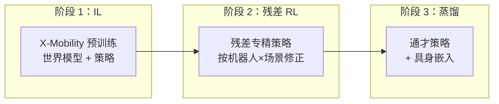
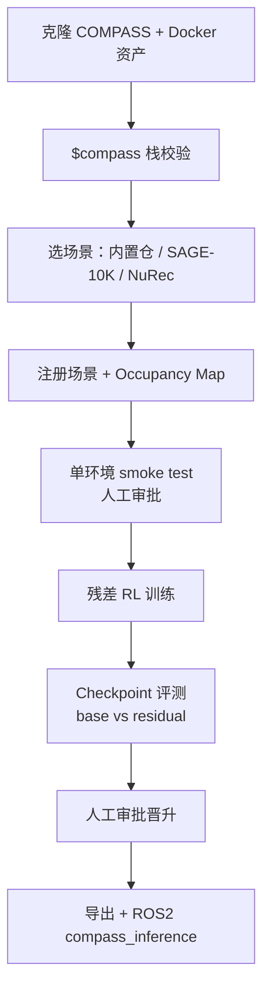

# COMPASS

**COMPASS**（*Cross-embOdiment Mobility Policy via ResiduAl RL and Skill Synthesis*，[arXiv:2502.16372](https://arxiv.org/abs/2502.16372)）是 NVIDIA Research 发布的 **跨具身移动（mobility）策略** 开源框架。它只需 **单具身专家演示**，通过 **模仿学习 → 残差强化学习 → 策略蒸馏** 三阶段，得到以 **具身嵌入** 条件化的通才导航策略，并支持 **零样本 Sim2Real** 与开放词汇导航扩展。

## 一句话定义

**复用 X-Mobility 导航基座，用残差 RL 为每个「机器人×场景」打补丁，再蒸馏成一个带具身 ID 的通才移动策略。**

## 英文缩写速查

| 缩写 | 英文全称 | 简要说明 |
|------|----------|----------|
| COMPASS | Cross-embOdiment Mobility Policy via Residual RL and Skill Synthesis | 本框架全称 |
| IL | Imitation Learning | 第一阶段：单具身 IL 预训练 |
| RL | Reinforcement Learning | 第二阶段：残差 RL 专精 |
| X-Mobility | NVIDIA X-Mobility | 预训练世界模型+移动策略基座权重 |
| HF | Hugging Face | gated 资产与 checkpoint 下载入口 |
| ROS 2 | Robot Operating System 2 | 参考部署：`compass_inference` → `/cmd_vel` |
| Sim2Real | Simulation to Real | 仿真训练策略零样本上真机（Carter、G1 等） |
| OMap | Occupancy Map | 导航自由空间/障碍占据图；SAGE-10K 等路径需生成 |

## 为什么重要

- **跨具身移动的可扩展配方：** 经典移动栈换平台要重调参；纯 IL 要为每个具身采高质量演示。COMPASS 用 **单具身 IL + 残差修正 + 蒸馏** 降低数据与工程重复（见 [跨具身迁移选型](../queries/cross-embodiment-transfer-strategy.md)）。
- **Agent-driven 工程化：** [官方博客教程](../../sources/blogs/nvidia_compass_cross_embodiment_navigation_ai_agents.md) 把依赖校验、场景注册、smoke test、训练、评测封装为仓库 **skills**（`$compass` 等），用编码 agent + 人工审批门降低复现摩擦。
- **与 Isaac 栈对齐：** 钉 **Isaac Lab 3.0 beta + Sim 4.5**，Docker 一键 `assets`/`build`；与 [Isaac Lab](./isaac-lab.md)、[GR00T](./isaac-gr00t.md) 后训数据管线衔接。
- **已开源可跑：** [NVlabs/COMPASS](https://github.com/NVlabs/COMPASS) **Apache 2.0**；需 HF token 访问 gated 资产。

## 核心结构

| 阶段 | 输入 | 输出 |
|------|------|------|
| **IL** | 单具身教师策略 / X-Mobility ckpt | 基座移动策略（世界模型+策略） |
| **残差 RL** | 基座动作 + 目标机器人/场景 | 专精残差策略（修正动力学与传感差异） |
| **蒸馏** | 多专精策略 | 单一 **embodiment-conditioned** 通才策略 |

项目页报告：通才策略相对 IL 基座约 **5×** 成功率、**3×** 更低行程时间；未见具身上显著退化。

## 流程总览（Agent 工作流）

参考教程以 **Boston Dynamics Spot** + 内置 `combined_multi_rack` 仓库为基线；SAGE-10K 与 **NuRec** 扩展 Real2Sim 场景。

## 工程实践

| 项 | 建议 |
|----|------|
| 首次运行 | `HF_TOKEN` + `./docker/run.sh assets` 拉取 USD 与 `x_mobility.ckpt`；401/403 先查 gated 仓权限 |
| Agent | Codex：symlink `.claude/skills` → `.agents/skills`；用 `$compass` 提示词（非 shell 命令） |
| Smoke test | **始终** `--num_envs 1`；通过后再开并行环境 |
| 训练 | `python run.py ... -b ./assets/x_mobility.ckpt --embodiment spot --environment <key>` |
| 评测 | 对比 **X-Mobility base** 与 residual；看 goal-reached、fall-down、travel time |
| 部署 | `compass_inference` 吃 RGB + 目标/路线 + 里程计 → `/cmd_vel`；缺里程计时可选 **cuVSLAM** |
| 算力 | 无本地 GPU 可用 [NVIDIA Brev](./nvidia-brev.md) 启动实例 |

## 局限与风险

- **版本钉扎：** Lab **3.0.0-beta1** + Sim **4.5.0**；与社区仍钉 Lab 2.x 的工程并存时需分支对齐。
- **Gated 资产：** HF 仓 `nvidia/COMPASS`、`nvidia/X-Mobility` 需接受条款；token 勿写入 agent 日志或 git。
- **教程止于仿真评测：** ONNX/TensorRT/真机导出需单独验证；无统一成功率阈值。
- **任务域：** 本框架聚焦 **移动/导航**，不是全身操作或 VLA 通才；与 [GR00T](./isaac-gr00t.md) 是互补后训关系。

## 关联页面

- [Isaac Lab](./isaac-lab.md)
- [Isaac GR00T](./isaac-gr00t.md)
- [NVIDIA Brev](./nvidia-brev.md)
- [跨具身策略迁移选型](../queries/cross-embodiment-transfer-strategy.md)
- [Sim2Real](../concepts/sim2real.md)
- [Boston Dynamics](./boston-dynamics.md) — Spot 参考平台
- [NVIDIA Jetson](./nvidia-jetson.md) — 机载推理硬件

## 参考来源

- [COMPASS 仓库归档](../../sources/repos/compass.md)
- [跨具身导航 Agent 教程博客](../../sources/blogs/nvidia_compass_cross_embodiment_navigation_ai_agents.md)

## 推荐继续阅读

- [COMPASS 项目页](https://nvlabs.github.io/COMPASS/)
- [COMPASS Handbook](https://nvlabs.github.io/COMPASS/docs/)
- [How to Train a Cross-Embodiment Robot Navigation Policy with AI Agents（NVIDIA Blog）](https://developer.nvidia.com/blog/how-to-train-a-cross-embodiment-robot-navigation-policy-with-ai-agents/)
- [arXiv:2502.16372](https://arxiv.org/abs/2502.16372)
