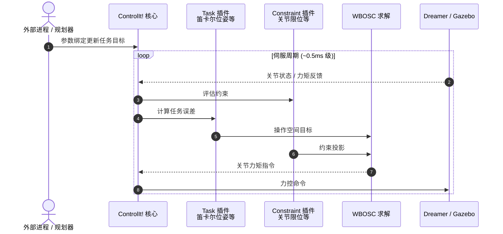

# ControlIt!（Whole-Body Operational Space Control 软件框架）

**ControlIt!**（*A Software Framework for Whole-Body Operational Space Control*；[arXiv:1506.01075](https://arxiv.org/abs/1506.01075)；[代码](https://github.com/liangfok/controlit)，LGPL-2.1）是 **Luis Sentis**（UT Austin）组对 **WBOSC（Whole Body Operational Space Control）** 的 **开源 ROS 中间件**：把 [ICRA 2006 WBC 框架](./paper-sentis-khatib-icra-2006-whole-body-control-framework.md) 的操作空间全身控制落实为 **可插件扩展、可多线程集成** 的软件栈。

## 一句话定义

**用 ROS 插件化中间件实现浮基高冗余机器人的 WBOSC：Task/Constraint 原语可扩展，两插件+URDF 适配新机器人，多线程将伺服延迟压到约 0.5 ms。**

## 英文缩写速查

| 缩写 | 英文全称 | 简要说明 |
|------|----------|----------|
| WBOSC | Whole Body Operational Space Control | 浮基全身操作空间运动/力统一控制 |
| WBC | Whole-Body Control | 全身控制总称 |
| ROS | Robot Operating System | 本文基于 Catkin/Indigo 生态 |
| URDF | Unified Robot Description Format | 机器人模型输入 |
| LGPL | GNU Lesser General Public License | 本仓库开源许可 |

## 为什么重要

- **理论→软件的关键一跳：** IJHR 2004 / ICRA 2006 无官方代码；ControlIt! 是社区仍可参考的 **WBOSC 参考实现**（相对封闭的原型 UTA-WBC）。
- **架构可教：** Task/Constraint 插件边界、参数绑定、多线程伺服 — 适合讲授 WBC **系统集成** 而非只推公式。
- **性能锚点：** 论文在 Dreamer 16-DoF 力控上半身报告 **~0.5 ms** 平均伺服延迟（vs UTA-WBC ~5 ms）。

## 核心信息

| 项 | 内容 |
|----|------|
| **机构** | 德州大学奥斯汀分校（UT Austin）；Luis Sentis 组 |
| **平台** | Dreamer 16-DoF 力控上半身（串联弹性 + co-actuated 关节）；Gazebo 仿真 |
| **开源** | **已开源** [liangfok/controlit](https://github.com/liangfok/controlit) |
| **维护性** | 依赖 **ROS Indigo** 等 legacy 栈；入库日仓库仍可读，但非现代 ROS2 默认选型 |

## 核心原理

- **WBOSC：** 在物理约束下，对 **一个或多个操作空间目标** 统一做运动/力控制（继承 [OSF 1987](./paper-operational-space-formulation.md)）。
- **插件模型：** 新 **Task** / **Constraint** 插件扩展 WBC 原语；新机器人 = **两插件 + URDF**。
- **参数绑定：** 外部进程经可扩展传输协议读写控制器参数（便于人机协作/上层规划改目标）。
- **多线程：** 将控制、通信与求解并行，提高标准 PC 伺服频率。

## 源码运行时序图

- **集成路径：** Catkin workspace → 编译 `controlit` 及模型/配置包 → Gazebo 演示 → 真机需对应力控硬件与插件。

## 工程实践

| 项 | 内容 |
|----|------|
| 环境 | ROS Indigo + Gazebo + RBDL + yaml-cpp 0.3.0 |
| 新机器人 | 实现两插件 + 提供 URDF |
| 新原语 | 编写 Task 或 Constraint 插件 |
| 局限 | **非 ROS2**；Dreamer 平台已属历史硬件；现代人形需重写插件与动力学接口 |

## 局限与风险

- **Legacy 依赖：** Indigo/Gazebo 版本与现代 Ubuntu/ROS2 不兼容，教学复现建议容器化或只读架构。
- **覆盖范围：** 论文演示为 **上半身力控 + 拆解任务**，不含现代人形下肢 locomotion 全栈。
- **非唯一 WBC 实现：** 与 [TSID](https://github.com/stack-of-tasks/tsid)、[Stack of Tasks](./paper-hmi-stack-of-tasks.md) 等并存，选型看平台与任务栈。

## 结论

**ControlIt! 把 Sentis–Khatib WBC 线变成可插件集成的 WBOSC 中间件，是理解「全身操作空间控制如何落地为软件」的首选开源样本（接受其 ROS 年代限制）。**

1. **先读 ICRA 2006 再跑 ControlIt!** — 论文定 Task/Constraint 语义，仓库定集成边界。
2. **插件边界是核心设计** — 两插件+URDF 适配机器人；Task/Constraint 扩展原语。
3. **多线程是为伺服频率服务** — 0.5 ms 级延迟是相对 UTA-WBC 的关键工程收益。
4. **Dreamer 是验证台，不是通用人形栈** — 迁移到 G1/H1 等需重做插件与力控接口。
5. **与 TSID/HQP 对照选型** — ControlIt! 偏 WBOSC+ROS；TSID 偏 Pinocchio 动力学 QP 链。
6. **容器化复现** — legacy ROS 栈建议隔离环境，勿与 ROS2 工作区混装。

## 与其他页面的关系

- 理论线：[paper-khatib-sentis-ijhr-2004-whole-body-dynamic-behavior.md](./paper-khatib-sentis-ijhr-2004-whole-body-dynamic-behavior.md)、[paper-sentis-khatib-icra-2006-whole-body-control-framework.md](./paper-sentis-khatib-icra-2006-whole-body-control-framework.md)
- 概念：[whole-body-control.md](../concepts/whole-body-control.md)、[hub-wbc.md](../overview/hub-wbc.md)
- 四足 MPC 参考：[legbot-mpc-wbc.md](./legbot-mpc-wbc.md)

## 参考来源

- [controlit_arxiv_1506_01075.md](../../sources/papers/controlit_arxiv_1506_01075.md)
- [sources/repos/controlit.md](../../sources/repos/controlit.md)

## 推荐继续阅读

- [arXiv:1506.01075](https://arxiv.org/abs/1506.01075) — 论文与性能数据
- [GitHub: liangfok/controlit](https://github.com/liangfok/controlit) — 安装与演示
- [TSID](https://github.com/stack-of-tasks/tsid) — 现代人形 WBC QP 对照
