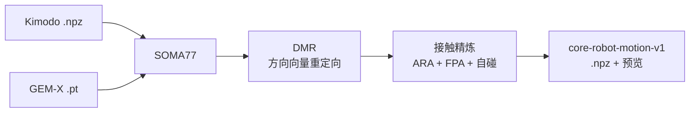
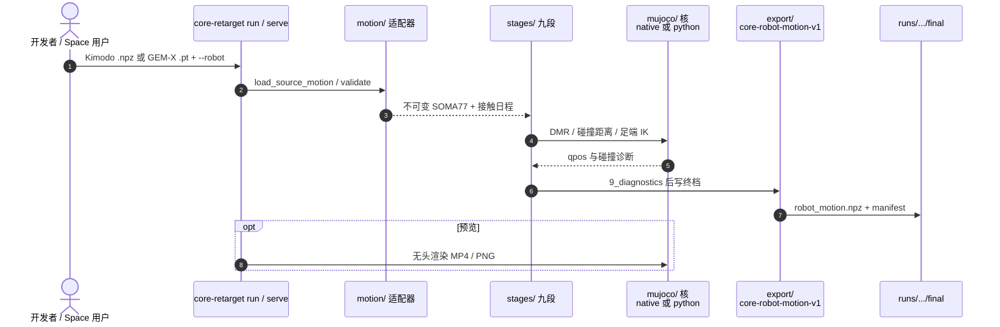

# CoRe（接触感知全身重定向软件）

**CoRe**（*Contact-Aware Motion Retargeting*，<https://github.com/tmjeong1103/CoRe>，[v0.1.0](https://github.com/tmjeong1103/CoRe/releases/tag/v0.1.0)）由 **高丽大学（Korea University）Robot Intelligence Lab**（Taemoon Jeong 维护，Sungjoon Choi 指导）发布：把 [Kimodo](./kimodo.md) `.npz` 或 [GEM-X](https://github.com/NVlabs/GEM-X) `.pt` 的 **SOMA** 人体运动，经 **DMR + 接触感知精炼** 映射到 **11 台捆绑人形**，用 [MuJoCo](./mujoco.md) 做碰撞距离与预览，导出无 pickle 的 `core-robot-motion-v1` `.npz`。

> **同名消歧：** 本页是 **人形动作重定向软件 / Humanoids 2025 CoRe 论文** 的工程实现。勿与可变形世界模型 [PhysCoRe](./paper-physcore.md)（Georgia Tech，arXiv:2607.20653，未开源）混淆。

## 一句话定义

**一条命令把 SOMA 人体运动重定向到 11 台人形，并在 RL 之前用接触与自碰精炼压住脚滑、浮空和手臂穿透。**

## 英文缩写速查

| 缩写 | 英文全称 | 简要说明 |
|------|----------|----------|
| CoRe | Contact-Aware Motion Retargeting / Contact-aware motion Refinement | 本软件与 Humanoids 论文的接触精炼管线 |
| DMR | Direction-based Motion Retargeting | 来自 [RMR](./paper-rmr.md) 的方向向量重定向阶段 |
| SOMA | Standardized Open Motion Avatar | NVIDIA 统一人体骨架；本工具吃 SOMA77 |
| FPA | Foot-Placement Adjustment | 接触感知落脚目标 + IK / 接地 |
| ARA | Absolute Root Adjustment | 根轨迹与接地偏置调整 |
| IK | Inverse Kinematics | 足端与身体目标的关节求解 |

## 为什么重要

- **SOMA 栈的多机出口：** [SOMA Retargeter](./soma-retargeter.md) 主打 G1 CSV；本工具直接吃 Kimodo / GEM-X 产物，`--robot` 切 11 机，适合「一份人体资产、多机预览」。
- **接触精炼写进产品，而不只在论文里：** 相对纯 [GMR](../methods/motion-retargeting-gmr.md) 几何 IK，CoRe 把接触段、落脚、接地与手臂自碰做成 **九段可检查制品**。
- **可试、可复现：** [Hugging Face Space](https://huggingface.co/spaces/robotaemoon/CoRe) 免安装；v0.1.0 带 16 条示例、22 条已审视频、macOS/Ubuntu CI。

## 核心信息

| 项 | 内容 |
|----|------|
| **机构** | 高丽大学（Korea University）；联合韩国科学技术研究院（KIST）、伊利诺伊大学厄巴纳-香槟分校（UIUC） |
| **许可** | 代码 Apache-2.0；示例动作 CC BY 4.0；机器人 XML 保留厂商许可 |
| **平台** | macOS / Ubuntu，Python 3.10–3.13；MuJoCo 3.6.0 |
| **开源** | **已开源、可运行**（重定向 + 精炼 + 网页）；论文 **T2M / RL 训练未随 v0.1.0 发布** |
| **接口** | `Retargeter` Python API、`core-retarget` CLI、`core-retarget serve` / HF Space |

## 核心原理

扩展名即适配器：`.npz` → Kimodo（已评估全局 SOMA77）；`.pt` → GEM-X（body parameters + 接触 logits，固定 bind rig 求值后做 Z-up 与时变支撑地面归一）。两者进入同一不可变 SOMA77，再跑 DMR 与接触精炼。

### 九段制品

| 阶段 | 制品 | 职责 |
|------|------|------|
| 1 | `1_contacts.npz` | 源校验 + 提供方感知足接触 |
| 2 | `2_dmr.npz` | 身体目标 → 选定机器人 |
| 3 | `3_initial_collision.npz` | 初始手臂自碰 |
| 4–5 | 轨迹 / `5_ara.npz` | 根、踝、足底、趾；根与接地偏置 |
| 6–7 | FPA | 接触感知落脚目标 + IK |
| 8–9 | 终态 | 再一次手臂自碰 + 诊断后写出终档 |

输出含时间戳、MuJoCo `qpos`、命名根/关节布局、接触与源/模型哈希；**无 object 数组**。部分厂商模型 `nq` ≠ 驱动 DoF，必须读 named layout。

## 源码运行时序图

官方入口对齐仓库 `core_retarget/` 与 README：`core-retarget run` / `Retargeter.run` / `core-retarget serve` 都调用同一 `run_retarget_pipeline()`。

- **最短复现：** `pip install -e ".[gemx,video]"` → `core-retarget backend --require-native` → `core-retarget run examples/motions/kimodo/... --robot g1 --video`。
- **浏览器：** `pip install -e ".[web]"` → `core-retarget serve`，或打开 HF Space。
- **批量：** `scripts/generate_example_outputs.py --source-set kimodo|gem-x`。

## 工程实践

| 项 | 建议 |
|----|------|
| 源格式 | Kimodo 用嵌入或默认 FPS；GEM-X **必须** `--fps`（捆绑示例 30 Hz） |
| 后端 | `auto` 优先 C++ 核；清单记录 requested / selected backend |
| 安全加载 | `.npz` 关 pickle；`.pt` 用 `weights_only=True`；输出再 `allow_pickle=False` 校验 |
| 资产 | `core-retarget robots verify` 核 XML/网格哈希；勿改 vendor 目录 |
| 真机 | README 写明 **研究软件**：先仿真检查再上硬件 |
| 许可 | 再分发时分开代码、示例动作与各厂商 `SOURCE.yaml` |

### 捆绑机型（v0.1.0）

`g1` / `h1` / `h2` / `r1`（Unitree）、`k1`（ROBOTIS）、`apollo`（Apptronik）、`oli`（LimX）、`n1`（Fourier）、`adam`（PNDbotics）、`t1`（Booster）、`pm01`（ENGINEAI）。

## 局限与风险

- **不是论文全管线：** v0.1.0 **不含** text-to-motion 与 contact-aware RL；产物是运动学+接触精炼参考，下游仍要 [WBT](../concepts/whole-body-tracking-pipeline.md) / AMP。
- **输入契约窄：** 只吃 SOMA77 Kimodo/GEM-X；SMPL-X / BVH 需先经 [Kimodo](./kimodo.md) / [SOMA-X](./soma-x.md) / [SOMA Retargeter](./soma-retargeter.md) 转换。
- **接触质量不保证任意动作：** 回归基线钉在捆绑 Kimodo 参考上，不外推到任意 GEM-X 或自采视频。
- **安装要 C++17：** native 核在安装期编译；纯 Python 后端可跑但更慢。
- **厂商模型有本地修改：** 以各目录 `SOURCE.yaml` / `MODIFICATIONS.md` 为准，勿当官方仿真模型的 bit-exact 副本。

## 与相近工具对比

| 维度 | CoRe v0.1.0 | [GMR](../methods/motion-retargeting-gmr.md) | [SOMA Retargeter](./soma-retargeter.md) | [robot_retargeter](./robot-retargeter.md) |
|------|-------------|---------------------------------------------|----------------------------------------|------------------------------------------|
| 典型输入 | Kimodo `.npz` / GEM-X `.pt` | BVH / SMPL / FBX | SOMA BVH | SMPL-X `.npz` / LAFAN1 CSV |
| 接触精炼 | 九段 ARA/FPA/自碰 | 几何 IK，物理另补 | 足部稳定 + 限位 | 接触锁定 FrameTask |
| 多机 | 11 台捆绑 | 多机、格式广 | 主推 G1 | G1/H2/T800 等并排 |
| 浏览器演示 | HF Space / `serve` | 无官方 Space | 无 | 无 |

## 关联页面

- [CoRe 论文（Humanoids 2025）](./paper-core.md)
- [RMR 论文（IROS 2025）](./paper-rmr.md)
- [Motion Retargeting](../concepts/motion-retargeting.md)
- [Motion Retargeting Pipeline](../concepts/motion-retargeting-pipeline.md)
- [GMR](../methods/motion-retargeting-gmr.md)
- [SOMA Retargeter](./soma-retargeter.md) / [robot_retargeter](./robot-retargeter.md)
- [Kimodo](./kimodo.md) / [SOMA-X](./soma-x.md) / [Unitree G1](./unitree-g1.md)

## 参考来源

- [CoRe 仓库归档](../../sources/repos/core_retarget.md)
- [Hugging Face Space 归档](../../sources/sites/huggingface-robotaemoon-core.md)
- [CoRe 项目页归档](../../sources/sites/core-page.md)
- [RMR 项目页归档](../../sources/sites/rmr-page.md)

## 推荐继续阅读

- GitHub：<https://github.com/tmjeong1103/CoRe>
- 发布说明：<https://github.com/tmjeong1103/CoRe/releases/tag/v0.1.0>
- 在线演示：<https://huggingface.co/spaces/robotaemoon/CoRe>
- 架构文档：<https://github.com/tmjeong1103/CoRe/blob/main/docs/architecture.md>
