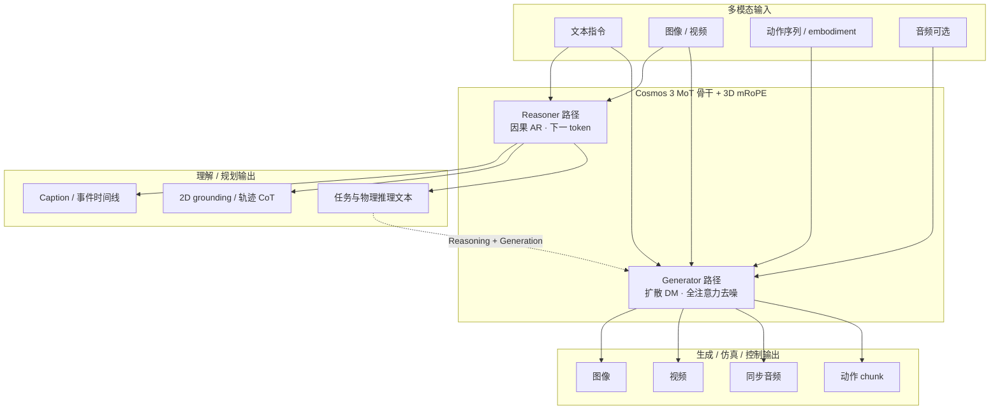

# Cosmos 3（NVIDIA 全模态世界模型）

**Cosmos 3**（2026-06，[arXiv:2606.02800](https://arxiv.org/abs/2606.02800)，[项目页](https://research.nvidia.com/labs/cosmos-lab/cosmos3/)，[GitHub](https://github.com/NVIDIA/cosmos)）是 NVIDIA Cosmos 平台的第三代 **全模态（omnimodal）世界模型** 家族：在单一 **Mixture-of-Transformers（MoT）** 骨干内，以灵活的多模态 I/O 同时承担 **视觉–语言理解、图像/视频/音频生成、世界仿真、操纵策略与正/逆动力学**——把以往分立的 VLM、视频扩散生成器、世界模拟器与 world-action 模型收束为 **Physical AI 通用底座**。

## 一句话定义

**一个开源 MoT 世界模型栈：Reasoner 路径做物理 grounded 文本推理，Generator 路径做视频/音频/动作联合生成与 rollout，用同一时空表征服务机器人与自动驾驶等 Physical AI 任务。**

## 英文缩写速查

| 缩写 | 英文全称 | 简要说明 |
|------|----------|----------|
| MoT | Mixture-of-Transformers | Cosmos 3 统一骨干：AR 推理 + 扩散生成 |
| mRoPE | multi-dimensional Rotary Position Embedding | 跨模态时空位置编码 |
| VLM | Vision-Language Model | 视觉–语言理解模型；Cosmos 3 Reasoner 涵盖此类能力 |
| WAM | World Action Model | 联合世界预测与动作生成的范式 |
| Physical AI | Physical Artificial Intelligence | 需在物理世界中感知、推理与行动的 AI 系统 |
| T2V | Text-to-Video | 文本条件视频生成 |
| I2V | Image-to-Video | 图像条件视频生成 |

## 为什么重要

- **平台级统一，而非单点论文：** 同时发布 **16B Nano / 64B Super** 权重、合成数据、评测基准与 **Diffusers / vLLM-Omni / NIM** 集成，降低从「看视频想象」到「出动作/出仿真」的工程切换成本。
- **Physical AI 闭环语义完整：** 项目页与 README 明确覆盖 **policy、forward dynamics、inverse dynamics**，并与 **2D 轨迹 CoT + 视频再生** 串联——对齐 [World Action Models（WAM）](../concepts/world-action-models.md) 对「预测 + 控制」联合范式的讨论。
- **开源榜单叙事强：** 技术报告撰写时，后训练模型在 **Artificial Analysis** 开源 T2I/I2V 与 **RoboArena** policy 榜位居首（见 [参考来源](#参考来源)）；与 [EWMBench](../entities/ewmbench.md) 等 **操纵向** 专用基准形成互补——前者偏平台综合能力，后者偏场景/运动/语义三维量。
- **生态承接：** 前序 **Cosmos-Predict2** 已是 [mimic-video](../methods/mimic-video.md) VAM 骨干与 [Cosmos Policy](./paper-shenlan-wm-11-cosmos-policy.md) 微调基底；Cosmos 3 把「视频先验 + 动作头」路线升级为 **原生五模态单栈**，并进入 [NVIDIA SO-101 Sim2Real](./nvidia-so101-sim2real-lab-workflow.md) 等课程的 **合成演示增广** 语境。

## 核心结构

| 模块 | 作用 |
|------|------|
| **MoT 骨干** | **自回归 Transformer（Reasoner）** + **扩散 Transformer（Generator）** 共享层与多模态注意力 |
| **3D mRoPE** | 统一编码图像/视频/音频/动作的 **时空结构** |
| **Reasoner 面** | 文本+视觉 → 文本：caption、时序定位、2D grounding、具身 CoT、物理合理性 |
| **Generator 面** | 文本+视觉+声音+动作 → 视觉+声音+动作：T2I/T2V/I2V/V2V、带声视频、policy rollout |
| **Embodiment 条件** | 相机 9D、AV 9D、ego 57D、单臂 10D、双臂 20D、人形 29D 等动作空间 |
| **开放资产** | 权重（HF）、代码、策展合成数据、评测基准；**OpenMDW-1.1** 许可（论文摘要口径） |

### 模型族（公开 checkpoint）

| 模型 | 规模 | 侧重 |
|------|-----:|------|
| **Cosmos3-Nano** | 16B | 默认研究与部署入口：全模态理解+生成+动作 |
| **Cosmos3-Super** | 64B | 前沿规模全模态 |
| **Cosmos3-Super-Text2Image** | 64B | 高保真 T2I |
| **Cosmos3-Super-Image2Video** | 64B | 时序一致 I2V |
| **Cosmos3-Nano-Policy-DROID** | 16B | DROID 操纵策略专用 |

### 流程总览（双路径 + 典型机器人闭环）

**典型用法分岔：**

1. **只理解：** Reasoner — 例如操纵视频上的 **下一动作预测** 或 **2D 像素轨迹**。
2. **只生成：** Generator — **T2V / I2V** 合成训练数据（SO-101 课程 Strategy 3 语境）。
3. **闭环 WM：** Generator **policy**（视觉+语言→动作+rollout）或 **forward / inverse dynamics**（动作↔未来视频）。
4. **先想再做：** Reasoner 输出轨迹与 CoT → Generator 再生 **物理交互视频**（项目页 *Reasoning + Generation* demo）。

## 部署与集成（工程入口）

| 路径 | 适用 | 备注 |
|------|------|------|
| **Diffusers** `Cosmos3OmniPipeline` | 研究、微调、原型 | 加载完整 checkpoint（含 Reasoner + 扩散路径） |
| **vLLM-Omni** | Generator 生产 API | OpenAI 兼容 `/v1/images/generations`、`/v1/videos/sync`；action modes 含 policy / forward_dynamics / inverse_dynamics |
| **vLLM + vllm-cosmos3** | Reasoner 生产 API | Chat-completions；Qwen3-VL 风格多模态消息 |
| **Cosmos 3 Reasoner NIM** | 最快 Reasoner 上线 | NGC 预优化容器 |

默认生成设定（README）：480p / 16:9 / 24 FPS / 最多 300 帧；Linux + BF16 + Ampere/Hopper/Blackwell。

## 与相邻路线的分界

| 对比轴 | Cosmos 3 | [mimic-video](../methods/mimic-video.md) | [τ₀-WM](./tau0-world-model.md) | [GE-Sim 2.0](./ge-sim-2.md) |
|--------|----------|------------------------------------------|-------------------------------|------------------------------|
| **模态范围** | 语言+图像+视频+音频+动作 | 语言+视频潜空间+动作 | 多视角视频+动作 | 多视角视频+本体状态 |
| **架构** | 单 MoT 双路径 | 冻结 Cosmos-Predict2 + 动作解码器 | 5B 联合 VAM + 测试时搜索 | 视觉专家 + 状态专家 + Judge |
| **开源形态** | 平台+多尺寸权重+ serving 栈 | 论文+第三方复现 | HF 权重+server | 报告已出，代码 TODO |
| **主要卖点** | **一个模型多种 Physical AI 任务** | 样本效率与潜计划 VAM | 操纵测试时 propose–evaluate–revise | 千万级闭环操纵模拟 |

## 常见误区

- **误区 1：Cosmos 3 = 只做视频生成。** Generator 明确包含 **policy 与正/逆动力学**；Reasoner 侧也是产品级能力，而非附属 caption 模型。
- **误区 2：与 Cosmos Policy 重复。** [Cosmos Policy](./paper-shenlan-wm-11-cosmos-policy.md) 是 **微调 Predict2 的联合架构论文实例**；Cosmos 3 是 **下一代全模态母平台**，可再被微调为各类 policy / 仿真器。
- **误区 3：榜单第一等于操纵闭环已解决。** 平台榜与 [EWMBench](../entities/ewmbench.md) 等 **任务语义/轨迹** 量纲不同；合成增广仍要面对 **物理幻觉与分布偏移**（见 [Sim2Real](../concepts/sim2real.md)）。

## 与其他页面的关系

- [Generative World Models](../methods/generative-world-models.md) — 生成式世界模型工具箱中的 **NVIDIA 开源平台级** 样本
- [World Action Models（WAM）](../concepts/world-action-models.md) — policy + dynamics 作为 Joint 能力族谱
- [Video-as-Simulation](../concepts/video-as-simulation.md) — 视频 rollout 替代/补充解析仿真
- [机器人世界模型训练闭环 taxonomy](../overview/robot-world-models-training-loop-taxonomy.md) — ③ 可控视频生成 / 数据增广支路
- [mimic-video（VAM）](../methods/mimic-video.md) — Cosmos-Predict2 系视频先验的历史路线
- [Cosmos Policy](./paper-shenlan-wm-11-cosmos-policy.md) — Predict2 微调版联合控制实例
- [NVIDIA SO-101 Sim2Real 动手课](./nvidia-so101-sim2real-lab-workflow.md) — Cosmos 演示视频增广实验

## 参考来源

- [Cosmos 3 技术报告（arXiv:2606.02800）](../../sources/papers/cosmos3_arxiv_2606_02800.md)
- [Cosmos 3 官方项目页](../../sources/sites/cosmos3-project.md)
- [NVIDIA/cosmos 仓库](../../sources/repos/nvidia_cosmos.md)

## 关联页面

- [Generative World Models](../methods/generative-world-models.md)
- [World Action Models（WAM）](../concepts/world-action-models.md)
- [mimic-video（VAM）](../methods/mimic-video.md)
- [Cosmos Policy](./paper-shenlan-wm-11-cosmos-policy.md)
- [NVIDIA SO-101 Sim2Real 动手课](./nvidia-so101-sim2real-lab-workflow.md)

## 推荐继续阅读

- [arXiv:2606.02800](https://arxiv.org/abs/2606.02800) — 论文全文
- [Cosmos 3 项目页](https://research.nvidia.com/labs/cosmos-lab/cosmos3/) — 交互 demo 与能力矩阵
- [GitHub: NVIDIA/cosmos](https://github.com/NVIDIA/cosmos) — Quickstart、模型卡与 serving 配方
- [Cosmos 3 Diffusers 文档](https://huggingface.co/docs/diffusers/main/en/api/pipelines/cosmos3) — `Cosmos3OmniPipeline` API
