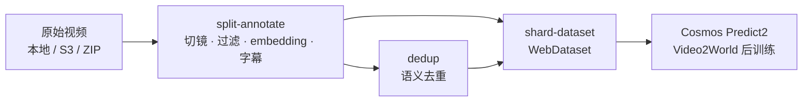
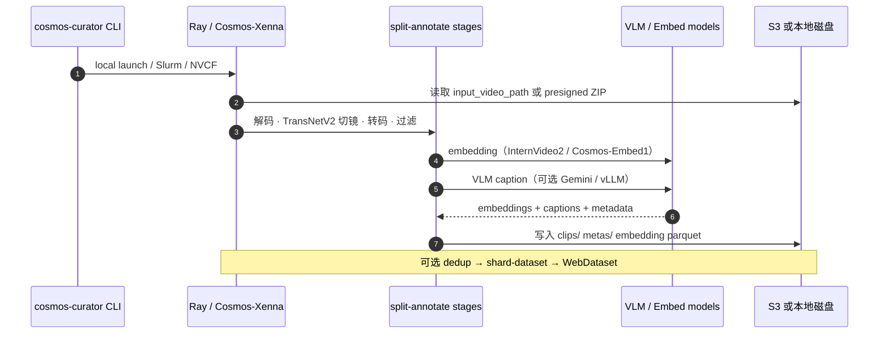

# Cosmos Curator（视频策展）

**Cosmos Curator** 是 [NVIDIA Cosmos](./nvidia-cosmos.md) 生态里专门处理 **海量原始视频 → 可训练 clip + caption + embedding** 的一层。它既提供 [开源自托管框架](https://github.com/NVIDIA/cosmos-curator)，也提供 [DGX Cloud 托管策展服务](https://docs.nvidia.com/cosmos-curator-lha/current/introduction.html)（S3 双桶或 ZIP 输入，NGC WebUI / API 操作）。

## 一句话定义

**把未整理的长视频流变成 Cosmos WFM 能吃的训练包：GPU 上切镜、滤劣质、打 embedding、写 VLM 字幕，再去重并打成 WebDataset——Cosmos 预训练与后训练的数据工厂。**

## 英文缩写速查

| 缩写 | 英文全称 | 简要说明 |
|------|----------|----------|
| WFM | World Foundation Model | Curator 服务的下游模型族 |
| VLM | Vision-Language Model | split-annotate 管线为 clip 生成 caption |
| V2W | Video-to-World | shard-dataset 可产出 Predict2 Video2World 后训练包 |
| NVCF | NVIDIA Cloud Functions | 可选云端部署入口（需联系 Cosmos 团队） |
| LHA | （文档路径 cosmos-curator-lha） | NVIDIA 托管 Curator 服务文档系列 |
| S3 | Simple Storage Service | 托管与自托管管线的对象存储接口 |

## 为什么重要

- **WFM 质量上限在数据，不在单卡推理。** Cosmos 1.0 论文就把「世界模型 + 策略模型」写成 Physical AI 双孪生；没有 Curator 级切滤标，Predict / Transfer 后训练只能在脏长视频上硬啃。
- **官方自己用它产 Cosmos 训练数据。** README 写明 Curator **powers Cosmos training data generation at NVIDIA**；不是外围小工具。
- **策展与增广是不同工序。** Curator 负责 **切 / 滤 / 标 / 去重**；[Cosmos Transfer](./cosmos-transfer.md) 负责 **同一轨迹换外观**。技术地图第②段应分开读。
- **两条部署路径：** 有集群与合规要求 → 自托管 `NVIDIA/cosmos-curator`；要快、少运维 → DGX Cloud LHA（S3 或 ZIP）。

## 核心原理

Curator 建立在 **[Cosmos-Xenna](https://github.com/nvidia-cosmos/cosmos-xenna)**（Ray 多节点 GPU 流式框架）之上：逻辑阶段可拆成多个物理 stage，按吞吐 **autoscale worker**（caption 预处理在 CPU、推理在 GPU 时尤其明显）。

### 三条参考视频管线

| 管线 | 关键阶段 | 主要产出 |
|------|----------|----------|
| **split-annotate** | 下载 → TransNetV2 切镜 → H264 转码 → 运动/美学过滤 → InternVideo2 / Cosmos-Embed1 embedding → VLM caption | `clips/`、`metas/v0/`、embedding parquet、可选 `cosmos_predict2_video2world_dataset/` |
| **dedup** | 基于 clip embedding 的语义去重 | 去重索引与过滤后 clip 集 |
| **shard-dataset** | 合并 clips + captions（+ dedup） | 可直接喂训练的 **WebDataset** |

**读法：** 只做探索性分析可停在 split-annotate；要上 Predict2 后训练通常还要 shard-dataset；百万级爬取必须加 dedup。

### 源码运行时序图

复现入口：`cosmos-curator image build` → `model-download` → `cosmos-curator local launch ... run_pipeline split`（详见仓内 End User Guide）。

## 工程实践

### 自托管上手

| 步骤 | 命令 / 配置 |
|------|-------------|
| 环境 | Ubuntu ≥ 22.04；Pixi + Docker + NVIDIA Container Toolkit；`~/.config/cosmos_curator/config.yaml` 填 HF / NGC 凭证 |
| 克隆 | `git clone --recurse-submodules https://github.com/NVIDIA/cosmos-curator` |
| 镜像 | `cosmos-curator image build --image-name cosmos-curator --image-tag 1.0.0` |
| 模型 | `cosmos-curator local launch ... pixi run --as-is model-download --models ...` |
| 跑管线 | `cosmos-curator local launch ... python3 -m cosmos_curator.pipelines.video.run_pipeline split ...` |
| 大配置 | JSON/YAML 单文件配置（与 NVCF API payload 同形）；模板见 `examples/osmo/` |

### 托管服务（LHA）

| 输入 | 输出 | 操作面 |
|------|------|--------|
| S3 输入桶 + 输出桶 | 策展后数据集写回 S3 | NGC WebUI 或 REST API |
| ZIP 上传 | 结果存 **NVIDIA DGX Cloud** | 同上 |

### 硬件门槛（官方 End User Guide）

| 场景 | 最低配置 |
|------|----------|
| hello-world 示例 | 1× GPU（≥ 4 GB VRAM）；主机 ≥ 32 GB RAM、200 GB 磁盘 |
| 参考视频管线 | 1× GPU **≥ 48 GB VRAM**（算力 ≥ 8.0） |
| 大规模 | Slurm 集群或 DGX Cloud；Ray 水平扩展 |

### 与 Cookbook / Cosmos 3 的分工

| 需求 | 入口 |
|------|------|
| 2.x Curator 配方（CABR、embedding 离群） | [Cosmos Cookbook](./cosmos-cookbook.md) — **有限维护** |
| 3.x 全模态 WFM | [Cosmos 3](./cosmos-3.md) + [NVIDIA/cosmos](https://github.com/NVIDIA/cosmos)；Curator 仍产 Predict2 形 WebDataset |
| 视频增广 | [Cosmos Transfer](./cosmos-transfer.md) — 在已策展 clip 之后 |

开源结论（2026-09-06）：**Curator 源码已开源**（Apache-2.0，~264★）；InternVideo2 等依赖模型需 HF 门控；托管 LHA 为商业云能力，与开源仓能力对齐。

## 局限与风险

- **不是物理仿真：** 运动/美学过滤与 VLM caption 都是 **启发式 + 学习式**，不能代替 Newton / Omniverse 的接触与几何校验。
- **算力与存储重：** 参考管线单卡 48 GB 起；S3 往返与 clip 副本会快速吃掉百 GB 级磁盘。
- **caption 质量需二次质检：** 管线输出 `caption_quality_stats.json` 与 quality flags，但 **不自动拒采**；合成数据进训练前仍建议 [Cosmos Reason](./cosmos-3.md) 或人工 spot-check。
- **macOS 不能跑 GPU 管线：** 仅能做 CLI / 格式检查；正式策展要在 Linux GPU 或云上。
- **托管与自托管凭证模型不同：** presigned URL 模式可免 AWS 凭证；全桶挂载需正确配置 `~/.aws/credentials` profile。

## 关联页面

- [NVIDIA Cosmos 平台](./nvidia-cosmos.md)
- [Cosmos Cookbook](./cosmos-cookbook.md) — 2.x Curator 配方与 CABR
- [Cosmos 3](./cosmos-3.md) — 当前 WFM 主线
- [Cosmos Transfer](./cosmos-transfer.md) — 策展后的域增广
- [Cosmos 1.0 WFM 平台论文](./paper-sa-2501-03575-cosmos-world-foundation-model-platform-for-physi.md)
- [NVIDIA Physical AI 工具链技术地图](../overview/nvidia-physical-ai-toolchain-technology-map.md)
- [NVIDIA Physical AI 数据集](./nvidia-physical-ai-datasets.md)
- [Generative World Models](../methods/generative-world-models.md)
- [Sim2Real](../concepts/sim2real.md)

## 参考来源

- [NVIDIA/cosmos-curator 仓库](../../sources/repos/nvidia_cosmos_curator.md)
- [Cosmos Curator LHA 文档摘录](../../sources/sites/cosmos-curator-docs.md)
- [NVIDIA/cosmos 平台仓](../../sources/repos/nvidia_cosmos.md)
- [NVIDIA Cosmos 产品页](../../sources/sites/nvidia-cosmos.md)
- [Cosmos Cookbook 站点](../../sources/sites/cosmos-cookbook.md)

## 推荐继续阅读

- [Cosmos Curator End User Guide（GitHub）](https://github.com/NVIDIA/cosmos-curator/blob/main/docs/client/end-user-guide.md) — 本地 / Slurm / DGX Cloud 完整步骤
- [Reference Video Pipelines](https://github.com/NVIDIA/cosmos-curator/blob/main/docs/curator/reference/video-pipelines.md) — split / dedup / shard 输出格式与 CLI 选项
- [Cosmos Curator LHA Introduction](https://docs.nvidia.com/cosmos-curator-lha/current/introduction.html) — 托管服务 S3 / ZIP 与 API 概览
