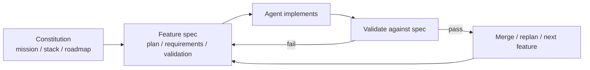

# Spec-Driven Development with Coding Agents（DeepLearning.AI 短课）

[DeepLearning.AI](https://www.deeplearning.ai/courses/spec-driven-development-with-coding-agents/) 与 **JetBrains** 合作的短课（Paul Everitt 讲授）：把 **规格驱动开发（SDD）** 作为 vibe coding 的纪律替代——先写 Markdown **constitution** 与 **feature spec**，再让 coding agent 在 **plan → implement → verify** 环里执行，人类保留意图与验收权。

## 一句话定义

**用持久化的 Markdown 规格当 agent 的单一真相源，把「想做什么」与「怎么验」写死在 repo 里，而不是每次 session 重新口头解释。**

## 英文缩写速查

| 缩写 | 英文全称 | 简要说明 |
|------|----------|----------|
| SDD | Spec-Driven Development | 本课核心工作流 |
| HITL | Human-in-the-Loop | 人写 spec、定验收，agent 实现 |
| MVP | Minimum Viable Product | 课内两阶段 feature 后的可交付切片 |
| IDE | Integrated Development Environment | 课内示例 WebStorm；流程可移植 |
| SDLC | Software Development Lifecycle | constitution 中的 mission / stack / roadmap |

## 为什么重要

- **补本库「agent 流程」的软件课：** [Agentic Coding 软件工程基础](../concepts/agentic-coding-software-fundamentals.md) 讲 **取舍语言**；[mattpocock/skills](../entities/mattpocock-skills.md)、[Superpowers](../entities/superpowers-obra.md) 讲 **技能与 TDD 管线**；本课给出 **constitution + 三文件 feature spec** 的可跟做模板。
- **与机器人 harness 同构：** [ENPIRE](../methods/enpire.md) 与 [真机 autoresearch](../queries/real-robot-policy-autoresearch-harness.md) 都假设 **written task + automatic verify**；SDD 是通用软件侧的同类纪律。
- **跨 session 上下文：** spec 落盘减轻 **cognitive debt**，对齐 [LLM Wiki](../references/llm-wiki-karpathy.md)「编译进持久知识」而非 chat-only vibe。
- **Legacy 现实：** 不仅 greenfield；课内演示用现有文档 **反推 spec** 再改老代码——对本库大量 **脚本 + 维护工具** 仓库同样适用。

## 核心原理

### Constitution（项目宪法）

与 agent 协作固定三层文档（课内 `specs/`）：

| 文件 | 作用 |
|------|------|
| `mission.md` | 目标与用户价值 |
| `tech-stack.md` | 技术栈与非协商约束 |
| `roadmap.md` | 阶段划分与优先级 |

### Feature spec（单功能三件套）

| 文件 | 作用 |
|------|------|
| `plan.md` | 实现步骤与边界 |
| `requirements.md` | 可测试需求 |
| `validation.md` | 验收标准（agent 与人类共用） |

### 三阶段渐进（课内叙事）

1. **Human-to-Robot 类比：** 先广域 **constitution + 第一 feature**（plan/implement/validate）。
2. **Replan + 第二 feature：** 合并主线后重规划（测试、响应式、changelog skill 等）。
3. **MVP → Legacy → Skill：** 收敛 MVP；在 legacy 上重建 constitution；把流程封装为 **agent skill** 换 agent/IDE 仍可用。

### 流程总览

## 工程实践（伴学仓 AgentClinic）

| 项 | 内容 |
|----|------|
| **仓库** | [https-deeplearning-ai/sc-spec-driven-development-files](https://github.com/https-deeplearning-ai/sc-spec-driven-development-files) |
| **跟做** | 建议从 **Video 5** 起顺序构建；或复制对应 `VideoNN_*` 文件夹 |
| **栈** | Node 18+、TypeScript、**Hono**；`npm install` |
| **Agent** | 课内 **Claude Code**；README 声明 workflow **agent-agnostic** |
| **Skills** | `skills/` 含 **feature-spec**、**changelog** 等可移植 skill |
| **Prompts** | 根目录 `prompts/` 与各视频 `prompts.md` |
| **社区** | [Course materials 讨论帖](https://community.deeplearning.ai/t/course-materials/891543) |

## 局限与风险

- **平台绑定：** 视频在 DeepLearning.AI；离线学习依赖 GitHub 快照与自写 spec，无官方完整文字讲义导出。
- **示例域：** AgentClinic 为 Web 应用，不是机器人 sim/real 栈；迁移到 [wiki 维护](../../schema/ingest-workflow.md) 时需自己写 **validation**（如 `make ci-preflight`）。
- **不是架构课：** constitution 不替代 [Archify](../entities/archify.md) 的服务边界图；spec 要人仍会写 **取舍**（见 Ng 软件基础文）。
- **License：** GitHub API 未标注 SPDX；商用 fork 前读仓库 LICENSE 文件。

## 关联页面

- [Agentic Coding 软件工程基础](../concepts/agentic-coding-software-fundamentals.md)
- [mattpocock/skills](../entities/mattpocock-skills.md)
- [Superpowers（obra）](../entities/superpowers-obra.md)
- [Agent Skills（Addy Osmani）](../entities/agent-skills-addyosmani.md)
- [真机 autoresearch harness](../queries/real-robot-policy-autoresearch-harness.md)
- [ENPIRE](../methods/enpire.md)
- [LLM Wiki 模式](../references/llm-wiki-karpathy.md)

## 参考来源

- [deeplearning_ai_spec_driven_development_coding_agents.md](../../sources/courses/deeplearning_ai_spec_driven_development_coding_agents.md)
- [deeplearning-ai-spec-driven-development-course.md](../../sources/sites/deeplearning-ai-spec-driven-development-course.md)
- [sc-spec-driven-development-files.md](../../sources/repos/sc-spec-driven-development-files.md)

## 推荐继续阅读

- 课程页：<https://www.deeplearning.ai/courses/spec-driven-development-with-coding-agents/>
- 伴学仓库：<https://github.com/https-deeplearning-ai/sc-spec-driven-development-files>
- Andrew Ng，[Software engineering fundamentals（The Batch）](https://www.deeplearning.ai/the-batch/the-ai-engineering-skills-map-in-detail-software-engineering-fundamentals)
