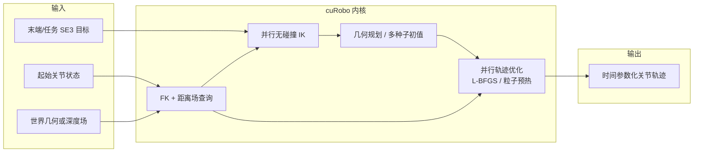

# cuRobo

**cuRobo**（仓库名 `curobo`）把机器人 **运动生成** 里算得最重的部分——**运动学、有符号距离与连续碰撞、数值优化、几何种子、轨迹优化**——搬到 **GPU** 上 **批量并行**，目标是在 **桌面 GPU** 或 **Jetson** 一类平台上用 **数十毫秒** 量级生成 **无碰撞、关节与动力学可行** 的轨迹。后续 **cuRoboV2**（[arXiv:2603.05493](https://arxiv.org/abs/2603.05493)）强调 **动力学约束（力矩界）**、**毫米级深度融合距离场** 与 **高自由度（双臂 / 人形）** 下的 **可扩展求解**，与初版技术报告（[arXiv:2310.17274](https://arxiv.org/abs/2310.17274)）形成「从快规划到可执行、可感知闭环」的递进。

## 一句话定义

把 **全局运动生成** 写成 **「并行无碰撞 IK / 几何规划 → 多种子并行轨迹优化（+ 可选 MPPI）」**，在 **CUDA** 上端到端批处理，使 **操作与高自由度整机** 在 **稠密几何或深度场** 下仍能在 **毫秒–百毫秒** 预算内迭代求解。

## 为什么重要

- **把「规划–优化」从 CPU 串行瓶颈中解耦出来**：多 seed、多 restart、多环境实例天然适合 GPU；对 **cell 制造、仓储拣选、双臂协同** 等需要反复重规划的场景，吞吐直接影响节拍与安全裕度。
- **与 NVIDIA 机器人栈对齐**：文档与示例围绕 **Isaac Sim**、**nvblox / 深度** 与 **ROS 2**；无碰撞规划能力亦通过 **Isaac ROS cuMotion** 进入 **MoveIt** 集成路径（以官方说明为准）。
- **V2 补齐「快但不物理」的常见短板**：在 **负载力矩**、**人形 IK**、**动捕重定向可行性** 等问题上给出与 **PyRoki、GMR** 等对照的实证叙事，便于和 **学习式操作 / 模仿学习** 的数据管线对齐讨论。

## 核心结构（初版 MotionGen 管线）

| 模块 | 作用 |
|------|------|
| **球包络 + 连续碰撞** | 以 **有符号距离** 与 **缓冲带内平滑代价** 做自碰/环境碰，支持 **cuboid / mesh / depth** 世界表示。 |
| **无碰撞 IK** | 为终端 **SE(3)** 目标提供 **可行终端姿态** 与多解探索。 |
| **几何规划** | 在 **IK 直线插值 / retract / 并行图规划** 等种子之间提供 **可行几何路径**，降低非凸 TO 的冷启动失败率。 |
| **并行轨迹优化** | **L-BFGS + 并行线搜索** 等，在 **多 seed** 上同时下降；代价侧强调 **jerk/加速度平滑** 与 **路径长度**。 |
| **MPPI / 重定时** | 文档栈亦包含 **反应式** 与 **速度剖面重定时** 等扩展能力（以版本发布说明为准）。 |

### 流程总览（概念级）

## cuRoboV2 相对初版的关键增量（论文级归纳）

| 维度 | 初版（2310.17274 / 官网栈） | V2（2603.05493） |
|------|---------------------------|------------------|
| **决策变量** | 离散关节 **waypoint** 轨迹为主 | **B 样条控制点**：更少变量、隐式高阶平滑，便于 **力矩硬约束** |
| **动力学** | 主要强调 **运动学 + 平滑** | **逆动力学力矩界**、能量型代价，面向 **重载可行性** |
| **感知–距离场** | nvblox 等深度避障集成 | **块稀疏 TSDF + 按需稠密 ESDF**，强调 **全工作空间距离查询** 与 **显存/延迟** |
| **DoF 扩展** | 叙事以 **典型操作臂** 数据集为主 | **双臂 / 48-DoF 人形** 的 IK、规划与 **动捕重定向** 叙事 |

## 常见误区或局限

- **误区：GPU 规划等于全局最优。** 实际仍是 **多局部解的并行搜索**；失败常来自 **目标不可达、目标在障碍内、碰撞体近似（如 cuboid 包圆柱）与标注几何不一致** 等 **问题本身病态**。
- **误区：开源 Python 栈与 MoveIt 插件无差别。** 官网明确区分 **研究代码库** 与 **Isaac ROS cuMotion** 商业集成；企业采购需单独许可路径。
- **局限：** 任何论文中的 **× 倍加速、成功率** 都与 **GPU 型号、场景分辨率、机器人模型与碰撞近似** 强相关；落地应以 **自家 URDF/网格与工站节拍** 复测为准。

## 关联页面

- [Trajectory Optimization（轨迹优化）](../methods/trajectory-optimization.md) — 与 **TO + 碰撞非凸** 的方法论语境对照
- [Crocoddyl](./crocoddyl.md) — **shooting / 多接触最优控制** 的另一条经典开源工具链
- [Manipulation（操作任务）](../tasks/manipulation.md) — 抓取–放置与 **笛卡尔目标** 的工程任务面
- [Motion Retargeting（运动重定向）](../concepts/motion-retargeting.md) — V2 将 **高 DoF 无碰撞 IK** 与 **重定向 / 策略训练** 质量关联的叙事入口
- [Isaac Gym / Isaac Lab](./isaac-gym-isaac-lab.md) — NVIDIA 仿真与 **Isaac Sim** 生态入口

## 参考来源

- [NVlabs cuRobo 源归档（本站）](../../sources/repos/nvlabs-curobo.md)
- Sundaralingam et al., *cuRobo: Parallelized Collision-Free Minimum-Jerk Robot Motion Generation*, [arXiv:2310.17274](https://arxiv.org/abs/2310.17274)
- Sundaralingam et al., *cuRoboV2: Dynamics-Aware Motion Generation with Depth-Fused Distance Fields for High-DoF Robots*, [arXiv:2603.05493](https://arxiv.org/abs/2603.05493)
- [cuRobo 官方文档站](https://curobo.org/)
- [NVlabs/curobo（GitHub）](https://github.com/NVlabs/curobo)

## 推荐继续阅读

- [Isaac ROS cuMotion（MoveIt 插件仓库）](https://github.com/NVIDIA-ISAAC-ROS/isaac_ros_cumotion) — 产品化集成与部署文档入口
- [nvblox（GPU TSDF/ESDF）](https://github.com/nvidia-isaac/nvblox) — 初版文档常引用的深度 **ESDF** 后端之一
