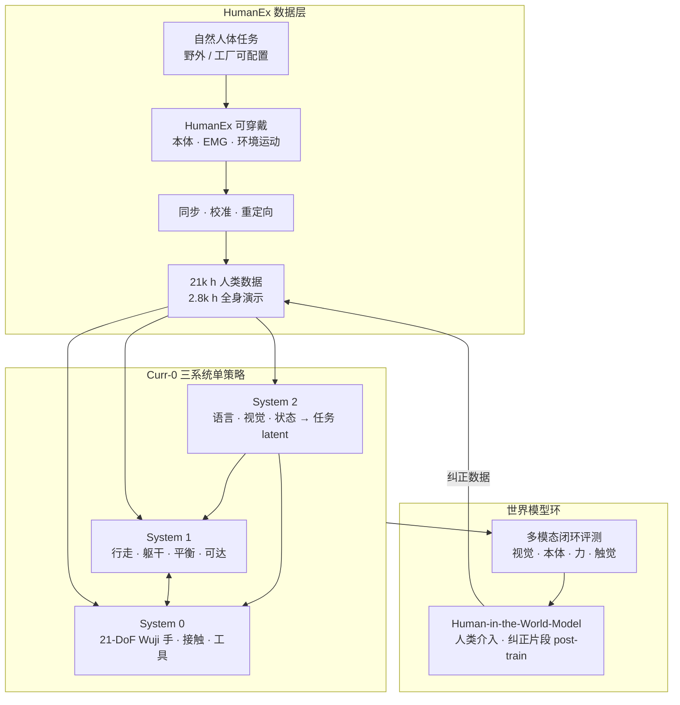

# Curr-0（Current Robotics · Loco-Dexterous Manipulation）

**Curr-0** 是 **Current Robotics**（2026-06 博客发布）对外阐述的 **第一代人形 loco-dexterous manipulation 基础系统**：把 **可穿戴人类数据采集（HumanEx）**、**三系统耦合策略（System 0/1/2）** 与 **交互多模态世界模型（评测 + Human-in-the-World-Model 后训练）** 收进同一条全栈叙事，强调 **移动、灵巧接触与工具使用必须在单闭环策略中联合学习**，而非行走控制器与手部策略的顺序拼接。

## 一句话定义

**用 HumanEx 把野外自然人体行为规模化为人形训练数据，再以 System 2→1→0 三系统单策略在 70+ DoF 人形上闭环执行 loco-dexterous 任务，并用多模态世界模型加速评测与部署后纠正。**

## 英文缩写速查

| 缩写 | 英文全称 | 简要说明 |
|------|----------|----------|
| DoF | Degrees of Freedom | 关节或驱动自由度；Curr-0 面向 70+ DoF 人形 |
| EMG | Electromyography | 肌电信号；HumanEx 绑带采集之一 |
| VLA | Vision-Language-Action | System 2 层的视觉–语言–推理接地语境 |
| WBC | Whole-Body Control | System 1 负责的行走、躯干、平衡与可达协调 |
| Loco-Dex | Loco-Dexterous Manipulation | 移动与灵巧操作动力学耦合的全身任务 |
| WM | World Model | 交互多模态环境，用于评测与 post-training |

## 为什么重要

- **明确反对「走–手两阶段」范式：** 与大量分层 VLA + 低层 WBC 路线对照，Curr-0 把 **站姿、躯干、足端、双手与工具** 视为 **同一耦合行为**；博客用踩踏板倒垃圾、肘推门、跪放等任务说明 **腿与手在任务语义上不可拆分**。
- **数据缩放律叙事：** **HumanEx** 将采集从 **robot-hour** 推向 **human-task-hour**，并强调 **incidental human behavior**（非脚本、难用语言标注的物理先验）——与纯 egocentric 视频或仅手套级手部数据形成对照。
- **与 2026 loco-manip 姊妹路线并列：** [MotionWAM](./paper-motionwam-humanoid-loco-manipulation-wam.md) 走 **egocentric 视频 WAM + SONIC token**；[LEGS](./paper-legs-embodied-gaussian-splatting-vla.md) 走 **3DGS 合成 + VLA 微调**；Curr-0 走 **真机规模人类可穿戴数据 + 三系统端到端策略 + 公司自研世界模型环**——代表产业侧 **全栈垂直整合** 样本。
- **世界模型定位偏评测与部署后训练：** 与 [Genesis World 1.0](./genesis-world-10.md) 类似，把仿真/世界模型从「纯数据增广」抬到 **闭环打分、人类介入纠正与可回滚分支** 的迭代基础设施。

## 流程总览

## 核心结构

### HumanEx（人→人形数据接口）

| 要求 | 含义 |
|------|------|
| **Embodied** | 感知–身体–手–物体–任务进度一体 |
| **Interactive** | 闭环响应环境，而非静态 pose 库 |
| **Retargetable** | 可映射到目标人形运动学与控制约束 |
| **Scalable** | 随人类日常活动扩展采集 |

模块化配置：从轻量 egocentric 视频到全身 embodied + EMG；博客用 **Action Fidelity / Action Diversity / Visual Diversity** 三轴对比可穿戴方案。

### 三系统架构（推理–全身–灵巧）

| 系统 | 功能 | 训练要点（博客） |
|------|------|------------------|
| **System 2** | 任务理解、物体接地、任务条件 **latent**、子任务推理与未来视觉–运动预测 | 预训练于 **手部中心** 数据；上身姿态 **辅助监督** 提升接触精度 |
| **System 1** | 行走、躯干、姿态、平衡、手臂可达 | 预训练于 **全身** 数据 |
| **System 0** | 抓、捏、再抓、工具作用等 **手–物接触** | 与 System 1 协调；**21-DoF [Wuji Hand](./wuji-robotics.md)** |

联合阶段：在完整人类数据混合上 **端到端微调**，部署为 **单策略共享权重**。

### 博客演示任务（定性）

| 任务 | 耦合要点 |
|------|----------|
| 泡茶 | 双手机动撕 deformable 茶包；放置时手指抑制吊牌摆动 |
| 文件盖章 | 双手协作开盖；指间分工形成 handle grasp |
| 点香 | 细棒对齐插入；打火机定向与维持火焰 |
| 踩踏板倒垃圾 | 行走 + 单手多物分持；一脚保持踏板 + 上身前倾释放 |
| 玩偶过门 | 双手占满时用 **肘推门** + **跪放** 篮中 |

### 世界模型：评测与 Human-in-the-World-Model

- **可扩展评测：** 并行闭环 rollout + 自动任务打分；博客称与真机成功率 **高度相关**，优于传统 sim-to-real 评测对齐。
- **多模态必要性：** 足端不稳、滑移、负载平衡等失败模式在 **纯 RGB** 下易漏检。
- **Human-in-the-World-Model：** 策略在世界模型中试错，人类在失败倾向处分支介入；纠正片段用于 **post-training**；真机保留 grounding 与终验。

## 常见误区或局限

- **不是 peer-reviewed 论文：** 除数据小时数外，定量基准与消融应以后续技术报告为准；当前主要为 **官方博客 + 演示视频**。
- **不等于「消灭真机」：** 世界模型环降低高频介入与重置成本，但 **grounding、校准与终验** 仍依赖硬件。
- **硬件栈未完全公开：** 除 **Wuji Hand 21-DoF** 外，具体人形平台型号与完整驱动接口博客未给出 datasheet 级说明。
- **与开源学术栈的接口未知：** 与 G1+SONIC、GR00T 等公开基线的 **同条件对比** 尚未见独立第三方报告。

## 关联页面

- [Loco-Manipulation](../tasks/loco-manipulation.md) — 任务定义与 2024–2026 技术路线谱系
- [舞肌科技 · Wuji Hand](./wuji-robotics.md) — Curr-0 System 0 采用的 21-DoF 灵巧手
- [MotionWAM](./paper-motionwam-humanoid-loco-manipulation-wam.md) — 实时 WAM + 统一全身 token 对照
- [LEGS](./paper-legs-embodied-gaussian-splatting-vla.md) — 合成数据 + VLA 微调对照
- [生成式世界模型](../methods/generative-world-models.md) — 多模态 WM 评测语境
- [World Action Models](../concepts/world-action-models.md) — 联合未来–动作建模分界
- [运动重定向管线](../concepts/motion-retargeting-pipeline.md) — HumanEx→人形数据链路上游概念
- [Genesis World 1.0](./genesis-world-10.md) — 同类「仿真/世界模型作评测引擎」产业叙事
- [机器人世界模型训练闭环分类](../overview/robot-world-models-training-loop-taxonomy.md) — WM 在训练环中的位置

## 推荐继续阅读

- Current Robotics 官方博客：<https://current-robotics.com/blog/curr-0>
- [Wuji Hand 文档中心](https://docs.wuji.tech/docs/zh/wuji-hand/latest/) — System 0 硬件规格与 SDK

## 参考来源

- [current_robotics_curr0_loco_dexterous_manipulation.md](../../sources/blogs/current_robotics_curr0_loco_dexterous_manipulation.md)
