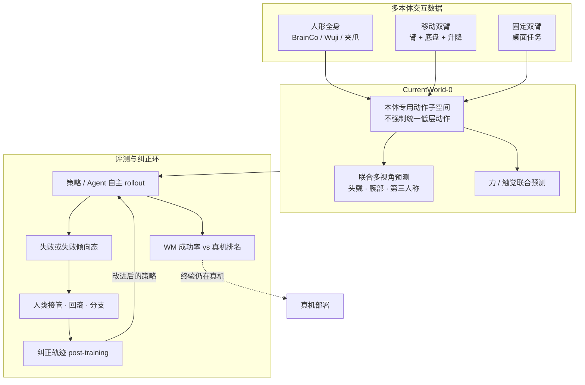

# CurrentWorld-0（Current Robotics · 交互世界模拟器）

**CurrentWorld-0** 是 **现行机器人（Current Robotics）** 在 2026-08 博客发布的 **生成式交互环境**：把世界模型从「预测下一帧」做成 **interactive world simulator**——策略、AI Agent 或人类操作员均可控，在异构本体、同步多视角与视觉–力–触觉通道上做动作条件 rollout。它补齐 [Curr-0](./current-robotics-curr0.md) 叙事里缺的 **评测、纠正与后训练环**，目标不是取代真机，而是让两次真机部署之间的迭代可规模化。

## 一句话定义

**不统一底层动作空间的跨本体世界模型：联合预测多视角与力/触觉，把失败态做成可回滚、可分支的 Human-in-the-World-Model 评测与后训练沙盒。**

## 英文缩写速查

| 缩写 | 英文全称 | 简要说明 |
|------|----------|----------|
| WM | World Model | 动作条件未来观测/力触觉预测器；本文定义为交互模拟器 |
| Hi-WM | Human-in-the-World-Model | 策略在 WM 中失败时由人类接管纠正，轨迹用于 post-training |
| VLA | Vision-Language-Action | 博客评测的 π0 / π0.5 等上层策略族 |
| DP | Diffusion Policy | 博客后训练对照中的扩散策略基线 |
| DoF | Degrees of Freedom | 跨本体自由度差异；不强迫对齐到同一低层动作 |
| RGB | Red-Green-Blue | 像素观测；接触起始与滑移常弱可观测 |

## 为什么重要

- **把「世界模型」钉在评测基础设施，而不是 Demo 视频。** 公司把物理 AGI 拆成 **数据 + 模型 + 评测** 三件可扩展组件；CurrentWorld-0 专攻第三件：真机评测受台数/工时/场地约束，物理仿真又难覆盖 deformable、流体、铰接与接触长尾。
- **跨本体不走 OSCAR 式统一骨架。** [OSCAR](./paper-oscar.md) 用 **2D 骨架** 把异构机器人压进同一条件空间；CurrentWorld-0 明确 **不统一低层动作**，每个本体保留 **embodiment-specific action subspace**，只在共享世界动力学上联合训练。
- **多视角 + 力触觉同时作为「仿真接口」。** [Ctrl-World](./paper-ctrl-world.md) 对齐现代 VLA 的第三人称/腕部相机；[ViTacWorld](./paper-vitacworld.md) / [TACO](./paper-taco-tactile-wm-vla-posttrain.md) 补接触通道。CurrentWorld-0 把三条能力写成同一产品定义，并挂到人形（BrainCo / [Wuji Hand](./wuji-robotics.md) / 夹爪）、移动双臂、桌面双臂三类本体。
- **Human-in-the-World-Model 与真机接管分流。** 真机近失败接管见 [ROVE](./paper-rove-humanoid-vla-intervention.md)；这里把失败态 **保存、回滚、分支** 放进世界模型，避免在硬件上反复复现同一失败。学术前身见同公司 [Hi-WM](./paper-sa-2604-21741-hi-wm-human-in-the-world-model-for-scalable-robo.md)（arXiv:2604.21741）。

## 流程总览

## 核心原理

### 三项定义能力

| 能力 | 机制要点 | 失败则意味着 |
|------|----------|--------------|
| **Cross-embodiment** | 联合训练多平台；各本体条件化自身动作子空间 | 模型只能服务单一形态，数据无法跨机复用 |
| **Multi-view** | 同步头戴 / 腕部 / 第三人称联合生成，要求物体、位姿、接触、任务进度一致 | 各相机独立续写 → 策略吃到互相矛盾的观测 |
| **Force-tactile** | 同一轨迹上预测 RGB **以及** 力 / 触觉演化 | 接触起始、作用力、初期滑移在纯像素里漏检 |

视觉逼真被明确降级为 **不够格当交互模拟器** 的条件：模型必须预测 **动作下环境如何演化**，并覆盖真实系统里异构的观测与控制接口。

### 训练涌现顺序（博客 checkpoint 叙事）

对比不同训练阶段的输出，而不是只读 loss：

1. **动作一致性最先** — 跨视角画面仍不稳，但运动方向、粗轨迹、时间进程已对齐。
2. **静态世界随后稳定** — 背景与应静止物体停止漂移，给运动提供空间参照。
3. **物理交互最后** — 接触如何带动物体、物体响应是否与动作耦合。

工程读法：早期 checkpoint 适合看「机器人有没有在动、多视角是否同意在动」；不要用早期样本判断接触物理是否可用。

### 两种产品用法

| 用法 | 流程 | 博客主张（自报） |
|------|------|------------------|
| **评测层** | 多策略 / checkpoint 在 WM 内闭环 rollout，对比成功率与失败模式 | 与真机成功率 **强相关**，相对排名保持；复现真机主要失败模式 |
| **后训练层** | 自主执行 → 人类在失败态接管 → 回滚/分支多条纠正 → post-train | π0 / π0.5 / DP 各设定成功率上升；难任务增益更大；若干原策略全失败设定出现成功 rollout |

与 [GigaWorld-1](./paper-gigaworld-1-policy-evaluation.md) / [SC3-Eval](./paper-sc3-eval.md) 同属「WM 当策略评估器」；CurrentWorld-0 额外把 **人类接管纠正** 做成同一环境里的数据工厂，而不是只做离线打分。

## 工程实践

| 检查项 | 截至 2026-08-17 的结论 |
|--------|------------------------|
| 项目页 | [current-robotics.com/blog/currentworld](https://current-robotics.com/blog/currentworld)；公司站 [current-robotics.com](https://current-robotics.com/) |
| 开源 | **确认未开源**（博客与首页无 GitHub / HF / 权重 / 数据集） |
| 源码运行时序图 | **不适用**（无可运行官方实现） |
| 可引用数字 | 仅有定性图（π0 / π0.5 / DP 后训练前后成功率）；**无** 公开 Pearson / 任务表 / 数据小时数 |
| 对接 Curr-0 | 策略侧见 [Curr-0](./current-robotics-curr0.md)；WM 侧本页。部署终验仍在真机 |
| 选型对照 | 要可复现多视角闭环 → [Ctrl-World](./paper-ctrl-world.md)；要评估协议与 WMES → [GigaWorld-1](./paper-gigaworld-1-policy-evaluation.md)；要接触通道开源路线 → 等 [ViTacWorld](./paper-vitacworld.md) 仓落地 |

## 局限与风险

- **不是 peer-reviewed 论文：** 真机相关性、后训练增益均为官方博客自报；独立复现前不要当硬基准。
- **确认未开源：** 无法核骨干、动作编码、多视角一致性损失或力触觉传感器型号。
- **不等于消灭真机：** 博客自己写明真机仍是物理经验来源与终验；WM 只承担两次部署之间的高频迭代。
- **跨本体数据配比未知：** 三类本体是否均衡、人形是否主导，会影响「共享世界动力学」主张的外推。
- **与学术栈接口未知：** 与 Ctrl-World、Cosmos、Wan 系的同条件对比未见第三方报告。

## 关联页面

- [Curr-0](./current-robotics-curr0.md) — 同一公司的 loco-dex 策略全栈；本页是其评测/后训练环境
- [生成式世界模型](../methods/generative-world-models.md) — 像素/多模态动作条件 WM 方法谱系
- [世界模型路线 03：虚拟沙盒](../overview/world-models-route-03-virtual-sandbox.md) — 把 WM 当可交互想象环境
- [机器人世界模型训练闭环 taxonomy](../overview/robot-world-models-training-loop-taxonomy.md) — 学习型模拟器主线
- [动作后果分类 04：训练与评估闭环](../overview/wm-action-consequence-category-04-eval-posttrain.md) — 策略评估与后训练 hub
- [Ctrl-World](./paper-ctrl-world.md) — 开源多视角 VLA 闭环 WM（ICLR 2026）
- [ViTacWorld](./paper-vitacworld.md) — 视触觉动作条件 WM
- [GigaWorld-1](./paper-gigaworld-1-policy-evaluation.md) — 策略评估器研究与 WMES
- [Hi-WM](./paper-sa-2604-21741-hi-wm-human-in-the-world-model-for-scalable-robo.md) — 同公司 Human-in-the-World-Model 论文（索引级）
- [OSCAR](./paper-oscar.md) — 用 2D 骨架统一跨本体条件的对照路线
- [WALL-SS](./paper-wall-ss.md) — next-scale AR 虚实成功率校准对照（训练代码待发布）
- [Loco-Manipulation](../tasks/loco-manipulation.md) — Curr-0 / CurrentWorld 所服务的任务
- [Teleoperation](../tasks/teleoperation.md) — 世界模型内接管 vs 真机干预
- [舞肌科技 · Wuji Hand](./wuji-robotics.md) — 人形末端样例之一
- [具身评测基准选型闭环](../queries/embodied-eval-benchmark-selection-loop.md) — ② 层「WM 当评估器」产业样本

## 参考来源

- [current_robotics_currentworld.md](../../sources/blogs/current_robotics_currentworld.md)
- [current-robotics-com.md](../../sources/sites/current-robotics-com.md)
- [current_robotics_curr0_loco_dexterous_manipulation.md](../../sources/blogs/current_robotics_curr0_loco_dexterous_manipulation.md)

## 推荐继续阅读

- CurrentWorld-0 官方博客：<https://current-robotics.com/blog/currentworld>
- Curr-0 官方博客：<https://current-robotics.com/blog/curr-0>
- Hi-WM 论文：<https://arxiv.org/abs/2604.21741>
- Ctrl-World 项目页（可复现多视角对照）：<https://ctrl-world.github.io/>
