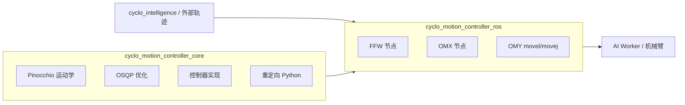

# cyclo_control

**cyclo_control**（[`ROBOTIS-GIT/cyclo_control`](https://github.com/ROBOTIS-GIT/cyclo_control)，Apache-2.0，~40★）是 [ROBOTIS](./robotis.md) **Cyclo Physical AI** 栈的 **真机运动控制层**：在 ROS 2 Jazzy 上提供 **Pinocchio 运动学**、**OSQP 二次规划** 与按机型划分的控制器节点，把 [cyclo_lab](./cyclo-lab.md) / [cyclo_intelligence](./cyclo-intelligence.md) 训练或编排出的指令落到 **AI Worker（FFW）**、**OMX/OMY** 等硬件。

## 一句话定义

Cyclo 的 **Control 模块真身**：不是训练框架，而是 **WBC/轨迹跟踪 + 重定向工具 + URDF 模型** 的 ROS 2 可部署包集合。

## 英文缩写速查

| 缩写 | 英文全称 | 简要说明 |
|------|----------|----------|
| WBC | Whole-Body Control | 全身/多任务运动控制；本仓 QP 层支撑 |
| QP | Quadratic Programming | 优化问题；经 osqp-eigen 求解 |
| FFW | Freedom From Work | AI Worker 产品族 ROS 包前缀 |
| OMY / OMX | OpenMANIPULATOR-Y / X | 桌面臂控制器 launch 目标 |
| ROS 2 | Robot Operating System 2 | 节点、话题、launch 运行时 |

## 为什么重要

- **补齐 Cyclo 闭环最后一环**：站内已有 Lab（仿真训练）与 Intelligence（BT+VLA）；缺 **官方开源控制栈** 时，读者易误以为策略容器即全栈。
- **与 mjlab/Isaac 双路径对齐**：[cyclo_mjlab](./robotis-cyclo-mjlab.md) 导出 ONNX 后，真机仍依赖 **bringup + 本仓类控制器** 而非 DDS Sim2Real 脚本 alone。
- **可复用优化组件**：核心衍生 **dyros_robot_controller**；重定向参考 **dex-retargeting**——便于与学术 WBC 栈对照。

## 核心信息

| 项 | 内容 |
|----|------|
| **机构** | 乐百机器人（ROBOTIS） |
| **许可** | Apache-2.0 |
| **ROS** | **Jazzy**（README 明确要求） |
| **Python** | `numpy<2` |
| **机型** | FFW SG2 follower、OMX、OMY F3M 等（见 `cyclo_motion_controller_models`） |

## 包结构与数据流

| 包 | 职责 |
|----|------|
| `cyclo_motion_controller_core` | 运动学、QP、控制器、重定向 |
| `cyclo_motion_controller_ros` | 按机型的 ROS 2 节点与 YAML 配置 |
| `cyclo_motion_controller_ros_py` | 重定向脚本入口 |
| `cyclo_motion_controller_models` | URDF/SRDF + RViz launch |
| `osqp_eigen_vendor` | vendored osqp-eigen |

## 源码运行时序图

**不适用（库/ROS 2 包集合）** — 运行时由 launch 选择的节点图决定；典型路径：`/movej` 或 `/movel` 话题 → 控制器节点 → 关节命令 → 硬件驱动（见各 `*_controller.launch.py`）。

## 工程实践

| 项 | 说明 |
|----|------|
| 构建 | ROS 2 workspace + `vcs import` + `rosdep`（见仓库 README） |
| OMY 示例 | `ros2 launch cyclo_motion_controller_ros omy_controller.launch.py start_interactive_marker:=true` |
| 模型检查 | `ros2 launch cyclo_motion_controller_models view_ffw_sg2_follower.launch.py` |
| 与 Cyclo 索引 | 模块表见 [cyclo 索引仓](../../sources/repos/cyclo.md) |

## 实验与评测

仓库为 **工程控制栈**，无统一论文 benchmark；验收以各机型 launch、interactive marker 与 README 示例 `ros2 topic pub` 为准。

## 结论

**cyclo_control 是 ROBOTIS Physical AI 的默认真机执行层**——仿真侧选 Isaac 或 mjlab，任务侧可选 BT+VLA，但关节级 QP/跟踪应落到本仓 ROS 包；部署前确认 **Jazzy + numpy<2** 与目标机型 URDF 包一致。

1. 与 **cyclo_intelligence** 的 `/leader/*/joint_trajectory`、`/cmd_vel` 话题衔接，而非替代策略容器。
2. **K1/mjlab** 路径 ONNX 部署后须按 `sim2real.yaml` 与本仓 bringup 对齐（见 [robotis-cyclo-mjlab](./robotis-cyclo-mjlab.md)）。
3. 重定向工具可单独用于 dex 类任务，但真机安全仍依赖现场标定与限速。
4. **已开源**；私有 Cyclo Supervisor/Hub 不在本仓。

## 局限与风险

- **ROS 2 发行版钉死 Jazzy** — 其他 distro 需自行移植。
- **非策略训练仓** — 不包含 RL/IL；勿与 cyclo_lab 混淆。
- 控制器成熟度以 README 与 issue 为准，无独立 sim2real 论文数字。

## 关联页面

- [ROBOTIS 组织 hub](./robotis.md)
- [cyclo_lab](./cyclo-lab.md) / [Cyclo Intelligence](./cyclo-intelligence.md)
- [robotis-cyclo-mjlab](./robotis-cyclo-mjlab.md)
- [Whole-Body Control](../concepts/whole-body-control.md)
- [Motion Retargeting](../concepts/motion-retargeting.md)

## 参考来源

- [cyclo_control 仓库摘录](../../sources/repos/cyclo_control.md)
- [cyclo 模块索引](../../sources/repos/cyclo.md)

## 推荐继续阅读

- [ROBOTIS-GIT/cyclo_control](https://github.com/ROBOTIS-GIT/cyclo_control) README
- [Physical AI 文档](https://ai.robotis.com/)
- dyros_robot_controller（SNU）— 核心控制器上游
