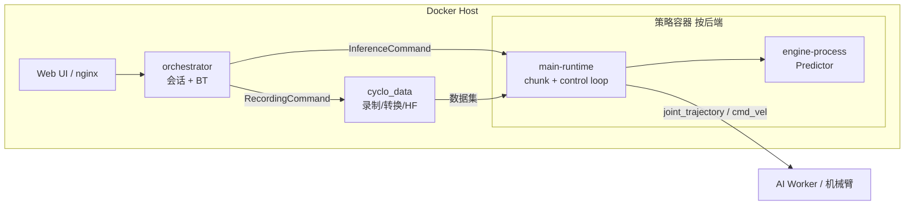

# Cyclo Intelligence

**Cyclo Intelligence** 是 [ROBOTIS](https://www.robotis.com/) 发布的 **开源 Physical AI 全栈平台**（[ROBOTIS-GIT/cyclo_intelligence](https://github.com/ROBOTIS-GIT/cyclo_intelligence)）：在单一仓库内贯通 **遥操作采集 → 数据转换 → 策略训练 → Docker 化推理 → 真机执行**，并内置 **行为树（BT）任务编排** 与 Web UI。面向 **AI Worker**（半人形）、**OMY/OMX** 机械臂等 ROBOTIS Physical AI 产品线；官方教程见 [ai.robotis.com](https://ai.robotis.com/)。

## 一句话定义

用 **Docker Compose + ROS 2/Zenoh** 拉起「数据平面 + 控制平面 + 按后端隔离的策略容器」，其中 **orchestrator 的行为树** 通过 `SendCommand` 节点调度 **LeRobot / Isaac-GR00T** 等 VLA 后端的 **LOAD/RESUME/STOP** 生命周期，与 **关节/底盘宏动作** 组合成长程任务。

## 英文缩写速查

| 缩写 | 英文全称 | 简要说明 |
|------|----------|----------|
| VLA | Vision-Language-Action | 视觉-语言-动作策略，Cyclo 通过 LeRobot/GR00T 后端接入 |
| BT | Behaviour Tree | 行为树，orchestrator 内任务编排与 BT Manager UI |
| IL | Imitation Learning | 模仿学习，与 cyclo_data 采集和 LeRobot 训练衔接 |
| GR00T | Generalist Robot 00 Technology | NVIDIA 人形/操作基础模型系列，Cyclo 以子模块集成 |
| ROS 2 | Robot Operating System 2 | 中间件；可选 `rmw_zenoh_cpp` 与共享内存传输 |

## 核心信息

| 字段 | 内容 |
|------|------|
| 机构 | 乐百机器人（ROBOTIS） |
| 许可 | Apache 2.0 |
| 硬件 | AI Worker（FFW 等）、OMY、OMX；仿真见 [robotis_mujoco_menagerie](https://github.com/ROBOTIS-GIT/robotis_mujoco_menagerie) |
| 预构建镜像 | `robotis/cyclo-intelligence`、`robotis/lerobot-zenoh`、`robotis/groot-zenoh` |

## 为什么重要

- **少见的开源「BT + VLA」真机栈**：将导航域成熟的 **行为树编排** 迁移到 **操作 / 半人形** 部署，与站内 [VLA 部署](../queries/vla-deployment-guide.md)、[VLA+低层控制](../queries/vla-with-low-level-controller.md) 形成 **任务层** 补全。
- **训练与推理后端可切换**：钉版本子模块集成 [LeRobot](./lerobot.md) 与 **Isaac-GR00T**，`model` 端口支持 `lerobot:act|smolvla|xvla|pi0|pi05|diffusion`、`groot:n17` 等，降低「换策略就要 fork 部署仓」的摩擦。
- **与 ROBOTIS 生态闭环**：配套 [ai_worker](https://github.com/ROBOTIS-GIT/ai_worker) ROS 2 包、Hugging Face [ROBOTIS 模型与数据集](https://huggingface.co/ROBOTIS)、教程视频与 MuJoCo 资产。

## 模块与数据流



| 目录 | 职责 |
|------|------|
| `cyclo_data/` | 数据平面：录制、转换、Hugging Face 上传、数据集编辑 |
| `orchestrator/` | 控制平面：会话状态、`/task/command`、**BT 执行**、设备健康 |
| `cyclo_brain/` | 训练脚本 + `policy/` 下 LeRobot/GR00T **独立容器** 运行时 |
| `shared/` | 机器人 YAML 配置（关节名、话题映射） |
| `docker/` | `container.sh` 一键 start/stop、s6 服务、ARM64/AMD64 |

## 行为树 × VLA（核心结合机制）

概念归纳见 [行为树 × VLA 编排](../concepts/behavior-tree-vla-orchestration.md)。工程要点：

1. **`SendCommand` BT 动作**（`orchestrator/orchestrator/bt/actions/send_command.py`）映射 `LOAD | RESUME | STOP | CLEAR` 到 orchestrator 推理状态机；`LOAD` 为 **先 START 再 STOP**，使策略 **驻留内存但处于 PAUSED**，便于先跑复位动作再 `RESUME`。
2. **相位同步**：每 stage 轮询 `/task/inference_status`，目标相位到达后才进入下一 BT 节点——避免 VLA 异步加载未完成时开始 chunk。
3. **示例树** `ffw_sg2_rev1_example.xml`：`LOAD groot:n17` + 语言指令 → `JointControl` 初始位 → `Rotate` → `Loop`（`RESUME` 3s → `STOP` → 臂复位）→ `CLEAR`。
4. **BT Manager**：React UI 可视化编辑树、**Refresh Nodes** 扫描 `bt/actions` 自定义节点；XML 经 cyclo_data HTTP 保存到 `bt/trees/`。

支持的 VLA 相关参数包括 `task_instruction`、`policy_path`、`inference_hz`（默认 15）、`control_hz`（默认 100）、`chunk_align_window_s`、`inference_mode`（`simulation` | `robot`）、`acceleration_mode`（PyTorch / TensorRT）。

## 推理运行时（双进程）

每个策略后端容器内：

- **main-runtime**：`SessionState`、`InferenceRequester`、`ActionChunkProcessor`、`ControlLoop`、`RobotClient` 发布 `/cmd_vel`、`/leader/*/joint_trajectory`。
- **engine-process**：`PolicyLoader`、预处理、`Predictor`、观测订阅；经 `EngineCommand.srv` 与 main 通信，`seq_id` 用于丢弃超时陈旧响应。

与 [Action Chunking](../methods/action-chunking.md) 及 [VLA 真机部署](../queries/vla-deployment-guide.md) 叙述一致：**低频推理 + 高频控制环** 在容器内闭合。

## 快速启动（摘要）

```bash
git clone --recurse-submodules https://github.com/ROBOTIS-GIT/cyclo_intelligence.git
cd cyclo_intelligence
docker/container.sh start          # 拉取并启动统一镜像
docker/container.sh start-lerobot  # 按需启动 LeRobot 策略容器
docker/container.sh start-groot    # 按需启动 GR00T 策略容器
# UI: http://localhost/  |  API: http://localhost/api/health
```

需 Docker 24+、NVIDIA Container Toolkit、约 35 GB 镜像空间；Jetson 与 AMD64 共用同一 `container.sh`（自动检测 `uname -m`）。

## 常见误区或局限

- **不是独立 VLA 论文实现**：训练能力主要来自 **LeRobot / GR00T 子模块**；Cyclo 的价值在 **数据—训练—BT 部署** 一体化与 ROBOTIS 硬件适配。
- **BT 不替代 VLA 语义**：复杂开放词汇长程推理仍需更强 planner；BT 更适合 **可重复产线流程 + 已训 checkpoint**。
- **仿真预览 vs 真机**：`inference_mode=simulation` 不发布机器人命令，调试 BT 流程时勿与真机模式混淆。

## 参考来源

- [sources/repos/cyclo_intelligence.md](../../sources/repos/cyclo_intelligence.md)
- [ROBOTIS-GIT/cyclo_intelligence](https://github.com/ROBOTIS-GIT/cyclo_intelligence)
- [ROBOTIS Physical AI 文档](https://ai.robotis.com/)
- [AI Worker ROS 2 包](https://github.com/ROBOTIS-GIT/ai_worker)

## 关联页面

- [行为树 × VLA 编排（概念）](../concepts/behavior-tree-vla-orchestration.md)
- [VLA（方法）](../methods/vla.md)
- [LeRobot（实体）](./lerobot.md)
- [ROBOTIS 机械臂产品线](./robotis-open-manipulator-line.md)
- [Teleoperation（任务）](../tasks/teleoperation.md) — cyclo_data 采集侧
- [VLA 真机部署指南（Query）](../queries/vla-deployment-guide.md)

## 推荐继续阅读

- [Cyclo Architecture（仓库内）](https://github.com/ROBOTIS-GIT/cyclo_intelligence/blob/main/docs/ARCHITECTURE.md)
- [orchestrator README（BT 子系统）](https://github.com/ROBOTIS-GIT/cyclo_intelligence/blob/main/orchestrator/README.md)
- [ROBOTIS Open Source YouTube](https://www.youtube.com/@ROBOTISOpenSourceTeam)
