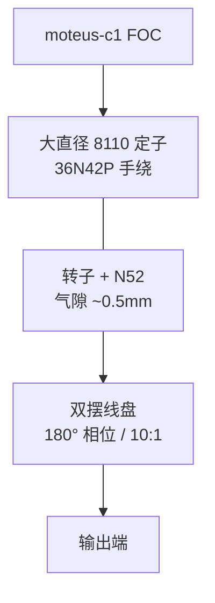

# Cycloidal Quasi-Direct Drive Actuator（Jeong 双摆线 QDD）

## 一句话定义

**Cycloidal Quasi-Direct Drive Actuator**（[JeongSeoJin/quasi-direct-drive-actuator](https://github.com/JeongSeoJin/quasi-direct-drive-actuator)）是面向动态腿足的开源 **QDD** 执行器：大直径 pancake 无刷电机 + **10:1** 内嵌双摆线盘（**180°** 相位差）+ [moteus-c1](./moteus.md) FOC，强调扭矩密度、紧凑性与可反驱透明性。

## 英文缩写速查

| 缩写 | 英文全称 | 简要说明 |
|------|----------|----------|
| QDD | Quasi-Direct Drive | 准直驱，低减速比、高背驱动性的作动方案 |
| FOC | Field-Oriented Control | 无刷电机的磁场定向控制 |
| BLDC | Brushless DC Motor | 无刷直流电机 |
| CAD | Computer-Aided Design | 计算机辅助设计；本项目主用 Onshape |
| HRI | Human–Robot Interaction | 人机交互；低阻抗关节利于接触安全 |

## 为什么重要

- 明确用 **双摆线盘 180° 相位** 对消偏心轴引起的径向力与振动——学摆线 QDD 机械平衡的好样本。
- 与 [Berkeley Humanoid Lite](./berkeley-humanoid-lite.md)（打印摆线 + 成品电机）和 [Internal Cycloidal](./internal-cycloidal-actuator.md)（自制外转子 + 内嵌摆线）形成三角对照。
- 从作者早期小航模电机方案演进到大直径定子，直接演示「气隙半径平方律」对 QDD 扭矩密度的工程含义。

## 核心信息

| 项 | 内容（README 摘录） |
|----|---------------------|
| 减速 | **10:1** 双盘摆线，两盘相差 **180°** |
| 电机 | 自制/改装 frameless；**8110** 大直径定子；**36N42P**；N52 磁钢；气隙约 **0.5 mm** |
| 结构 | Onshape CAD；原型齿轮/轴/转子为 **CNC 铝**（目标仍指向可打印低成本版） |
| 驱动 | **moteus-c1**（10–51 V，峰值相电流约 20 A） |
| 性能 | 最大力矩约 **8.8 N·m**；最大速度约 **22 rad/s**；标称约 **12.6 rad/s @ 24 V** |
| 开源 | **已开源**（CAD / 文档 / 资产）；GitHub API 未标 SPDX，使用前核验 |

## 核心原理

- **为何 QDD：** 高减速带来高机械阻抗与反射惯量，不利冲击与力透明；3:1–10:1 区间保留反驱与本体感知力矩（电流估计）。
- **为何大直径电机：** \(\tau \propto r_g^2\)，增大气隙半径比加长叠厚更划算；定子中空便于内嵌减速器。
- **为何摆线：** 相对谐波抗冲击更好；相对 3D 打印行星，载荷由多齿瓣分担，齿根应力更友好。

## 工程实践

| 学习点 | 做法 |
|--------|------|
| 双盘平衡 | 对照 Onshape：两盘 180°、偏心输入与输出机构 |
| 与 BHL | BHL ~15:1 打印摆线进整机；本项目单关节 10:1 + 自制电机 |
| 与 Internal Cycloidal | 同为 36N42P + 内嵌摆线叙事；本项目驱动用 moteus，彼用 ODrive S1 |
| 验证 | README 用 load-cell 做 1–10 N·m 力矩估计试验 |

## 局限与风险（作者自述 + 策展）

- **无转子背铁 / 非 Halbach：** 漏磁，峰值力矩偏弱，尚不足高动态整机。
- **手绕铜填充率低：** 限流与扭矩密度。
- 原型铝件验证设计；完全打印版与下一轮磁路改进仍在规划。
- 个人原型，缺工业级寿命/热循环公开数据。

## 关联页面

- [开源 QDD 执行器项目对比](../comparisons/open-source-qdd-actuator-projects.md)
- [Berkeley Humanoid Lite](./berkeley-humanoid-lite.md)
- [Internal Cycloidal Actuator](./internal-cycloidal-actuator.md)
- [Ironless QDD Actuator](./ironless-qdd-actuator.md)
- [moteus](./moteus.md)
- [执行器驱动链选型闭环](../queries/actuator-drive-chain-selection-loop.md)

## 参考来源

- [sources/repos/quasi_direct_drive_actuator.md](../../sources/repos/quasi_direct_drive_actuator.md)
- [开源 QDD 执行器学习策展](../../sources/personal/open_source_qdd_actuator_learning_curator.md)
- 上游 README：<https://github.com/JeongSeoJin/quasi-direct-drive-actuator>

## 推荐继续阅读

- 仓库 CAD / `cad-designs.md` / `off-the-shelf-list.md`
- Sensinger 摆线优化文献（README References [6][8]）
