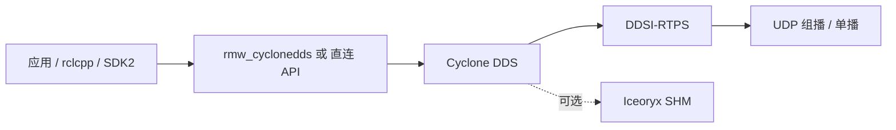

# Cyclone DDS（Eclipse）

## 一句话定义

**Cyclone DDS** 是 Eclipse IoT 下的开源 **OMG DDS** 实现（C 核心 + 独立 C++/Python 绑定）：强调低延迟与可互操作 RTPS，是 ROS 2 **tier-1** 中间件，也被 Unitree 等厂商用作真机 DDS。

## 英文缩写速查

| 缩写 | 英文全称 | 简要说明 |
|------|----------|----------|
| DDS | Data Distribution Service | OMG 数据分发服务标准 |
| RTPS | Real-Time Publish-Subscribe | DDSI-RTPS 线协议 |
| RMW | ROS Middleware | 经 `rmw_cyclonedds_cpp` 对接 |
| EPL | Eclipse Public License | 双许可之一（另有 EDL-1.0） |
| IDL | Interface Definition Language | 类型定义；Python 可动态类型 |

## 为什么重要

- [unitree_ros2](./unitree-ros2.md) / SDK2：**与真机同语义的 CycloneDDS 主题**；RMW 必须切到 `rmw_cyclonedds_cpp` 才能「ROS msg 直连」。
- 相对 [Fast DDS](./fast-dds.md)：常被视为更「瘦」、发现开销可控；但 **版本钉定**（如 Unitree Foxy → 0.10.x）比抽象选型更关键。
- 官网/文档按 **0.10 / 11.0 / master** 分线——混用发行线是真机联调头号坑。

## 核心原理

| 项 | 内容 |
|----|------|
| 规范覆盖 | DCPS、DDS Security、C++ API、XTypes（部分 caveats）、DDSI-RTPS |
| 核心仓 | `eclipse-cyclonedds/cyclonedds`（C API） |
| 绑定 | `cyclonedds-cxx`、`cyclonedds-python` |
| 可选零拷贝 | Eclipse Iceoryx 2.0 |
| ROS 2 | `ros2/rmw_cyclonedds` |

## 工程实践

1. ROS 2：安装 `ros-$DISTRO-rmw-cyclonedds-cpp`，`export RMW_IMPLEMENTATION=rmw_cyclonedds_cpp`。
2. Unitree：**Humble 优先**；Foxy 按上游要求先编匹配的 Cyclone **0.10.x** 再编功能包。
3. 同网段仿真（如 [unitree_mujoco](./unitree-mujoco.md)）与真机：隔离 **Domain ID** / 网口，避免串域。
4. 独立使用：CMake ≥ 3.16 构建；Python 绑定可 dataclass+IDL 注解快速验证 pub/sub。
5. 安全部署：按文档启用 DDS-Security 插件（证书与 permissions）。

**上游元数据（2026-07）：** [eclipse-cyclonedds/cyclonedds](https://github.com/eclipse-cyclonedds/cyclonedds) ~1.3k★，EPL-2.0/EDL-1.0，最新发行 **11.0.1**；文档入口 [cyclonedds.io/docs](https://cyclonedds.io/docs/)。

## 局限与风险

- 发行线混用（0.10 ↔ 11.x）导致与厂商二进制不互通。
- XTypes / Content profile 覆盖非 100%——复杂类型演化先查官方 caveats。
- 仍不适合替代共享内存 / LCM 做 **1 kHz 硬实时力矩环**（见 [运控中间件指南](../queries/real-time-control-middleware-guide.md)）。
- 开源状态：**已开源**。

## 关联页面

- [DDS 通信机制](../concepts/dds-communication.md)
- [Fast DDS](./fast-dds.md)
- [unitree_ros2](./unitree-ros2.md)
- [unitree_sdk2](./unitree-sdk2.md)
- [ROS 2 基础](../concepts/ros2-basics.md)
- [ROS 2 vs LCM](../comparisons/ros2-vs-lcm.md)

## 参考来源

- [sources/repos/cyclonedds.md](../../sources/repos/cyclonedds.md)
- [sources/sites/cyclonedds-io.md](../../sources/sites/cyclonedds-io.md)
- [sources/sites/omg-dds-spec.md](../../sources/sites/omg-dds-spec.md)
- [sources/repos/unitree_ros2.md](../../sources/repos/unitree_ros2.md)
- [sources/repos/ros2.md](../../sources/repos/ros2.md)

## 推荐继续阅读

- 官网：<https://cyclonedds.io/>
- 仓：<https://github.com/eclipse-cyclonedds/cyclonedds>
- OMG DDSI-RTPS 2.5：<https://www.omg.org/spec/DDSI-RTPS/2.5>
