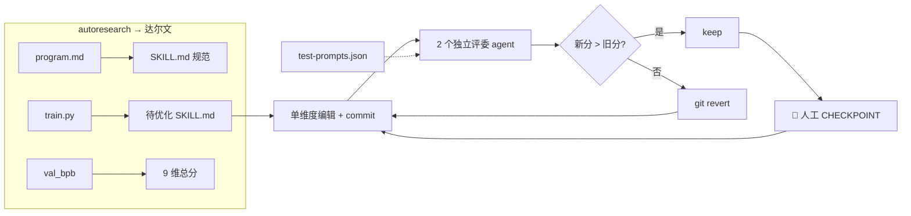

# Darwin Skill（达尔文.skill）

**Darwin Skill** 是 [alchaincyf/darwin-skill](https://github.com/alchaincyf/darwin-skill) 仓库分发的 **元 skill**：把 [karpathy/autoresearch](karpathy-autoresearch.md) 的 **只保留可测量改进** 实验环，映射到 **Agent Skill 优化** — 每次只改一个 `SKILL.md`，用独立评委打分，改进则 keep，退步则 revert，关键阶段 **暂停等人确认**。

## 一句话定义

用 **9 维加权评分 + 独立子 agent 评委 + git 棘轮 + test-prompts 实测**，像优化训练脚本一样 **迭代 SKILL.md**，且分数只升不降（局部退步自动回滚）。

## 英文缩写速查

| 缩写 | 英文全称 | 简要说明 |
|------|----------|----------|
| LLM | Large Language Model | 改 skill 与评委打分的主体；自改自评被明文禁止 |
| HITL | Human in the Loop | 人在回路；Phase 1/2/3 强制 checkpoint |
| SkillOpt | SkillOpt Framework | 微软研究院 validation-gated skill 编辑框架；达尔文 v2.0 对齐 |
| SkillLens | SkillLens Study | 微软实证 rubric 论文；提供 9 维中 3 维与自评偏差数据 |

## 为什么重要（对本知识库读者）

- **autoresearch → skill 域的清晰映射：** [autoresearch](karpathy-autoresearch.md) 优化 `train.py` + `val_bpb`；达尔文优化 `SKILL.md` + 9 维百分制 — 对理解 **如何把实验纪律迁移到 `schema/`、`AGENTS.md` 迭代** 有直接参照（仍须本站 `make ci-preflight` 作最终门禁）。
- **闭合女娲 / 仓颉生态：** [Nuwa](nuwa-skill.md) 与 [Cangjie](cangjie-skill.md) **制造** skill；**达尔文** **维护与进化** skill — 与本库「ingest 新页 + lint 健康体检」形成 **创建 / 优化** 对照。
- **学术与工业互证：** v2.0 吸收 SkillLens（73.8% rubric 药方、LLM 自评准确率 46.4%）与 SkillOpt（validation-gated edits）；SkillOpt 官方仓库将 darwin-skill 列入集成名单。

## 核心结构

| 层次 | 内容 |
|------|------|
| **安装** | `npx skills add alchaincyf/darwin-skill` |
| **编辑面** | 每次只改 **一个** 待优化 `SKILL.md` |
| **评分** | 9 维加权满分 100（结构静态分析 + 效果实测）；v2.0 新增失败模式编码、可执行具体性、高风险行动黑名单 |
| **评委** | 每轮 2 个独立子 agent；下一轮换新评委防锚定 |
| **棘轮** | 新分 > 旧分 → keep commit；否则 `git revert`（禁用 `reset --hard`） |
| **早停** | 单轮涨幅 < 1 分自动停；干跑比例 > 30% 告警 |
| **测试集** | `test-prompts.json` 验证改进是否泛化 |
| **HITL** | Phase 1 审基线 → Phase 2 🔴 CHECKPOINT → Phase 3 🛑 回归停手 |

### autoresearch 映射与优化环

## 与相关范式的对照

| 维度 | autoresearch | Darwin Skill | LLM Wiki lint |
|------|--------------|--------------|---------------|
| 优化对象 | `train.py` | `SKILL.md` | `wiki/` + 派生一致性 |
| 指标 | val_bpb | 9 维百分制 + 实测 | lint / export / pytest |
| 回滚 | discard 变更 | git revert 棘轮 | git 回退或手工修 |
| 人的角色 | 迭代 `program.md` | Phase checkpoint 确认 | curator 审 ingest |
| 自主度 | 高（夜间循环） | 中（阶段间暂停） | 低（提交前 preflight） |

## 常见误区或局限

- **误区：达尔文可全自动替代人工审 skill。** v2.0 刻意 **HITL** — Skill 好坏比 validation loss 更微妙；SkillOpt 全自动 vs 达尔文 checkpoint 是设计分野。
- **误区：9 维高分 = 任务一定更好。** 分数约束 **结构与 rubric**；领域任务（机器人 sim、真机安全）仍需 **本仓库 CI 与领域测试**。
- **误区：与 autoresearch 完全等价。** 映射是 **方法论类比**；达尔文不改 GPU 训练代码，autoresearch 不维护 `SKILL.md` rubric。
- **局限：** 多样 skill 批量优化耗时长；评委 agent 成本；rubric 偏通用 agent skill，垂直域（CAD、仿真）需自建 test-prompts。

## 关联页面

- [autoresearch（karpathy）](karpathy-autoresearch.md) — 原始灵感与 keep/discard 环
- [Nuwa Skill](nuwa-skill.md) — 造 perspective skill；内置达尔文式双 agent 精炼
- [Cangjie Skill](cangjie-skill.md) — 蒸馏方法论 skill + 压力测试
- [AI Auto-Research](../concepts/ai-auto-research.md) — 自主实验生命周期框架
- [Superpowers（obra）](superpowers-obra.md) — 流程型 skill 库（可被达尔文优化）
- [LLM Wiki（Karpathy 模式）](../references/llm-wiki-karpathy.md) — 知识编译 vs skill 编译
- [Ingest Workflow](../../schema/ingest-workflow.md) — 本仓库 lint / preflight 规范

## 参考来源

- [Darwin Skill 仓库源归档（本站）](../../sources/repos/darwin-skill.md)
- [alchaincyf/darwin-skill（GitHub）](https://github.com/alchaincyf/darwin-skill)
- [karpathy/autoresearch](https://github.com/karpathy/autoresearch)
- [SkillLens（arXiv:2605.23899）](https://arxiv.org/abs/2605.23899)
- [SkillOpt（arXiv:2605.23904）](https://arxiv.org/abs/2605.23904)

## 推荐继续阅读

- [microsoft/SkillOpt](https://github.com/microsoft/SkillOpt) — validation-gated 形式化框架与集成名单
- [nuwa-skill](https://github.com/alchaincyf/nuwa-skill) — 女娲造 skill 上游
- [ENPIRE](../methods/enpire.md) — 机器人域 **物理 autoresearch** 对照（策略而非 SKILL.md）
