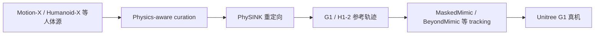

# PHUMA（Physically Reliable Humanoid Locomotion Dataset）

**PHUMA**（Lee et al., arXiv:[2510.26236](https://arxiv.org/abs/2510.26236)，2025）是 DAVIAN Robotics / KAIST AI 发布的 **物理可信人形 locomotion 数据集**：经 **physics-aware curation** 与 **PhySINK 物理约束重定向**，将 Motion-X / Humanoid-X 等大规模人体动作清洗并映射到 **Unitree G1** 与 **Unitree H1-2**，公开约 **76k clips · 73 h** 的 **机器人关节轨迹**，可直接用于 motion tracking 训练。

## 英文缩写速查

| 缩写 | 英文全称 | 简要说明 |
|------|----------|----------|
| PHUMA | Physically Reliable HUMAnoid locomotion dataset | 物理可信人形运动数据集 |
| PhySINK | Physics-constrained SINK retargeting | 物理约束重定向方法（相对 GMR/Mink 更稳足端接触） |
| BFM | Behavior Foundation Model | 大规模行为数据预训练的可复用全身行为先验 |
| G1 | Unitree G1 Humanoid | 宇树教育科研人形实验平台 |
| SMPL-X | SMPL eXpressive | 带手与面部的扩展 SMPL 人体模型 |
| WBT | Whole-Body Tracking | 全身关节/根轨迹跟踪类 RL 任务 |
| HF | Hugging Face | 托管数据集与模型的开源平台 |

## 为什么重要

- **「已重定向好」的宇树数据**：与 [AMASS](./amass.md)（仅 SMPL 人体）不同，PHUMA 提供 **`download_phuma.sh` 即可获取的 G1/H1-2 `dof_pos` 参考**，显著降低从零跑 GMR 的工程成本。
- **物理可信策展**：过滤 floating、穿透、脚滑等大规模视频/MoCap 常见伪影；默认阈值保留跳跃等腾空相位，可按 `--foot_contact_threshold` 收紧（仅行走场景）。
- **评测与生态**：论文报告 G1 **零样本 sim2real** tracking 优于 AMASS；[ProtoMotions](./protomotions.md) 已原生支持；[LIMMT](../methods/limmt-gqs-motion-curation.md)、Humanoid-GPT 等将其与 AMASS 并列实验。

## 核心信息

| 字段 | 内容 |
|------|------|
| 规模 | **76k** clips · **73 h**（awesome-bfm 与论文一致） |
| 机器人 | **Unitree G1**、**H1-2**（预构建轨迹） |
| 管线 | Curation（SMPL-X→69D）→ PhySINK shape/motion adaptation |
| 代码 | <https://github.com/davian-robotics/PHUMA> |
| 数据 | <https://huggingface.co/datasets/DAVIAN-Robotics/PHUMA> |
| Split | `phuma_train.txt` / `phuma_test.txt` / `unseen_video.txt` |

## 流程总览

## 常见误区或局限

- **不是原始人体 MoCap 发布包**：Train/Test split 的 **人体姿态因许可无法全量公开**（FAQ）；消费侧应使用 **已重定向机器人轨迹** 或自建 curation 管线。
- **locomotion 为主**：与 [OMOMO](./omomo-dataset.md) 的 HOI 操纵、与 [Humanoid Everyday](./humanoid-everyday-dataset.md) 的真机操作 **任务域不同**。
- **轻微伪影权衡**：默认 curation 为保留跳跃等动作，可能残留少量穿透/漂浮；严格行走可调高 `foot_contact_threshold`。

## 与其他页面的关系

- **人体源对照**：[AMASS](./amass.md)、[dataset-bfm-humanoid-x](./dataset-bfm-humanoid-x.md)
- **重定向对照**：[GMR](../methods/motion-retargeting-gmr.md)（论文定性对比 PhySINK vs GMR 高矮被试伪影）
- **BFM 索引**：[bfm-41-papers-technology-map](../overview/bfm-41-papers-technology-map.md)
- **五集选型**：[humanoid-reference-motion-datasets](../comparisons/humanoid-reference-motion-datasets.md)

## 参考来源

- [PHUMA 仓库归档](../../sources/repos/phuma.md)
- [bfm_awesome_dataset_phuma](../../sources/papers/bfm_awesome_dataset_phuma_arxiv_2510_26236.md)
- Lee et al., *PHUMA: Physically Reliable Humanoid Locomotion Dataset*, arXiv:2510.26236
- GitHub：<https://github.com/davian-robotics/PHUMA>

## 关联页面

- [Unitree G1](./unitree-g1.md)
- [ProtoMotions](./protomotions.md)
- [AMASS](./amass.md)
- [Motion Retargeting](../concepts/motion-retargeting.md)
- [LIMMT（GQS 策展）](../methods/limmt-gqs-motion-curation.md)

## 推荐继续阅读

- [PHUMA 项目页](https://davian-robotics.github.io/PHUMA/) — PhySINK vs GMR 视频对比与 sim2real 表
- [ProtoMotions PHUMA 准备指南](https://github.com/NVlabs/ProtoMotions/blob/main/docs/source/getting_started/phuma_preparation.rst)
