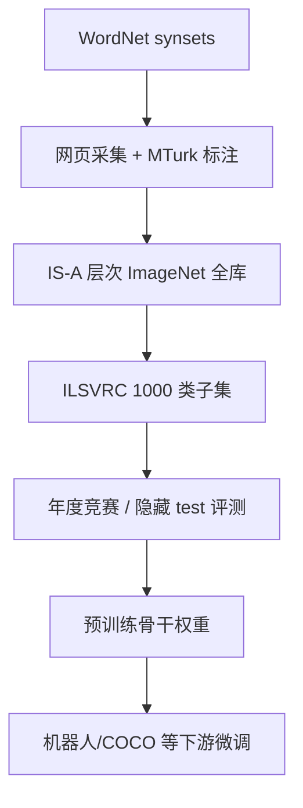

# ImageNet / ImageNet-21K

## 一句话定义

**ImageNet** 是以 **WordNet synset** 为骨架、人工质控的 **层次化大规模图像库**；**ILSVRC** 取其子集形成 **1000 类、百万级** 分类/检测/定位竞赛 benchmark，成为 ResNet/ViT 等 **视觉骨干预训练** 的事实标准数据源。

## 英文缩写速查

| 缩写 | 英文全称 | 简要说明 |
|------|----------|----------|
| ILSVRC | ImageNet Large Scale Visual Recognition Challenge | 2010 起年度视觉竞赛与 1K 类 benchmark |
| synset | Synonym Set (WordNet) | WordNet 同义词集，ImageNet 的基本类别单元 |
| IS-A | Is-A (WordNet relation) | 概念层次关系，组织 ImageNet 语义树 |
| CV | Computer Vision | 计算机视觉任务语境 |
| WordNet | WordNet Lexical Database | synset 与名词层次来源 |

## 数据集速查

| 维度 | 速查 |
|------|------|
| 全库（circa 2014） | 约 **21,841 synsets、14.2M** 人工验证全分辨率图（IJCV 2015 综述数字）。 |
| ILSVRC 训练子集 | **1000 类**；ILSVRC **2010** 约 **1.46M** 训练图（相对 PASCAL VOC 20 类 / 约 2 万图的数量级跃迁）。 |
| ImageNet-21K（工程语境） | 常指 **2 万+ synset** 预训练词表（torchvision/timm 等实现版本不一，以权重卡为准）。 |
| 模态 | RGB 自然图 + **图像级 presence** 和/或 **物体级 bbox**（ILSVRC 检测/定位任务）。 |
| 许可证 | **ImageNet 不持有图像版权**；研究下载需 [image-net.org](https://www.image-net.org/) 注册与条款；商用/机器人产品需单独法务评估。 |
| 适配形态 | 通用 **分类预训练** → 检测/分割/机器人域微调；非具身轨迹数据。 |
| 重定向就绪度 | 不适用；仅作 **表征预训练** 或 **源域 benchmark**。 |

## 为什么重要

- **North Star 问题：** 官方动机之一是为视觉确立清晰的 **物体分类** 标杆，使算法可在 **统一 split + metric** 上对比（后扩展检测/定位）。
- **规模解锁深度模型：** 百万级标注使 **AlexNet（2012）→ VGG/GoogLeNet → ResNet** 等深度 CNN 训练成为常态，并固化 **ImageNet 预训练 → COCO 检测微调** 路径。
- **机器人侧读法：** 本库解决 **通用 RGB 表征**，与 **机器人相机域差、动态模糊、鱼眼** 并存；选型时区分 **ILSVRC top-1** 与 **真机任务成功率**（见 [具身评测闭环](../queries/embodied-eval-benchmark-selection-loop.md)）。

## 核心原理

**本体层（ImageNet）：** 每个 **synset** 对应 WordNet 中的一个名词概念；图像经 **MTurk 众包 + 质控** 挂到 synset，并用 **IS-A** 关系形成 **密集语义树**（CVPR 2009 报告早期 12 子树约 **5247 synsets / 320 万图**，全库后续扩展至千万级）。

**竞赛层（ILSVRC）：** 公开 **训练集** + **隐藏测试标注**；参赛者提交预测，由 **evaluation server** 返回指标。任务含 **1000 类分类**、**200 类检测** 等（年度细节以当年规则为准）。

## 工程实践

| 项 | 建议 |
|----|------|
| 下载 | 走 [image-net.org](https://www.image-net.org/) 官方流程；注意 **2019+ 人物子树过滤** 与 **2021 隐私更新** 对旧权重/全库复现的影响。 |
| 接口 | `torchvision.datasets.ImageNet`、`timm` 21k 权重、`tensorflow_datasets` 等；核对 **类 index ↔ synset id** 映射文件。 |
| 机器人迁移 | ImageNet/COCO 预训练 → **自有域** 精调；勿只报源域 top-1。 |
| 质控 | 校验损坏图、**WordNet 消歧**（同形异义 synset）与 dataloader 归一化常量是否与预训练权重一致。 |

## 局限与风险

- **域差：** 网络自然图 vs 机器人 **运动模糊、遮挡、非常规视角**；预训练增益需下游实测。
- **版权与隐私：** 图像版权归原站点/作者；**FAT* 2020** 等指出 **People subtree** 分布与伦理问题，默认全库预训练在产品中可能不合规。
- **版本漂移：** 「ImageNet-21K」在不同代码库 **类数、清洗策略** 不一致；论文数字应对齐 **ILSVRC 年份** 或 **权重 README**。
- **非具身数据：** 不提供动作/力矩/多模态对齐；不能替代 **Open-X、DROID** 等机器人数据飞轮。

## 关联页面

- [AlexNet](../entities/alexnet.md) — 2012 ILSVRC 分类突破
- [ResNet 论文页](../entities/paper-resnet-deep-residual-learning.md) — ILSVRC 2015 分类冠军骨干
- [Vision Backbones](../concepts/vision-backbones.md) — 预训练 → 微调管线
- [Object Detection](../methods/object-detection.md) — ILSVRC 检测任务与 COCO 迁移
- [Transformer CV 课程策展](../entities/transformer-cv-curriculum.md)
- [具身大模型评测基准选型闭环](../queries/embodied-eval-benchmark-selection-loop.md)

## 参考来源

- [ImageNet: A Large-Scale Hierarchical Image Database（CVPR 2009）](../../sources/papers/imagenet_hierarchical_database_cvpr_2009.md)
- [ImageNet Large Scale Visual Recognition Challenge（IJCV 2015 / arXiv:1409.0575）](../../sources/papers/imagenet_ilsvrc_arxiv_1409_0575.md)
- [ImageNet 官方站点归档](../../sources/sites/image-net-org.md)

## 推荐继续阅读

- [ImageNet About / 出版物 PDF](https://www.image-net.org/about.php)
- [ILSVRC 竞赛页](http://image-net.org/challenges/LSVRC/)
- [arXiv:1409.0575（ILSVRC 综述）](https://arxiv.org/abs/1409.0575)
