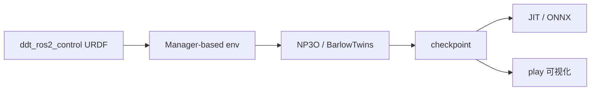

# DDT_Lab

**DDT_Lab**（仓内包名 `ddt_lab`）是 [直驱科技（Direct Drive Tech）](https://github.com/DDTRobot) 在 [Isaac Lab](https://github.com/isaac-sim/IsaacLab) 上的轮足 locomotion 训练扩展（GitHub：[`DDTRobot/DDT_Lab`](https://github.com/DDTRobot/DDT_Lab)）。

## 一句话定义

用 **NP3O**（BarlowTwins 增强的约束 PPO）在 Isaac Lab 上训练 **D1 四轮足** 与 **Tita 轮腿双足** 的速度跟踪策略，并可导出 JIT / ONNX 供下游部署。

## 英文缩写速查

| 缩写 | 英文全称 | 简要说明 |
|------|----------|----------|
| NP3O | Constrained PPO + BarlowTwins（仓内算法名） | 带 SSL 历史编码与 Lagrangian 代价约束的 PPO 变体 |
| Isaac Lab | NVIDIA Isaac Lab | 机器人学习仿真/训练框架 |
| SSL | Self-Supervised Learning | BarlowTwins 历史编码器，隐式估计速度 |
| ONNX | Open Neural Network Exchange | play 脚本可导出的部署格式之一 |
| RL | Reinforcement Learning | 强化学习 |

## 为什么重要

- **官方轮足栈**：相对 [robot_lab](./robot-lab.md) 里「顺带注册 Tita」，本仓是 DDT 自有任务、算法与导出约定。
- **算法可读**：README 把 BarlowTwins 历史编码、约束代价、特权 Critic 写清楚，适合研究「无特权推理 + 训练期特权价值」类 locomotion。
- **形态覆盖**：同一仓内并列 **四轮足 D1** 与 **轮腿双足 Tita**，便于对照混合运动学差异。

## 核心原理

| 模块 | 作用 |
|------|------|
| 环境 | `DDT-Velocity-{Flat,Rough}-{D1,Tita}-v0`（另有 Play 变体） |
| NP3O Actor | BarlowTwins SSL 编码本体历史 → 隐式状态估计；推理无需特权观测 |
| CostManager | 关节/力矩等代价项经 Lagrangian 乘子约束 |
| Privileged Critic | 训练期可见接触、增益随机化等物理参数 |
| 导出 | `play.py --export_policy` → JIT + ONNX（当前观测 + 历史缓冲双输入） |

## 工程实践

1. 对齐依赖：**Isaac Sim 5.1 · Isaac Lab v2.3.0 · Python 3.11 · CUDA 12.x**。
2. 在 Isaac Lab 目录外 clone 本仓（默认分支 `main`；勿把 README 里带 `/tree/...` 的网页路径当作 clone URL）。
3. 在仓内 clone [`ddt_ros2_control`](https://github.com/DDTRobot/ddt_ros2_control)，保证 `ddt_ros2_control/urdfs/` 存在；或改 `DDT_MODEL_DIR`。
4. `python -m pip install -e source/ddt_lab` → `python scripts/list_envs.py`（期望 8 个 DDT 任务）。
5. 训练：`python scripts/np3o/train.py --task=DDT-Velocity-Rough-D1-v0 --num_envs 4096 --headless`；用 TensorBoard 看 `mean_reward`、`mean_imitation_loss`、`cost_*`。
6. 评估 / 导出：`python scripts/np3o/play.py --task=...-Play-v0 --export_policy --export_dir /tmp/out`。

## 局限与风险

- **开源状态：已开源**；许可证未在 GitHub SPDX 字段标明，使用前核对源码头文件。
- **资产分仓**：缺 `ddt_ros2_control` 会在启动时报 URDF `FileNotFoundError`。
- **星标与社区体量较小**（入库时约 10★），文档/issue 活跃度可能不及 Unitree / robot_lab；升级 Isaac Lab 时需自行回归。
- 与 [unitree_rl_lab](./unitree-rl-lab.md)、[deeprobotics-rl-training](./deeprobotics-rl-training.md) 的观测/动作约定不互通；ONNX 输入布局以本仓导出说明为准。

## 关联页面

- [轮足四足机器人](../concepts/wheel-legged-quadruped.md)
- [Hybrid Locomotion](../tasks/hybrid-locomotion.md)
- [robot_lab](./robot-lab.md) — 社区扩展中亦列出 DDTRobot Tita
- [unitree_rl_lab](./unitree-rl-lab.md)
- [Deep Robotics rl_training](./deeprobotics-rl-training.md)
- [cyclo_lab](./cyclo-lab.md) — ROBOTIS 厂商 Lab 对照
- [Isaac Lab](./isaac-lab.md)
- [Locomotion](../tasks/locomotion.md)

## 参考来源

- [sources/repos/ddt_lab.md](../../sources/repos/ddt_lab.md)
- 上游：<https://github.com/DDTRobot/DDT_Lab>
- URDF 配套：<https://github.com/DDTRobot/ddt_ros2_control>

## 推荐继续阅读

- Isaac Lab v2.3.0 文档：<https://isaac-sim.github.io/IsaacLab/v2.3.0/index.html>
- 社区多机型对照：[robot_lab](https://github.com/fan-ziqi/robot_lab)
