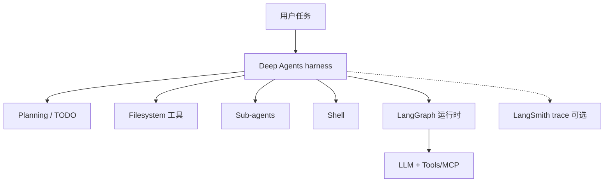
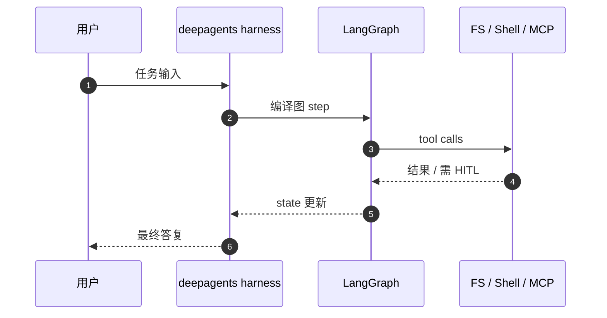

# Deep Agents

**Deep Agents** 是 LangChain 生态的 **开箱 agent harness**（*The batteries-included agent harness*）：在 **[LangGraph](./langgraph.md)** 之上提供 **规划、子 agent、可插拔文件系统、上下文 offload、shell、持久 memory、human-in-the-loop、Skills 与 MCP/自定义工具**。Python：[langchain-ai/deepagents](https://github.com/langchain-ai/deepagents)；JavaScript/TypeScript：[langchain-ai/deepagentsjs](https://github.com/langchain-ai/deepagentsjs)。

## 一句话定义

**不用从零拼 prompt/工具/上下文管理，直接拿一个可扩展的长时 agent 运行时，再按需 override 各模块。**

## 英文缩写速查

| 缩写 | 英文全称 | 简要说明 |
|------|----------|----------|
| DA | Deep Agents | 本页 harness 产品名 |
| MCP | Model Context Protocol | 可接入的外部工具协议 |
| HITL | Human-in-the-Loop | 工具调用前审批/编辑 |
| LG | LangGraph | 底层编排与 checkpoint |

## 为什么重要

- **LangChain 文档推荐的「快速 agent」路径：** 比手写 LangGraph 图更 **opinionated**，适合 **Deep Research、编码、多步运维** 类任务（README 与 [Manus/Claude Code 式长 horizon](https://github.com/langchain-ai/deep-agents-from-scratch) 叙事对照）。
- **与本库其他 agent OS 对照：** [Hermes Agent](./hermes-agent.md) / [OpenClaw](./openclaw.md) 是 **独立运行时**；Deep Agents 是 **LangChain 公司栈内** 的 harness，Skills/MCP 叙事与 [agentskills.io](https://agentskills.io/) 生态可对照阅读。
- **教学：** [deep-agents-from-scratch](https://github.com/langchain-ai/deep-agents-from-scratch) 用 LangGraph **从零实现** TODO、文件 offload、子 agent——适合理解 Deep Agents 默认行为从哪来。

## 核心结构

| 模块 | 说明 |
|------|------|
| Sub-agents | 隔离上下文委托 |
| Filesystem | local / sandbox / remote 可插拔 |
| Context management | 摘要 + 工具输出落盘 |
| Shell | 沙箱内命令 |
| Memory | 跨会话 store |
| HITL | 工具调用闸门 |
| Skills | 按需加载行为包 |
| Tools | 自定义函数 + MCP |

## 工程实践

| 场景 | 做法 |
|------|------|
| **Python** | 安装 `deepagents`（见 PyPI / 仓库 README） |
| **JS/TS** | `npm install deepagents`；注意 LangChain **peer dependencies**（Yarn 需显式安装） |
| **理解原理** | 克隆 `deep-agents-from-scratch`，Python 3.11+，`uv sync` |
| **机器人** | 适合 **高层任务 agent**；运动与安全仍下沉到 Gateway/ROS |

### 源码运行时序图（概念级）

## 局限与风险

- **Opinionated 默认值：** 与自研 agent 环（OpenClaw 等）哲学不同；深度定制可能不如直接写 LangGraph。
- **LangSmith 叙事：** 生产 tracing/eval 文档常指向商业 LangSmith。
- **长 horizon 成本：** 多步子 agent + 大上下文 **token 与延迟** 显著。

## 关联页面

- [LangGraph](./langgraph.md)
- [LangChain](./langchain.md)
- [LangSmith](./langsmith.md)
- [Hermes Agent](./hermes-agent.md)
- [OpenClaw](./openclaw.md)

## 参考来源

- [`sources/repos/deepagents.md`](../../sources/repos/deepagents.md)
- [`sources/repos/deepagentsjs.md`](../../sources/repos/deepagentsjs.md)
- [`sources/repos/deep-agents-from-scratch.md`](../../sources/repos/deep-agents-from-scratch.md)

## 推荐继续阅读

- [Deep Agents 文档](https://docs.langchain.com/oss/python/deepagents/overview)
- [产品页](https://www.langchain.com/deep-agents)
- [Python 仓库](https://github.com/langchain-ai/deepagents)
