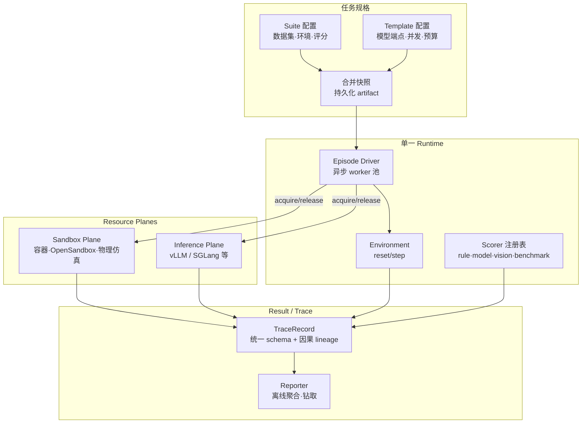

# DeepInsight（XPENG Robotics 全栈评测基础设施）

**DeepInsight**（2026-06，[arXiv:2606.17574](https://arxiv.org/abs/2606.17574)，XPENG Robotics）是面向 **embodied humanoid stack** 的 **统一评测基础设施（evaluation infrastructure）**：在 **单一 runtime** 上承载从 **单次 foundation-model decode** 到 **数千 physics tick 全身控制 rollout** 的异构算子谱，用共享 **trace identity** 把层间失败留在可查询的因果链上，而不是用分段 harness 拼接。

## 英文缩写速查

| 缩写 | 英文全称 | 简要说明 |
|------|----------|----------|
| Physical AI | Physical Artificial Intelligence | 需在物理世界中感知、推理与行动的 AI 系统谱系 |
| FM | Foundation Model | 基础模型，本文 System 2 评测对象 |
| WBC | Whole-Body Control | 全身控制，本文 System 0 层 |
| VLA | Vision-Language-Action | 视觉–语言–动作策略，System 1 典型形态之一 |
| LLM | Large Language Model | 大语言模型，System 2 推理后端 |
| GPU | Graphics Processing Unit | 推理与并行仿真的主要算力 |
| SR | Success Rate | 任务成功率，System 0 筛选指标之一 |
| MPJPE | Mean Per-Joint Position Error | 关节位置平均误差，System 0 跟踪质量指标 |

## 为什么重要？

- **谱段缝隙：** lm-evaluation-harness、Inspect AI、VLMEvalKit、Isaac Lab 等各自在 **短 episode 文本 QA** 或 **长 physics rollout** 一端高效，但 **没有单一 orchestrator** 覆盖 Foundation Model → sandbox agent → 并行物理仿真 的全跨度（论文 Table 1）。
- **层间失败不可分：** 语义规划、视运动策略与稳定器在部署中 **耦合**；分段评测保留各层局部 benchmark 有效性，却丢失 **共享 run identity 与 trace 连续性**，跨层回归无法定位。
- **产业落地样本：** 论文声称已在 XPENG 人形栈 **三层生产环境**运行，并给出 System 2 与 peer 框架的 **对齐 + 吞吐** 数字，以及 System 0 **发布决策** 与全系统 **failure attribution** 案例——代表「评测平台」正从单模态 leaderboard 走向 **全栈诊断链**。

## Physical AI 栈分层（论文口径）

论文采用工业人形常见的 **System 2 / 1 / 0** 三层（非普适 Physical AI 定义，而是 **该栈的评测切片**）：

| 层 | 角色 | 典型算子与 benchmark 谱段 |
|----|------|---------------------------|
| **System 2** | 语义目标推理、工具调用、对话 | 单步 decode（MMLU、HumanEval）→ 数十至数百 turn agentic（SWE-bench、GAIA、OSWorld） |
| **System 1** | 导航、操作、运动生成等子系统策略 | 数十至数百 control step 闭环（CALVIN、LIBERO、SimplerEnv、VLN-CE） |
| **System 0** | 全身稳定、 locomotion、接触与姿态 | 数百至数千 physics tick（HumanoidBench、Isaac Lab、RoboHive） |

## 核心架构：三抽象与三不变量

论文主张异构性由 **三个窄抽象** 吸收，每个抽象落实为一个 **全子系统共享的不变量**：

| 抽象 | 吸收什么 | 不变量 / 关键机制 |
|------|----------|-------------------|
| **Task** | episode 形状、模态、奖励语义、终止条件 | **一个 episode driver**；environment 无状态，`reset/step` 两方法；状态在 **per-episode handle**；scorer 与 task **正交** |
| **Resource** | LLM 推理、sandbox、物理仿真的成本与故障模式 | **一个 resource-handle 协议**（`acquire/release`）；inference plane + sandbox plane 对称控制面；**per-stage 独立并发池** |
| **Result** | 对话、判决、租约、轨迹等多源事件 | **一个 trace identity scheme**；统一 **TraceRecord**；聚合分数为 trace 上的 query，而非替代 trace |

### 流程总览

**配置接入：** suite（任务是什么）+ template（一次怎么跑）在启动时合并为 **单一快照** 落盘；多数 benchmark 以 **声明式 suite** 接入，仅 sandbox verifier、tool validator、simulator user model 等需定制 environment。

## System 2：有 peer 的可量化段

论文在 **8×A100 单节点**、共享 vLLM 与 judge 配置下，与成熟开源 orchestrator 对比（**对齐优先，再比墙钟**）：

| 对比维度 | 主要结论（论文自述，需独立复现） |
|----------|----------------------------------|
| **分数对齐** | 在 Qwen3.6-27B text、Qwen3-32B text、15 项 multimodal VQA、5 项 omni-modal 表上，DeepInsight **closest-to-Ref 行数最多** |
| **单节点墙钟** | vs VLMEvalKit / lmms-eval **~1.03–1.04×**；vs lm-eval **1.29×**；vs Inspect AI **1.13×** |
| **机制消融** | AIME-2024：**async pipelining 1.41×**；LiveCodeBench v6：**stage decoupling 3.31×** |
| **多节点** | 27-suite 工作负载 **1→4 节点 4.00×**（各倍增约 **2×**，failure rate <0.1%） |

**策展提示：** LiveCodeBench、Video-MME 等存在 **协议未完全公开** 的边界案例；论文将其标为 alignment 证据的边界而非失效。

## System 1 / 0 与全栈诊断（覆盖展示）

后两段 **无成熟 peer orchestrator**，论文以 **案例研究** 展示 runtime 可达范围：

### System 1：闭环仿真 + 主观评测

- 导航（VLN-CE 风格）、操作（LIBERO 风格）等子系统共享 **同一仿真、执行、trace、reporting 路径**；benchmark 逻辑留在 adapter/scorer。
- **主观偏好：** 音频条件动作生成，20 clips、10 名盲评 pairwise 判断，结果写入 **同一 result schema**，与客观闭环评测并列报告。

### System 0：从排行榜到发布决策

两阶段 **trace 驱动工作流**：

1. **聚合筛选：** 同机器人、动作、阈值下的 SR–MPJPE 平面选 aggregate winner（例：**WBC-RC-01**）。
2. **行为诊断：** 基于注册轨迹统计的检查单（步态对称、摆脚 clearance、髋部角速度、触地姿态、上肢 ROM 等）可 **否决** aggregate winner——论文案例中 winner 在 **hip dynamics / contact attitude / upper-body kinematics** 上 Fail。

### 全系统：跨层 failure localization

**Vehicle-guide** 组合任务（System 2–1–0，96 episodes）：

| 指标 | 数值 |
|------|------|
| 端到端成功率 | **60.4%** |
| 失败 episode 主因 **System 1** | **42.1%**（搜索与导航执行） |
| **Boundary handoff** | **28.9%**（层间状态/前置条件/可执行性不匹配） |
| System 2 / System 0 模块失败 | **18.4% / 10.5%** |

论文强调：子目标边际成功率可达 **90%+**，但 **组合后** 端到端显著更低——说明 **集成缝隙** 才是系统性能天花板的关键观测对象。

## 与分段 harness 联邦的对比

| 维度 | 分段 harness + 顶层调度 | DeepInsight「单一 runtime」 |
|------|-------------------------|----------------------------|
| Episode 驱动 | 各段独立 driver | **共享 episode driver 与 scheduler** |
| 昂贵后端 | 各框架内嵌或异构集成 | **统一 acquire/release 协议** |
| 事件与身份 | 多 store、难 join | **统一 TraceRecord + 因果 parent 链** |
| 跨层诊断 | 需事后 ETL 对齐 | **同一 episode_id 上 graph traversal** |

## 常见误区

- 将论文中的 **Physical AI** 等同于全行业定义——此处是 **该人形栈评测算子连续体** 的标签。
- 把 DeepInsight 当作 **新 benchmark 集**——它是 **orchestration + trace 基础设施**；benchmark 仍来自 MMLU、LIBERO、HumanoidBench 等既有生态。
- 用 System 2 吞吐数字外推 **System 1/0 已有同等量化对标**——论文明确后两层目前是 **coverage demonstration**，定量深度留待后续。
- 忽略 **仿真 rollout** 前提：结论 6 指出 **sim-to-real** 仍是硬件部署的决定性不确定；未来方向是把真机也挂到同一 resource-handle 协议。

## 关联页面

- [仿真评测基础设施](../concepts/simulation-evaluation-infrastructure.md) — 可信仿真闭环评测概念；DeepInsight 补 **跨层 orchestration** 维度
- [训练栈分层技术地图](../overview/robot-training-stack-layers-technology-map.md) — ⑥ 闭环评估层产业坐标
- [Genesis World 1.0](genesis-world-10.md) — 另一路「仿真作评测引擎」全栈叙事
- [Isaac Lab](isaac-lab.md) — System 0 段并行仿真参照；论文列为 regime-local 框架
- [loco-manipulation](../tasks/loco-manipulation.md) — 本库内 System 2/1/0 端到端任务语境
- [VLA](../methods/vla.md) — System 1 策略形态
- [Whole-Body Control](../concepts/whole-body-control.md) — System 0 控制层
- [Athena-WBC](./paper-athena-wbc-humanoid-longtail.md) — 同机构 System 0 训练集长尾与能力对齐专家蒸馏（arXiv:2607.04837）
- [数据飞轮](../concepts/data-flywheel.md) — 评测驱动采集闭环
- [具身大模型评测基准选型闭环](../queries/embodied-eval-benchmark-selection-loop.md) — 全栈统一评测基础设施，横跨其 ① 认知 / ② 世界模型 / ③ 策略成功率各层的跨层回归定位

## 推荐继续阅读

- 论文 PDF：<https://arxiv.org/pdf/2606.17574>
- Inspect AI（System 2 强基线）：<https://github.com/UKGovernmentBEIS/inspect_ai>
- SimplerEnv（real-to-sim 操作评测）：<https://simpler-env.github.io/>
- HumanoidBench：<https://humanoid-bench.github.io/>

## 参考来源

- [deepinsight_arxiv_2606_17574.md](../../sources/papers/deepinsight_arxiv_2606_17574.md)
