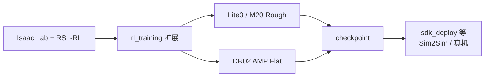

# Deep Robotics rl_training

**rl_training** 是 [云深处科技（Deep Robotics）](https://www.deeprobotics.cn/) 官方在 [Isaac Lab](https://github.com/isaac-sim/IsaacLab) 上的强化学习训练扩展（GitHub：[`DeepRoboticsLab/rl_training`](https://github.com/DeepRoboticsLab/rl_training)）。

## 一句话定义

把 Deeprobotics **Lite3（四足）/ M20（轮足）/ DR02（AMP 平地）** 装进 Isaac Lab 工作流，用 RSL-RL 做并行速度跟踪与对抗运动先验训练，再交给同组织部署仓做 Sim2Sim / 真机。

## 英文缩写速查

| 缩写 | 英文全称 | 简要说明 |
|------|----------|----------|
| Isaac Lab | NVIDIA Isaac Lab | 基于 Omniverse 的机器人学习框架 |
| RSL-RL | Robotic Systems Lab RL | ETH RSL 系 PPO 训练库，本仓默认后端 |
| AMP | Adversarial Motion Prior | DR02 平地任务使用的对抗运动先验 |
| RL | Reinforcement Learning | 强化学习 |
| Sim2Real | Simulation to Real | 仿真策略迁移真机 |

## 为什么重要

- **厂商官方入口**：做云深处机型 locomotion 时，比在社区多机型库里「碰巧有 Lite3/M20」更贴近官方资产与任务命名。
- **覆盖四足 + 轮足 + AMP**：`Rough-Lite3` / `Rough-M20` 与 `Amp-Flat-DR02` 并列，便于同一 Lab 栈内切换任务形态。
- **部署边界清晰**：README 明确训练与 MuJoCo/真机部署分仓；选型时不要把本仓当成一体式 sim2real SDK。

## 核心原理

| 步骤 | 说明 |
|------|------|
| 独立扩展 | 仓库放在 Isaac Lab 目录**之外**，`pip install -e source/rl_training` |
| 环境注册 | Gym ID：`Rough-Deeprobotics-Lite3-v0`、`Rough-Deeprobotics-M20-v0`、`Amp-Flat-Deeprobotics-DR02-v0` |
| 训练后端 | `scripts/reinforcement_learning/rsl_rl/train.py` / `play.py` |
| AMP 路径 | 含 `amp_locomotion_env`、`ppo_amp` 与 motion dataset loader（服务 DR02） |
| 部署分流 | MuJoCo / 真机 → DeepRoboticsLab 组织下对应 deploy 仓（如 `sdk_deploy`） |

## 工程实践

1. 按官方徽章对齐：**Isaac Sim 5.1 · Isaac Lab 2.3.2 · RSL-RL 5.0.1 · Python 3.11**。
2. `git clone --recurse-submodules https://github.com/DeepRoboticsLab/rl_training.git`（含 `deep_robotics_model`）。
3. 在已含 Isaac Lab 的解释器中：`python -m pip install -e source/rl_training`，再 `python scripts/tools/list_envs.py`。
4. 训练示例：`python scripts/reinforcement_learning/rsl_rl/train.py --task=Rough-Deeprobotics-M20-v0 --headless`；play 可加 `--keyboard` / `--video`。
5. 与社区对照：多厂商速度跟踪也可走 [robot_lab](./robot-lab.md)（机型表含 Lite3 / M20）；本仓是 **Deep Robotics 官方**任务与资产入口。
6. 轮足语境与 [AWARE](./paper-aware-wheeled-legged-reflexive-evasion.md)（M20 反射避障）互补：AWARE 偏方法论文；本仓偏可训练官方环境。

## 局限与风险

- **开源状态：已开源**（BSD-3-Clause）；部署代码在同组织其他仓，勿假设本仓含完整真机栈。
- **版本矩阵硬**：需对齐 Isaac Sim / Lab / RSL-RL 徽章版本；与 [unitree_rl_lab](./unitree-rl-lab.md) 的任务名、观测空间不互通。
- **DR02 AMP** 依赖运动数据与 AMP 管线配置；Rough 速度任务与 AMP 任务的调试指标不同，勿混用同一套 reward 直觉。
- GPU / 驱动 / 首次资源下载门槛与其它 Isaac Lab 扩展相同。

## 关联页面

- [robot_lab](./robot-lab.md) — 社区多厂商 Isaac Lab 扩展（亦含 Deeprobotics 机型）
- [unitree_rl_lab](./unitree-rl-lab.md) — 宇树官方 Isaac Lab RL 对照
- [DDT_Lab](./ddt-lab.md) — 直驱科技轮足官方 Lab 对照
- [Isaac Lab](./isaac-lab.md)
- [轮足四足机器人](../concepts/wheel-legged-quadruped.md)
- [AWARE（M20 高动态反射避障）](./paper-aware-wheeled-legged-reflexive-evasion.md)
- [Locomotion](../tasks/locomotion.md)

## 参考来源

- [sources/repos/rl_training.md](../../sources/repos/rl_training.md)
- 上游：<https://github.com/DeepRoboticsLab/rl_training>
- 部署配套（未单独升格）：<https://github.com/DeepRoboticsLab/sdk_deploy>

## 推荐继续阅读

- Isaac Lab 安装指南：<https://isaac-sim.github.io/IsaacLab/>
- 官方教程视频（README）：[Bilibili](https://b23.tv/UoIqsFn) / [YouTube playlist](https://youtube.com/playlist?list=PLy9YHJvMnjO0X4tx_NTWugTUMJXUrOgFH)
