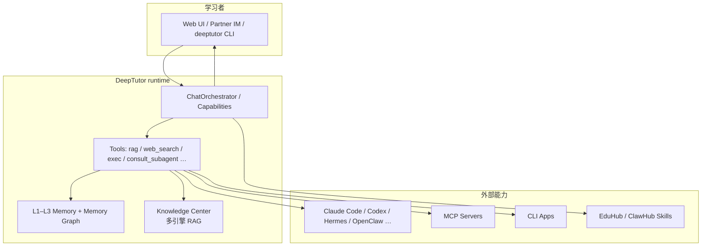
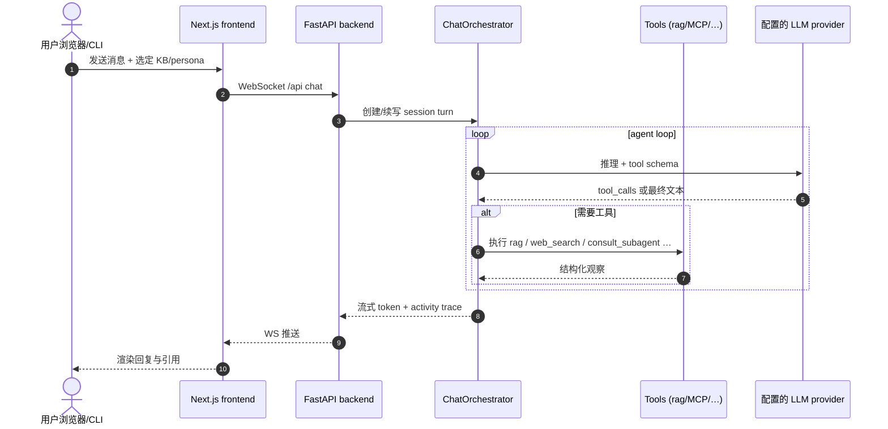

# DeepTutor（HKUDS）

**DeepTutor**（[HKUDS/DeepTutor](https://github.com/HKUDS/DeepTutor)，Apache-2.0）是香港大学 [HKUDS](https://github.com/HKUDS) 维护的 **agent-native 学习伴侣**：在单一 **capability + tools** 运行时里贯通辅导、出题、研究、可视化、解题、课程与 **living book**，并以 **Knowledge Center**（多引擎 RAG）、**三层 Memory**、**Partner IM** 与 **[EduHub](https://eduhub.deeptutor.info/)** skills 生态扩展。技术报告见 [arXiv:2604.26962](https://arxiv.org/abs/2604.26962)；文档与安装见 [deeptutor.info](https://deeptutor.info/)。

## 一句话定义

把「个性化家教 + 资料库 + 出题测验 + 长期记忆」收成 **可自托管的 agent 工作区**，并能把本机 **Claude Code / Codex / Hermes / OpenClaw** 等收成可 consult 的子代理——面向 **学习与研究知识编译**，不是机器人运动控制栈。

## 英文缩写速查

| 缩写 | 英文全称 | 简要说明 |
|------|----------|----------|
| RAG | Retrieval-Augmented Generation | 检索增强生成；Knowledge Center 核心能力 |
| MCP | Model Context Protocol | 工具互操作协议；DeepTutor 维护 per-account MCP 服务 |
| IM | Instant Messaging | 即时通讯；Partner 可接 Feishu/Telegram/Slack 等 |
| CLI | Command-Line Interface | `deeptutor` 命令行与可挂载的 CLI Apps |
| KB | Knowledge Base | 版本化知识库；多解析/多向量引擎可选 |
| L1/L2/L3 | Memory layers | 迹线 / 表面摘要 / 综合记忆三层 |
| EduHub | Education skill hub | DeepTutor 默认教学向 Agent-Skills registry |
| TutorBench | Tutoring benchmark | 论文提出的交互式个性化辅导评测集 |

## 为什么重要（对本知识库读者）

- **技术栈自学载体：** 机器人研究者可把本库 `wiki/`、论文 PDF、课程讲义导入 **Knowledge Center**，用 Quiz、Mastery Path、Book 做 **RL/控制/Sim2Real** 等主题的 structured learning——与 [LLM Wiki（Karpathy 模式）](../references/llm-wiki-karpathy.md)「知识编译进页面」形成 **读者侧** 互补（wiki 维护 vs 个人辅导消费）。
- **HKUDS 代理生态一环：** 与 [CLI-Anything](cli-anything.md)（生成专业软件 CLI）、[Hermes Agent](hermes-agent.md) / [OpenClaw](openclaw.md)（常驻 agent OS / SKILL 宿主）同属 HKUDS 线；DeepTutor **My Agents** 可 **live consult** 这些宿主，而非替代它们。
- **RAG 与工具面选型参考：** 同时支持 LlamaIndex、PageIndex、GraphRAG、LightRAG、Obsidian 等引擎，并内置 MCP store、CLI Apps、web/paper search——适合对照「教学场景要多引擎还是要单一管线」。
- **可审计个性化：** Memory Graph 把 L3 主张溯源到 L1 证据，比黑盒「越聊越懂你」更适合 **高可信学习记录**（考试备考、实验室 onboarding）。
- **非机器人栈：** 不提供真机网关、运动学求解或仿真训练环；勿与 locomotion / manipulation 训练框架混选。

## 核心原理

| 层次 | 内容 |
|------|------|
| **问题** | 通用 LLM + 静态 RAG 难以持续适应个体学习者，且缺乏引用落地与引导式闭环 |
| **运行时** | **Capabilities**（Chat、Quiz、Research、Solve、Book…）+ **Tools** 插件；统一 `ChatOrchestrator` agent loop（多轮 tool call → 观察 → 无工具收尾） |
| **上下文** | Sticky session（KB、persona、subagent、model）+ 单次引用（附件、历史、notebook、question bank） |
| **个性化** | 静态 grounding（RAG / Book / 课程材料）+ 动态 **L1–L3 Memory** + Persona / Mastery Path |
| **扩展** | MCP 服务、CLI Apps、[EduHub](https://eduhub.deeptutor.info/) / ClawHub skills、Partner 多通道 IM |
| **子代理** | `consult_subagent` 实际 **运行** 外部 agent harness 并流式汇入 Activity |

### 流程总览

### 与相近方案对照

| 方案 | 主场景 | 强项 | 典型代价 |
|------|--------|------|----------|
| **DeepTutor** | 个性化辅导全栈 | RAG 多引擎、Book/Quiz/Memory、Partner IM、EduHub | 需自备 LLM/embedding；全功能依赖较多 extras |
| [CLI-Anything](cli-anything.md) | 专业软件 → agent CLI | 生成 Click CLI + Hub | 不包教学闭环与 learner memory |
| [Hermes Agent](hermes-agent.md) / [OpenClaw](openclaw.md) | 常驻个人 agent OS | 网关、cron、广泛工具与 SKILL | 非教育专用 UX；可被 DeepTutor consult |
| [Agent Reach](agent-reach.md) | 外网读搜脚手架 | 聚合上游读搜 CLI | 无本地 KB/Book/测验管线 |
| 通用 RAG 笔记库 | 文档问答 | 轻量 | 缺 Mastery、Partner、可审计 memory 与 subagent consult |

## 工程实践

| 场景 | 做法 |
|------|------|
| **最快试用** | `mkdir my-deeptutor && cd my-deeptutor` → `pip install -U deeptutor` → `deeptutor init` → `deeptutor start` → 打开默认 `http://127.0.0.1:3782` |
| **Docker** | `docker run … -p 127.0.0.1:3782:3782 -v deeptutor-data:/app/data ghcr.io/hkuds/deeptutor:latest`；仅需暴露前端端口 |
| **开发** | `git clone` → `pip install -e .` → `cd web && npm ci --legacy-peer-deps` → `deeptutor start --dev` |
| **无 Web CLI** | `pip install -e ./packaging/deeptutor-cli` → `deeptutor init --cli` → `deeptutor chat`（**仅源码路径**，2026-08-31 未单独上 PyPI） |
| **机器人 Wiki 自学** | 将 PDF/讲义入 KB → Chat 开 `rag` → 用 Quiz / Mastery Path 巩固 → Book 编译长线材料 |
| **接子代理** | Settings / My Agents 连接本机 Claude Code 或 [Hermes](hermes-agent.md)；Chat 用 Agent chip 或 `consult_subagent` |
| **装教学 skill** | `deeptutor skill search "socratic"` → `deeptutor skill install <slug>`（默认 EduHub；ClawHub 用 `clawhub:` 前缀） |
| **多用户** | `auth.json` 开启后首注册用户为 admin；`data/users/<uid>/` 隔离工作区 |
| **开源状态** | **已开源**。详见 [仓库归档](../../sources/repos/hkuds_deeptutor.md) |

### 源码运行时序（`deeptutor start` 后一次 Chat 回合）

典型复现路径：`deeptutor init` 配置 `model_catalog.json` → `deeptutor start` → Web Chat 选择 Knowledge Base → 提问触发 `rag` 工具链。

## 局限与风险

- **不是 Robot Gateway：** 不替代真机安全闸门、运动控制或仿真训练；仅适合 **知识学习与方法论** 辅导。
- **依赖与信任面大：** office skills 默认经 **code_execution** 沙箱跑模型生成脚本；`sandbox_allow_subprocess` 关会禁用 docx/pdf 等产出——需显式信任决策。
- **LLM 成本与密钥：** 多 capability、Book 编译、Partner 常驻 IM 会放大 token 与提供商账单；embedding/search 需单独配置。
- **生态演进快：** 发布节奏密集（v1.6.x）；引擎列表、IM channel、provider 支持以官方 README / [deeptutor.info](https://deeptutor.info/) 为准。
- **论文 vs 产品：** TutorBench 与论文指标来自特定评测设定；落地效果仍取决于材料质量、profile 与模型选择。
- **误区：DeepTutor = OpenClaw。** OpenClaw/Hermes 可被 **consult**；DeepTutor 专有 Book、Mastery、EduHub、三层 Memory 与教学 UX。

## 关联页面

- [CLI-Anything（HKUDS）](cli-anything.md) — 同 org；生成 agent-native 软件 CLI，DeepTutor 侧消费 CLI Apps/skills
- [Hermes Agent](hermes-agent.md) — 可被 My Agents live consult 的 agent OS
- [OpenClaw](openclaw.md) — SKILL 宿主；ClawHub skill 可 `deeptutor skill install`
- [Agent Reach](agent-reach.md) — 外网读搜 CLI 聚合（与 DeepTutor 内置 search 互补）
- [HarnessBank](paper-harnessbank.md) — 宿主 harness 自进化（问题域不同）
- [Model Context Protocol](../concepts/model-context-protocol.md) — MCP 工具协议层
- [LLM Wiki（Karpathy 模式）](../references/llm-wiki-karpathy.md) — 知识编译维护范式对照

## 参考来源

- [DeepTutor 仓库源归档（本站）](../../sources/repos/hkuds_deeptutor.md)
- [deeptutor.info 站点归档（本站）](../../sources/sites/deeptutor-info.md)
- [技术报告归档 arXiv:2604.26962（本站）](../../sources/papers/deeptutor_arxiv_2604_26962.md)
- [HKUDS/DeepTutor（GitHub）](https://github.com/HKUDS/DeepTutor)
- [DeepTutor 文档站](https://deeptutor.info/)

## 推荐继续阅读

- [DeepTutor README（main）](https://github.com/HKUDS/DeepTutor/blob/main/README.md) — 安装四路径、Explore 导览与 CLI 参考
- [DeepTutor: Towards Agentic Personalized Tutoring](https://arxiv.org/abs/2604.26962) — TutorBench 与个性化引擎设计
- [EduHub](https://eduhub.deeptutor.info/) — 教学向 Agent-Skills 社区 registry
