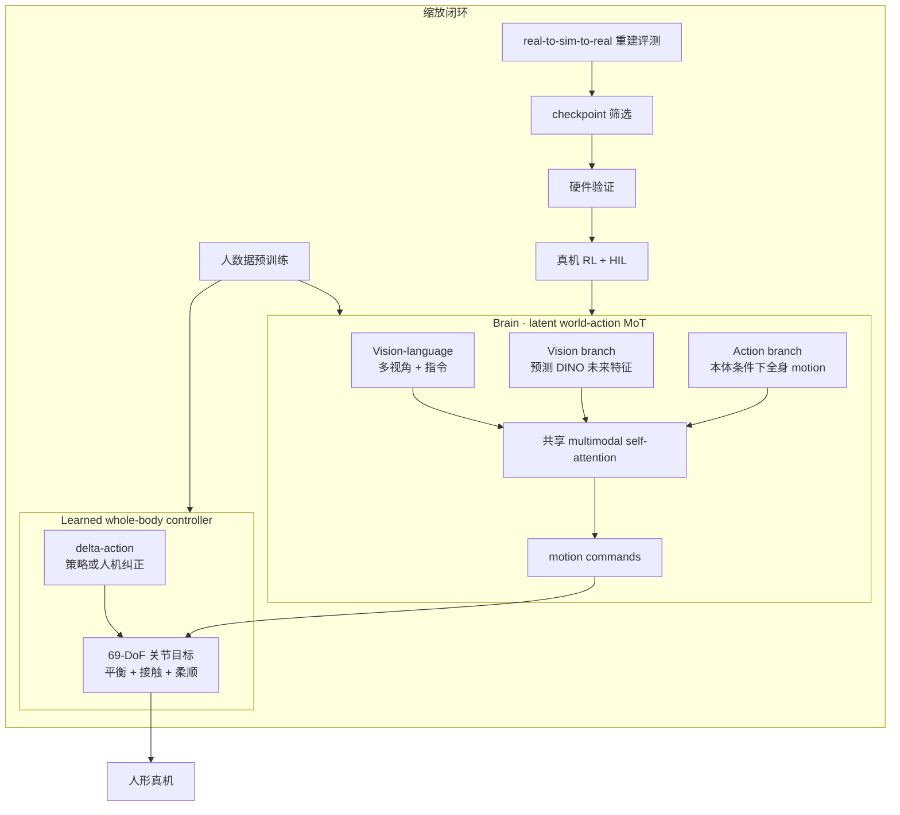

# Δ₀（Delta-0）：人形全身 Loco-Manipulation 基础模型

[Delta Intelligence（德塔智能）](https://deltai.com/en) 在 **2026-09** 博客 [Delta-0 (Δ₀)](https://deltai.com/en/blog/delta-0) 中发布 **Δ₀**：面向 **whole-body loco-manipulation** 的 **Humanoid Foundation Model（HFM）**。叙事上把 **浮动基座上的移动、平衡、接触与双手操作** 合成一条学习闭环，而不是「先走到位再站着抓」的分层脚本。

## 一句话定义

> **脑（潜空间 world–action MoT）与 69-DoF 学习式全身控制器协同设计，用统一 motion 接口连接人数据预训练、仿真批量评测与 delta-action 真机 RL。**

## 英文缩写速查

| 缩写 | 英文全称 | 简要说明 |
|------|----------|----------|
| HFM | Humanoid Foundation Model | 文中对 Δ₀ 的产品定位 |
| MoT | Mixture of Transformers | 视觉、语言、动作分支专属 FFN + 共享跨模态注意力 |
| WAM | World Action Model | brain 同时建模未来视觉 latent 与全身 motion |
| HIL | Human-in-the-Loop | 真机 RL 与纠正共用 delta-action 执行接口 |
| MPJPE | Mean Per Joint Position Error | 控制器跟踪评测（pelvis 对齐后的 link 原点误差） |
| RL | Reinforcement Learning | 文内 value 条件与 rollout 后训练 |
| OOD | Out-of-Distribution | 洗碗机镜像厨房等空间分布偏移评测 |

## 核心信息

| 项 | 内容 |
|----|------|
| **机构** | 德塔智能（Delta Intelligence） |
| **发布** | 2026-09 官方博客（无同期 arXiv / 代码链接） |
| **DoF** | **69**（手、臂、躯干、腿进入共享 action space） |
| **开源** | **确认未开源**（[deltai.com 核查](../../sources/sites/deltai-com.md)） |

## 为什么重要

- **产业侧「脑 + 小脑」样板：** 与 [Being-M0.7](./paper-being-m07-humanoid-latent-wam.md)、[ω-0](./paper-omega-0.md) 等同期的 **latent 未来 + 全身动作** 路线对照，但 Δ₀ 把 **可扩展 whole-body controller** 提到与 brain **同权 co-design**（含遥操作 fidelity、热稳定与数据采集中断率）。
- **数据轴清晰：** **>10,000 h** 配对 egocentric 视频 + 全身 motion 预训练 brain；controller 另吃大规模 **human motion** 扩跟踪覆盖；**180 维 padded 共享动作空间** 明确写多单臂/双臂/UMI/人形等数据源通道。
- **评测闭环叙事完整：** **real-to-sim-to-real** 重建真实厨房等场景做 checkpoint 筛选，再回硬件验证排序；给出洗碗机 **sim/hardware 成功率同向** 与 **OOD 布局 4/20→13/20** 等数字（均为 **公司自报**，不可与公开论文表直接横比）。

## 核心原理

### 流程总览

### Brain：四种互补训练模式

| 模式 | 条件 | 去噪/预测目标 |
|------|------|----------------|
| Forward dynamics | 当前观测 + **动作** | 未来 **DINO 视觉特征** |
| Inverse dynamics | 当前观测 + **未来视觉** | **全身 motion** |
| Visual planning | 无动作条件 | 未来视觉特征 |
| Policy-only | 无未来视觉目标 | **动作** |

长时程任务由 **stage-level 语言/指令** 驱动；Δ₀ 学习 **阶段之间的站姿、抓放保持与重定位**，而不是替代独立高层任务规划器。

### Controller：delta-action 与跟踪基线

- **Motion command 接口** 同时服务 brain 输出、**VR/遥操作** 与 **delta-action 人机纠正**，避免切换另一套低层栈。
- 文内 **zero-shot** 对比 HEFT、MimicLite v1.1、SONIC v1.1、ScaleBFM XL（Motion Tracking Leaderboard 协议与代码），指标含 **Global Root Error（m）** 与 **MPJPE（mm）**；并报告 **coverage**（腕 ≤2 cm 且 root ≤15 cm 的日常 motion 占比随数据预算上升）。

### 真机 RL 与 OOD

- **Value 模型** 从视觉、短历史与本体估计 **cost-to-go**；progress 增益大的 action chunk 正条件， setbacks 负条件。
- **HIL correction chunk** 直接正条件，与自主 rollout 并列。
- **洗碗机镜像厨房**：仅原场景 teleop SFT **4/20**；目标 OOD 布局采集纠正 + RL 后 **13/20**（同条件）。

## 工程实践

| 主题 | 博客可读结论 |
|------|----------------|
| **动作空间** | 154 维核心（左右手/臂、root & motion command 等）→ **180 维** padding；多 embodiment 数据源映射到同一 layout |
| **预训练缩放** | brain 人数据 **0% / 10% / 100%** 三档；策略成功率随预训练上升（分移动操作、双手、全身接触三类） |
| **仿真重建** | 视频→可编辑仿真资产（光照/摩擦/物体位姿）；文称 agent 管线含 **GPT-6 Astra** 等 LLM 命名 |
| **部署速度** | 强调 **near-human speed** 的单通才策略（无公开 Hz 表） |
| **复现入口** | **无**；仅第三方 leaderboard 代码用于 **控制器基线**，不是 Δ₀ 发布物 |

## 局限与风险

- **确认未开源**：无权重、训练代码、数据集或正式论文；数字与视频 **不可独立复现**。
- **本体未在文中钉死型号**：与 [SONIC](../methods/sonic-motion-tracking.md) 等 **仅作控制器对比名**，勿默认 Δ₀ 即 NVIDIA SONIC 栈。
- **LLM 命名（GPT-6 Astra）** 属产品叙事，仿真管线细节与许可未公开。
- 与 [Physical Intelligence Layer](./pi-physical-intelligence-layer.md) 类似，这是 **系统与缩放故事**，不是可对照的 arXiv 实验协议。

## 关联页面

- [Loco-Manipulation](../tasks/loco-manipulation.md)
- [World Action Models](../concepts/world-action-models.md)
- [Whole-Body Control](../concepts/whole-body-control.md)
- [Being-M0.7（潜空间 WAM 对照）](./paper-being-m07-humanoid-latent-wam.md)

## 参考来源

- [deltai_delta_0_blog_2026-09](../../sources/blogs/deltai_delta_0_blog_2026-09.md)
- [deltai.com 站点归档](../../sources/sites/deltai-com.md)

## 推荐继续阅读

- [Delta-0 官方博客（英文）](https://deltai.com/en/blog/delta-0)
