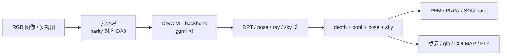

# depth-anything.cpp（DA3 的 C++/ggml 本地几何推理）

**depth-anything.cpp**（[localai-org/depth-anything.cpp](https://github.com/localai-org/depth-anything.cpp)，MIT）是 [Depth Anything 3](https://github.com/ByteDance-Seed/Depth-Anything-3)（DA3，[arXiv:2511.10647](https://arxiv.org/abs/2511.10647)）的 **独立 C++ 推理引擎**：用 [ggml](https://github.com/ggml-org/ggml) 把官方 checkpoint 转为 **自包含 GGUF**，运行时 **不依赖 Python、PyTorch 或 CUDA toolkit**，从单张或多张 RGB 恢复 **metric/相对深度、逐像素置信度、相机内外参、可选天空掩码、反投影点云**，并导出 **glb / COLMAP / PLY**。预转换权重见 [mudler/depth-anything.cpp-gguf](https://huggingface.co/mudler/depth-anything.cpp-gguf)。

## 一句话定义

**DA3 的嵌入式几何运行时**：一个 GGUF 文件 + `da3-cli` 或 flat C API，在 CPU/任意 ggml GPU 后端上做与 PyTorch 参考 **数值等价** 的单目/多视图深度与位姿推理。

## 英文缩写速查

| 缩写 | 英文全称 | 简要说明 |
|------|----------|----------|
| DA3 | Depth Anything 3 | ByteDance Seed 任意视图几何基础模型（上游） |
| DA2 | Depth Anything V2 | 前代单目深度系列；本引擎亦支持 V2 GGUF |
| GGML | Georgi Gerganov Machine Learning | 轻量张量运行时；本仓以 submodule 钉版本 |
| GGUF | GGML Unified Format | 自包含权重容器；维度与预处理常数写入文件元数据 |
| DPT | Dense Prediction Transformer | DA 系列的稠密解码头族 |
| COLMAP | Structure-from-Motion library | 本 CLI 可写出 cameras/images/points3D 文本格式 |
| PFM | Portable Float Map | 无损浮点深度图导出格式 |
| C API | Application Programming Interface (C) | `da_capi.h`；供 C/C++/Go/Rust 嵌入 |

## 为什么重要（对本知识库读者）

- **缩短感知–部署间隙：** 官方 DA3 栈绑定 PyTorch + xformers + 可选 gsplat/Gradio；机器人现场、ROS 节点、嵌入式或 **禁止 Python 运行时** 的环境需要 **原生库 + GGUF**（对照 [SAM3DBody-cpp](./sam3dbody-cpp.md)、[kimodo.cpp](./kimodo-cpp.md)）。
- **单图即几何包：** 除深度外还输出 **置信度、3×4 外参、3×3 内参、ray-pose、点云**，可直接喂 **COLMAP/NeRF 初始化、抓取深度兜底、Sim2Real 场景重建**（见 [抓取位姿估计](../methods/grasp-pose-estimation.md) 中单目深度兜底行）。
- **上游生态枢纽：** [R³](./paper-r3-relative-regression.md)、[Track4World](./paper-track4world.md)、[Instant NuRec](./paper-instant-nurec.md) 等大量工作以 **DA3 为骨干或深度教师**；本引擎提供 **与官方 forward 对齐的推理面**，便于在非 Python 管线里复用同一几何先验。
- **CPU 可实用：** README 报 Ryzen 9950X3D 上 **1.20×（f32）/ 1.31×（q8_0）** 于 PyTorch CPU，内存约半、加载约 **6.7× 更快**——适合无独显的离线批处理或边缘预处理。

## 核心原理

| 层次 | 内容 |
|------|------|
| **上游** | DA3：plain DINO transformer + depth-ray 统一目标；单模型覆盖单目/多视图深度、位姿、3DGS、metric 分支 |
| **移植策略** | 逐组件 parity：预处理、backbone、attention、DPT head、depth/pose/ray head、导出器均对 PyTorch dump 张量 gate |
| **权重** | `convert_da3_to_gguf.py` / `convert_mono_to_gguf.py` / `convert_nested_to_gguf.py` / `convert_da2_to_gguf.py`；量化用 `da3-cli quantize` |
| **运行时** | 元数据驱动加载器；无硬编码架构常量；支持 f16 与 K-quants |

### 流程总览



### 与官方 PyTorch 栈对照

| 维度 | 官方 DA3 | depth-anything.cpp |
|------|----------|-------------------|
| 运行时 | Python + PyTorch + CUDA（典型） | C++17 + ggml；推理零 Python |
| 权重 | HF `depth-anything/*` | 自转换或 [HF GGUF](https://huggingface.co/mudler/depth-anything.cpp-gguf) |
| 任务覆盖 | 全功能 API + Gradio + 3DGS 训练头 | **推理** 向：深度/位姿/天空/导出；训练不在范围 |
| 数值 | 参考实现 | ctest **correlation 1.0** vs `net()` |
| 许可 | 因 checkpoint 而异 | 引擎 MIT；**权重许可不变** |

## 源码运行时序图

```mermaid
sequenceDiagram
  autonumber
  participant App as 调用方 / da3-cli
  participant C as da_capi
  participant GG as ggml 图会话
  participant IO as 导出器

  App->>C: da_capi_load(model.gguf)
  App->>C: da_capi_depth_dense(ctx, image.jpg, ...)
  C->>GG: 预处理 → ViT → DPT/pose 头
  GG-->>C: depth[H×W], conf, ext 3×4, intr 3×3
  C-->>App: 缓冲指针（须 da_capi_free_floats）
  opt App->>C: da_capi_export_glb / da_capi_points
  C->>IO: 无 trimesh/pycolmap 依赖写出
  IO-->>App: scene.glb / COLMAP 目录 / PLY
  App->>C: da_capi_free(ctx)
```

最短复现：`git clone --recursive` → `cmake -B build -DDA_BUILD_CLI=ON && cmake --build build -j` → 下载 [GGUF](https://huggingface.co/mudler/depth-anything.cpp-gguf) 或自转换 → `build/examples/cli/da3-cli depth --model ... --input photo.jpg --pfm out.pfm`。

## 工程实践

| 场景 | 做法 |
|------|------|
| **快速试用** | 拉取 HF 预转换 GGUF；默认锚点 **DA3-BASE**（Apache-2.0，可商用） |
| **metric 街景/室内** | Nested 双文件：`--model nested-anyview.gguf --metric-model nested-metric.gguf`；注意 CC BY-NC |
| **多视图 SfM 种子** | `da3-cli depth --input a.jpg --input b.jpg --out-prefix scene` + `--colmap` |
| **嵌入 ROS/现场** | `-DDA_SHARED=ON` 构建 `libdepthanything.so`；`da_capi.h` + `da_capi_last_error` |
| **GPU** | `DA_GGML_CUDA` / `METAL` / `VULKAN`；GB10 上 README 报与 PyTorch cuDNN **同速**、冷启动更快 |
| **量化部署** | q8_0 near-lossless；q4_k ~99 MB；parity 持有至 f16 |
| **LocalAI** | README「Use it from LocalAI」；与 [kimodo.cpp](./kimodo-cpp.md) 同属 LocalAI 本地模型栈 |
| **开源状态** | **已开源**（引擎 MIT + 转换脚本 + GGUF 发布）。详见 [仓库归档](../../sources/repos/depth-anything-cpp.md) |

## 局限与风险

- **不是 ByteDance 官方仓：** 社区移植；上游 DA3 配置或权重 revision 变更需自行重跑 parity / ctest。
- **许可分层：** 引擎 MIT **不改变** checkpoint 许可；**DA3-LARGE/GIANT/Nested 多为 CC BY-NC**；商用前读 [官方 model cards](https://github.com/ByteDance-Seed/Depth-Anything-3#%EF%B8%8F-model-cards)。
- **能力子集：** 无 Gradio、无 DA3-Streaming 滑动窗口、无 3DGS **训练**；GIANT 重建路径以推理/导出为主。
- **转换仍要 Python：** 仅 **推理** 零 Python；自研 checkpoint 须维护 venv + `requirements.txt` 转换链。
- **单目深度误区：** metric 输出仍受单目尺度/纹理先验约束；动态场景、反光与无纹理平面需结合 **conf 阈值** 与多视图（对照 [状态估计](../concepts/state-estimation.md) 中 R³/流式几何讨论）。
- **DA2 Giant 缺失：** README 注明 HF 上 DA2 ViT-g **gated/unreleased**。

## 关联页面

- [R³](./paper-r3-relative-regression.md) — DA3 骨干上的相对位姿流式重建
- [Track4World](./paper-track4world.md) — 可选 DA3 骨干的稠密 3D 跟踪
- [Instant NuRec](./paper-instant-nurec.md) — 驾驶场景 NuRec；编码器 lineage 含 DA3
- [kimodo.cpp](./kimodo-cpp.md) — 同 LocalAI 团队的 C++/ggml 运动生成运行时
- [SAM3DBody-cpp](./sam3dbody-cpp.md) — 另一条「研究 PyTorch → 社区 C++」人体感知部署
- [状态估计](../concepts/state-estimation.md) — 单目/多视图几何在 SLAM 主线中的位置
- [机器人感知栈选型闭环](../queries/robot-perception-stack-selection-loop.md) — 深度模块如何进入策略/规划
- [抓取位姿估计](../methods/grasp-pose-estimation.md) — 单目深度作 RGB-only 抓取兜底

## 参考来源

- [depth-anything.cpp 仓库归档（本站）](../../sources/repos/depth-anything-cpp.md)
- [Depth Anything 3 论文摘录（本站）](../../sources/papers/depth_anything_3_arxiv_2511_10647.md)
- [localai-org/depth-anything.cpp（GitHub）](https://github.com/localai-org/depth-anything.cpp)
- [mudler/depth-anything.cpp-gguf（Hugging Face）](https://huggingface.co/mudler/depth-anything.cpp-gguf)
- [ByteDance-Seed/Depth-Anything-3（上游）](https://github.com/ByteDance-Seed/Depth-Anything-3)
- [arXiv:2511.10647](https://arxiv.org/abs/2511.10647)

## 推荐继续阅读

- 性能与 parity 方法论：仓库 [`benchmarks/BENCHMARK.md`](https://github.com/localai-org/depth-anything.cpp/blob/main/benchmarks/BENCHMARK.md)
- 导出格式：[`docs/EXPORT.md`](https://github.com/localai-org/depth-anything.cpp/blob/main/docs/EXPORT.md)
- GPU 构建：[`docs/GPU.md`](https://github.com/localai-org/depth-anything.cpp/blob/main/docs/GPU.md)
- DA3 官方 CLI/API：[`Depth-Anything-3` docs](https://github.com/ByteDance-Seed/Depth-Anything-3/tree/main/docs)
