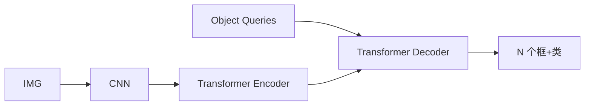

# DETR（DEtection TRansformer）

## 一句话定义

**DETR** 用 Transformer 编解码器把目标检测变成固定数量的 **集合预测**：object queries 经交叉注意力读图像特征，匈牙利算法对齐预测与真值，**推理端去掉 NMS**。

## 英文缩写速查

| 缩写 | 英文全称 | 简要说明 |
|------|----------|----------|
| DETR | DEtection TRansformer | 集合预测检测框架 |
| Query | Object Query | 可学习检测槽位 |
| Hungarian | Hungarian Matching | 二分图最优匹配损失 |
| NMS | Non-Maximum Suppression | 传统后处理，DETR 通常不需要 |
| AP | Average Precision | COCO 精度 |

## 为什么重要

- 课程 3.3.1 与作业 3（VisDrone 训练）的核心模型。
- 开启检测 Transformer 路线，衍生 Deformable DETR、RT-DETR、[RF-DETR](./rf-detr.md) 等。

## 核心原理

CNN 抽特征 → Transformer encoder 建模全局 → decoder 以 N 个 query 做交叉注意力 → 并行输出类+框。训练用匹配损失（分类 + 框 L1/GIoU）。

## 工程实践

| 项 | 建议 |
|----|------|
| 收敛 | 原版收敛慢，需长 schedule；优先试 Deformable DETR |
| 数据 | COCO 预训练再迁 VisDrone；注意小目标 |
| 实现 | 官方 Facebook DETR / MMDetection |
| 部署 | query 数影响延迟；对比 YOLO 测 FPS |

## 局限与风险

小目标与训练时长曾是痛点；勿在未改 schedule 时断言「Transformer 检测不行」。实时场景看 RT-DETR/RF-DETR。

## 关联页面

- [Deformable DETR](./deformable-detr.md)
- [RF-DETR](./rf-detr.md)
- [Object Detection](../methods/object-detection.md)
- [Transformer CV 课程策展](../entities/transformer-cv-curriculum.md)

## 参考来源

- [Transformer 视觉应用课程大纲](../../sources/courses/transformer_cv_applications_syllabus.md)

## 推荐继续阅读

- [DETR (ECCV 2020) arXiv:2005.12872](https://arxiv.org/abs/2005.12872)
