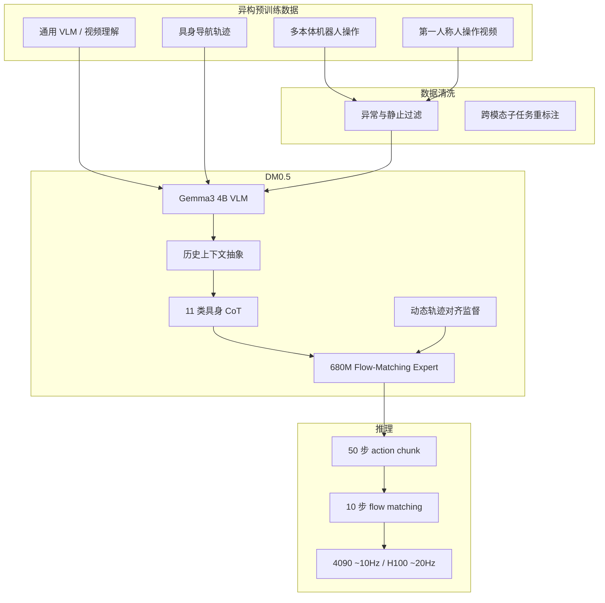

# Dexmal DM0.5

**DM0.5**（[Dexmal 官方博客](https://www.dexmal.com/blog/dm0.5/index.html)）是 [Dexmal](https://www.dexmal.com/) 在 **DM0**（2026-02）之后的第二代原生具身基础模型，定位从「可控环境复杂动作」走向 **开放世界 zero-shot 与高效 fine-tuning**。架构延续 [VLA](../methods/vla.md) 范式，但在 **历史上下文、具身推理、动作监督与数据质量** 上做了系统增强，使策略从「当前帧 Markov 操作」升级为能理解任务进程、开放指令并稳定输出连续动作的基础模型。

## 一句话定义

以 **Gemma3-4B VLM + 680M Action Expert（Flow Matching）** 为骨干，通过 **最长约 60s 的历史视觉上下文**、**11 类具身 CoT 自回归任务** 与 **动态轨迹对齐监督**，在异构机器人数据与导航/人视频混合预训练上构建面向开放指令与长程记忆的 VLA 基础模型。

## 英文缩写速查

| 缩写 | 英文全称 | 简要说明 |
|------|----------|----------|
| VLA | Vision-Language-Action | 视觉-语言-动作统一建模的机器人基础策略 |
| VLM | Vision-Language Model | 视觉-语言多模态主干，DM0.5 采用 Gemma3-4B |
| CoT | Chain-of-Thought | 具身推理式自回归辅助任务，强化阶段与意图理解 |
| Flow Matching | Flow Matching | 连续动作生成的流匹配训练目标（相对扩散的确定性流场族） |
| DP | Dynamic Programming | 动态规划；用于轨迹进展上的单调动作锚点匹配 |
| SFT | Supervised Fine-Tuning | 监督微调，将基础模型适配到下游真机任务 |
| VLN | Vision-Language Navigation | 视觉-语言导航；DM0.5-Nav 覆盖 R2R/RxR 类基准 |
| SR | Success Rate | 任务成功率，Table30/LIBERO 等基准常用指标 |

## 为什么重要

- **开放世界叙事：** 强调在 **未见环境、自然语言、多相机/多本体与人为干扰** 下的 **zero-shot 涌现** 与 **fine-tuning 效率**，与仅追求固定 benchmark 高分的「剧本环境」路线形成对照。
- **长程记忆工程化：** **Context Abstraction Layer** 把长达约 **60s** 的关键视觉历史压缩为固定 token 预算，并在「擦桌复位」「人类示范规则」等真机案例上验证 **短程物体状态** 与 **长程示范约束** 两类记忆需求。
- **监督信号升级：** **Embodiment CoT** 把机器人数据从单一动作标签扩展为 **任务规划、事件预测、动作意图** 联合监督；**Trajectory Alignment** 用 **DP 单调匹配** 缓解遥操作节奏差异带来的时间相位噪声。
- **通才评测覆盖面广：** 同一模型族在 **操作（LIBERO、RoboTwin2.0、Table30 v2）** 与 **导航（R2R/RxR）** 均报告领先或 SOTA 数值，便于与 [Qwen-VLA](./qwen-vla.md)、[LingBot-VLA 2.0](./lingbot-vla-v2.md) 等 **操作+导航通才** 对照。

## 核心结构/机制

| 模块 | 作用 |
|------|------|
| **Gemma3 4B VLM** | 多模态主干：理解当前/历史图像、语言指令与场景语义。 |
| **680M Action Expert** | Flow Matching 连续动作头；与 VLM 分组学习率（主干小 LR、专家大 LR）。 |
| **Context Abstraction Layer** | 多历史 slot 时间/空间抽样 → 固定视觉 token；随机历史长度训练，历史缺失时可退化为当前帧策略。 |
| **Embodiment CoT（11 任务）** | 任务阶段/进度、事件与环境预测、未来动作或动作语义摘要等自回归辅助目标。 |
| **Trajectory Alignment Layer** | 对未来动作 chunk 在真实轨迹上做 **单调递增锚点 DP 匹配**，兼顾相邻段轨迹连续性。 |
| **多源混合预训练** | 机器人操作 + 通用 VLM + 导航 + 视频理解；配套异常/静止/低价值动作过滤与跨模态重标注。 |

## 流程总览（数据 → 训练 → 推理）

## 公开结果（博客摘录，以官方更新为准）

| 场景 | 亮点 |
|------|------|
| **Zero-Shot** | 8 类动作原语 × 7 类语义约束；Dexmal-Mirror 上 **DM0.5 > DM0**，Franka 上 **DM0.5-Droid > π0.5-Droid** |
| **Table30 v2 Generalist** | **43% SR**，Score **54.42**（文称 SOTA；记忆型盖章/按钮、双臂托盘、插花等） |
| **LIBERO** | 平均 **99.0%**（Spatial/Object/Goal/Long 分项均 ≥97.4%） |
| **RoboTwin2.0** | Clean/Randomized 平均 **93.5%** |
| **R2R / RxR**（DM0.5-Nav） | R2R Val-Unseen **SR 59.7%**、**NE 4.8**；RxR 四项指标文称第一 |
| **鲁棒性** | 九组第三视角相机扰动成功率 **80–100%**；人为移动目标/遮挡后仍能重规划 |

## 与相近路线的关系

- **相对 DM0：** 同一机构的代际升级，重点在 **开放 zero-shot、历史记忆、CoT 监督与轨迹对齐**，而非单纯扩模扩数据。
- **相对 [π₀.₇](../methods/pi07-policy.md) / OpenPI 系：** 同属 **VLM + flow/chunk 动作** 族；DM0.5 更突出 **长历史 token 抽象** 与 **具身 CoT 多任务监督**，博客在 Franka 上与 **π0.5-Droid** 直接对比 zero-shot。
- **相对 [Qwen-VLA](./qwen-vla.md) / [Qwen-RobotManip](./qwen-robot-manip.md)：** 均为 **~4B 级 VLM + flow 动作专家** 与 **多源混合预训练**；Qwen 系强调 **开源权重与 embodiment prompt**，Dexmal 博文当前以 **能力与基准叙事** 为主，权重与训练细节需跟踪后续发布。
- **相对 [LingBot-VLA 2.0](./lingbot-vla-v2.md)：** 均报告 **LIBERO / RoboTwin / 真机 generalist** 高位分数；LingBot 公开 **6B 权重与 6 万小时** 规模叙事，DM0.5 侧重 **开放世界 zero-shot 与 60s 记忆** 案例。

## 常见误区或局限

- **误区：高 LIBERO 分即等于开放世界已解决。** 仿真微调榜与 **zero-shot 真机开放指令** 衡量不同能力；应同时看 Table30、相机扰动与人为干扰案例。
- **误区：历史记忆只靠加长上下文窗口。** DM0.5 依赖 **历史抽样抽象 + CoT 阶段监督 + 下游 SFT 激活** 的组合，而非单纯堆帧。
- **局限：** 截至本 ingest，博文未给出 **开源权重、技术报告 PDF 或统一 HuggingFace 入口**；推理 **10–20Hz** 仍可能需要 [Action Chunking](../methods/action-chunking.md) 与低层控制器配合部署。

## 参考来源

- [DM0.5 官方博客归档](../../sources/blogs/dexmal_dm05.md)
- [DM0.5 | 走出实验室，走向开放世界](https://www.dexmal.com/blog/dm0.5/index.html)

## 关联页面

- [VLA（Vision-Language-Action）](../methods/vla.md) — 方法总览与 DM0.5 在 flow/chunk 族中的位置
- [Action Chunking](../methods/action-chunking.md) — 50 步 chunk 与 10Hz 推理的部署语境
- [Manipulation](../tasks/manipulation.md) — Table30、LIBERO、RoboTwin 等操作评测语境
- [Vision-Language Navigation](../tasks/vision-language-navigation.md) — DM0.5-Nav 与 R2R/RxR
- [Qwen-VLA](./qwen-vla.md) — 操作+导航通才对照
- [π₀.₇ Policy](../methods/pi07-policy.md) — zero-shot 对比基准 π0.5-Droid 所属路线

## 推荐继续阅读

- [DM0.5 官方博客（Dexmal）](https://www.dexmal.com/blog/dm0.5/index.html)
- [VLA 开源复现景观（2025）](../overview/vla-open-source-repro-landscape-2025.md) — 将 DM0.5 放入更广的开源 VLA 谱系对照
