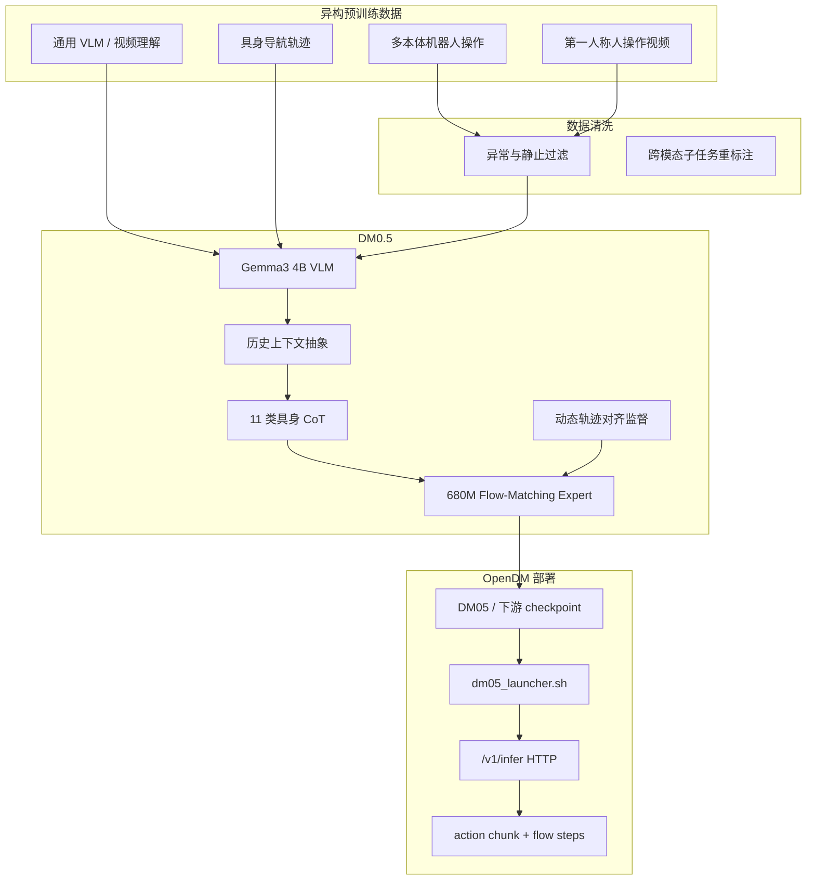
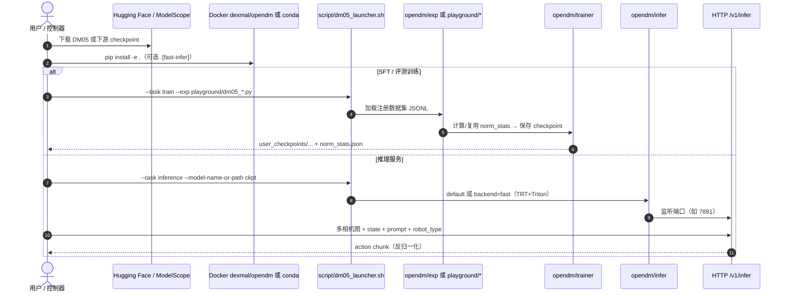

# Dexmal DM0.5（OpenDM）

**DM0.5**（[技术博客](https://www.dexmal.com/blog/dm0.5)，[GitHub `dexmal/opendm`](https://github.com/dexmal/opendm)，[HF DM05](https://huggingface.co/Dexmal/DM05)）是 [大晓智能（Dexmal）](https://www.dexmal.com/) 在 **DM0**（2026-02）之后的第二代原生具身基础模型，定位从「可控环境复杂动作」走向 **开放世界 zero-shot 与高效 fine-tuning**。架构延续 [VLA](../methods/vla.md) 范式，在 **历史上下文、具身推理、动作监督与数据质量** 上系统增强；官方以 **OpenDM** 开源 **权重、训练、推理、数据注册与评测流程**。

## 一句话定义

以 **Gemma3-4B VLM + 680M Action Expert（Flow Matching）** 为骨干，通过 **最长约 60s 的历史视觉上下文**、**11 类具身 CoT 自回归任务** 与 **动态轨迹对齐监督**，在异构机器人数据与导航/人视频混合预训练上构建面向开放指令与长程记忆的 VLA；复现入口为 **OpenDM**（`script/dm05_launcher.sh` + HF/ModelScope checkpoint）。

## 英文缩写速查

| 缩写 | 英文全称 | 简要说明 |
|------|----------|----------|
| VLA | Vision-Language-Action | 视觉-语言-动作统一建模的机器人基础策略 |
| VLM | Vision-Language Model | 视觉-语言多模态主干，DM0.5 采用 Gemma3-4B |
| CoT | Chain-of-Thought | 具身推理式自回归辅助任务，强化阶段与意图理解 |
| Flow Matching | Flow Matching | 连续动作生成的流匹配训练目标 |
| DP | Dynamic Programming | 动态规划；用于轨迹进展上的单调动作锚点匹配 |
| SFT | Supervised Fine-Tuning | 监督微调；OpenDM 提供 demo / LIBERO / RobotWin 等入口 |
| OpenDM | OpenDM | Dexmal 官方 DM0.5 训练与推理开源仓库 |
| TRT | TensorRT | Fast 推理 backend 的 vision engine 编译路径 |
| VLN | Vision-Language Navigation | 视觉-语言导航；DM0.5-Nav 覆盖 R2R/RxR 类基准 |
| SR | Success Rate | 任务成功率，Table30/LIBERO 等基准常用指标 |

## 为什么重要

- **开放世界叙事 + 可复现栈：** 博文强调未见环境、自然语言与人为干扰下的 **zero-shot**；OpenDM 把同一模型族落到 **可下载权重 + Docker/conda + JSONL SFT + HTTP 推理**，便于选型与二次微调。
- **长程记忆工程化：** **Context Abstraction Layer** 把长达约 **60s** 的关键视觉历史压缩为固定 token 预算，并在「擦桌复位」「人类示范规则」等真机案例上验证短程状态与长程约束两类记忆。
- **监督信号升级：** **Embodiment CoT** 把机器人数据从单一动作标签扩展为任务规划 / 事件预测 / 动作意图联合监督；**Trajectory Alignment** 用 **DP 单调匹配** 缓解遥操作节奏噪声。
- **通才评测覆盖面广：** 同一模型族在 **操作（LIBERO、RoboTwin2.0、Table30 v2、VLA-Arena）** 与 **导航（R2R/RxR）** 均报告领先或 SOTA 数值，便于与 [Qwen-VLA](./qwen-vla.md)、[LingBot-VLA 2.0](./lingbot-vla-v2.md) 对照。

## 核心结构/机制

| 模块 | 作用 |
|------|------|
| **Gemma3 4B VLM** | 多模态主干：理解当前/历史图像、语言指令与场景语义。 |
| **680M Action Expert** | Flow Matching 连续动作头；与 VLM 分组学习率（主干小 LR、专家大 LR）。 |
| **Context Abstraction Layer** | 多历史 slot 时间/空间抽样 → 固定视觉 token；随机历史长度训练，历史缺失时可退化为当前帧策略。 |
| **Embodiment CoT（11 任务）** | 任务阶段/进度、事件与环境预测、未来动作或动作语义摘要等自回归辅助目标。 |
| **Trajectory Alignment Layer** | 对未来动作 chunk 在真实轨迹上做 **单调递增锚点 DP 匹配**，兼顾相邻段轨迹连续性。 |
| **多源混合预训练** | 机器人操作 + 通用 VLM + 导航 + 视频理解；配套异常/静止/低价值动作过滤与跨模态重标注。 |
| **OpenDM 运行时** | `opendm/model/dm05` + `script/dm05_launcher.sh`；default PyTorch 与 TRT **fast** 双 backend；JSONL 数据集注册。 |

## 流程总览（数据 → 训练 → 推理）

```mermaid
flowchart TB
  subgraph data [异构预训练数据]
    R[多本体机器人操作]
    V[通用 VLM / 视频理解]
    N[具身导航轨迹]
    H[第一人称人操作视频]
  end
  subgraph clean [数据清洗]
    F[异常与静止过滤]
    A[跨模态子任务重标注]
  end
  subgraph model [DM0.5]
    VLM[Gemma3 4B VLM]
    HIST[历史上下文抽象]
    COT[11 类具身 CoT]
    ACT[680M Flow-Matching Expert]
    ALIGN[动态轨迹对齐监督]
  end
  subgraph opendm [OpenDM 部署]
    CKPT[DM05 / 下游 checkpoint]
    LAUNCH[dm05_launcher.sh]
    HTTP["/v1/infer HTTP"]
    CHUNK[action chunk + flow steps]
  end
  R --> F
  H --> F
  V --> VLM
  N --> VLM
  F --> VLM
  VLM --> HIST
  HIST --> COT
  COT --> ACT
  ALIGN --> ACT
  ACT --> CKPT --> LAUNCH --> HTTP --> CHUNK
```

## 开源状态

| 项 | 状态（截至 2026-08-25） |
|----|-------------------------|
| **代码** | **已开源** — [dexmal/opendm](https://github.com/dexmal/opendm)（Apache-2.0） |
| **基础权重** | **已开源** — [Dexmal/DM05](https://huggingface.co/Dexmal/DM05)（亦见 ModelScope） |
| **下游权重** | **已开源** — LIBERO / RobotWin2 / SO101 / VLA-Arena / Table30v2 等（见下表） |
| **权重许可** | **Gemma**（HF 模型卡；Gemma3 骨干衍生 checkpoint 须遵守 Gemma 使用条款） |
| **技术报告 PDF** | 博文为主；细节以 OpenDM docs 与模型卡为准 |

### OpenDM 官方动态（README News）

| 日期 | 更新 |
|------|------|
| 2026-08-03 | [`robot_platforms.md`](https://github.com/dexmal/opendm/blob/main/docs/en/robot_platforms.md) — COBOT Magic / DOS-W1 真机相机与 `robot-name` 映射 |
| 2026-07-24 | SO101 pick-cube checkpoint + LoRA SFT 指南 |
| 2026-07-17 | RoboTwin2.0 generalist checkpoint + SFT 栈 |
| 2026-07-09 | DM0.5 正式发布 + 技术博客 |

### 公开权重分工

| Checkpoint | 用途 | 典型推理配置（OpenDM docs） |
|------------|------|------------------------------|
| [**DM05**](https://huggingface.co/Dexmal/DM05) | 通用预训练底座 / SFT 起点 | 3 图 · chunk **50** · action_dim **14** · `opendm/exp/dm05_exp.py` |
| [**DM05-libero**](https://huggingface.co/Dexmal/DM05-libero) | LIBERO 评测 | 2 图 · chunk **10** · action_dim **7** · `playground/dm05_libero.py` |
| [**DM05-robotwin2**](https://huggingface.co/Dexmal/DM05-robotwin2) | RoboTwin2.0 generalist | 3 图 · chunk **50** · action_dim **14** · `playground/dm05_robotwin2.py` |
| [**DM05-SO101-Pick-Cube**](https://huggingface.co/Dexmal/DM05-SO101-Pick-Cube) | SO101 pick-cube | 见 `docs/*/dm05_so101_lora_training.md` |
| [**DM05-Vla-Arena**](https://huggingface.co/Dexmal/DM05-Vla-Arena) | VLA-Arena | 见 `docs/*/dm05_vla_arena.md` |
| [**DM05-Table30v2**](https://huggingface.co/collections/Dexmal/dm05-table30v2) | RoboChallenge Table30 v2 集合 | 见 `docs/*/dm05_robochallenge.md` |

## 源码运行时序图

节点对齐 [`sources/repos/dexmal_opendm.md`](../../sources/repos/dexmal_opendm.md) 与 OpenDM README / `docs/en/dm05_inference.md`。

```mermaid
sequenceDiagram
    autonumber
    actor U as 用户 / 控制器
    participant HF as Hugging Face / ModelScope
    participant ENV as Docker dexmal/opendm 或 conda
    participant LAUNCH as script/dm05_launcher.sh
    participant EXP as opendm/exp 或 playground/*
    participant TRAIN as opendm/trainer
    participant INFER as opendm/infer
    participant HTTP as HTTP /v1/infer
    U->>HF: 下载 DM05 或下游 checkpoint
    U->>ENV: pip install -e .（可选 .[fast-infer]）
    alt SFT / 评测训练
        U->>LAUNCH: --task train --exp playground/dm05_*.py
        LAUNCH->>EXP: 加载注册数据集 JSONL
        EXP->>TRAIN: 计算/复用 norm_stats → 保存 checkpoint
        TRAIN-->>U: user_checkpoints/... + norm_stats.json
    else 推理服务
        U->>LAUNCH: --task inference --model-name-or-path ckpt
        LAUNCH->>INFER: default 或 backend=fast（TRT+Triton）
        INFER->>HTTP: 监听端口（如 7891）
        U->>HTTP: 多相机图 + state + prompt + robot_type
        HTTP-->>U: action chunk（反归一化）
    end
```

- **最短复现：** Docker `dexmal/opendm:latest` → `hf download Dexmal/DM05` → `script/dm05_launcher.sh --task inference --exp opendm/exp/dm05_exp.py …`。
- **下游对齐：** 勿混用「A 基准 checkpoint + B 基准 playground / chunk / 图像键」；`norm_stats` 与 `robot_type` 必须同训。

## 工程实践

| 项 | 要点 |
|----|------|
| **环境** | Ubuntu 20.04/22.04 + NVIDIA；推荐 Docker；本地 Python 3.10 + CUDA torch + flash-attn |
| **GPU** | 训练建议 **8 卡**；推理 **1 卡** 即可（4090 / A100 / H100 / H20） |
| **推理频率（博客）** | 默认 50-step chunk + 10 flow steps；**4090 ~10Hz**、**H100 ~20Hz** |
| **Fast backend** | 需 TensorRT、Triton、`torch.nn.attention.flex_attention`；首次启动有 ONNX/TRT 构建开销 |
| **数据** | JSONL episode；注册于 `opendm/dataset/*.py`；demo 烟测用 `assets/demo/` |
| **机型映射** | 真机改动与算法侧 robot-name 见 `docs/*/robot_platforms.md`（COBOT Magic / DOS-W1 等） |
| **MaaS** | 在线试用入口 <https://maas.dexmal.com/>（不等同于本地复现） |

## 公开结果（博客 + OpenDM README，以官方更新为准）

| 场景 | 亮点 |
|------|------|
| **Zero-Shot** | 8 类动作原语 × 7 类语义约束；Dexmal-Mirror 上 **DM0.5 > DM0**，Franka 上 **DM0.5-Droid > π0.5-Droid** |
| **Table30 v2 Generalist** | **43% SR**，Score **54.42**（README 对照 Pi0.5：31.48 / 14.3%） |
| **LIBERO** | 平均 **99.0%** |
| **RoboTwin2.0** | Clean **93.6%** / Rand **93.3%**（平均约 **93.5%**） |
| **VLA-Arena** | L0 **89.0%** / L1 **53.6%** / L2 **44.1%** |
| **R2R / RxR**（DM0.5-Nav） | R2R Val-Unseen **SR 59.7%**、**NE 4.8**；RxR 四项指标文称第一 |
| **鲁棒性** | 九组第三视角相机扰动成功率 **80–100%**；人为移动目标/遮挡后仍能重规划 |

## 与相近路线的关系

- **相对 DM0：** 同一机构代际升级，重点在 **开放 zero-shot、历史记忆、CoT 监督与轨迹对齐**。
- **相对 [π₀.₇](../methods/pi07-policy.md) / OpenPI 系：** 同属 **VLM + flow/chunk 动作** 族；DM0.5 更突出 **长历史 token 抽象** 与 **具身 CoT**；OpenDM README 在 LIBERO / RobotWin / Table30 上直接对照 **Pi0 / Pi0.5**。
- **相对 [Qwen-VLA](./qwen-vla.md) / [LingBot-VLA 2.0](./lingbot-vla-v2.md)：** 均为开源或半开源通才 VLA；DM0.5 以 **OpenDM 全栈 + Gemma 骨干 + 60s 记忆叙事** 区分。
- **相对 [Dexmal DW05](./dexmal-dw05.md)：** 同机构双线——DM0.5 / OpenDM 偏 **开放世界 VLA（语言→动作）**；DW05 / OpenDW 偏 **Wan + MoT 世界–动作联合** 与动作条件未来视频。

## 常见误区或局限

- **误区：高 LIBERO 分即等于开放世界已解决。** 仿真微调榜与 **zero-shot 真机开放指令** 衡量不同能力；应同时看 Table30、VLA-Arena、相机扰动与人为干扰案例。
- **误区：历史记忆只靠加长上下文窗口。** DM0.5 依赖 **历史抽样抽象 + CoT 阶段监督 + 下游 SFT 激活** 的组合。
- **误区：任意 checkpoint 可套任意 playground。** OpenDM 明确要求入口、chunk、图像键、action_dim 与 **norm_stats / robot_type** 同源。
- **局限：** Fast 推理对 TRT/Triton/FlexAttention 依赖硬；导航侧 **DM0.5-Nav** 指标主要来自博文，OpenDM 当前公开 docs 更侧重操作 benchmark 与真机 SFT。
- **部署：** 推理 **10–20Hz** 仍常需 [Action Chunking](../methods/action-chunking.md) 与低层控制器配合。

## 参考来源

- [OpenDM 仓库归档](../../sources/repos/dexmal_opendm.md)
- [DM0.5 官方博客归档](../../sources/blogs/dexmal_dm05.md)
- [OpenDM GitHub](https://github.com/dexmal/opendm)
- [DM0.5 技术博客](https://www.dexmal.com/blog/dm0.5)
- [DM05 Hugging Face 模型页](https://huggingface.co/Dexmal/DM05)
- [DM05 Hugging Face collection](https://huggingface.co/collections/Dexmal/dm05)

## 关联页面

- [VLA（Vision-Language-Action）](../methods/vla.md) — 方法总览与 DM0.5 在 flow/chunk 族中的位置
- [Action Chunking](../methods/action-chunking.md) — 50 步 chunk 与 10Hz 推理的部署语境
- [Manipulation](../tasks/manipulation.md) — Table30、LIBERO、RoboTwin 等操作评测语境
- [Vision-Language Navigation](../tasks/vision-language-navigation.md) — DM0.5-Nav 与 R2R/RxR
- [RoboTwin 2.0](./robotwin.md) — `DM05-robotwin2` 与数据注册对齐
- [Qwen-VLA](./qwen-vla.md) — 操作+导航通才对照
- [π₀.₇ Policy](../methods/pi07-policy.md) — zero-shot 对比基准 π0.5-Droid 所属路线
- [Dexmal DW05](./dexmal-dw05.md) — 同机构 Wan+MoT 世界–动作联合开源线

## 推荐继续阅读

- [OpenDM README](https://github.com/dexmal/opendm)
- [DM0.5 官方博客（Dexmal）](https://www.dexmal.com/blog/dm0.5)
- [DM05 Inference Guide](https://github.com/dexmal/opendm/blob/main/docs/en/dm05_inference.md)
- [VLA 开源复现景观（2025）](../overview/vla-open-source-repro-landscape-2025.md)
