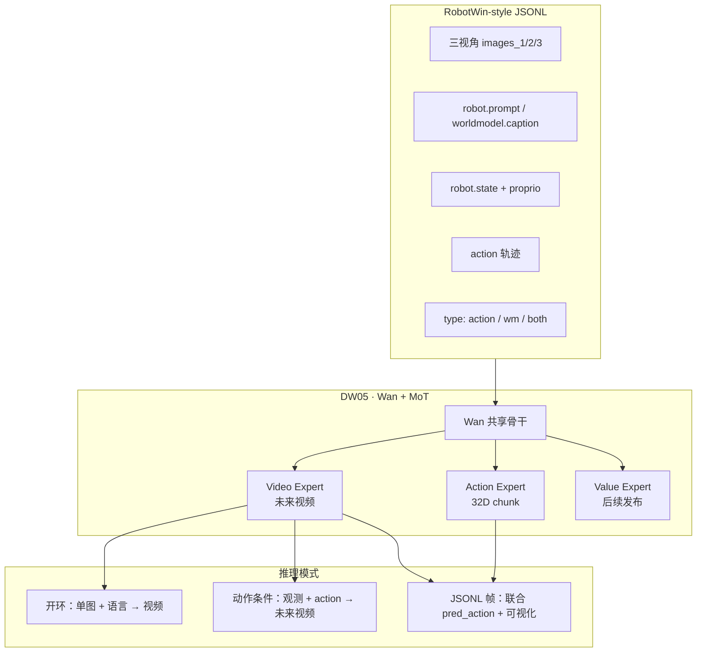

# Dexmal DW05（OpenDW）

**DW05**（2026-07，[GitHub `dexmal/opendw`](https://github.com/dexmal/opendw)，[DW05-Base](https://huggingface.co/Dexmal/DW05-Base)）是 [Dexmal](https://www.dexmal.com/) 开源的 **动作条件具身世界模型**：在共享 **Wan** 视频扩散骨干上，用 **Mixture-of-Transformers（MoT）** 分出 **视频、动作与价值** 三条专家路径，把「动作如何改变未来观测」与「下一步该怎么动」收进同一可训练栈，并发布 **基础预训练权重** 与 **RoboTwin 2.0 微调评测包**。

## 一句话定义

**Wan + MoT 的 Joint WAM：同一骨干联合预测未来视频、生成 32 维动作 chunk，并预留状态–价值专家；开源完整训练/推理与 RobotWin 对齐数据格式。**

## 英文缩写速查

| 缩写 | 英文全称 | 简要说明 |
|------|----------|----------|
| WM | World Model | 学习环境动态以供想象/规划的世界模型 |
| WAM | World Action Model | 联合世界预测与动作生成的具身策略框架 |
| MoT | Mixture-of-Transformers | 共享骨干下分模态/分任务专家头的 Transformer 混合架构 |
| VAM | Video-Action Model | 视频扩散骨干同时服务未来预测与动作解码 |
| VLA | Vision-Language-Action | 视觉-语言-动作策略；DW05 更强调动作条件 **后果视频** |
| SFT | Supervised Fine-Tuning | 监督微调；DW05-Robotwin 为 RoboTwin 2.0 下游包 |

## 为什么重要

- **开源闭环完整：** 相对仅发 blog/权重的路线，OpenDW 同时放出 **推理、训练、数据 schema 与 norm stats 工具**，便于复现 **动作条件 rollout** 与二次微调。
- **动作条件视频是核心接口：** 在线 demo 展示 **给定观测与动作序列 → 预测未来多视角视频**，把世界模型从「预览」推进到 **操纵后果仿真**——与 [τ₀-World Model](./tau0-world-model.md) 的联合 VAM 叙事同族，但工程栈归属 Dexmal **Dexbotic DW05** 运行时。
- **与 DM0.5 形成机构双线：** [Dexmal DM0.5](./dexmal-dm05.md) 走 **Gemma VLM + Flow 动作专家** 的开放世界 **VLA**；DW05 走 **Wan 视频骨干 + MoT** 的 **世界–动作联合** 线，覆盖「先想象再控制」的研究与集成需求。
- **RoboTwin 生态落地：** **DW05-Robotwin** 自带 **policy 归一化统计** 与在线评测配置；Base checkpoint **不含** `norm_stats.json`，避免误把通用权重当 RobotWin 即插即用策略。

## 核心结构

| 模块 | 作用 |
|------|------|
| **Wan 骨干** | 多模态条件（语言、图像/视频、机器人类型、状态、动作）下的视频扩散表征 |
| **Video Expert** | **未来视频预测**；开环单图推理与动作条件 rollout 的可视化出口 |
| **Action Expert** | **32 维 action chunk** 与 **32 维 proprio** 接口；与 checkpoint 维度须严格一致 |
| **Value Expert** | **状态–价值估计**（README 注明后续版本更新；当前公开侧重 video/action） |
| **运行时 bundle** | `model.pt` + 本地 `vae/`、`text_encoder/`、`tokenizer/`；`DW05_MODEL_BASE_PATH` 指向根目录 |
| **数据层** | **RobotWin-style JSONL**：帧级 `type` 区分 `action` / `wm` 监督；三视角 `images_*`、缓存 text embedding、`norm_stats.json` |

### 公开权重分工

| Checkpoint | 用途 | 备注 |
|------------|------|------|
| [**DW05-Base**](https://huggingface.co/Dexmal/DW05-Base) | 多源预训练 **通用 32D** 基础模型 | step **140k**；**无** RobotWin policy norm stats |
| [**DW05-Robotwin**](https://huggingface.co/Dexmal/DW05-Robotwin) | **RoboTwin 2.0** SFT 与 packaged online demo | 含匹配 **`norm_stats.json`** 与评测配置 |

## 流程总览（数据 → 训练 → 推理）

## 部署与工程要点

- **环境：** Python 3.10+、CUDA PyTorch；`pip install -e .`（可选 `'.[attention]'`）。
- **路径变量：** `DW05_MODEL_BASE_PATH`、`DIFFSYNTH_MODEL_BASE_PATH`、`TOKENIZERS_PARALLELISM=false`。
- **维度硬约束：** 构建模型时 **`action_dim=32`、`proprio_dim=32`**，与 Base/Robotwin checkpoint 一致。
- **策略归一化：** RobotWin policy 输出须使用 **对应 checkpoint 的 `norm_stats.json`**；Base 权重需自行统计或微调后再部署。
- **上游栈：** **Wan2.2**、**uMT5** 兼容文本组件（Apache-2.0；再分发须保留 NOTICE）。

## 与相邻路线的分界

| 对比轴 | DW05 | [τ₀-WM](./tau0-world-model.md) | [DM0.5](./dexmal-dm05.md) |
|--------|------|-------------------------------|---------------------------|
| **范式** | Joint **WAM**（Wan + MoT 三头） | Joint **VAM**（5B，测试时仿真选动作） | **VLA**（Gemma VLM + Flow 动作专家） |
| **开源粒度** | 训练 + 推理 + 数据 recipe | 策略 server 已发；完整测试时环待续 | 博文能力叙事为主 |
| **数据接口** | **RobotWin JSONL** 一等公民 | 多视角遥操作 + UMI + 人视频掩码 | 多本体操作 + 导航 + 人视频混合 |
| **价值头** | 架构预留，公开版侧重 video/action | 动作条件 **task-progress** 评估 | 不显式世界 rollout |

## 常见误区

- **误区 1：DW05-Base 可直接跑 RobotWin policy demo。** Base **不带** policy `norm_stats.json`；请用 **DW05-Robotwin** 或自算统计后微调。
- **误区 2：有视频生成就等于 VLA。** DW05 的核心是 **动作条件世界动态** 与 **联合动作头**；纯语言→动作反应式部署应看 VLA 线（如 DM0.5）。
- **误区 3：Value Expert 已完整发布。** README 明确 **Value Expert 后续更新**；当前评测与 demo 以 **video + action** 为主。

## 与其他页面的关系

- [World Action Models（WAM）](../concepts/world-action-models.md) — Joint 族谱；DW05 为 **Wan + MoT 三专家** 开源实例
- [Generative World Models](../methods/generative-world-models.md) — 像素/ latent 视频预测工具箱
- [mimic-video（VAM）](../methods/mimic-video.md) — 另一条视频–动作工程路线
- [Manipulation](../tasks/manipulation.md) — 双臂/多视角操作与 **动作条件仿真** 语境
- [RoboTwin 2.0](./robotwin.md) — 数据合成平台与 **DW05-Robotwin** 评测对齐
- [ABot-M0.5](./paper-abot-m05-mobile-manipulation-wam.md) — 同属 **Wan2.2 系 WAM**；ABot 聚焦移动操作 **latent action + Dream Forcing**

## 参考来源

- [dexmal/opendw 仓库归档](../../sources/repos/dexmal_opendw.md)
- [OpenDW GitHub](https://github.com/dexmal/opendw)
- [DW05-Base（Hugging Face）](https://huggingface.co/Dexmal/DW05-Base)
- [DW05-Robotwin（Hugging Face）](https://huggingface.co/Dexmal/DW05-Robotwin)

## 关联页面

- [World Action Models（WAM）](../concepts/world-action-models.md)
- [Dexmal DM0.5](./dexmal-dm05.md)
- [τ₀-World Model](./tau0-world-model.md)
- [RoboTwin 2.0](./robotwin.md)
- [mimic-video（VAM）](../methods/mimic-video.md)
- [Manipulation](../tasks/manipulation.md)

## 推荐继续阅读

- OpenDW README（架构图与 demo）：<https://github.com/dexmal/opendw>
- DW05-Base 模型卡：<https://huggingface.co/Dexmal/DW05-Base>
- RoboTwin 2.0 官方仓库：<https://github.com/msc-robotwin/robotwin>
