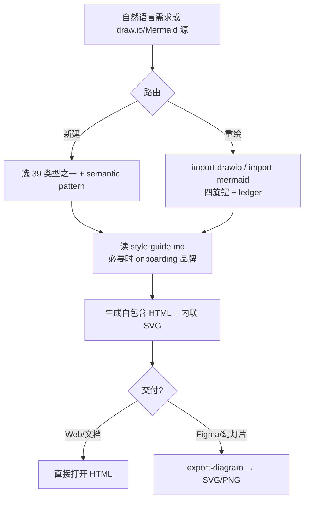
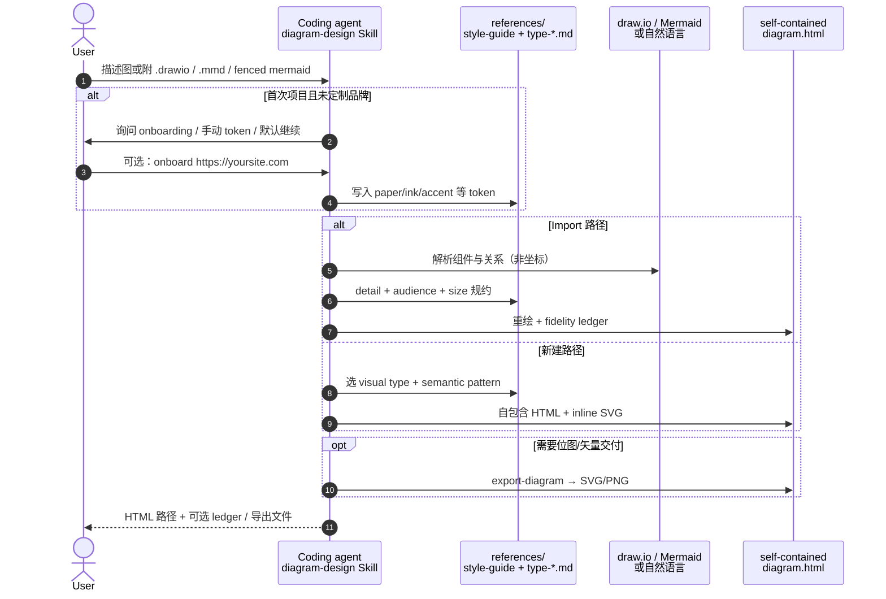

# Diagram Design

**Diagram Design**（[cathrynlavery/diagram-design](https://github.com/cathrynlavery/diagram-design)，MIT）是面向 **Claude Code、Codex、Factory Droid、Pi** 等 harness 的 **Agent Skill + marketplace 插件**：代理按 **39 种 editorial 版式**（架构、时序、象限、飞轮、Sankey、Wardley、kanban、UML class 等）生成 **自包含 HTML + 内联 SVG**，并可从 **draw.io / Mermaid** 源 **重绘** 为同一设计系统下的交付物。项目 gallery：[cathrynlavery.github.io/diagram-design](https://cathrynlavery.github.io/diagram-design/)。

## 一句话定义

用 **Agent Skill + 固定 editorial 设计系统** 把系统说明、决策逻辑或已有 draw.io/Mermaid 草图编译成 **可直接截图、导出 PNG/SVG、可品牌化的静态图**——默认 **无构建、无脚本、无通用圆角 Mermaid 审美**，而不是可编辑 CAD 或 JSON 校验器。

## 英文缩写速查

| 缩写 | 英文全称 | 简要说明 |
|------|----------|----------|
| SVG | Scalable Vector Graphics | 内联于 HTML 的矢量图；可单独导出给 Figma / 幻灯片 |
| HTML | HyperText Markup Language | 默认交付：单文件自包含图 + 可选 summary card |
| PNG | Portable Network Graphics | `/export-diagram` 栅格导出；可调 scale |
| WCAG | Web Content Accessibility Guidelines | onboarding 时对 `ink`/`paper` 做 AA 对比度校验 |
| SKILL.md | Agent Skill Manifest | `skills/diagram-design/SKILL.md`：类型路由、import/export 与 style-guide 契约 |
| LLM | Large Language Model | 代理读 Skill 规约并生成/重绘图，不是运行时渲染引擎 |

## 为什么重要

1. **补 wiki 页内 Mermaid 的「对外沟通层」。** 本站方法页用 Mermaid 表达 **知识结构**（版本友好、lint 可检）；组会、博客、README、赞助页常需要 **editorial 密度与品牌色**。Diagram Design 专司这一层，不替代 git 内 Mermaid。
2. **机器人栈同样需要「讲清楚」的五类图。** 仿真集群 / 策略服务 / 真机安全层（architecture）、遥操作→数据集→训练→评测（dataflow / process）、策略状态机（state）、多团队泳道（swimlane）、影响×工作量象限（quadrant）——Skill 已内置版式与 **semantic patterns**（队列、策略 trace、信任边界等）路由。
3. **Import 是重绘而非坐标转换。** 读 draw.io / Mermaid **语义**（组件、关系、分组），丢弃源坐标与 pastel 配色，经 **detail / audience / size** 四旋钮输出 **fidelity ledger**——适合把 README 里的 Mermaid 块或旧 draw.io 升级为 slide-ready 图。
4. **与 Archify、Draw.io Scientific Illustrator 分工明确。** 要 **JSON 校验 + Delta 审阅** 走 [Archify](./archify.md)；要 **可见步进 `.drawio` 科研插图** 走 [Draw.io Scientific Illustrator](./drawio-scientific-illustrator.md)；要 **editorial HTML/SVG + 品牌 onboarding + Mermaid/draw.io 重绘** 走本页。

## 核心原理

| 层次 | 内容 |
|------|------|
| **Skill 根** | `skills/diagram-design/`：`SKILL.md`、`references/*`（39 类型 spec、style-guide、import/export、semantic-patterns、animation） |
| **视觉类型（39）** | 每种有 minimal light / dark / full-editorial；模板见 `assets/template*.html` |
| **语义模式（8）** | 行为优先：fan-in 队列、策略 trace、secure paved road 等 → 映射 **最近邻视觉类型**，不膨胀类型计数 |
| **品牌** | onboarding 抓站点 CSS → `style-guide.md` token；多项目用 `~/.diagram-design/profiles/` + `.diagram-design` marker |
| **Import** | `/import-drawio`、`/import-mermaid`：四旋钮 + fidelity ledger |
| **Export** | `/export-diagram` → SVG / PNG（`--scale`） |
| **动效（可选）** | `template-motion.html`：`reveal` / `step` / `loop`；默认 `none`，静态首帧完整 |

### 流程总览

## 源码运行时序图

主仓 **已开源**（MIT，入库时 README **v2.5.10**）。下列时序对齐 Skill 的 **新建图** 与 **Mermaid 重绘** 路径（无独立 CLI 守护进程；代理按 `SKILL.md` 写 HTML）。

关键复现路径：按 harness 安装 marketplace 或 `ln -s .../skills/diagram-design ~/.cursor/skills/diagram-design` → 对话中点名 Diagram Design 或 `/skill:diagram-design` → 本地打开 `skills/diagram-design/assets/index.html` 对照版式。

## 工程实践

| 项 | 要点 |
|----|------|
| **Claude Code** | `/plugin marketplace add cathrynlavery/diagram-design` → `/plugin install diagram-design@diagram-design`；启用 marketplace auto-update |
| **Codex** | `codex plugin marketplace add cathrynlavery/diagram-design` → `codex plugin add diagram-design@diagram-design` |
| **Pi** | `pi install https://github.com/cathrynlavery/diagram-design`；`/reload`；显式 `/skill:diagram-design` |
| **Cursor 可编辑** | 克隆仓 → `ln -s ~/code/diagram-design/skills/diagram-design ~/.cursor/skills/diagram-design` |
| **品牌** | `onboard diagram-design to https://yoursite.com` 或编辑 `style-guide.md`；多品牌用 profile + `.diagram-design` marker |
| **Import 提示** | 说明 **audience**（executive/mixed/engineer）与 **size**（如 slide-16x9）；要 faithful 细节时声明 node 上限 |
| **开源状态** | **已开源**（截至 2026-09-08）：项目页链 GitHub；gallery 与 Skill 均可本地运行 |

## 局限与风险

- **误区：Diagram Design = 本库 Mermaid 渲染器。** 本站 wiki **继续用 Mermaid** 做结构图。本 Skill 产出 **独立 HTML 工件**；Import 路径是 **语义重绘**，不保留 Mermaid 自动布局或 draw.io 对角连线。
- **误区：输出是可编辑 draw.io。** 交付物是 **HTML/SVG/PNG**；要 `.drawio` 逐步编辑走 [Draw.io Scientific Illustrator](./drawio-scientific-illustrator.md)。
- **误区：等同 Archify 校验环。** [Archify](./archify.md) 用 **typed JSON + `validate`/`deliver`/`compare`** 做 showcase 门禁；Diagram Design 用 **editorial 规约 + style-guide**，无统一 JSON schema Delta。
- **Managed 安装会覆盖本地 style-guide 改动**；定制 token 应 clone 可编辑安装或只用 profile 库。
- **Motion HTML 受硬边界约束**；任意内联脚本 / 远程资源会被拒绝；`prefers-reduced-motion` 时必须完整静态首帧。

## 与相近方案的对照

| 方案 | 产物 | 代理接口 | 强项 |
|------|------|----------|------|
| **Diagram Design** | 自包含 HTML/SVG/PNG | Agent Skill（多 marketplace） | 39 editorial 类型、品牌 onboarding、draw.io/Mermaid 重绘 |
| [Archify](./archify.md) | HTML + 导出图 | Skill + Node CLI | JSON 校验、Architecture Delta、五类系统图 |
| [Draw.io Scientific Illustrator](./drawio-scientific-illustrator.md) | 可编辑 `.drawio` | Codex Skill + MCP | 可见步进、科研插图 |
| [Manim](./manim.md) | 讲解视频 | Python Scene | 时间线叙事，不是静态框图 |
| [GSAP Skills](./gsap-skills.md) | Web UI 动效 | 官方 SKILL.md | DOM 动效，不是系统拓扑 |
| 本库 Mermaid | Markdown 内流程图 | 无（静态编译） | wiki 结构、版本友好 |

## 关联页面

- [Archify](./archify.md) — **JSON 校验系统图**；要 editorial 幻灯片/品牌 HTML 走本页
- [Draw.io Scientific Illustrator](./drawio-scientific-illustrator.md) — **可见步进 `.drawio`**；本 Skill 可 import draw.io 但产出 HTML
- [Manim](./manim.md) — **程序化讲解动画**
- [GSAP Skills](./gsap-skills.md) — **Web 动效** 官方技能
- [Skills For Real Engineers（mattpocock）](./mattpocock-skills.md) — 通用编码工程技能对照
- [Agentic Coding 时代的软件工程基础](../concepts/agentic-coding-software-fundamentals.md) — 架构沟通仍要人取舍；本工具把已决定的边界画清楚
- [LLM Wiki（Karpathy 模式）](../references/llm-wiki-karpathy.md) — 知识编译进 wiki；Diagram Design 编译沟通工件
- [ingest 工作流](../../schema/ingest-workflow.md) — 本站资料入库规范

## 参考来源

- [diagram-design 仓库源归档（本站）](../../sources/repos/diagram-design.md)
- [Diagram Design 项目页归档（本站）](../../sources/sites/diagram-design-cathrynlavery-github-io.md)
- [cathrynlavery/diagram-design（GitHub README）](https://github.com/cathrynlavery/diagram-design)
- [skills/diagram-design/SKILL.md](https://github.com/cathrynlavery/diagram-design/blob/main/skills/diagram-design/SKILL.md)

## 推荐继续阅读

- [Diagram Design gallery](https://cathrynlavery.github.io/diagram-design/) — 39 类型 light/dark/editorial 预览
- [docs/cookbook.md](https://github.com/cathrynlavery/diagram-design/blob/main/docs/cookbook.md) — onboarding、import/export、Windows junction 等配方
- [semantic-patterns.md](https://github.com/cathrynlavery/diagram-design/blob/main/skills/diagram-design/references/semantic-patterns.md) — 八类行为模式路由
- [Agent Skills](https://agentskills.io/) — `SKILL.md` 约定
