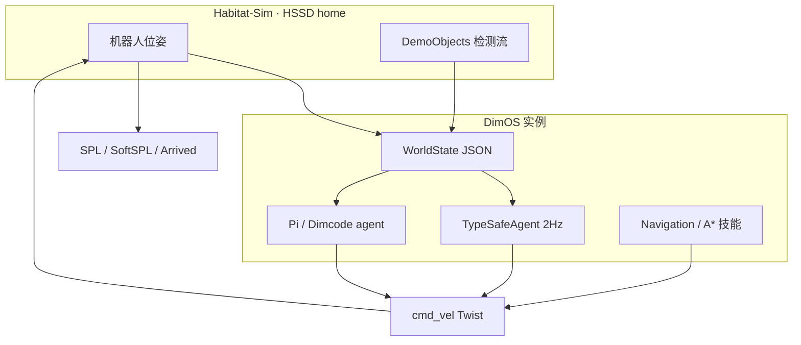

# Can Jev Nav?（Dimensional · Nav Arena）

**Can Jev Nav?**（[Dimensional Research](https://research.dimensional.org/system-one-navigation)，2026）是 Dimensional 对 **System One 模型能否承担实时机器人导航** 的公开基准报告：在 **Habitat-Sim + HSSD 家庭场景** 上，用统一 **WorldState（JSON/字符串）** 感知抽象，对比 **DimOS Dimcode 导航工具**、**TypeSafe Jev（无 tool、typed 速度选择）** 与多款 **Pi harness coding agent**（仅 Zenoh `world_state` / `cmd_vel` / `finished`）。

## 一句话定义

**在同等文本 WorldState 下问：算法化导航技能、2 Hz Jev 与「写脚本控 cmd_vel」的 coding agent，谁能在室内 object-goal 任务上兼顾 SPL、到达率、时间与 token 成本。**

## 英文缩写速查

| 缩写 | 英文全称 | 简要说明 |
|------|----------|----------|
| SPL | Success weighted by Path Length | 成功且路径长度相对最短路的比例 |
| SoftSPL | Soft Success weighted by Path Length | 以终距目标连续加权成功的 SPL 变体 |
| HSSD | Habitat Synthetic Scenes Dataset | CVPR 2024 合成室内场景数据 |
| OGN | Object-Goal Navigation | 导航至指定类别/实例物体 |
| WorldState | — | 报告定义的 JSON/文本环境抽象（非原始点云） |
| Dimcode | — | Dimensional agent harness，可调 dimOS 导航/规划 tools |

## 为什么重要

- **System One × 具身导航的首批大规模公开对照：** 与软件 workflow eval 不同，本报告固定 **327 任务 × 6 driver**，把 [Jev](./typesafe-jev.md) 放进 **与 A* 技能、Pi agent 同场** 的 Habitat 四足设定。
- **WorldState 设计即结论的一部分：** Jev 在 **world-frame 数值** vs **robot-frame + 自然语言 helper** 上完成率 **40% → 90%**（84 任务子集），说明 **typed S1 对 state 工程极度敏感**——对 [NavJev](./paper-navjev-efficient-vln-jev.md) 等 **ACVC 文本压缩** 路线有直接动机。
- **工具 vs 纯推理的分工证据：** **Dimcode + Navigate()** 仍 **~0.74 mean SPL / 88.4% arrived**，高于 **Astra Pi（0.52 / 76%）** 与 **Jev（0.26 / 46%）**——支持「**毫秒级规划/技能 + 慢环 LLM**」分层，而非让 S1 单独闭环长距导航。
- **复现锚在 dimOS：** 套件 `dimos.evals.suites.habitat_nav`、分支 `feat/typesafe-world-state` 与 [DimOS 导航能力文档](https://github.com/dimensionalOS/dimos/blob/main/docs/capabilities/navigation/index.md) 绑定，便于对照 **Go2 真机栈** 与 **habitat-nav 仿真蓝图**。

## 核心结构

| 模块 | 作用 |
|------|------|
| **Scene / Task 生成** | 133 homes（Habitat），每 home 最多 6 个 object-goal；间距与路径重叠约束 |
| **WorldState 构建** | 场景图 → 文本：goal、robot.recent、objects、way_to_target、free_space、been_there 等 |
| **TypeSafeAgent（Jev）** | 2 Hz；`drive.*` / `stop` / `task` / `target` choices → `Twist` |
| **RawRobotBridge + Pi agents** | 同频 WorldState；agent 自写 zenoh 客户端发 `cmd_vel` |
| **Dimcode driver** | dimOS **navigation & path planning** tool calls |
| **评分** | 测地线 `G`、SPL、SoftSPL、碰撞、时间、路径平滑等 |

### 流程总览

## 实验与评测（摘要）

| Driver | Mean SPL ↑ | Arrived ↑ | 备注 |
|--------|------------|-----------|------|
| Dimensional Dimcode | **0.743** | **88.4%** | 典型单次 `Navigate()` |
| Astra + Pi | 0.522 | 76.1% | 成本 ~$1.61/run |
| Fable 5.1 + Pi | 0.330 | 50.8% | |
| **TypeSafe Jev** | 0.263 | 45.9% | ~$0.08/run；短路径子集接近 Fable |
| GPT-5.6 + Pi | 0.213 | 32.1% | |
| Opus 4.7 + Pi | 0.125 | 18.7% | |

- **短路径（&lt;10 m，45 任务）：** Jev **71.1% arrived**，median **51 s**，成本 **$0.055/run** — 报告强调 **速度与成本** 相对 coding agent 的优势区间。
- **真机多房间：** 报告称仿真外 **WorldState 墙/门标注** 更难，Jev 多房间成为瓶颈；建议 **~4 Hz 外环 + 粗粒度控制** 或 **慢 LLM 外环**。

## 工程实践

| 项 | 建议 |
|----|------|
| **复现 Jev 轨** | `git checkout feat/typesafe-world-state` → `dimos evals run dimos.evals.suites.habitat_nav ...`（见报告 Reproduction） |
| **state 设计** | 为 Jev 优先 **robot-frame + 离散语言 helper**，避免裸 world 坐标 |
| **选型** | 长距 / 高 SPL → **DimOS 导航模块或 Nav2 类规划**；Jev 适合 **短程分支、代价敏感** 或与 [NavJev](./paper-navjev-efficient-vln-jev.md) 式 **ACVC 压缩** 组合 |
| **与 DimOS Go2 栈** | 真机 column-carving + A* 见 [DimOS 实体](./dimensionalos-dimos.md) 与仓库 [navigation deep dive](https://github.com/dimensionalOS/dimos/blob/main/docs/capabilities/navigation/deep_dive.md) |

## 局限与风险

- **God-view WorldState：** 仿真中障碍物/物体可早于真实传感器可见 — 可能 **偏袒 Jev**（报告 Caveats 自述）。
- **非 VLN 指令跟随：** 任务是 **object-goal**，不是 R2R 自然语言段落 — 与 [VLN 任务页](../tasks/vision-language-navigation.md) 互补但不等价。
- **模型与 harness 版本：** driver 名称（gpt-6-astra、claude-fable-5-1 等）随产品迭代；数字以报告页为准。
- **Jev API 依赖：** 与 [Jev 实体](./typesafe-jev.md) 相同 — **托管 API**，不可本地权重复现 Jev 轨。

## 关联页面

- [DimOS（Dimensional）](./dimensionalos-dimos.md) — 评测运行时、Habitat 蓝图 `habitat-nav`、Go2 导航栈
- [Jev（TypeSafe System One）](./typesafe-jev.md) — 2 Hz typed drive 与 software workflow eval 对照
- [NavJev 论文](./paper-navjev-efficient-vln-jev.md) — VLN-CE 上 Jev + ACVC/DASM 的学术延伸
- [具身导航 agent 评测（SPL 原论文）](./paper-rcl-1807-06757-on-evaluation-of-embodied-navigation-agents.md) — SPL 指标来源
- [零样本 Object-Goal Navigation](../tasks/zero-shot-object-navigation.md) — 任务族对齐
- [具身大模型评测基准选型闭环知识链](../queries/embodied-eval-benchmark-selection-loop.md) — Nav Arena 属其 ③ 策略任务成功率评测层（SR/SPL）；Habitat 结论外推 Go2 真机需 ④ sim↔real 校准

## 参考来源

- [Can Jev Nav? 站点归档](../../sources/sites/dimensional_research_can_jev_nav.md)
- [DimOS 仓库归档](../../sources/repos/dimensionalos_dimos.md)
- [Can Jev Nav?（在线报告）](https://research.dimensional.org/system-one-navigation)

## 推荐继续阅读

- [DimOS Navigation 能力索引](https://github.com/dimensionalOS/dimos/blob/main/docs/capabilities/navigation/index.md)
- [TypeSafe Jev 介绍博文](https://typesafe.ai/blog/introducing-system-one-models-and-jev)
- Habitat 数据：[HSSD-200（arXiv:2306.11290）](https://arxiv.org/abs/2306.11290)
