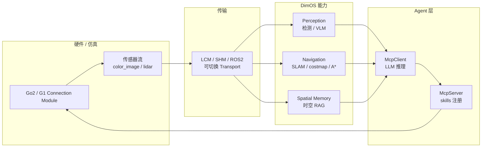

# DimOS（Dimensional 物理空间 Agent OS）

> **勿与 ICCV 2023 [DIMOS](./paper-dimos-human-scene-motion-synthesis.md)**（室内 SMPL 人–场景运动合成，[zkf1997/DIMOS](https://github.com/zkf1997/DIMOS)）混淆。本文档指 **[dimensionalOS/dimos](https://github.com/dimensionalOS/dimos)** 开源机器人集成栈。

## 一句话定义

**DimOS** 是 Dimensional 推出的 **agent-native 物理空间操作系统**：用 **Python Module + Blueprint** 把相机/LiDAR 感知、SLAM 导航、时空记忆、控制环与 **LLM Agent（MCP skills）** 串成可复用应用；**默认无需 ROS**，一条 `dimos run` 即可在 **Unitree Go2/G1**、机械臂、无人机等硬件或 MuJoCo 仿真上跑通「导航 + agent 对话控制」闭环。

## 英文缩写速查

| 缩写 | 英文全称 | 简要说明 |
|------|----------|----------|
| DimOS | Dimensional Operating System | 本仓库品牌名；README 亦写作 Dimensional |
| MCP | Model Context Protocol | Agent 调用机器人 skills/tools 的开放协议 |
| LCM | Lightweight Communications and Marshalling | DimOS 默认模块间传输；低延迟 pub/sub |
| SLAM | Simultaneous Localization and Mapping | 同步定位与建图，Go2 导航蓝图核心 |
| VLM | Vision-Language Model | 感知栈中的视觉–语言模型推理 |
| ROS 2 | Robot Operating System 2 | 可选传输后端之一，非安装前提 |
| MuJoCo | Multi-Joint dynamics with Contact | `--simulation` 人形/四足仿真后端 |

## 为什么重要

- **降低「先学 ROS 再写机器人」门槛：** README 明确 **no ROS required**；用 `uv pip install 'dimos[base,unitree]'` 即可从回放/仿真起步，对只想快速验证 **导航 + LLM agent** 的团队更友好。
- **Agent-native 一等公民：** CLI 提供 `dimos agent-send`、`dimos mcp list-tools/call`；Blueprint 可原生接入 `McpServer` / `McpClient`，把「hey Robot, go find the kitchen」类指令落到 skills（如 `relative_move`）。
- **跨形态硬件目录：** 同一框架覆盖 **四足（Go2 stable、B1 experimental）**、**人形 G1（beta）**、**xArm / AgileX Piper**、**MAVLink / DJI 无人机（alpha）**，适合作为 **Unitree 生态的 ROS-optional 集成层** 对照 [unitree_ros](./unitree-ros.md) 遗产栈。
- **空间记忆与导航并重：** 除 SLAM + A* 导航外，强调 **spatio-temporal RAG**、动态记忆与物体持久性——把「会走的机器人」推进到「记得环境的 agent」。

## 核心结构

| 组件 | 作用 |
|------|------|
| **Module** | 子系统抽象；类型化 `In[T]` / `Out[T]` 数据流 + `@rpc` 启停；消息对齐 `sensor_msgs.Image`、`geometry_msgs.Twist` 等 |
| **Blueprint** | `autoconnect(module_a(), module_b(), ...)` 按流名与类型自动接线；`.transports({...})` 切换 LCM / SHM / DDS / ROS 2 |
| **Runfile / CLI** | `dimos run <name>`、`--simulation`、`--replay`；`--daemon` + `dimos status/log/stop` 管理长驻进程 |
| **Platform adapters** | `dimos.robot.unitree.go2` / `g1` 连接模块；真机 Go2 经 WebRTC + `ROBOT_IP` |
| **Agents** | MCP server/client 模块；可接 Ollama 本地 LLM（`unitree-go2-agentic-ollama`） |
| **Capabilities** | 导航建图、感知（检测/VLM/音频）、操作（manipulation extra）、空间记忆、可视化（Rerun 等） |

## 流程总览（Agentic 四足蓝图）

## 常见误区或局限

- **≠ ICCV DIMOS：** 图形学 **human-scene interaction 运动合成** 论文实现是另一项目；检索「DIMOS」时需看组织名 **dimensionalOS** vs **zkf1997**。
- **Pre-Release Beta：** API、硬件成熟度矩阵（🟩/🟨/🟧/🟥）仍在快速迭代；G1/B1/无人机等多为 beta 以下。
- **不是 VLA 训练框架：** 与 [LeRobot](./lerobot.md) 等 **数据集 + 策略训练** 栈正交；DimOS 侧重 **现场集成、导航、agent 编排与 MCP 部署**。
- **ROS 可选而非对立：** 导航能力文档写明可走 **DimOS native 或 ROS**；重度 Nav2/slam_toolbox 生态用户仍可能混用 ROS 2 传输。
- **真机安全：** 自然语言 agent 直接驱动运动前，应沿用 teleop 同款 **急停、限速与仿真预演**（`--simulation` / `--replay`）。

## 关联页面

- [ROS 2 基础](../concepts/ros2-basics.md) — DimOS 宣称无需 ROS 即可起步；ROS 2 仍可作为传输与导航互操作层
- [ROS 2 vs LCM](../comparisons/ros2-vs-lcm.md) — DimOS 默认 **LCMTransport** 连模块流
- [Unitree G1](./unitree-g1.md) — `dimos --simulation run unitree-g1-sim`；README 列 beta 支持
- [Unitree 品牌](./unitree.md) — Go2/G1 官方 SDK 之外的集成路线
- [LeRobot](./lerobot.md) — 训练/数据侧框架；与 DimOS 部署侧分工
- [Navigation2](./navigation2.md) — ROS 2 导航参考实现；DimOS 提供并行 native 导航路径
- [导航·SLAM·自动驾驶栈总览](../overview/navigation-slam-autonomy-stack.md) — 本栈作为 ROS-optional agent 导航补充
- [Teleoperation](../tasks/teleoperation.md) — 键盘遥操作 xArm7 等 manipulation 演示

## 参考来源

- [DimOS 仓库归档](../../sources/repos/dimensionalos_dimos.md)
- [dimensionalOS/dimos（GitHub）](https://github.com/dimensionalOS/dimos)
- [Dimensional 官网](https://dimensionalos.com/)

## 推荐继续阅读

- [RIO（Robot I/O）](./robot-io-rio.md) — 另一套跨形态 **实时 I/O + 异步 VLA 推理** 编排框架（CMU RSS 2026 线）
- [unitree_ros（ROS1/Gazebo）](./unitree-ros.md) — Unitree 经典 ROS 遗产栈，与 DimOS 选型对照
- DimOS 文档：[Modules](https://github.com/dimensionalOS/dimos/blob/main/docs/usage/modules.md)、[Blueprints](https://github.com/dimensionalOS/dimos/blob/main/docs/usage/blueprints.md)、[CLI](https://github.com/dimensionalOS/dimos/blob/main/docs/usage/cli.md)（以仓库 `main` 为准）
