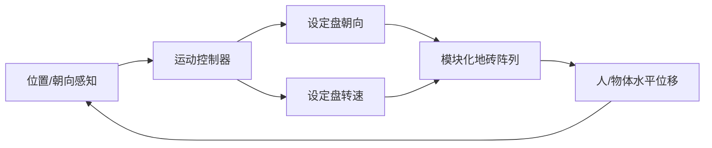

# Disney Holotile（全向活动地板）

**一句话定义：** Holotile 是 Disney Research / Imagineering 的 **模块化全向地板**：用大量六边形地砖单元形成可 **被动全向行走** 与 **主动可编程运动** 的支撑面，让人在有限房间内「任意方向无限步行」，并可用于物体「遥移」类演示。

## 英文缩写速查

| 缩写 | 英文全称 | 简要说明 |
|------|----------|----------|
| VR | Virtual Reality | 头显/沉浸式显示驱动的虚拟环境 |
| AR | Augmented Reality | 虚实叠加交互；公开演示叙事中与 VR 并列 |
| HCI | Human–Computer Interaction | 人机交互；Holotile 落在沉浸式交互硬件侧 |
| DoF | Degrees of Freedom | 自由度；地面需在水平面内提供可任意定向的位移 |
| LIDAR | Light Detection and Ranging | 公开媒体称原型用激光雷达感知用户位置（非项目页正文） |
| CAD | Computer-Aided Design | 计算机辅助设计；官方未发布 Holotile CAD |
| BOM | Bill of Materials | 物料清单；未开源故无公开 BOM |

## 为什么重要

- **把「无限空间」问题从软件改到地面：** 多数 VR locomotion 靠摇杆、瞬移或重定向行走（redirected walking）；Holotile 用 **主动地面代偿** 让真实步态与有限房间共存。
- **与角色机器人线正交：** Disney LA 的 [Olaf](../methods/disney-olaf-character-robot.md) / [BDX](./paper-notebook-design-and-control-of-a-bipedal-robotic-characte.md) 解决「角色怎么自己走」；Holotile 解决「人/物在房间里怎么被地面带着走」——同属乐园体验栈，控制对象不同。
- **多人 / 多物体叙事：** 公开演示强调同台多玩家与「遥移」搬运；专利背景明确批评单用户全向跑步机与碗形滑面难扩展。

## 核心原理

### 项目页公开表述

官方 [Holotile 专页](https://la.disneyresearch.com/holotile/) 只给出产品级定义：

1. 地板由许多 **hexes** 组成；
2. 同时支持 **passive omnidirectional locomotion** 与 **active, programmed movement**；
3. 灵感来自 *Star Trek* Holodeck；用例从 VR metaverse 到物体 telekinesis；
4. 创建者 **Lanny Smoot**，Disney Research Imagineering R&D 支持。

### 专利披露的机构机理（US10416754B2）

专利摘要给出可工程化的结构读法（实现细节以专利为准，**不等于**当前演示样机 BOM）：

| 模块 | 作用 |
|------|------|
| **Active tile / disk array** | 地砖上大量倾斜 **contact disks**，各盘抬起边缘共同拼成近似平面支撑 |
| **Disk orienting** | 设定盘的抬起段方位 → 决定物体被推动的水平方向 |
| **Disk rotation** | 盘绕轴旋转 → 提供沿该方向的连续位移 |
| **Motion controller** | 跟踪参与者位置与预测路径，选择地砖集合，必要时沿行走反方向代偿，避免撞墙或互撞 |

公开媒体（Fast Company 等）补充：原型约数英尺尺度圆台、多盘同步、可用外部手势/遥控驱动物体；**精确运动学未公开**。

## 工程实践

| 维度 | 可操作要点 |
|------|------------|
| **选型对照** | 需要「真走」且房间受限 → 评估全向地面 vs redirected walking / 瞬移；需要可复现开源栈 → **不要选 Holotile**（闭源） |
| **安全包络** | 主动地面有绊倒/甩出风险；专利与媒体均强调相对皮带式跑步机更安静，但仍需护栏/急停等系统层设计（演示未披露） |
| **感知闭环** | 媒体称 LiDAR + 定制软件；与机器人 locomotion 的状态估计类似，但估计对象是人脚/物体而非机器人本体 |
| **与机器人联调** | 若机器人站在 Holotile 上，地面速度会进入足端接触模型——公开材料未给机器人用例，部署前需自建 sim |
| **开源状态** | **确认未开源**（2026-08-01 核查项目页无代码/CAD）；复现入口是专利 + 演示视频，见 [sources 归档](../../sources/sites/disney-research-la-holotile.md) |

## 局限与风险

- **信息极度稀疏：** 官方专页无参数、无评测、无 API；机理只能下沉到专利与二手报道，存在样机与专利实施例不一致的风险。
- **不可复现：** 无仓库、无数据集、无仿真模型；不宜写入「可跟做」清单。
- **任务边界：** Holotile **不是** 足式机器人 locomotion 方法；评估行走策略时勿把地面代偿当成策略能力。
- **产品化未知：** 公开表述为研究探索，无乐园落地时间表。

## 关联页面

- [Disney Research LA](./disney-research-la.md) — 机构研究门户与出版物枢纽
- [Character Animation vs Robotics](../concepts/character-animation-vs-robotics.md) — 乐园体验里「角色表演」与「物理可控」边界
- [Locomotion](../tasks/locomotion.md) — 机器人自身移动任务（与地面代偿对照）
- [Disney Olaf 角色机器人](../methods/disney-olaf-character-robot.md) — 同机构「角色自己走」路线
- [Open Duck Mini](./open-duck-mini.md) — BDX 风格开源迷你复刻（可复现对照）

## 参考来源

- [Holotile 项目页归档](../../sources/sites/disney-research-la-holotile.md)
- [Disney Research LA Research 总览归档](../../sources/sites/disney-research-la.md)

## 推荐继续阅读

- [Holotile 官方专页](https://la.disneyresearch.com/holotile/)
- [US10416754B2 — Floor system providing omnidirectional movement…](https://patents.google.com/patent/US10416754B2/en)
- [Fast Company：A Disney Imagineer explains HoloTile](https://www.fastcompany.com/91019277/a-disney-imagineer-explains-how-they-made-the-holotile-floor-a-magical-walkway-that-moves-in-any-direction)
