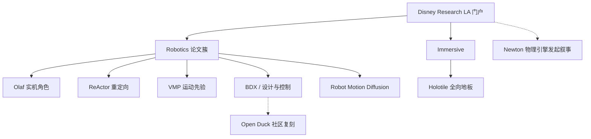

# Disney Research LA（研究门户）

**一句话定义：** [Disney Research Los Angeles](https://la.disneyresearch.com/research/) 是迪士尼面向全球研究社区的 **产业实验室门户**：公开声明做基础与应用研究并部署到海量用户体验，当前站内三大方向为 **Robotics**、**Artificial Intelligence & Machine Learning**、**Immersive Technologies**。

## 英文缩写速查

| 缩写 | 英文全称 | 简要说明 |
|------|----------|----------|
| RL | Reinforcement Learning | 角色控制与运动重定向论文的主训练范式 |
| VR | Virtual Reality | Immersive 方向常见载体；Holotile 的核心用例之一 |
| HCI | Human–Computer Interaction | 出版物筛选中的人机交互簇 |
| RSS | Robotics: Science and Systems | 门户提及的机器人顶会示例 |
| SIGGRAPH | Special Interest Group on Computer Graphics | 门户提及的图形学顶会；角色/动画论文常投 |
| PDF | Portable Document Format | 多数 publication 页的主要开放物 |

## 为什么重要

- **娱乐机器人的机构坐标：** 本库已沉淀的 Olaf、BDX、VMP、ReActor、Robot Motion Diffusion 等多条线，官方入口都汇到 `la.disneyresearch.com`；需要一页枢纽避免读者只在单论文页打转。
- **「角色保真」研究议程：** 与通用人形「能走能操作」不同，Disney LA 公开论文强调 **动画参考、风格化步态、接触声音、执行器热、物理可跟踪重定向**——与 [Character Animation vs Robotics](../concepts/character-animation-vs-robotics.md) 同轴。
- **开源边界清晰：** 门户积极发 PDF，但 **硬件项目（Holotile）与多数角色平台不附训练/部署仓**；社区复现应转向 [Open Duck](./open-duck-mini.md) 等，勿误判官方已开源。

## 核心结构 / 机制

### 门户组织

| 板块 | 内容 |
|------|------|
| Research Areas | Robotics · AI & Machine Learning · Immersive Technologies |
| Recent Publications | 首页卡片链到单篇 publication（含 PDF / Additional Content） |
| Collaboration | 与大学共址（文案：Caltech / Pasadena）、Internship、Academic Consultants |
| 导航 | Researchers / Alumni / Publications / Careers / News |

### 与本库知识图的映射（Robotics 主线）

| 官方入口 | 本库页面 | 备注 |
|----------|----------|------|
| [Olaf publication](https://la.disneyresearch.com/publication/olaf-bringing-an-animated-character-to-life-in-the-physical-world/) | [disney-olaf-character-robot](../methods/disney-olaf-character-robot.md) | 动画参考 + PPO；热/降噪奖励 |
| [ReActor](https://la.disneyresearch.com/publication/reactor-reinforcement-learning-for-physics-aware-motion-retargeting/) | [reactor-physics-aware-motion-retargeting](../methods/reactor-physics-aware-motion-retargeting.md) | 物理感知双层重定向 |
| [VMP](https://la.disneyresearch.com/publication/vmp-versatile-motion-priors-for-robustly-tracking-motion-on-physical-characters/) | [paper-notebook-vmp](./paper-notebook-vmp.md) | ETH + Disney Research 线 |
| [BDX / Design and Control…](https://la.disneyresearch.com/publication/design-and-control-of-a-bipedal-robotic-character/) | [paper-notebook-design-and-control…](./paper-notebook-design-and-control-of-a-bipedal-robotic-characte.md) | 待深读索引；社区见 Open Duck |
| [AMOR](https://la.disneyresearch.com/publication/amor-adaptive-character-control-through-multi-objective-reinforcement-learning/) | [paper-notebook-amor…](./paper-notebook-amor-adaptive-character-control-through-multi-ob.md) | 待深读索引 |
| [Robot Motion Diffusion Model](https://la.disneyresearch.com/publication/robot-motion-diffusion-model-motion-generation-for-robotic-characters/) | [paper-loco-manip-161-102…](./paper-loco-manip-161-102-robot-motion-diffusion-model.md) | 角色运动扩散 |
| [Holotile](https://la.disneyresearch.com/holotile/) | [disney-holotile](./disney-holotile.md) | Immersive 硬件；**未开源** |
| （跨站点）Generative Motion Rig | [generative-motion-rig](./generative-motion-rig.md) | DisneyResearch\|Studios 页，非 LA 专页 |
| （跨机构叙事）Newton | [newton-physics](./newton-physics.md) | Disney Research 为发起方之一 |

### 近期出版物（门户首页，2026-08-01）

除 Olaf / ReActor 外，首页还列出 **CoCo-InEKF**（接触丰富场景的学习接触协方差状态估计）与 **Autonomous Human-Robot Interaction via Operator Imitation**；完整列表见 [Publications Archive](https://la.disneyresearch.com/publication/)（Robotics 筛选项百余篇量级）。

## 工程实践

| 用途 | 建议 |
|------|------|
| **跟论文** | 从 [publication/](https://la.disneyresearch.com/publication/) 下 PDF → 对照本页映射表进 wiki；缺页再 ingest，勿复制门户当 wiki |
| **做复现** | 先查各论文页是否真有代码链接；Holotile / 多数角色硬件 **默认不可复现**；BDX 风格练手走 [Open Duck Mini](./open-duck-mini.md) |
| **做选型** | 需要「角色表演约束下的 RL」→ Olaf / VMP / AMOR 簇；需要「跨具身可跟踪参考」→ ReActor；需要「无限步行场地」→ Holotile（仅概念/专利） |
| **机构标签** | frontmatter 用已注册 alias `disney`（[institutions.json](../../schema/institutions.json)） |

## 局限与风险

- **站点 ≠ 苏黎世线：** VMP 等同时挂 ETH / Disney Research Switzerland；本页以 **LA 门户** 为锚，跨站点作者以论文页为准。
- **PDF 开放 ≠ 代码开放：** 门户强调发表与社区交流；复现性要按 ingest 步骤 2.5 逐项目页核查。
- **Holotile 细节在专利不在专页：** 勿把媒体报道参数写成官方规格。
- **门户文案会变：** Recent Publications 卡片随时间滚动；本页只固定结构与已升格映射。

## 关联页面

- [Disney Holotile](./disney-holotile.md)
- [Disney Olaf 角色机器人](../methods/disney-olaf-character-robot.md)
- [ReActor（物理感知运动重定向）](../methods/reactor-physics-aware-motion-retargeting.md)
- [VMP](./paper-notebook-vmp.md)
- [Character Animation vs Robotics](../concepts/character-animation-vs-robotics.md)
- [Open Duck Mini](./open-duck-mini.md)
- [Newton Physics](./newton-physics.md)
- [Generative Motion Rig](./generative-motion-rig.md)

## 参考来源

- [Disney Research LA Research 总览归档](../../sources/sites/disney-research-la.md)
- [Holotile 项目页归档](../../sources/sites/disney-research-la-holotile.md)

## 推荐继续阅读

- [Research 官方页](https://la.disneyresearch.com/research/)
- [Publications Archive](https://la.disneyresearch.com/publication/)
- [Holotile](https://la.disneyresearch.com/holotile/)
- [Disney Research YouTube](https://www.youtube.com/user/DisneyResearchHub)
