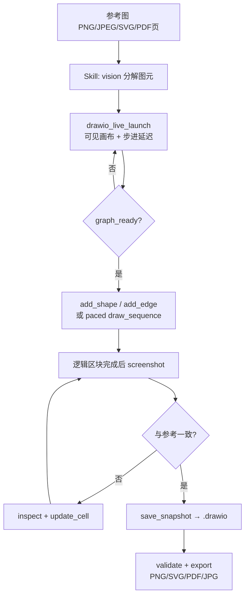
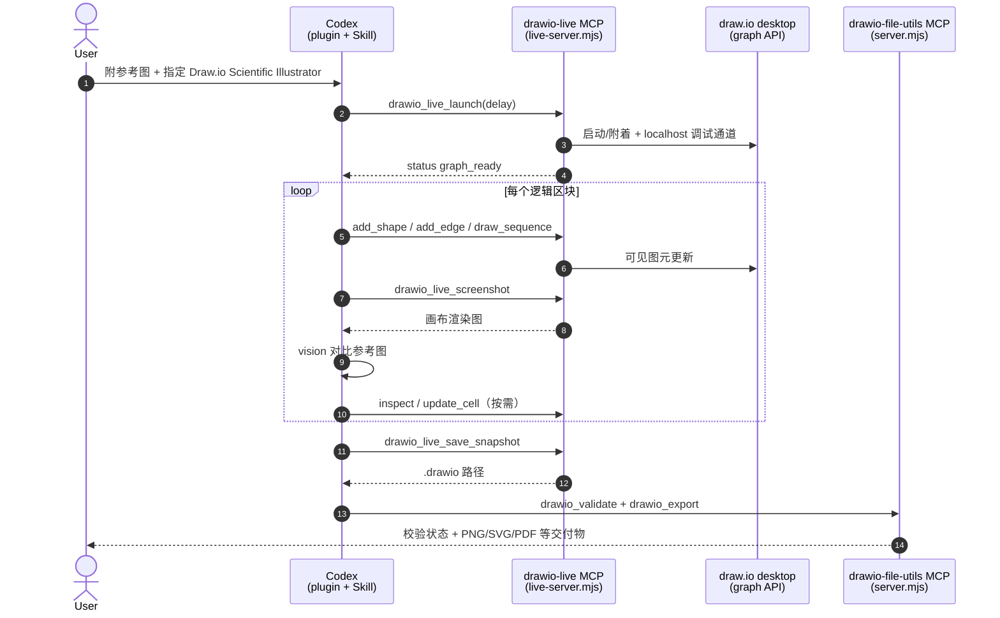

# Draw.io Scientific Illustrator

**Draw.io Scientific Illustrator**（[icebird1998/drawio-scientific-illustrator](https://github.com/icebird1998/drawio-scientific-illustrator)，MIT）是面向 **Codex** 的 **科研插图插件**：打包 **`drawio-live` / `drawio-file-utils` MCP**、技能 **`recreate-scientific-figure-in-drawio`** 与本地 marketplace 元数据。代理经 **localhost-only** 通道调用桌面版 **draw.io** 自身的 graph API，在**可见画布**上逐步添加形状、连线、标签与样式；用户可像旁观人工绘图一样看到步进过程。

## 一句话定义

用 **MCP + Agent Skill** 让 Codex **实时操控本机 draw.io 画布**重绘参考科研图，产出可编辑 `.drawio` 与位图/矢量导出——**不是**操作系统键鼠录制，也**不是**先生成 XML 再打开。

## 英文缩写速查

| 缩写 | 英文全称 | 简要说明 |
|------|----------|----------|
| MCP | Model Context Protocol | 代理与外部工具/数据源的开放互操作协议；见 [MCP 概念页](../concepts/model-context-protocol.md) |
| draw.io | diagrams.net desktop | 开源桌面矢量图编辑器；本插件的可见画布宿主 |
| SKILL.md | Agent Skill Manifest | Agent Skills 约定下的技能入口与硬边界 |
| PNG | Portable Network Graphics | 常用审图/交付位图格式；推荐导出宽度约 2000 px |
| SVG | Scalable Vector Graphics | 矢量导出格式之一 |
| PDF | Portable Document Format | 论文插图常用交付格式；参考页可先渲染再重绘 |
| CLI | Command-Line Interface | 命令行界面；Codex CLI 亦可装插件 |

## 为什么重要

1. **把「论文/wiki 插图」变成可代理的可编辑交付物：** 本站大量方法页用 Mermaid 表达知识结构；投稿图、组会示意、专利框图常需 **draw.io 级可编辑图元**。本插件把「参考图 → 可见重绘 → 校验导出」写成可重复 Skill 路径。
2. **MCP 操控桌面专业软件的垂直样本：** 与 [FreeCAD MCP](./freecad-mcp.md)（CAD）同构——**本机 GUI 真值 + localhost 工具通道**；与 [CAD Skills](./cad-skills.md) / [img2threejs](./img2threejs.md) 的「纯 skill/脚本」路线互补：这里强调 **人眼可见的逐步绘制**。
3. **硬边界可审计：** Skill 明确禁止 OS 键鼠自动化与 XML-first；调试口仅绑 `127.0.0.1`，无遥测——适合评估「代理是否在合法 API 面内操作」。
4. **与讲解动画栈分工：** [Manim](./manim.md) 服务 **程序化讲解短片**；本工具服务 **静态可编辑科研图**；[GSAP Skills](./gsap-skills.md) 服务 **Web UI 动效**；[Archify](./archify.md) 服务 **可校验的独立 HTML 系统图**——勿混用选型。

## 核心架构

| 组件 | 角色 |
|------|------|
| **Codex plugin**（`drawio-scientific-illustrator`） | 安装单位：Skill + MCP 注册 + UI 元数据（`plugin.json`） |
| **`drawio-live` MCP**（`live-server.mjs`） | 启动/附着可见 draw.io；实时增改图元、截图审图、保存快照 |
| **`drawio-file-utils` MCP**（`server.mjs`） | 校验 `.drawio`、导出 PNG/SVG/PDF/JPG（Skill：仅在可见图已保存后使用） |
| **Skill** `recreate-scientific-figure-in-drawio` | 分解参考图、步进绘制、区域审图、迭代修正、再保存导出的规约 |

## Live MCP 工具一览

| 工具 | 作用 |
|------|------|
| `drawio_live_launch` / `drawio_live_status` | 启动或连接可见编辑器；确认 `graph_ready` |
| `drawio_live_add_shape` / `drawio_live_add_edge` | 单步添加可编辑形状与连线 |
| `drawio_live_draw_sequence` | 带 `step_delay_ms` 的批量步进（仍须分次模型更新） |
| `drawio_live_screenshot` | 截取 **draw.io 渲染区** 做视觉对比（非全桌面控制） |
| `drawio_live_inspect` / `drawio_live_update_cell` | 读 cell → 改标签/样式/几何 |
| `drawio_live_fit` / `drawio_live_clear` | 适配视口；清空画布 |
| `drawio_live_save_snapshot` | **首次**把已可见图序列化为 `.drawio` |
| `drawio_validate` / `drawio_export` | 结构校验与多格式导出（文件 MCP） |

## 流程总览

### 源码运行时序图

主仓 **已开源**（MIT，v1.0.0）。下列时序对齐 README / `SKILL.md` 与插件内 MCP 入口。

关键复现路径：安装插件并重启 Codex → 新建任务 → 附参考图并点名插件 → 走 live 工具直至可见图完成 → 再 `save_snapshot` / `validate` / `export`。

## 工程实践

| 项 | 要点 |
|----|------|
| **安装（审计友好）** | `git clone` → `codex plugin marketplace add "$(pwd)"` → `codex plugin add drawio-scientific-illustrator@drawio-scientific-tools`；或审阅后跑 `install.sh` / `install.ps1` |
| **依赖** | Codex（支持插件）+ draw.io 桌面版 + Git；MCP 单独跑时 Node.js **≥22** |
| **自定义路径** | `DRAWIO_PATH`；端口 `DRAWIO_LIVE_PORT`（默认偏好 9333，冲突则邻近端口）；配置目录 `DRAWIO_LIVE_PROFILE` |
| **推荐提示** | 明确「可见逐步绘制、禁止 OS 自动化与 XML-first、区块审图、保存 `.drawio` + 2000 px PNG」 |
| **复杂图建议** | README：选较强推理档并提高 effort（官方举例 GPT-5.6 Sol + Max）；会增加时延与 token |
| **开源状态** | **已开源**（截至 2026-07-28）：MIT；无独立项目页，以 GitHub README / Release v1.0.0 为准 |

## 局限与风险

- **误区：像人一样「操作系统级手绘」。** 表象是逐步出现图元，实现是 **draw.io graph API**；禁止（也未使用）OS 键鼠自动化。
- **误区：先写好 `.drawio` XML 再打开。** Skill 硬边界要求 **可见图画完后才序列化**；文件 MCP 虽有 `write_xml` 等能力，主工作流不得以此替代 live 绘制。
- **平台：** v1.0.0 **Windows 充分测试**；macOS/Linux 为尽力支持，Electron 打包差异可能导致附着失败。
- **内容边界：** 显微照片、热图、密集数据图等超出「可编辑图元」时，当前 live API **缺少专用插图工具**——应显式说明，勿静默退化到 XML-first。
- **安全：** 调试口本机绑定；仍须只安装可信 revision，并审阅远程安装脚本。参考图默认留本机，但 Codex/模型提供商隐私策略不在本插件范围内。

## 与相近方案的对照

| 方案 | 产物 | 代理接口 | 强项 |
|------|------|----------|------|
| **本插件** | 可编辑 `.drawio` + 导出图 | Codex Skill + MCP | 可见步进、科研示意图、人在环审图 |
| [FreeCAD MCP](./freecad-mcp.md) | FreeCAD 文档 / STEP | MCP + Addon RPC | 机械 CAD / FEM |
| [CAD Skills](./cad-skills.md) | build123d → STEP/URDF | Agent Skills + CLI | 无头、可 CI 的制造向 CAD |
| [img2threejs](./img2threejs.md) | TypeScript Three.js 工厂 | Agent Skill + forge 脚本 | 程序化 WebGL，非矢量框图 |
| [Manim](./manim.md) | 讲解视频 | Python 场景脚本 | 公式/动画叙事，非交互编辑器 |
| [Archify](./archify.md) | 自包含 HTML + 导出图 | Agent Skill + Node CLI | 可校验架构/时序/数据流，非图元编辑 |
| 本库 Mermaid | Markdown 内流程图 | 无（静态编译） | 知识页结构图、版本友好 |

## 关联页面

- [FreeCAD MCP](./freecad-mcp.md) — **桌面 CAD** 的 MCP 桥；同属「代理驱动本机专业软件」
- [CAD Skills](./cad-skills.md) — **制造向 STEP/URDF** Agent Skills
- [img2threejs](./img2threejs.md) — **图像→程序化 Three.js** Skill（WebGL 资产）
- [GSAP Skills](./gsap-skills.md) — **Web 动效** 官方 Agent Skills
- [Manim](./manim.md) — **程序化数学/技术讲解动画**
- [Archify](./archify.md) — **可校验 HTML 系统图**（架构/工作流/时序）；要投稿级可编辑图元仍走本页
- [3D Gen Studio](./3dgenstudio.md) — ComfyUI 网格生产 + MCP（三维资产，非 2D 框图）
- [Skills For Real Engineers（mattpocock）](./mattpocock-skills.md) — 通用编码工程技能对照
- [Model Context Protocol（MCP）](../concepts/model-context-protocol.md) — 协议层 Host/Client/Server 与传输
- [远程过程调用（RPC）](../concepts/remote-procedure-call.md) — 本地工具桥与过程调用概念同族
- [LLM Wiki（Karpathy 模式）](../references/llm-wiki-karpathy.md) — 知识编译 vs Skill/MCP 规约编译
- [ingest 工作流](../../schema/ingest-workflow.md) — 本站资料入库规范

## 参考来源

- [drawio-scientific-illustrator 仓库源归档（本站）](../../sources/repos/drawio-scientific-illustrator.md)
- [icebird1998/drawio-scientific-illustrator（GitHub README）](https://github.com/icebird1998/drawio-scientific-illustrator)
- [MCP 官方文档归档](../../sources/sites/modelcontextprotocol-io.md)
- [PRIVACY.md](https://github.com/icebird1998/drawio-scientific-illustrator/blob/main/PRIVACY.md)

## 推荐继续阅读

- [icebird1998/drawio-scientific-illustrator](https://github.com/icebird1998/drawio-scientific-illustrator) — 安装、推荐提示词与故障排查
- [draw.io desktop](https://www.drawio.com/) — 画布宿主
- [Model Context Protocol](https://modelcontextprotocol.io) — MCP 规范一手入口
- [Agent Skills](https://agentskills.io/) — `SKILL.md` 约定
