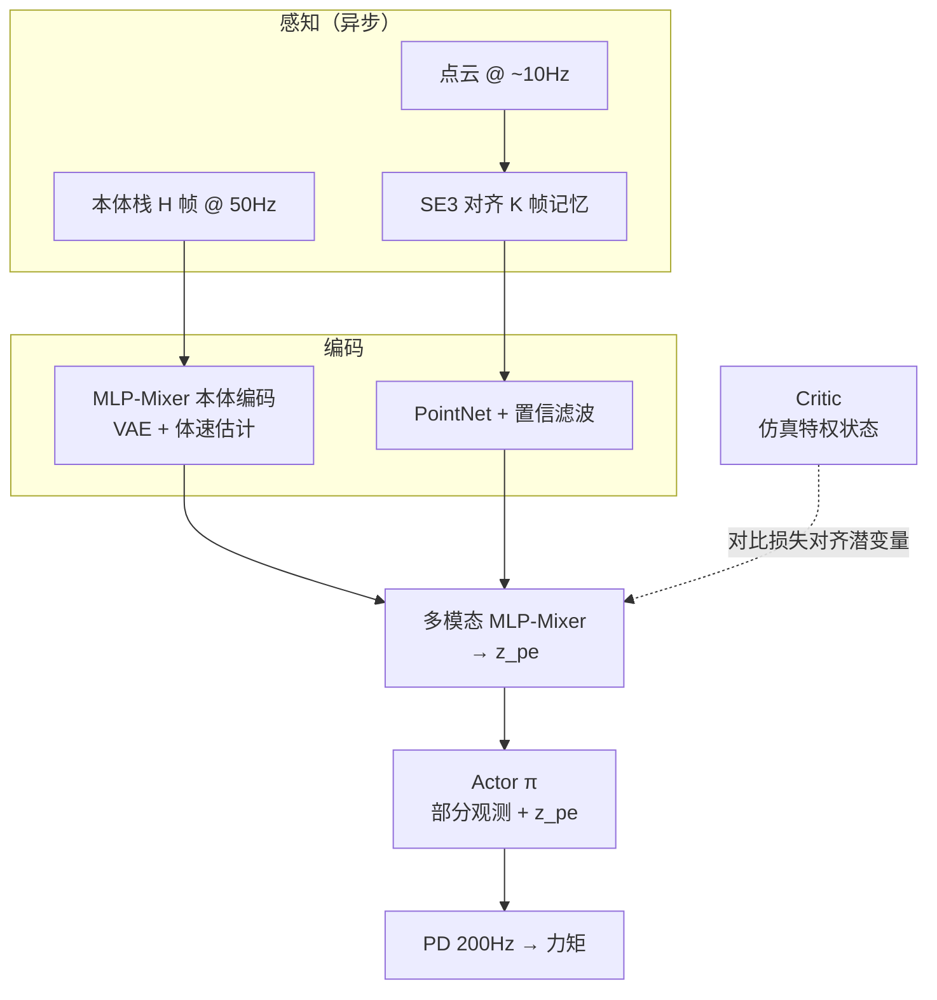

---

type: entity
tags:
  - quadruped
  - reinforcement-learning
  - locomotion
  - perception
  - sim2real
  - privileged-training
  - point-cloud
status: complete
updated: 2026-06-11
arxiv: "2409.19709"
venue: "IEEE T-RO 2026"
related:
  - ../concepts/privileged-training.md
  - ../concepts/terrain-adaptation.md
  - ../concepts/sim2real.md
  - ../concepts/state-estimation.md
  - ../tasks/locomotion.md
  - ../tasks/stair-obstacle-perceptive-locomotion.md
  - ./unitree.md
  - ./paper-walk-these-ways-quadruped-mob.md
sources:
  - ../../sources/papers/dreamwaq_plus_arxiv_2409_19709.md
  - ../../sources/sites/dreamwaqpp-github-io.md
summary: "DreamWaQ++（T-RO 2026）：四足多模态 RL，融合本体与外感知点云，单阶段非对称 AC+PPO，在楼梯/陡坡/OOD 与传感器失效下保持障碍感知行走。"
tags: [quadruped, reinforcement-learning, locomotion, perception, sim2real, privileged-training, point-cloud, kaist, mit]

---

# DreamWaQ++（障碍感知四足多模态强化学习）

**DreamWaQ++**（Nahrendra et al., [arXiv:2409.19709](https://arxiv.org/abs/2409.19709)，**IEEE T-RO 2026**）在 [DreamWaQ](https://arxiv.org/abs/2301.10602)（盲走 + CENet 隐式地形想象）基础上，把 **3D 外感知点云** 与 **本体历史** 在 **单阶段** 训练中联合优化，得到 **障碍感知、可探查、可外推坡度** 的四足 locomotion 策略。公开材料：[项目页](https://dreamwaqpp.github.io/)、[演示视频](https://youtu.be/DECFbMdpfps)。

## 一句话定义

**用分层外感知记忆 + 置信 PointNet + MLP-Mixer 多模态融合，在不对称 Actor–Critic 下单阶段学会「先看再走」的四足控制，并在传感器失效时回退到本体策略。**

## 英文缩写速查

| 缩写 | 英文全称 | 简要说明 |
|------|----------|----------|
| Sim2Real | Simulation to Real | 把仿真中学到的策略迁移落地真机的工程主线 |
| RL | Reinforcement Learning | 通过与环境交互最大化长期回报来学习策略的范式 |
| PPO | Proximal Policy Optimization | 人形/足式 locomotion 中最常用的 on-policy 策略梯度算法 |
| OOD | Out-of-Distribution | 分布外样本/未见场景，泛化评测关注点 |
| MLP | Multi-Layer Perceptron | 多层感知机，处理本体向量等低维输入 |
| PD | Proportional–Derivative | 关节位置/阻抗底层控制，策略输出常为其 setpoint |
| IMU | Inertial Measurement Unit | 惯性测量单元，提供加速度与角速度 |
| VAE | Variational Autoencoder | 变分自编码器，学习隐变量生成表示 |
| ANYmal | ANYbotics Quadruped | ANYbotics 的四足机器人研究平台 |
| Isaac Gym | NVIDIA Isaac Gym | GPU 并行刚体仿真训练环境 |
| Locomotion | Robot Locomotion | 足式/人形等无轮移动能力的总称 |

## 为什么重要

- **盲走上限清晰：** 仅靠本体时，楼梯/缺口往往要先 **碰** 再改步态；DreamWaQ++ 用 **前瞻点云** 主动抬身、伸摆腿，项目页报告困难楼梯成功率约 **97.8%**，相对盲走 DreamWaQ 在 50 级楼梯竞速中 **距离与爬升显著领先**。
- **频率异步的工程解：** 外感知 ~**10 Hz**、策略 **50 Hz**、PD **200 Hz**；通过 **$SE(3)$ 对齐的历史点云堆叠** 而非重地图重建，降低 onboard 算力与延迟敏感。
- **传感器无关：** 同一框架覆盖 **RealSense / Ouster / Livox** 等点云源，利于 sim2real 与平台迁移（论文与项目页均强调 **4 套实机 + 3 种仿真机体**）。
- **与特权训练谱系一致：** Critic 用仿真特权状态、Actor 用部分观测 + 学习到的多模态上下文；辅以 **对比损失** 拉近 actor/critic 潜空间，而非回归不可辨识的地形参数。

## 核心结构

| 模块 | 作用 |
|------|------|
| **分层外感知记忆** | 最近 $K$ 帧点云经 IMU + 估计体速积分的 $SE(3)$ 对齐到当前机体系，缓解低帧率外感知与控制环错位。 |
| **外感知编码器** | PointNet + **置信滤波**（抑制高方差离群点对 max-pool 的污染）→ $\mathbf{z}^e_t$。 |
| **本体编码器** | CENet 思路 + **MLP-Mixer** 跨模态/时间 token；$\beta$-VAE 潜变量 + **体速估计** 供记忆与 bootstrap。 |
| **多模态 Mixer** | 分模态 LayerNorm 后融合 → $\mathbf{z}^{pe}_t$；约束重参数化稳定 VAE 采样。 |
| **控制与训练** | **PPO** + 估计/VAE/对比/versatility 辅助损失；**50 Hz** 关节目标 + **200 Hz PD**；真机 **零微调** 部署（论文设定）。 |

### 流程总览

## 方法栈（提炼）

- **单阶段 vs 两阶段 Teacher–Student：** 感知与控制网络 **端到端** 与 PPO 同训；上下文学习类比 **meta-RL** 的 meta-train / 部署时 meta-test，但部署时 **不微调**。
- **技能发现：** 随机本体潜变量 + **versatility gain** + 对比损失，促成 **probing（探足）**、**爬行爬坡**、**跃障** 等未手写规则行为（项目页与论文 Fig.1）。
- **OOD：** 外感知与本体冲突时，潜空间聚类显示 **本体分支可兜底**（如移动平台被抽走时的支撑面扩大）。

## 实验与评测

- **楼梯：** 多种 rise/run 配置、1000 机并行仿真；相对多种 **视觉 loco 基线** 成功率约 **+20–40%**（项目页）。
- **坡度：** 训练 **10°**，测试 **35°**（约 **3.5×** 训练范围）仍可行，后足力矩相对盲走约 **1.5×** 降低。
- **大障碍：** 仿真 Go1 **0.6 m**、ANYmal-C **1.0 m**、Hound **1.5 m**；实机 Go1 带 **2.5 kg** 载荷攀 **41 cm** 沙发。
- **消融：** 去掉潜变量融合时困难楼梯成功率 **97.8% → 60.7%**（项目页）；对比损失与 versatility 对多样步态贡献显著。

## 与其他工作对比

| 路线 | 感知 | 训练阶段 | 与 DreamWaQ++ 的差异 |
|------|------|----------|---------------------|
| **DreamWaQ（盲走）** | 仅本体 + 隐式地形想象 | 单阶段 | 无前瞻点云；楼梯/缺口依赖接触探测 |
| **Walk These Ways** | 本体 + 命令条件步态 | Teacher–Student | 侧重 **步态参数化**，非 3D 障碍前瞻 |
| **高度图 / elevation map RL** | 2.5D 地图 | 多为单阶段或蒸馏 | 依赖 **地图维护**；本文用 **原始点云 + 短记忆** |
| **极端跑酷 / parkour** | 深度端到端 | 单阶段 | 更重 **极限动作**；DreamWaQ++ 强调 **多模态弹性与传感器失效回退** |

## 常见误区或局限

- **误区：** 把 DreamWaQ++ 等同于「又一个深度盲走」——其核心是 **外感知–本体融合与记忆对齐**，盲走 DreamWaQ 是 **对照基线** 而非同一方法。
- **误区：** 认为必须 **在线建完整 elevation map**——论文刻意避免 U-Net 式重建，用 **位姿积分 + 点云堆叠** 换算力。
- **局限：** 公开页 **未给出与论文同署名的官方训练代码仓库**（2026-05-30）；复现需依赖论文细节与社区 DreamWaQ 实现（如 Isaac Gym / Legged Gym 生态）自行对齐。**sim2real** 仍依赖大规模域随机与特权 critic，真机极端工况需自行安全边界验收。

## 参考来源

- [DreamWaQ++ 论文摘录（arXiv:2409.19709）](../../sources/papers/dreamwaq_plus_arxiv_2409_19709.md)
- [DreamWaQ++ 项目页归档](../../sources/sites/dreamwaqpp-github-io.md)

## 关联页面

- [Privileged Training（特权信息训练）](../concepts/privileged-training.md) — 非对称 AC 与特权 critic 语境
- [Terrain Adaptation（地形适应）](../concepts/terrain-adaptation.md) — 点云/高度图 → 步态调整的闭环
- [Locomotion](../tasks/locomotion.md) — 四足 RL 任务地图
- [Sim2Real](../concepts/sim2real.md) — 域随机与部署零微调叙事
- [State Estimation](../concepts/state-estimation.md) — 体速估计支撑外感知对齐
- [Unitree](../entities/unitree.md) — Go1 等主流四足硬件
- [Walk These Ways](../entities/paper-walk-these-ways-quadruped-mob.md) — 四足命令条件与 MoB 对照

## 推荐继续阅读

- 论文 PDF：<https://arxiv.org/pdf/2409.19709>
- 项目主页：<https://dreamwaqpp.github.io/>
- 前序 DreamWaQ（ICRA 2023）：<https://arxiv.org/abs/2301.10602>
- 演示视频：<https://youtu.be/DECFbMdpfps>
