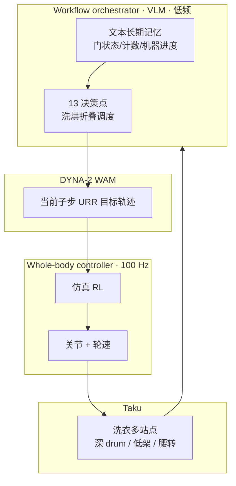

# Dyna-2.1（Physical Agent · Taku）

**Dyna-2.1** 是 **Dyna Robotics**（2026-09-29 发布）对外宣称的首个可 **端到端完成长时真实工作流** 的 **physical agent** 系统：硬件为全新半人形轮式双臂平台 **Taku**，软件为 **三层时钟分离** 栈——仿真 RL **全身控制器**（100 Hz）、改进版 **[Dyna-2](./dyna-2.md) WAM** 策略、以及基于 **VLM 的工作流编排器**（低频决策 + 文本长期记忆）。官方以 **酒店洗衣房** 为 running example，展示 **约一小时无剪辑** 自主流程（洗烘机操作、毛巾流、折叠上架、异步 attend 机器、进度接续与可恢复错误）。

| 机构 | 戴纳机器人（Dyna Robotics） |
|------|------------------------------|
| 类型 | 公司 Research 发布（非 arXiv） |
| 入口 | <https://www.dyna.co/dyna-2.1> |
| 硬件 | **Taku**（四轮转向 + 折叠下身 + 双 7-DoF 臂） |
| 开源 | **未开源**（2026-09-30） |

## 一句话定义

**把「岗位级工作流」拆成可教的全身体技能（URR + WAM）与可推理的编排（VLM + 文本记忆），在轮式 loco-dexterous 硬件上追求少看护的整班自动化。**

## 英文缩写速查

| 缩写 | 英文全称 | 简要说明 |
|------|----------|----------|
| WAM | World-Action Model | Dyna 中层策略；本文称改进 **DYNA-2** |
| VLM | Vision-Language Model | 工作流编排器骨干 |
| URR | Unified Robot Representation | 腕/肘/胸/footprint 位姿统一人–机接口 |
| RL | Reinforcement Learning | 全身控制器在仿真中训练 |
| DoF | Degrees of Freedom | 关节自由度；Taku 双臂各 7 |
| SR | Success Rate | 单步/单 episode 成功率；长工作流需复合可靠性 |

## 为什么重要

- **评测叙事转移：** 从「单任务 SR」转向 **METR 式长任务时域**——与 [Dyna-2](./dyna-2.md) 的 **百万小时预训练缩放** 互补：2.1 强调 **部署态整班工作流**，2 强调 **数据缩放律**。
- **loco-dexterous 产品形态：** 相对桌面双臂或电梯式 AMR，**Taku** 用 **轮式换站 + 类人工作空间** 覆盖洗衣类 **多高度、多站点** 任务；对照 [Curr-0](./current-robotics-curr0.md)（人形腿）与 [ACT-2](./sunday-robotics-act2.md)（家用 Solve）。
- **三层栈可教性：** **URR** 让人体数据进入策略命令层；**控制器–策略共进化** 与「硬件改版主要重训控制器」降低迭代成本——延续 Dyna 生产部署叙事（新站点 **~3 天** 达产条来自前序发布）。

## 流程总览

## 核心原理

### 工作流 vs 静止任务

- **Workflow** = 可异步交接的 **整班业务**；单任务自动化仍可能需要「第二个人」补料/清障。
- **复合可靠性：** 官方强调 ~182 子步时单步 95% 几乎无法无辅助完成 → 需要 **per-step 高 9's** 与 **可恢复错误**（洗衣场景多数失败可恢复）。

### Taku 硬件要点

| 设计 | 意图 |
|------|------|
| 四轮转向底座 | 站点间距米级；比腿式更贴 **reach 优先** 的 commercial laundry |
| 折叠下身 + 类人上身尺寸 | 对齐成人腕/肘/胸轨迹，便于 **人数据重定向** |
| 行星减速臂 | 更高速度/加速度，匹配人类动作节奏 |

### 三层模型分工

| 层 | 输入/输出 | 学习来源 |
|----|-----------|----------|
| Orchestrator | 视觉 + 记忆 + 人短指令 → **下一步** +  steer WAM | VLM 预训练 + 工作流 post-train |
| DYNA-2 WAM | 子步 → **URR 目标轨迹** | 人数据（URR）+ 机端 demo + 现场纠正 |
| WBC | URR → **关节 + 轮速** | 仿真 RL；随 demo 质量共进化 |

### URR（Unified Robot Representation）

- **腕、肘、胸、footprint** 在局部一致坐标系下的位姿序列；人与 Taku 均可生成 → **同一接口** 吃 egocentric / mocap / 机端数据（页内引用 UMI、OmniRetarget、SONIC 等对照）。

### 编排与记忆

- 洗衣 **13 决策点**；毛巾线性流程但机器人路径 **非线性**（烘干完成即 attend，折叠可中断）。
- **步骤内检查** 留在 WAM；失败时 repeat / 换法 / 改计划；编排器维护 **不可即时可见** 的状态（何时开洗、哪架有空间等）。

## 工程实践

| 项 | 读法 |
|----|------|
| 选型 | 评估 **长时、多站点、可中断** 商业流程时读本页 + [Dyna-2](./dyna-2.md) 数据缩放 |
| 复现 | **无可运行代码**；仅可参考 **URR + 分层时钟** 的产品架构 |
| 评测 | 官方主张用 **无干预工作流时长** 替代单 benchmark episode SR |
| 开源 | **不适用** 训练栈；见局限 |

### 源码运行时序图

**不适用** — 截至 2026-09-30，官方页 **未发布** 训练/推理代码、权重或数据集。

## 局限与风险

- **非 peer-reviewed / 无 arXiv：** 一小时演示与 teachability 叙事均为 **公司自报**。
- **确认未开源：** 无法审计 URR 实现、编排 prompt、WBC 仿真域与恢复策略库。
- **垂直绑定：** 洗衣 running example 的恢复假设未必迁移到 **不可逆错误** 场景。
- **与 Dyna-2 关系：** 页内称 **改进 DYNA-2**，但未给出相对 2026-08 研究检查点的 **定量 ablation** 公开细节。

## 结论

**Dyna-2.1 把 Dyna 的故事从「WAM 缩放律」推进到「岗位级 physical agent」：硬件（Taku）、控制（100 Hz RL）、策略（WAM）与推理（VLM 编排）必须一起设计，否则长工作流会在复合可靠性或异步调度上崩溃。**

- 读 demo 时分开看：**空间覆盖**（Taku）、**子步 9's**（WAM+WBC）、**非线性调度**（编排器+记忆）。
- 与 [Dyna-2](./dyna-2.md) 联读：2 回答 **人视频预训练是否缩放**；2.1 回答 **缩放后的栈能否扛整班流程**。
- 工程上仍应视为 **闭源垂直整合参照**；开源 loco-manipulation 对照见 [Curr-0](./current-robotics-curr0.md) 等。
- 下一步观察：客户现场 **部署飞轮** 数据是否公开、是否发布 arXiv/协议、Taku 是否开放 URR 数据集片段。

## 关联页面

- [Dyna-2（百万小时 WAM）](./dyna-2.md) — 中层策略与缩放律前代
- [World Action Models](../concepts/world-action-models.md)
- [VLA](../methods/vla.md) — 编排器与语言跟随语境
- [Manipulation](../tasks/manipulation.md)
- [Loco-Manipulation](../tasks/loco-manipulation.md) — 移动操作任务层
- [Sunday ACT-2](./sunday-robotics-act2.md) / [Curr-0](./current-robotics-curr0.md) — 闭源/产业对照

## 参考来源

- [dyna_2_1_physical_agent_taku.md](../../sources/blogs/dyna_2_1_physical_agent_taku.md) — 官方长文归纳
- [dyna-co-dyna-2-1.md](../../sources/sites/dyna-co-dyna-2-1.md) — 项目页与开源核查
- [dyna-co.md](../../sources/sites/dyna-co.md) — 公司站
- 官方页：<https://www.dyna.co/dyna-2.1>

## 推荐继续阅读

- [Dyna-2.1 官方发布](https://www.dyna.co/dyna-2.1)（含 1h 洗衣视频）
- [Dyna-2 研究页](https://www.dyna.co/dyna-2)
- Kwa et al., *Measuring AI Ability to Complete Long Tasks* — [arXiv:2503.14499](https://arxiv.org/abs/2503.14499)（编排器引用的长任务评测类比）
